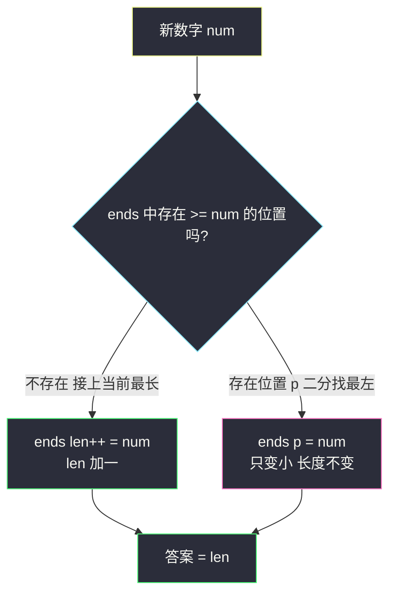
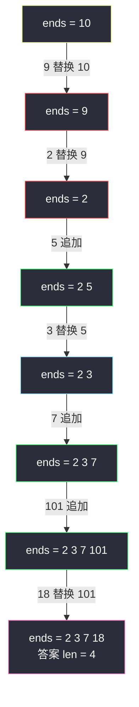

# 最长递增子序列 LIS（经典 DP + 贪心二分优化）

## 一、问题描述

给你一个整数数组 `nums`，找出其中**最长严格递增子序列**的长度。

「子序列」可以**跳着选**：由原数组按原顺序删除若干（也可以不删）元素得到，**不要求连续**。

> 🔗 LeetCode 300：https://leetcode.cn/problems/longest-increasing-subsequence/

**示例 1**

```
输入：nums = [10,9,2,5,3,7,101,18]
输出：4
解释：最长递增子序列是 [2,3,7,101]（或 [2,3,7,18]），长度为 4
```

**示例 2**

```
输入：nums = [0,1,0,3,2,3]
输出：4
解释：LIS 是 [0,1,2,3]
```

**直观理解**

和 #674（最长**连续**递增）一字之差，难度天壤之别：**不连续意味着以 i 结尾的递增子序列，前一个元素可以是前面任何一个比它小的位置**——`dp[i]` 不再只看 `dp[i-1]`，而是要看**所有前驱**。这是子序列 DP 的「地基题」。

---

## 二、暴力解法

### 直观思路

**从右往左的暴力递归**（对齐 class072 Code01 的尝试思路）：`f(i)` 表示以 `i` 结尾的最长递增子序列长度，枚举前一个元素的位置 `j < i`：

```java
// 暴力递归：以 i 结尾的 LIS 长度
public static int lengthOfLIS1(int[] nums) {
    int n = nums.length;
    int[] dp = new int[n];
    int ans = 0;
    for (int i = 0; i < n; i++) {
        dp[i] = 1; // 至少选自己
        for (int j = 0; j < i; j++) {
            if (nums[j] < nums[i]) {
                dp[i] = Math.max(dp[i], dp[j] + 1);
            }
        }
        ans = Math.max(ans, dp[i]);
    }
    return ans;
}
```

（这里直接写成填表版；严格递归版是同一个尝试加缓存，见 3.2。）

### 复杂度

- **时间**：`O(n²)`——每个 `i` 扫一遍全部前驱
- **空间**：`O(n)`

### 🔴 瓶颈在哪里

`dp[i]` 的计算要**枚举所有 j < i**。能不能不枚举？关键观察：如果只关心「长度为 t 的递增子序列的最小结尾值」，这个值越小，后面接上的机会越大——**最小结尾值是全局有用的信息**，把它维护成有序结构，查找就能二分。

---

## 三、优化探索

### 3.1 可变参数分析

以 `i` 结尾的 LIS 只有一个可变参数 → 一维表 `dp[i]`。

| dp 定义 | 含义 |
|---------|------|
| `dp[i]` | **以 nums[i] 结尾**的最长严格递增子序列长度 |

```
dp[i] = 1 + max(dp[j])，其中 0 <= j < i 且 nums[j] < nums[i]
若不存在这样的 j，则 dp[i] = 1
答案 = max(dp[0..n-1])
```

### 3.2 演进链（对齐 class072 Code01）

1. **暴力尝试**：`f(i)` 枚举前驱，`O(n²)`
2. **记忆化**：`f(i)` 结果存缓存，仍 `O(n²)` 但不重算
3. **严格位置依赖（填表）**：从左往右填 `dp[i]`——就是上面的 `lengthOfLIS1`
4. **贪心 + 二分（`ends` 数组）**：`O(n log n)`，本题最优解

### 3.3 贪心 + 二分推导（核心）

定义 `ends[t]`：**所有长度为 t+1 的递增子序列中，最小的结尾值**。

两条性质：

1. `ends` 严格递增——反证：若 `ends[t] >= ends[t+1]`，则长度 t+2 的子序列去掉尾元素得到一个长 t+1、结尾更小的子序列，与 `ends[t]` 的最小性矛盾。
2. 处理新数 `num` 时，在 `ends` 里找**第一个 >= num 的位置 p**：
   - 找不到 → `num` 能接在当前最长子序列后面，`ends` 追加，长度 +1
   - 找到 → `ends[p] = num`，长度 p+1 的最小结尾变得更小（**只改小，不改变长度**）

最终答案 = `ends` 的有效长度 `len`。

> **为什么替换是对的？** `ends[t]` 只是「潜力指标」：结尾越小，未来越容易接上新元素。替换不破坏任何已有的更长序列。

### 3.4 关键问题

| 问题 | 答案 |
|------|------|
| 严格递增 vs 非下降？ | 严格递增找「>= num 的最左位置」（class072 的 bs1）；非下降找「> num 的最左位置」（bs2），一字符之差 |
| `ends` 是某个真实子序列吗？ | 不一定！它是各长度的最小结尾集合；要还原具体序列需额外记录前驱 |
| 和 #674 连续版区别？ | #674 只依赖 `dp[i-1]`，O(n)；本题依赖全部前驱，O(n²) 起步 |
| 为什么答案就是 `len`？ | `ends` 每追加一次长度才加一，追加次数 = 出现过的最长长度 |

### 3.5 一句话核心

> **dp 版扫全部前驱取 max+1；贪心版维护「每个长度的最小结尾」，二分找位置：接尾或替换。**



---

## 四、代码实现

### Java（主解一：O(n²) 动态规划，对齐 class072 Code01 的 lengthOfLIS1）

```java
// 最长递增子序列
// 给定整数数组nums，找到其中最长严格递增子序列的长度
// 测试链接 : https://leetcode.cn/problems/longest-increasing-subsequence/
// 对齐 class072 Code01_LongestIncreasingSubsequence
public class Solution {

    // 时间复杂度 O(n²)，空间复杂度 O(n)
    public static int lengthOfLIS(int[] nums) {
        int n = nums.length;
        // dp[i] : 以 nums[i] 结尾的最长严格递增子序列长度
        int[] dp = new int[n];
        int ans = 0;
        for (int i = 0; i < n; i++) {
            dp[i] = 1; // 只选自己
            // 依赖方向 : 依赖所有 j < i 的 dp[j]，从左往右填
            for (int j = 0; j < i; j++) {
                if (nums[j] < nums[i]) {
                    // nums[j] 可以作为倒数第二个数
                    dp[i] = Math.max(dp[i], dp[j] + 1);
                }
            }
            ans = Math.max(ans, dp[i]);
        }
        return ans;
    }
}
```

### Java（主解二：O(n log n) 贪心 + 二分，对齐 class072 Code01 的 lengthOfLIS2）

```java
// ends[t] : 所有长度为 t+1 的递增子序列中，最小的结尾值
// 时间复杂度 O(n log n)，空间复杂度 O(n)
public class Solution {

    public static int lengthOfLIS(int[] nums) {
        int n = nums.length;
        int[] ends = new int[n];
        // ends[0...len-1] 为有效区，严格升序
        int len = 0;
        for (int i = 0, find; i < n; i++) {
            // 在 ends 有效区找 >= nums[i] 的最左位置，不存在返回 -1
            find = bs1(ends, len, nums[i]);
            if (find == -1) {
                // 接在最长子序列后面，长度加一
                ends[len++] = nums[i];
            } else {
                // 长度 find+1 的最小结尾变得更小
                ends[find] = nums[i];
            }
        }
        return len;
    }

    // ends[0...len-1] 严格升序，找 >= num 的最左位置
    // 不存在返回 -1（求"非下降"版本改为 ends[m] > num）
    public static int bs1(int[] ends, int len, int num) {
        int l = 0, r = len - 1, m, ans = -1;
        while (l <= r) {
            m = (l + r) / 2;
            if (ends[m] >= num) {
                ans = m;
                r = m - 1;
            } else {
                l = m + 1;
            }
        }
        return ans;
    }
}
```

### Python

```python
# O(n²) dp 版
class Solution:
    def lengthOfLIS(self, nums: list[int]) -> int:
        n = len(nums)
        # dp[i] : 以 nums[i] 结尾的 LIS 长度
        dp = [1] * n
        ans = 0
        for i in range(n):
            for j in range(i):
                if nums[j] < nums[i]:
                    dp[i] = max(dp[i], dp[j] + 1)
            ans = max(ans, dp[i])
        return ans
```

```python
# O(n log n) 贪心 + 二分版（ends 数组）
class Solution:
    def lengthOfLIS(self, nums: list[int]) -> int:
        from bisect import bisect_left
        ends: list[int] = []  # ends[t] : 长度 t+1 的最小结尾
        for num in nums:
            p = bisect_left(ends, num)  # 第一个 >= num 的位置
            if p == len(ends):
                ends.append(num)  # 接上，长度 +1
            else:
                ends[p] = num     # 替换，只变小
        return len(ends)
```

---

## 五、具体例子演示

以 `nums = [10,9,2,5,3,7,101,18]` 为例。

### dp 表逐格填充（O(n²) 版）

| i | nums[i] | 可接的前驱 j（nums[j] < nums[i]） | dp[j] 最大值 | dp[i] | ans |
|---|---------|----------------------------------|-------------|-------|-----|
| 0 | 10 | 无 | — | 1 | 1 |
| 1 | 9 | 无（10 不小于 9） | — | 1 | 1 |
| 2 | 2 | 无 | — | 1 | 1 |
| 3 | 5 | j=2（2<5） | dp[2]=1 | 1+1=2 | 2 |
| 4 | 3 | j=2（2<3） | dp[2]=1 | 1+1=2 | 2 |
| 5 | 7 | j=2(1)、j=3(2)、j=4(2) | dp[3]=2 | 2+1=3 | 3 |
| 6 | 101 | 全部都比它小 | dp[5]=3 | 3+1=4 | **4** |
| 7 | 18 | j=0..5 比 18 小，dp 最大 dp[5]=3 | dp[5]=3 | 3+1=4 | 4 |

以 101 结尾的 `[2,3,7,101]` 与以 18 结尾的 `[2,3,7,18]` 长度同为 4。

### ends 数组逐步演化（O(n log n) 版）

| 步骤 | num | 二分结果（ends 中 >= num 的最左位） | 动作 | ends 有效区 | len |
|------|-----|------------------------------------|------|-------------|-----|
| 1 | 10 | 无 | 追加 | [10] | 1 |
| 2 | 9 | 位置 0（10 >= 9） | 替换 | [9] | 1 |
| 3 | 2 | 位置 0（9 >= 2） | 替换 | [2] | 1 |
| 4 | 5 | 无（2 < 5） | 追加 | [2,5] | 2 |
| 5 | 3 | 位置 1（5 >= 3） | 替换 | [2,3] | 2 |
| 6 | 7 | 无 | 追加 | [2,3,7] | 3 |
| 7 | 101 | 无 | 追加 | [2,3,7,101] | **4** |
| 8 | 18 | 位置 3（101 >= 18） | 替换 | [2,3,7,18] | 4 |



绿=追加（长度+1），红/青=替换（长度不变、结尾变小）。注意第 8 步替换 18 后长度仍是 4——替换只是「留后路」。

---

## 六、复杂度分析

| 版本 | 时间 | 空间 | 说明 |
|------|------|------|------|
| 暴力枚举子集 | `O(2ⁿ)` | `O(n)` | 纯枚举不现实，列出仅为对照 |
| dp 填表（主解一） | `O(n²)` | `O(n)` | 每格扫全部前驱；n ≤ 2500 完全够用 |
| 贪心 + 二分（主解二） | `O(n log n)` | `O(n)` | 每个数二分一次；n 到 10⁵ 也能过 |

---

## 七、方法对比与总结

### 对比 #674 连续 vs #300 子序列

| | #674 连续递增 | #300 LIS |
|---|--------------|----------|
| dp[i] 依赖 | 仅 `dp[i-1]` | 所有 `j < i` 且 `nums[j] < nums[i]` |
| 最优时间 | `O(n)` | `O(n log n)` |
| 优化手段 | 只需滚动变量 | 贪心维护 ends + 二分 |

### 易错点

1. **dp 版忘了 `dp[i] = 1` 初始化**：每个数自己就是长度 1 的子序列。
2. **答案是全局 max 不是 dp[n-1]**：LIS 不一定以最后一个元素结尾。
3. **二分边界写错**：严格递增找「>= num 的最左」；若把 `>=` 写成 `>`，求出的就是最长**非下降**子序列（class072 的 bs1 vs bs2）。
4. **以为 ends 是 LIS 本身**：ends 只保证「各长度最小结尾」，不是某条真实子序列。

### 模板口诀

> **dp 版：前驱比我小，取大加一；贪心版：找位就替换，没位就追加，长度即答案。**

---

## 八、举一反三

| 题目 | 链接 | 迁移点 |
|------|------|--------|
| 674. 最长连续递增序列 | https://leetcode.cn/problems/longest-continuous-increasing-subsequence/ | 加上「连续」约束，退化为 O(n) 线性 DP |
| 354. 俄罗斯套娃信封问题 | https://leetcode.cn/problems/russian-doll-envelopes/ | 二维偏序：一维排序 + 另一维跑 LIS（class072 Code02） |
| 646. 最长数对链 | https://leetcode.cn/problems/maximum-length-of-pair-chain/ | 贪心或排序后 LIS 变体（class072 Code04） |
| 1143. 最长公共子序列 | https://leetcode.cn/problems/longest-common-subsequence/ | 子序列家族的另一地基：双串二维 DP |
| 2407. 最长递增子序列 II | https://leetcode.cn/problems/longest-increasing-subsequence-ii/ | 限制相邻差值 ≤ k，ends 换成线段树查询区间 max |

**迁移一句**：所有「选出最长满足偏序关系的子序列」题（信封嵌套、数对链、摆动序列）本质都是 LIS；先写 O(n²) dp 保底，数据量大再上贪心 + 二分。
