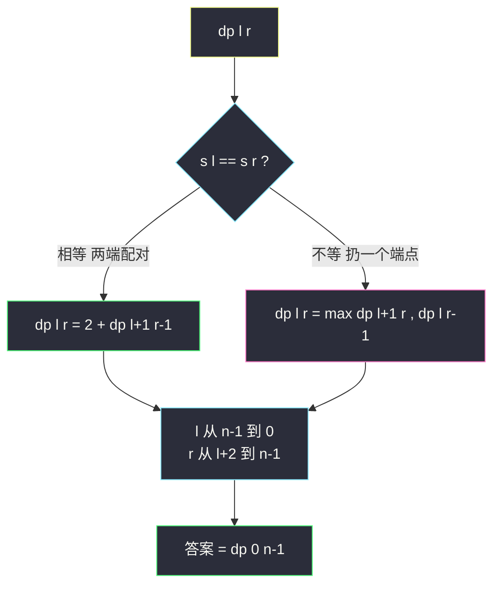
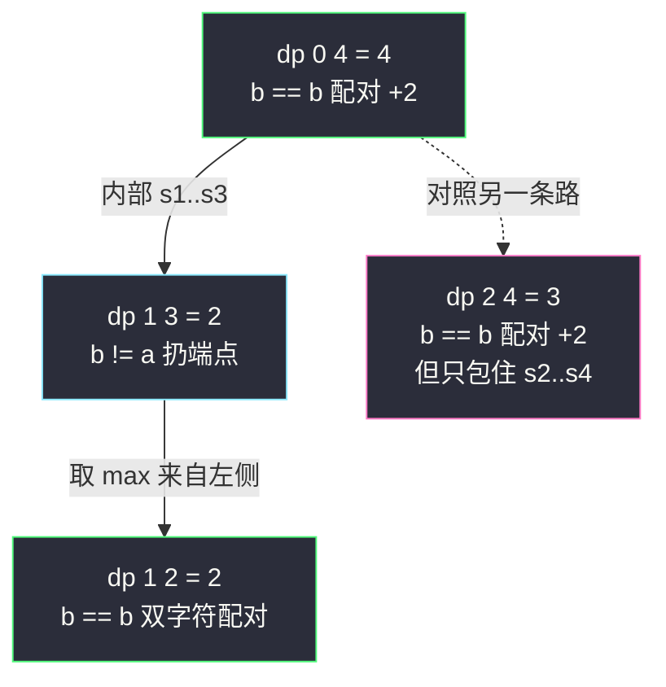

# 最长回文子序列（区间 DP 标准模型）

## 一、问题描述

给你一个字符串 `s`，找出其中**最长的回文子序列**，返回长度。「子序列」可以不连续，但不能改变相对顺序。注意与「最长回文子**串**」（#5，要求连续）区分。

> 🔗 LeetCode 516：https://leetcode.cn/problems/longest-palindromic-subsequence/

**示例 1**

```
输入：s = "bbbab"
输出：4
解释：最长回文子序列是 "bbbb"
```

**示例 2**

```
输入：s = "cbbd"
输出：2
解释：最长回文子序列是 "bb"
```

**直观理解**

子序列可以跳着选，中心扩散没法用（扩出来不保证连续的选法被覆盖）。那就换到区间 DP 的框架：**考察区间 `s[l..r]` 两端的字符**，它们要么配成一对进入答案，要么至少一个不进入答案——这一分类不重不漏，且所有分支都转向**更小的区间**。

课上 class067 Code04 正是用这道题引入区间 DP：可变参数是 `l`、`r` 两个端点 → 天然二维表。另外它还能转化成「`s` 与自身反串的 LCS」（#1143），文末对照。

---

## 二、暴力解法

### 直观思路

递归定义 `f(l, r)` = `s[l..r]` 上最长回文子序列的长度，对齐 class067 Code04 的 `f1`：

```java
// 暴力递归（对齐 class067 Code04 的 f1）
public static int longestPalSubseq1(String str) {
    char[] s = str.toCharArray();
    return f1(s, 0, s.length - 1);
}

// s[l...r] 最长回文子序列长度，l <= r
public static int f1(char[] s, int l, int r) {
    if (l == r) {
        return 1;          // 只剩一个字符
    }
    if (l + 1 == r) {      // 剩两个字符
        return s[l] == s[r] ? 2 : 1;
    }
    if (s[l] == s[r]) {
        // 两端配对，缩进内部
        return 2 + f1(s, l + 1, r - 1);
    } else {
        // 两端至少一个用不上，扔掉左端或扔掉右端
        return Math.max(f1(s, l + 1, r), f1(s, l, r - 1));
    }
}
```

### 复杂度

- **时间**：`O(2ⁿ)` 级别，每个分叉三个方向，指数展开
- **空间**：`O(n)` 递归栈

### 🔴 瓶颈在哪里

递归树里 `(l, r)` 组合被反复求解（比如 `f(l+1, r)` 会在「扔左端」和「配对后的内部」路径里重复出现）。状态只有 `O(n²)` 个——**区间型重叠子问题**，加缓存即得区间 DP。

---

## 三、优化探索（核心章节）

### 3.1 可变参数分析（区间 DP 定表）

按课上方法论：几个可变参数就是几维表。这里可变参数是区间左右端点 `l`、`r` → **二维表 `dp[l][r]`**：

| dp 定义 | 含义 |
|---------|------|
| `dp[l][r]` | `s[l..r]` 这一段里最长回文子序列的长度 |

### 3.2 转移方程推导（看区间两端）

对区间 `s[l..r]` 的**两个端点字符**分类（`l < r`）：

1. **`s[l] == s[r]`**：这一对字符可以配成回文的最外层两端（课上的贪心证明：存在最优解把它们配在一起），所以
   `dp[l][r] = 2 + dp[l+1][r-1]`
2. **`s[l] != s[r]`**：它们不可能同时充当回文的两端，至少扔一个：
   `dp[l][r] = max(dp[l+1][r], dp[l][r-1])`

边界：

```
dp[l][l] = 1                              // 单字符
dp[l][l+1] = (s[l] == s[l+1]) ? 2 : 1     // 双字符
答案 = dp[0][n-1]
```

### 3.3 遍历顺序（依赖方向）

`dp[l][r]` 依赖：

- 左下角 `dp[l+1][r-1]`（区间更短）
- 下方 `dp[l+1][r]`、左方 `dp[l][r-1]`

全部指向**更短的区间**。所以按 `l` **从大到小**、`r` **从小到大**（即课上 `for l = n-1..0，内层 r = l..n-1`）填表，读到的都是已算值。



### 3.4 关键问题

| 问题 | 答案 |
|------|------|
| 两端相等时为什么敢直接配对？ | 交换论证：若某最优解没把 `s[l]`、`s[r]` 同时用作两端，可调整成用它们，长度不减（class067 课上同 LCS 的证明思路） |
| 两端不等时要不要考虑 `dp[l+1][r-1]`？ | 不必——它是另两个分支的子情况，max 已覆盖 |
| 这题和 #5 最长回文子串的区别？ | 「子序列」可跳，转移是 max 型（扔端点）；「子串」要连续，dp 存 boolean，转移是 `s[l]==s[r] && dp[l+1][r-1]` |
| 能转化成 LCS 吗？ | 能：`s` 与 `s` 的反串的 LCS 长度即答案（class067 Code04 开头给出此思路），复杂度同阶 |
| 能空间压缩吗？ | 能，课上 `longestPalindromeSubseq4` 用一维数组 + `leftDown`/`backup` 两个变量保左下角，压到 `O(n)` |

### 3.5 一句话核心

> **看区间两端：相等配对缩内部 +2，不等扔一端取 max；l 从大到小、r 从小到大填表。**

---

## 四、代码实现

### Java（主解：严格位置依赖，对齐 class067 Code04 的 longestPalindromeSubseq3）

```java
// 最长回文子序列
// 给你一个字符串 s ，找出其中最长的回文子序列，并返回该序列的长度
// 测试链接 : https://leetcode.cn/problems/longest-palindromic-subsequence/
// 对齐 class067 Code04_LongestPalindromicSubsequence
public class Solution {

    // 时间复杂度 O(n^2)，空间复杂度 O(n^2)
    public static int longestPalindromeSubseq(String str) {
        char[] s = str.toCharArray();
        int n = s.length;
        // dp[l][r] : s[l..r] 上最长回文子序列的长度（l <= r，下三角）
        int[][] dp = new int[n][n];
        for (int l = n - 1; l >= 0; l--) {
            // 边界1 : 单字符
            dp[l][l] = 1;
            // 边界2 : 双字符
            if (l + 1 < n) {
                dp[l][l + 1] = s[l] == s[l + 1] ? 2 : 1;
            }
            // 一般转移 : 依赖下方 dp[l+1][r]、左下 dp[l+1][r-1]、左侧 dp[l][r-1]
            // l 从大到小、r 从小到大，保证读到的都已算好
            for (int r = l + 2; r < n; r++) {
                if (s[l] == s[r]) {
                    dp[l][r] = 2 + dp[l + 1][r - 1];
                } else {
                    dp[l][r] = Math.max(dp[l + 1][r], dp[l][r - 1]);
                }
            }
        }
        return dp[0][n - 1];
    }
}
```

### Java（进阶：空间压缩，对齐 class067 Code04 的 longestPalindromeSubseq4）

```java
// 一维滚动 + leftDown 保左下角：空间 O(n)
public class Solution {

    public static int longestPalindromeSubseq(String str) {
        char[] s = str.toCharArray();
        int n = s.length;
        int[] dp = new int[n];
        for (int l = n - 1, leftDown = 0, backup; l >= 0; l--) {
            // dp[l] 想象为 dp[l][l]
            dp[l] = 1;
            if (l + 1 < n) {
                leftDown = dp[l + 1];                 // 记下旧的 dp[l+1][l]（左下角）
                dp[l + 1] = s[l] == s[l + 1] ? 2 : 1; // 想象为 dp[l][l+1]
            }
            for (int r = l + 2; r < n; r++) {
                backup = dp[r];                       // 旧的 dp[l+1][r] 将被覆盖，先存
                if (s[l] == s[r]) {
                    dp[r] = 2 + leftDown;
                } else {
                    dp[r] = Math.max(dp[r], dp[r - 1]);
                }
                leftDown = backup;                    // 更新为下一格的左下角
            }
        }
        return dp[n - 1];
    }
}
```

### Python（主解同思路）

```python
class Solution:
    def longestPalindromeSubseq(self, s: str) -> int:
        n = len(s)
        # dp[l][r] : s[l..r] 最长回文子序列长度
        dp = [[0] * n for _ in range(n)]
        for l in range(n - 1, -1, -1):
            dp[l][l] = 1
            if l + 1 < n:
                dp[l][l + 1] = 2 if s[l] == s[l + 1] else 1
            for r in range(l + 2, n):
                if s[l] == s[r]:
                    dp[l][r] = 2 + dp[l + 1][r - 1]
                else:
                    dp[l][r] = max(dp[l + 1][r], dp[l][r - 1])
        return dp[0][n - 1]
```

---

## 五、具体例子演示

以 `s = "bbbab"`（n = 5）为例。下标：`b(0) b(1) b(2) a(3) b(4)`。

### 按填表顺序逐格跟踪（l 从 4 到 0）

| l | r | 比较 s[l] vs s[r] | 依赖来源 | dp[l][r] |
|---|---|------------------|----------|----------|
| 4 | 4 | —（边界） | — | 1 |
| 3 | 3 | —（边界） | — | 1 |
| 3 | 4 | a vs b，不等 | max(下 1, 左 1) | 1 |
| 2 | 2 | —（边界） | — | 1 |
| 2 | 3 | b vs a，不等 | max(下 1, 左 1) | 1 |
| 2 | 4 | b vs b，相等 | 2 + dp[3][3] = 2+1 | **3** |
| 1 | 1 | —（边界） | — | 1 |
| 1 | 2 | b vs b，相等（双字符边界） | — | 2 |
| 1 | 3 | b vs a，不等 | max(dp[2][3]=1, dp[1][2]=2) | 2 |
| 1 | 4 | b vs b，相等 | 2 + dp[2][3] = 2+1 | **3** |
| 0 | 0 | —（边界） | — | 1 |
| 0 | 1 | b vs b，相等（双字符边界） | — | 2 |
| 0 | 2 | b vs b，相等 | 2 + dp[1][1] = 2+1 | 3 |
| 0 | 3 | b vs a，不等 | max(dp[1][3]=2, dp[0][2]=3) | 3 |
| 0 | 4 | b vs b，相等 | 2 + dp[1][3] = 2+2 | **4** ← 答案 |

完整 dp 表（行 = l，列 = r）：

```
        b0  b1  b2  a3  b4
  b0  [ 1   2   3   3   4 ]
  b1  [     1   2   2   3 ]
  b2  [         1   1   3 ]
  a3  [             1   1 ]
  b4  [                 1 ]
```

### 答案怎么来的（沿依赖回溯）

`dp[0][4] = 4`：`s[0]='b' == s[4]='b'` 配对（+2），内部落在 `dp[1][3] = 2`：`s[1]='b'`、`s[3]='a'` 不等，取 `max(dp[2][3], dp[1][2])`，来自 `dp[1][2] = 2`（`b == b` 双字符配对）。



选中字符：`s[0](b) + s[1](b) + s[4](b)` 里再配一对——实际最优是 `b(0) b(1) b(2) b(4)`？长度 4 的构成：外层 `s[0]、s[4]`，内部 `dp[1][3]=2` 取 `s[1]、s[2]`，即回文 `b b b b`（下标 0,1,2,4）。✓

---

## 六、复杂度分析

| 版本 | 时间 | 空间 | 说明 |
|------|------|------|------|
| 暴力递归 | `O(2ⁿ)` | `O(n)` | 区间端点组合指数展开 |
| 记忆化搜索 | `O(n²)` | `O(n²)` | 每个 `(l,r)` 只算一次 |
| 二维 dp（主解） | `O(n²)` | `O(n²)` | 状态 `O(n²)`，转移 `O(1)` |
| 一维压缩 | `O(n²)` | `O(n)` | leftDown/backup 滚动 |

---

## 七、方法对比与总结

### 区间 DP 家族在本站的位置

| 题 | 转移核心 | 备注 |
|----|----------|------|
| #5 最长回文子串 | `dp[l][r] = s[l]==s[r] && dp[l+1][r-1]`（boolean） | 主解其实是中心扩散 |
| **#516 最长回文子序列** | `dp[l][r] = 2 + dp[l+1][r-1]` 或 `max(下,左)` | 本文，区间 DP 入门标准模型 |
| #1039 多边形三角剖分 | 枚举分割点 `m`：`dp[l][m] + dp[m][r] + 三角形分值` | min 型区间 DP |
| #312 戳气球 | 枚举**最后**爆的气球：左右区间独立 | 区间 DP 封神题 |

### 与 LCS 的互推

`s` 与 `reverse(s)` 做最长公共子序列（#1143），长度恰等于最长回文子序列——class067 Code04 开头即给出这个转化；两个方法复杂度同为 `O(n²)`，区间 DP 版更好写好讲。

### 易错点

1. **遍历顺序写反**：`l` 必须**从大到小**（因为依赖 `l+1` 行）；`r` 从小到大（依赖 `r-1` 列）。写成 `l` 递增会读到未初始化的值。
2. **双字符边界漏写**：`l+1 == r` 时 `r-1 < l+1`，递归式的 `dp[l+1][r-1]` 会越界，必须单列边界 `= s[l]==s[r] ? 2 : 1`。
3. **和 #5 的 dp 语义混了**：#5 存 boolean 判回文（连续），本题存 int 长度（可跳）。
4. **空间压缩丢左下角**：覆盖 `dp[r]` 前必须 `backup`，课上 leftDown/backup 就是为此设计。

### 模板口诀

> **端等配对加二缩内部，端异扔端上下左右取大；l 倒序 r 正序填下三角，区间 DP 从短到长不乱。**

---

## 八、举一反三

| 题目 | 链接 | 迁移点 |
|------|------|--------|
| 5. 最长回文子串 | https://leetcode.cn/problems/longest-palindromic-substring/ | 「子序列」换「子串」，max 换 boolean 与 |
| 1143. 最长公共子序列 | https://leetcode.cn/problems/longest-common-subsequence/ | 本题的另一种解法：`s` vs 反串做 LCS |
| 730. 统计不同回文子序列 | https://leetcode.cn/problems/count-different-palindromic-subsequences/ | 区间 DP + 计数，去重技巧 |
| 1312. 让字符串成为回文串的最少插入次数 | https://leetcode.cn/problems/minimum-insertion-to-make-string-palindrome/ | 答案 = `n - 本题结果`：保留最长回文子序列，其余字符配对补 |
| 2108. 找出数组中的第一个回文字符串 | https://leetcode.cn/problems/find-first-palindromic-string-in-the-array/ | 回文判定热身 |

**迁移一句**：凡是「字符串上选一段/选一些字符、答案只与区间两端有关」的题，先想**区间 DP**：可变参数是 `(l, r)`，转移看两端，填表从短区间到长区间。#516 → #1039 → #312 一路加深，都是这同一张下三角表。
