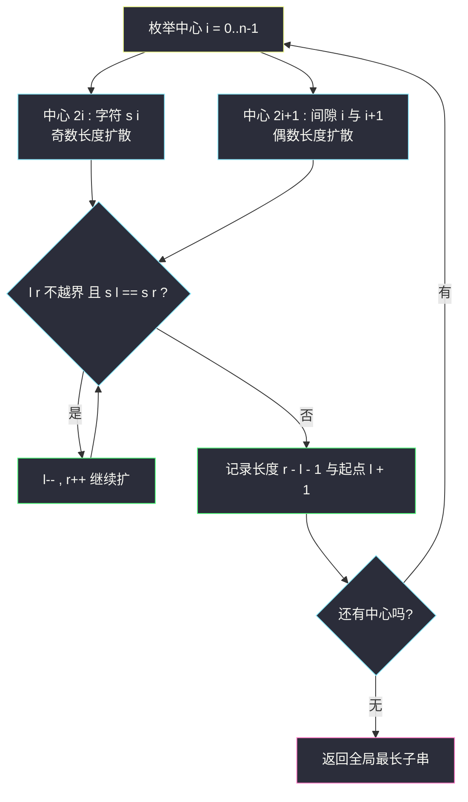

# 最长回文子串（中心扩散 + 区间 DP 对比）

## 一、问题描述

给你一个字符串 `s`，返回 `s` 中**最长的回文子串**。「子串」要求连续；「回文」正读反读相同。

> 🔗 LeetCode 5：https://leetcode.cn/problems/longest-palindromic-substring/

**示例 1**

```
输入：s = "babad"
输出："bab"
解释："aba" 同样是合法答案
```

**示例 2**

```
输入：s = "cbbd"
输出："bb"
```

**直观理解**

最朴素的想法是枚举所有子串再逐个验证回文，`O(n³)` 必超时。观察回文的**结构特征**：一个回文去掉两端后仍是回文——也就是说，判断「`s[l..r]` 是否回文」完全取决于「两端字符是否相等」和「内部 `s[l+1..r-1]` 是否回文」。

这个特征有两条利用路线：

1. **中心扩散**：每个回文都有一个「中心」。枚举 `2n-1` 个中心（`n` 个字符 + `n-1` 个字符间隙），从中心向两边扩到扩不动为止。面试默写首选。
2. **区间 DP**：`dp[l][r]` = `s[l..r]` 是否回文，从短区间推长区间。

本题主解用**中心扩散**，区间 DP 作对照，课上还有 Manacher 线性算法（class104 Code01）作进阶。

---

## 二、暴力解法

### 直观思路

枚举所有子串起点 `i`、终点 `j`（保证 `i ≤ j`），再双指针验证是否回文：

```java
// 暴力：枚举子串 + 验证回文
public static String longestPalindromeBrute(String s) {
    char[] c = s.toCharArray();
    int n = c.length;
    int begin = 0, maxLen = 1;
    for (int i = 0; i < n; i++) {
        for (int j = i; j < n; j++) {
            // 检查 s[i..j] 是否回文
            boolean ok = true;
            for (int l = i, r = j; l < r; l++, r--) {
                if (c[l] != c[r]) {
                    ok = false;
                    break;
                }
            }
            if (ok && j - i + 1 > maxLen) {
                begin = i;
                maxLen = j - i + 1;
            }
        }
    }
    return s.substring(begin, begin + maxLen);
}
```

### 复杂度

- **时间**：`O(n³)`——`O(n²)` 个子串，每个验证 `O(n)`
- **空间**：`O(1)`

### 🔴 瓶颈在哪里

同一个小区间 `s[l+1..r-1]` 被不同的大子串反复验证。**回文判定信息可以复用**——这正是区间 DP 的入口；换个角度枚举「中心」，则是中心扩散的入口。

---

## 三、优化探索（核心章节）

### 3.1 中心扩散的推导

一个长度为 `m` 的回文，去掉两端后仍是回文。反过来：**所有回文都由一个更小的回文（或单字符/空隙）加一对相同端点扩展而来**。

因此回文的「生长点」只有两类：

| 中心类型 | 数量 | 对应回文长度 |
|----------|------|--------------|
| 某个字符 `s[i]` | `n` 个 | 奇数长度（如 "aba"） |
| 相邻两字符之间 `s[i] 与 s[i+1]` | `n-1` 个 | 偶数长度（如 "abba"） |

共 `2n - 1` 个中心。固定中心后向两边扩：只要 `s[l] == s[r]` 且不越界就继续扩，直到失配。**以每个中心能扩出的最长回文，取全局最大即答案。**



### 3.2 区间 DP 对照

按课上区间 DP 体系（class067 / class076）：可变参数是区间端点 `l`、`r` → 二维表。

| dp 定义 | 含义 |
|---------|------|
| `dp[l][r]` | `s[l..r]` 是否为回文（boolean） |

```
dp[l][l] = true                       // 单字符
dp[l][l+1] = (s[l] == s[l+1])         // 双字符
dp[l][r] = (s[l] == s[r]) && dp[l+1][r-1]   // r - l >= 2
```

依赖方向：长区间的值取决于**短区间**（左下方向），所以**按区间长度从小到大**填表；每填到 `dp[l][r] = true` 就顺手用 `r - l + 1` 更新答案。

### 3.3 关键问题

| 问题 | 答案 |
|------|------|
| 为什么必须枚举 `2n-1` 个中心而不是 `n` 个？ | 偶数长度回文（如 "bb"）没有字符中心，中心落在两个字符的间隙上 |
| 中心扩散和区间 DP 谁快？ | 都是 `O(n²)`；中心扩散空间 `O(1)`，区间 DP 要 `O(n²)` 的表——扩散版面试默写更稳 |
| 失配时为什么长度是 `r - l - 1`？ | 循环在 `s[l] != s[r]` 或越界时退出，此时真正的回文是 `(l, r)` 开区间内部，长度 `r - 1 - (l + 1) + 1 = r - l - 1` |
| 能更快吗？ | Manacher 算法 `O(n)`（class104 Code01 用它一次解决 #5 与 #647），常数和心智成本更高，作为进阶 |
| 答案有多个怎么办？ | 题目允许返回任意一个合法答案 |

### 3.4 一句话核心

> **回文由中心对称生长：枚举 2n-1 个中心，两端相等就往外扩；不需要记整个 dp 表，所以空间 O(1)。**

---

## 四、代码实现

### Java（主解：中心扩散，面试默写版）

```java
// 最长回文子串
// 找到字符串s中最长的回文子串并返回
// 测试链接 : https://leetcode.cn/problems/longest-palindromic-substring/
// 说明 : 课上 class104 Code01 用 Manacher 做 O(n)，
//        面试常规做法是中心扩散，本文以中心扩散为主解
public class Solution {

    // 时间复杂度 O(n^2)，空间复杂度 O(1)
    public static String longestPalindrome(String s) {
        char[] c = s.toCharArray();
        int n = c.length;
        int begin = 0, maxLen = 1;
        // 枚举每个中心：先按字符扩（奇），再按间隙扩（偶）
        for (int center = 0; center < 2 * n - 1; center++) {
            // l, r 是扩散指针：
            // center 为偶数时从同一字符出发（奇长度），奇数时从相邻两字符出发（偶长度）
            int l = center / 2;
            int r = l + center % 2;
            while (l >= 0 && r < n && c[l] == c[r]) {
                l--;
                r++;
            }
            // 失配退出时，回文是开区间 (l, r) 内部
            int len = r - l - 1;
            if (len > maxLen) {
                maxLen = len;
                begin = l + 1;
            }
        }
        return s.substring(begin, begin + maxLen);
    }
}
```

### Java（对照版：区间 DP，对齐 class067/class076 区间 DP 体系）

```java
// dp[l][r] : s[l..r] 是否回文，按区间长度从小到大填
// 时间复杂度 O(n^2)，空间复杂度 O(n^2)
public class Solution {

    public static String longestPalindromeDp(String s) {
        char[] c = s.toCharArray();
        int n = c.length;
        boolean[][] dp = new boolean[n][n];
        int begin = 0, maxLen = 1;
        dp[0][0] = true;
        for (int r = 1; r < n; r++) {
            // 长度 1 与 2 的边界
            dp[r][r] = true;
            dp[r - 1][r] = c[r - 1] == c[r];
            if (dp[r - 1][r] && maxLen < 2) {
                begin = r - 1;
                maxLen = 2;
            }
            // 长度 >= 3：依赖 dp[l+1][r-1]（更短的区间，已算过）
            for (int l = r - 3; l >= 0; l--) {
                dp[l][r] = c[l] == c[r] && dp[l + 1][r - 1];
                if (dp[l][r] && r - l + 1 > maxLen) {
                    begin = l;
                    maxLen = r - l + 1;
                }
            }
        }
        return s.substring(begin, begin + maxLen);
    }
}
```

### Python（主解同思路）

```python
class Solution:
    def longestPalindrome(self, s: str) -> str:
        n = len(s)
        begin, max_len = 0, 1
        for center in range(2 * n - 1):
            l = center // 2
            r = l + center % 2
            while l >= 0 and r < n and s[l] == s[r]:
                l -= 1
                r += 1
            # 回文是开区间 (l, r) 内部
            length = r - l - 1
            if length > max_len:
                max_len = length
                begin = l + 1
        return s[begin:begin + max_len]
```

---

## 五、具体例子演示

以 `s = "babad"`（n = 5）为例，跟踪全部 9 个中心。用 `(begin, len)` 记录当前全局答案，初始 `(0, 1)` 即 `"b"`。

| # | center | 起点 l,r | 扩散过程（每步比较） | 最终回文 | 更新答案 |
|---|--------|----------|---------------------|----------|----------|
| 0 | 0（字符 b） | l=r=0 | b（无比较，直接通过）→ 越界停 | `b` (0,1) | 否（不大于 1） |
| 1 | 1（间隙 0,1） | l=0,r=1 | `b`≠`a` 停 | 无 | 否 |
| 2 | 2（字符 a） | l=r=1 | a；扩到 `b`≠`b`？比较 s[0]=b 与 s[2]=b：相等 → l=-1 越界停 | `bab` (0,3) | **是** → (0,3) |
| 3 | 3（间隙 1,2） | l=1,r=2 | `a`≠`b` 停 | 无 | 否 |
| 4 | 4（字符 b） | l=r=2 | b；s[1]=a==s[3]=a → 扩；s[0]=b vs s[4]=d：不等停 | `aba` (1,3) | 否（3 不大于 3） |
| 5 | 5（间隙 2,3） | l=2,r=3 | `b`≠`a` 停 | 无 | 否 |
| 6 | 6（字符 a） | l=r=3 | a；s[2]=b vs s[4]=d 不等 | `a` (3,1) | 否 |
| 7 | 7（间隙 3,4） | l=3,r=4 | `a`≠`d` 停 | 无 | 否 |
| 8 | 8（字符 d） | l=r=4 | d | `d` (4,1) | 否 |

最终答案 `(0, 3)` → `"bab"`。

**关键一步展开（center=2，找 "bab"）**：

```
初始 l = 1, r = 1        （字符 s[1] = 'a'）
第 1 轮：比较 s[1] 与 s[1]：相等（自己）→ l=0, r=2
第 2 轮：比较 s[0]='b' 与 s[2]='b'：相等 → l=-1, r=3
第 3 轮：l < 0 越界，退出
长度 = r - l - 1 = 3 - (-1) - 1 = 3，起点 = l + 1 = 0 → "bab"
```


再看偶数中心的一个例子 `s = "cbbd"`：center=3（间隙 1,2）从 `l=1, r=2` 出发，`s[1]='b' == s[2]='b'` → 扩到 `l=0, r=3`：`c ≠ d` 停，回文 = `bb` 长度 2。**偶数回文只有走「间隙中心」才能被找到**，这就是必须枚举 `2n-1` 个中心的原因。

---

## 六、复杂度分析

| 版本 | 时间 | 空间 | 说明 |
|------|------|------|------|
| 暴力枚举 | `O(n³)` | `O(1)` | `O(n²)` 子串 × `O(n)` 验证 |
| 中心扩散（主解） | `O(n²)` | `O(1)` | `2n-1` 个中心 × 每个最多扩 `O(n)` |
| 区间 DP | `O(n²)` | `O(n²)` | 逐格填 `dp[l][r]` |
| Manacher（class104 Code01） | `O(n)` | `O(n)` | 进阶；课上一次实现同时解决 #5、#647 |

---

## 七、方法对比与总结

### 三种方法的关系

| | 中心扩散 | 区间 DP | Manacher |
|---|----------|---------|----------|
| 枚举维度 | 回文中心 | 区间端点 (l, r) | 处理位置 i |
| 借助的信息 | 无（现扩现验） | 更短区间的回文性 | 已算位置的回文半径 |
| 时间 | `O(n²)` | `O(n²)` | `O(n)` |
| 空间 | `O(1)` | `O(n²)` | `O(n)` |
| 默写难度 | 低 | 中 | 高 |

中心扩散本质是「把区间 DP 的表隐式地用递归比较代替」——既然每次扩一圈只多比较一对字符，就没必要存表。

### 易错点

1. **忘了偶数中心**：只枚举 `n` 个字符中心，`"cbbd"` 会错误返回单字符。
2. **失配后长度计算**：退出循环时 `l`、`r` 已经过界，长度是 `r - l - 1` 不是 `r - l + 1`，起点是 `l + 1`。
3. **区间 DP 的遍历顺序**：`dp[l][r]` 依赖 `dp[l+1][r-1]`（左下角），必须短区间先算；按 `r` 递增、`l` 递减或按长度递增都可以，乱序会读错值。
4. **越界顺序**：`while` 条件要先判 `l >= 0 && r < n` 再取 `c[l] == c[r]`，短路保护。

### 模板口诀

> **中心扩散 2n-1，奇偶两类各扫平；两端相等往外顶，失配内段报长度。**

---

## 八、举一反三

| 题目 | 链接 | 迁移点 |
|------|------|--------|
| 647. 回文子串 | https://leetcode.cn/problems/palindromic-substrings/ | 同一套中心扩散，从「最长」变「计数」：每个中心能扩出的回文数直接累加 |
| 516. 最长回文子**序列** | https://leetcode.cn/problems/longest-palindromic-subsequence/ | 「连续」变「可跳」：中心扩散失效，标准区间 DP（class067 Code04） |
| 132. 分割回文串 II | https://leetcode.cn/problems/palindrome-partitioning-ii/ | 先用本题的 `dp[l][r]` 回文表，再做最少切割 DP |
| 131. 分割回文串 | https://leetcode.cn/problems/palindrome-partitioning-ii/ 旁系：https://leetcode.cn/problems/palindrome-partitioning/ | 回文表 + 回溯枚举切法 |
| 214. 最短回文串 | https://leetcode.cn/problems/shortest-palindrome/ | 回文判定 + KMP 的组合 |

**迁移一句**：见到「回文 + 连续」想中心扩散；「回文 + 可跳过字符」或「要复用回文判定」想区间 DP。#5 → #647 → #516 是回文三部曲，难度层层递进。
