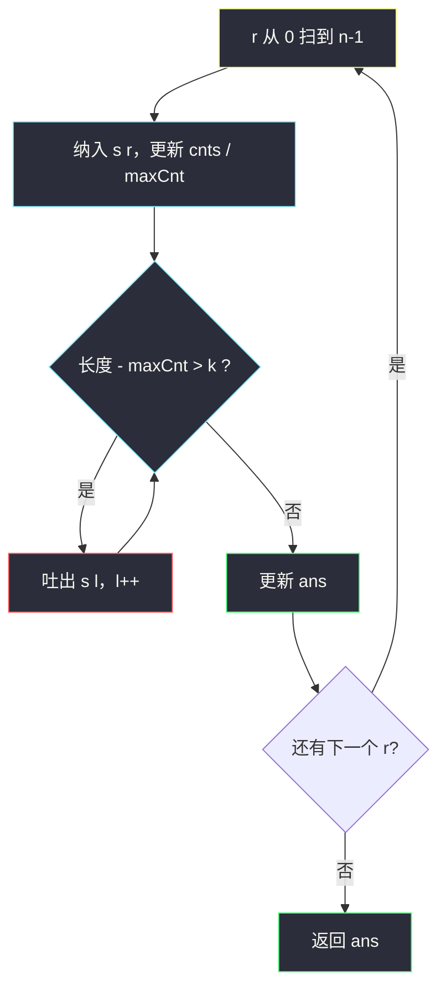
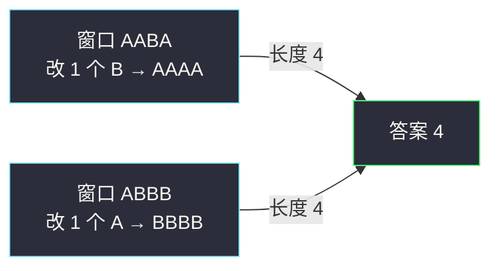

# 替换后的最长重复字符（变长窗口 · 最多改 k 个）

## 一、问题描述

给你一个只含大写字母的字符串 `s`，和一个整数 `k`。  
你可以选择字符串中的任意字符，并将其更改为任意其他大写字母，该操作**最多可以执行 `k` 次**。

做完这些更改后，返回包含相同字母的最长子字符串的长度。

> 🔗 LeetCode 424：https://leetcode.cn/problems/longest-repeating-character-replacement/

**示例 1（简单）**

```
输入：s = "ABAB", k = 2
输出：4
解释：把两个 'A' 换成两个 'B'（或反过来），得到 "BBBB" 或 "AAAA"，长度 4。
```

**示例 2（经典）**

```
输入：s = "AABABBA", k = 1
输出：4
解释：
把下标 1 的 'A' 换成 'B' → "AABB BBA" 中的一段 "BBBB"（下标 1..4），长度 4。
把下标 5 的 'B' 换成 'A' 也能得到长度 4。无法得到更长。
```

**直观理解**

找一个最长的连续窗口，使得：**把窗口里「不是出现最多的那种字母」全改掉，改动次数 ≤ k**。  
改完后窗口就变成单一字母的重复串。

和 [1004. 最大连续 1 的个数 III](https://leetcode.cn/problems/max-consecutive-ones-iii/) **同一模板**：  
1004 是「最多翻 k 个 0」；本题是「最多改 k 个『非众数』」。

---

## 二、暴力解法（入门）

### 直观思路

枚举所有子串 `[l..r]`，统计频次，看「长度 − 出现最多的字母次数」是否 ≤ k，取合法最长。

```java
public static int characterReplacement(String str, int k) {
    char[] s = str.toCharArray();
    int n = s.length, ans = 0;
    for (int l = 0; l < n; l++) {
        int[] cnts = new int[256];
        int maxCnt = 0;
        for (int r = l; r < n; r++) {
            cnts[s[r]]++;
            maxCnt = Math.max(maxCnt, cnts[s[r]]);
            // 需要替换的个数 = 窗口长 - 众数次数
            if (r - l + 1 - maxCnt <= k) {
                ans = Math.max(ans, r - l + 1);
            }
        }
    }
    return ans;
}
```

### 复杂度

- **时间**：`O(n²)`（字符集常数并进）。
- **空间**：`O(Σ)`，Σ=26。

### 🔴 瓶颈在哪里

每个 `l` 都重开窗口扫 `r`。注意到：右端右移时，合法左端**只会右移、不会左移**——可以用双指针一把滑过去。

---

## 三、优化探索（核心章节）

### 3.1 观察特征

| 特征 | 说明 |
|------|------|
| 连续子串 | 适合滑动窗口 |
| 目标是最长 | 变长窗口，尽量拉长 |
| 合法条件 | `窗口长度 - 窗口内众数次数 ≤ k` |
| 字符集 | 大写字母，`cnts[256]` 或 `cnts[26]` |

### 3.2 暴力 → 优化：变长窗口

维护窗口 `[l..r]`、频次数组 `cnts`、以及窗口内出现次数最多的字母次数 `maxCnt`：

1. **右扩**：纳入 `s[r]`，更新 `cnts` 与 `maxCnt`。
2. **左缩**：若 `r - l + 1 - maxCnt > k`（要改的太多），吐出 `s[l]`，`l++`。
3. **更新答案**：窗口合法后，`ans = max(ans, r - l + 1)`。

```
需要替换数 = 窗口长度 - 众数次数
          = 「非众数」字符的个数
要求这个数 ≤ k
```



### 3.3 和 1004 的对照（同一模板）

| | 1004 最大连续 1 | 424 替换后最长重复 |
|--|-----------------|-------------------|
| 窗口想变成 | 全是 `1` | 全是某一种字母（众数） |
| 「坏字符」 | `0` | 非众数字符 |
| 坏字符个数 | `zero` | `长度 - maxCnt` |
| 收缩条件 | `zero > k` | `长度 - maxCnt > k` |

1004 是 424 在「只有 0/1、目标字母固定为 1」时的特化。

### 3.4 关键推导问题（滑动窗口）

| 问题 | 答案 |
|------|------|
| 何时右扩？ | `r` 每次 +1 |
| 何时左缩？ | `r-l+1 - maxCnt > k` 时一直吐到合法 |
| 众数是谁要定死吗？ | **不用**。窗口内谁出现最多，就默认改成谁（最优） |
| 为何是 O(n)？ | `l`、`r` 各最多走 n 步 |

### 3.5 一句话核心

> **窗口内保留出现最多的那种字母，其余的用 ≤ k 次替换改掉；超额就从左边吐，直到合法，过程中记最长窗口。**

---

## 四、代码实现详解

### Java（与 class049 同风格）

```java
// 替换后的最长重复字符
// 测试链接 : https://leetcode.cn/problems/longest-repeating-character-replacement/
public class Solution {

    public static int characterReplacement(String str, int k) {
        char[] s = str.toCharArray();
        int[] cnts = new int[256];
        int maxCnt = 0; // 窗口内出现次数最多的字母的次数
        int ans = 0;
        for (int l = 0, r = 0; r < s.length; r++) {
            // 右边界纳入
            cnts[s[r]]++;
            maxCnt = Math.max(maxCnt, cnts[s[r]]);
            // 需要替换的个数 = 窗口长 - 众数次数；超额则左边界吐出
            while (r - l + 1 - maxCnt > k) {
                cnts[s[l++]]--;
                // maxCnt 可以不往回减（见下方说明）；要严格维护也可 O(26) 重扫
            }
            ans = Math.max(ans, r - l + 1);
        }
        return ans;
    }
}
```

**变量含义**

| 变量 | 含义 |
|------|------|
| `s` | `toCharArray()` |
| `cnts[c]` | 窗口内字符 `c` 的出现次数 |
| `maxCnt` | 窗口内「出现最多的那种字母」的次数 |
| `l, r` | 窗口左右端（含） |
| `r-l+1 - maxCnt` | 要把窗口变成纯重复串，至少要改几次 |

**关于 `maxCnt` 吐窗后不回减**

吐出字符后，真实的众数次数可能变小，但很多课上/题解写法**故意不减小 `maxCnt`**：

- 答案只关心**历史上出现过的最长合法窗口**；
- `maxCnt` 偏大时，`长度 - maxCnt` 偏小，窗口可能暂时「看起来」更宽；
- 但要刷新更大的 `ans`，必须出现**新的、更大的** `maxCnt`（更长且合法），此时 `maxCnt` 会被右扩正确抬高。

若你觉得不直观，缩窗时用 O(26) 重扫维护真实 `maxCnt` 也完全正确（见下）。

### Java（严格维护 maxCnt，更好懂）

```java
public static int characterReplacement(String str, int k) {
    char[] s = str.toCharArray();
    int[] cnts = new int[256];
    int ans = 0;
    for (int l = 0, r = 0; r < s.length; r++) {
        cnts[s[r]]++;
        while (r - l + 1 - max(cnts) > k) {
            cnts[s[l++]]--;
        }
        ans = Math.max(ans, r - l + 1);
    }
    return ans;
}

// 大写字母，扫 'A'..'Z' 即可
private static int max(int[] cnts) {
    int m = 0;
    for (int c = 'A'; c <= 'Z'; c++) {
        m = Math.max(m, cnts[c]);
    }
    return m;
}
```

### Python（同结构）

```python
class Solution:
    def characterReplacement(self, s: str, k: int) -> int:
        cnts = [0] * 256
        max_cnt = 0
        ans = 0
        l = 0
        for r, ch in enumerate(s):
            code = ord(ch)
            cnts[code] += 1
            max_cnt = max(max_cnt, cnts[code])
            while r - l + 1 - max_cnt > k:
                cnts[ord(s[l])] -= 1
                l += 1
            ans = max(ans, r - l + 1)
        return ans
```

---

## 五、具体例子演示

`s = "AABABBA"`，`k = 1`。

| r | 纳入 | 窗口 | cnts 要点 | maxCnt | 长度-maxCnt | 操作 | ans |
|---|------|------|-----------|--------|-------------|------|-----|
| 0 | A | A | A1 | 1 | 0 | 合法 | 1 |
| 1 | A | AA | A2 | 2 | 0 | 合法 | 2 |
| 2 | B | AAB | A2 B1 | 2 | 1 | 合法 | 3 |
| 3 | A | AABA | A3 B1 | 3 | 1 | 合法 | 4 |
| 4 | B | AABAB | A3 B2 | 3 | 2 | 2>1，吐 A → ABAB | 4 |
| 5 | B | ABABB | A1 B3 | 3 | 2→吐后… | 继续调到合法长度 4 | 4 |
| 6 | A | … | | | | 最长仍为 4 | **4** |

其中一段最优窗口示意：`AABA`（改 1 个 B）或 `BBBB` 段（改 1 个 A）→ 长度 4。



---

## 六、复杂度分析

| 方法 | 时间 | 空间 | 说明 |
|------|------|------|------|
| 枚举所有子串 | `O(n²)` | `O(Σ)` | 超时风险 |
| 滑窗（不回减 maxCnt） | **O(n)** | `O(Σ)` | `l、r` 各走一遍 |
| 滑窗（缩窗重扫 maxCnt） | `O(n·Σ)` | `O(Σ)` | Σ=26，可视为 O(n) |

---

## 七、方法对比与总结

| | 暴力枚举 | 变长滑窗 |
|--|----------|----------|
| 想法 | 每个子串算众数 | 右扩左缩维护 cnts |
| 合法判定 | `len - maxCnt ≤ k` | 同 |
| 适用 | 理解题意 | **本题默认解** |

**易错点**

1. 不是「最多改成某一种预先指定的字母」，而是**窗口内谁最多就保留谁**。
2. 收缩条件是 `长度 - maxCnt > k`，不要写成 `maxCnt > k`。
3. 和 1004 对比记忆：坏字符个数 = `长度 - 众数次数`。
4. 题面只有大写；若扩展字符集，重扫 `maxCnt` 时范围要跟着改。

**模板（最多改 k 个坏字符 · 最长窗）**

```java
// for l=0, r=0; r < n; r++:
//   纳入 s[r]，更新 cnts / maxCnt
//   while (长度 - maxCnt > k): 吐出 s[l++]
//   ans = max(ans, 长度)
```

---

## 八、举一反三

| 题目 | 关系 |
|------|------|
| [1004. 最大连续 1 的个数 III](https://leetcode.cn/problems/max-consecutive-ones-iii/) | 同模板；坏字符固定为 `0` |
| [2024. 考试的最大困扰度](https://leetcode.cn/problems/maximize-the-confusion-of-an-exam/) | 同模板；分别对目标 `'T'` / `'F'` 跑两遍，或直接套 424 |
| [340. 至多 K 个不同字符的最长子串](https://leetcode.cn/problems/longest-substring-with-at-most-k-distinct-characters/) | 变长窗口，约束从「替换次数」换成「种类数」 |
| [76. 最小覆盖子串](https://leetcode.cn/problems/minimum-window-substring/) | class049：变长但求**最短**覆盖 |

**思想迁移**

```
「最多做 k 次修改 / 翻转，使窗口变成全相同」
  ↓
坏字符个数 ≤ k
  ↓
424：坏 = 非众数 = 长度 - maxCnt
1004：坏 = 0 的个数
2024：坏 = 非目标字母的个数
```

**记忆口诀**：右扩记频次，留下众数；非众数个数超 k 就左吐；过程中刷新最长窗。
