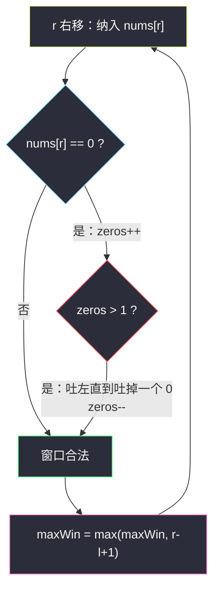
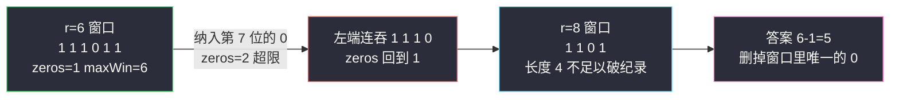

# 删掉一个元素以后全为 1 的最长子数组（变长窗口：窗口内最多一个 0）

## 一、问题描述

给你一个二进制数组 `nums`（只含 `0`/`1`），你需要从中**删掉恰好一个元素**，请返回删掉一个元素后，数组中**最长的、只包含 1 的子数组**的长度。如果不存在这样的子数组，返回 `0`。

> 🔗 LeetCode 1493：https://leetcode.cn/problems/longest-subarray-of-1s-after-deleting-one-element/

**示例 1（经典）**

```
输入：nums = [1,1,0,1]
输出：3
解释：删掉下标 2 的 0，得到 [1,1,1]，最长的全 1 子数组长度为 3。
```

**示例 2**

```
输入：nums = [0,1,1,1,0,1,1,0,1]
输出：5
解释：删掉下标 4 的 0，得到 [0,1,1,1,1,1,0,1]，最长全 1 子数组为中间的 5 个 1。
```

**直观理解**

「删掉一个元素」其实是一个**幌子**：删谁最划算？当然是删掉某个 `0`，把 `0` 两侧的 `1` 段拼起来。于是问题转化为：**找一段最长的子数组，其中 0 的个数 ≤ 1**（这一个 0 就是我们要删的），答案为该长度减 1。

---

## 二、暴力解法（入门）

### 直观思路

枚举要删掉的位置 `d`，在剩下的数组里数最长连续 1 段。

```java
public int longestSubarray(int[] nums) {
    int n = nums.length, ans = 0;
    for (int d = 0; d < n; d++) {          // 枚举删掉的位置
        int len = 0;
        for (int i = 0; i < n; i++) {
            if (i == d) continue;          // 跳过被删的
            len = nums[i] == 1 ? len + 1 : 0;
            ans = Math.max(ans, len);
        }
    }
    return ans;
}
```

### 复杂度

- **时间**：`O(n²)`。
- **空间**：`O(1)`。

### 🔴 瓶颈在哪里

每个 `d` 独立重扫整个数组，但删相邻两个位置的差别往往只是局部。而且更本质的观察是：**删的位置几乎总应该是某个 0**（删 1 只会亏），所有「删哪个 0」的方案，可以被一个「窗口内 0 ≤ 1」的滑动窗口一网打尽。

---

## 三、优化探索（核心章节）

### 3.1 观察特征

| 特征 | 说明 |
|------|------|
| 连续子数组 | 滑动窗口 |
| 条件宽松型：「最多容忍 1 个 0」 | **不满足才收缩**的变长窗口 |
| 求最长 | 右端能扩就扩 |

### 3.2 从暴力到优化的推导

```
删一个元素后全 1 的最长子数组
      ↓ 删谁最优？删掉把两段 1 拼起来的那个 0
找「0 的个数 ≤ 1」的最长子数组，记长度 maxWin
      ↓ 讨论
窗口内有 0  → 删掉它，长度 = maxWin - 1
窗口内全 1  → 也必须删一个（题目要求恰好删一个），长度 = maxWin - 1
      ↓ 统一
答案 = maxWin - 1（maxWin ≥ 1，因为 n ≥ 1）
```

为什么 `maxWin - 1` 对「全 1 数组」也成立？例如 `[1,1,1]`：最长窗口是整个数组，长度 3，但必须删一个元素，剩下 2 个 1，答案正是 `3 - 1 = 2`。两种情形被同一个减法统一，非常优雅。



### 3.3 关键推导问题：为什么不是「恰好删一个 0」？

若数组全为 1，没有 0 可删，但题目**强制删一个**（删掉一个 1 也算「删掉一个元素」）。所以返回值一定有 `-1`，任何「找最长 0≤1 窗口后直接返回」的写法都会在 `[1,1,1]` 上多算 1。这是本题最大的坑。

### 3.4 与 #1004 的关系

[1004. 最大连续 1 的个数 III](https://leetcode.cn/problems/max-consecutive-ones-iii/) 允许**翻转** k 个 0（可以不翻），骨架是「窗口内 0 ≤ k」；本题是它 `k = 1` 的特例，只是**必须消耗掉这一次删除**，所以最后减 1。

### 3.5 一句话核心

> **「恰好删一个」⇒「窗口内最多一个 0，长度再减一」：窗口找到最优删除位，减法统一了有无 0 两种情形。**

---

## 四、代码实现详解

> 说明：未在左程云课源码仓库中定位到本题原题，主解按 `class049` 滑动窗口专题的**变长窗口（不满足收缩）骨架**对齐书写，同 #1004「窗口内 0 ≤ k」模板。

### Java（主解）

```java
// 删掉一个元素以后全为 1 的最长子数组
// 给定一个二进制数组 nums，需要删除恰好一个元素，
// 返回删除后最长的、只包含 1 的非空子数组长度；不存在返回 0
// 转化：找 0 的个数 <= 1 的最长子数组，长度减 1
// 测试链接 : https://leetcode.cn/problems/longest-subarray-of-1s-after-deleting-one-element/
public class Solution {

    public static int longestSubarray(int[] nums) {
        int n = nums.length;
        int maxWin = 0;                      // 0 的个数 <= 1 的最长窗口
        for (int l = 0, r = 0, zeros = 0; r < n; r++) {
            if (nums[r] == 0) {
                zeros++;
            }
            while (zeros > 1) {              // 0 太多：吐左，直到吐掉一个 0
                if (nums[l++] == 0) {
                    zeros--;
                }
            }
            maxWin = Math.max(maxWin, r - l + 1);
        }
        return maxWin - 1;                   // 恰好删一个元素，统一减 1
    }
}
```

**变量含义**

| 变量 | 含义 |
|------|------|
| `zeros` | 当前窗口 `[l..r]` 内 0 的个数 |
| `l` / `r` | 窗口左右端，各自只前进 |
| `maxWin` | 「最多一个 0」约束下的最长窗口长度，至少为 1 |

**循环不变式**：更新 `maxWin` 时，窗口 `nums[l..r]` 内 0 的个数 ≤ 1。

### Java（对照版：前缀 0 段拼接）

```java
public static int longestSubarray2(int[] nums) {
    // 不用滑窗：统计每段 1 的长度，答案 = 相邻两段之和（中间隔一个 0）
    int n = nums.length, ans = 0;
    int prev = 0, cur = 0;                   // 上一段 1 的长度、当前段
    for (int i = 0; i < n; i++) {
        if (nums[i] == 1) {
            cur++;
        } else {
            prev = cur;
            cur = 0;
        }
        ans = Math.max(ans, prev + cur);     // 两段之间恰好删掉那个 0
    }
    return ans == n ? n - 1 : ans;           // 全 1 时强制删一个
}
```

### Python

```python
class Solution:
    def longestSubarray(self, nums: list[int]) -> int:
        max_win = 0
        l = zeros = 0
        for r, v in enumerate(nums):
            if v == 0:
                zeros += 1
            while zeros > 1:            # 0 的个数 <= 1
                if nums[l] == 0:
                    zeros -= 1
                l += 1
            max_win = max(max_win, r - l + 1)
        return max_win - 1              # 恰好删一个元素
```

---

## 五、具体例子演示

`nums = [0,1,1,1,0,1,1,0,1]`，逐步跟踪：

| r | nums[r] | zeros（纳入后） | 收缩动作 | 窗口 [l..r] | 长度 | maxWin |
|---|---------|----------------|----------|-------------|------|--------|
| 0 | 0 | 1 | 不收缩 | `[0]` | 1 | 1 |
| 1 | 1 | 1 | 不收缩 | `[0,1]` | 2 | 2 |
| 2 | 1 | 1 | 不收缩 | `[0,1,1]` | 3 | 3 |
| 3 | 1 | 1 | 不收缩 | `[0,1,1,1]` | 4 | 4 |
| 4 | 0 | 2 | 吐 `nums[0]=0` → zeros=1，l=1 | `[1,1,1,0]` | 4 | 4 |
| 5 | 1 | 1 | 不收缩 | `[1,1,1,0,1]` | 5 | 5 |
| 6 | 1 | 1 | 不收缩 | `[1,1,1,0,1,1]` | 6 | **6** |
| 7 | 0 | 2 | 吐 `1,1,1`（zeros 不变）再吐 `0` → zeros=1，l=5 | `[1,1,0]` | 3 | 6 |
| 8 | 1 | 1 | 不收缩 | `[1,1,0,1]` | 4 | 6 |

`maxWin = 6`，答案 `6 - 1 = 5`——对应窗口 `[1,1,1,0,1,1]` 删掉中间那个 `0`。✅

注意 `r=7` 这一步：为了吐出**一个 0**，左端连吞了三个 1——收缩的目标是让 `zeros` 回到 1，中间的 1 都是「陪葬」的。



**再看示例 1**：`[1,1,0,1]`：全程 `zeros ≤ 1`，`maxWin = 4`，答案 `4 - 1 = 3`。✅  
**示例 3**：`[1,1,1]`：`zeros` 恒为 0，`maxWin = 3`，答案 `3 - 1 = 2`（必须删一个 1）。✅

---

## 六、复杂度分析

| 方法 | 时间 | 空间 | 说明 |
|------|------|------|------|
| 暴力枚举删除位 | `O(n²)` | `O(1)` | 每个删除位重扫 |
| 滑动窗口 | `O(n)` | `O(1)` | `l`、`r` 各走一遍 |
| 分段拼接 | `O(n)` | `O(1)` | 一趟统计相邻 1 段 |

---

## 七、方法对比与总结

| | 滑动窗口 | 分段拼接 |
|--|----------|----------|
| 思维负担 | 低（复用 k=1 模板） | 中（边界多：全 1、开头 0、结尾 0） |
| 可推广性 | 强（#1004 任意 k、#424 字符预算） | 弱（只适合「容忍一个断点」） |

**易错点**

1. **最后必须 `-1`**：全 1 数组也要删一个元素，忘了减一会把 `[1,1,1]` 错报成 3。
2. 收缩条件是 `zeros > 1`（保持 ≤ 1），别写成 `>= 1`——那样会把恰好含一个 0 的合法窗口也收缩掉。
3. 吐左时只有 `nums[l] == 0` 才让 `zeros--`，吐到 `1` 不减。
4. 空数组 / 单元素：本题 `n ≥ 1`，`maxWin ≥ 1`，`maxWin - 1 ≥ 0` 天然安全。

**模板（变长窗口：预算型条件求最长）**

```java
// for (l=0, r=0, zeros=0; r<n; r++) {
//     纳入 nums[r]（必要时 zeros++）;
//     while (zeros > 1) { 吐左（是 0 则 zeros--）; }
//     ans = max(ans, r-l+1);   // 收缩完立刻更新
// }
```

---

## 八、举一反三

| 题目 | 关系 |
|------|------|
| [1004. 最大连续 1 的个数 III](https://leetcode.cn/problems/max-consecutive-ones-iii/) | 本题的推广版：窗口内 0 ≤ k，且不强制翻转 |
| [487. 最大连续 1 的个数 II](https://leetcode.cn/problems/max-consecutive-ones-ii/) | 最多翻转一个 0 的最长 1 段（会员题，即本题「不强制删」版） |
| [424. 替换后的最长重复字符](https://leetcode.cn/problems/longest-repeating-character-replacement/) | 同一骨架在字母上的版本：其他字符 ≤ k |
| [2024. 考试的最大困扰度](https://leetcode.cn/problems/maximize-the-confusion-of-an-exam/) | 窗口内较少字符 ≤ k，两个方向各做一次 |

**思想迁移**

- 「删除/翻转 k 个元素」类问题：把删除的元素留在窗口里当「预算」，窗口条件变成「坏元素个数 ≤ k」。
- 「恰好」约束常常意味着最后要减掉固定成本——先算宽松版，再统一修正。
