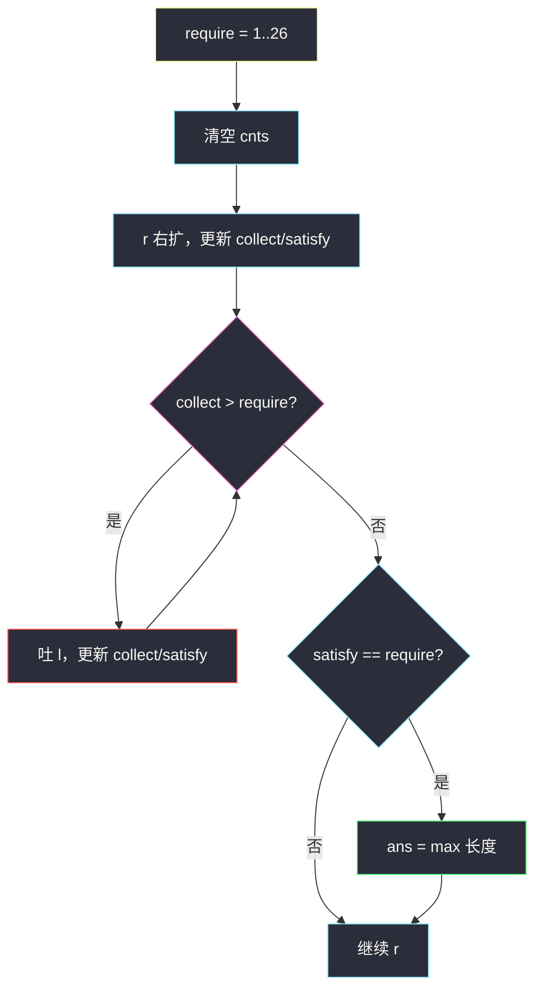

# 至少有 K 个重复字符的最长子串（枚举种类 + collect / satisfy）

## 一、问题描述

给你一个字符串 `s` 和一个整数 `k`，找出 `s` 中的**最长子串**，要求子串中**每一个出现过的字符**出现次数都 **不少于** `k`。返回该长度；若不存在则返回 `0`。

> 🔗 LeetCode 395：https://leetcode.cn/problems/longest-substring-with-at-least-k-repeating-characters/

**示例 1**

```
输入：s = "aaabb", k = 3
输出：3
解释：最长子串 "aaa"，'a' 出现 3 次 ≥ k
```

**示例 2**

```
输入：s = "ababbc", k = 2
输出：5
解释：最长子串 "ababb"：a×3、b×2，均 ≥ 2
```

**直观理解**

不是「某个字符出现 ≥ k」，而是**窗口里出现的每一种字符都 ≥ k**。  
难点：种类数未知时，有未达标字符不知道该缩谁——所以外层先固定「窗口里恰好几种字符」。

与 class049 Code07 一致：枚举 `require = 1..26`，内层用 `collect` / `satisfy` 做滑动窗口。

---

## 二、暴力解法（入门）

### 直观思路

枚举所有子串 `[l..r]`，统计频次，检查每个出现过的字符是否都 ≥ `k`，取最大长度。

```java
public static int longestSubstringBrute(String str, int k) {
    char[] s = str.toCharArray();
    int n = s.length, ans = 0;
    for (int l = 0; l < n; l++) {
        int[] cnts = new int[256];
        for (int r = l; r < n; r++) {
            cnts[s[r]]++;
            if (allSatisfy(cnts, k)) {
                ans = Math.max(ans, r - l + 1);
            }
        }
    }
    return ans;
}

private static boolean allSatisfy(int[] cnts, int k) {
    for (int c = 0; c < 256; c++) {
        if (cnts[c] > 0 && cnts[c] < k) {
            return false;
        }
    }
    return true;
}
```

### 复杂度

- **时间**：`O(n²)`（再乘检查字母的常数）。
- **空间**：`O(256)`。

### 🔴 瓶颈在哪里

「所有出现字符 ≥ k」是全局约束，直接做窗口时：**未达标不能靠缩窗变达标**（缩只会更少），种类又未知。  
优化：外层枚举窗口恰好含 `require` 种字符，内层在 `collect ≤ require` 下维护「每种都 ≥ k」。

---

## 三、优化探索（核心章节）

### 3.1 观察特征

| 特征 | 说明 |
|------|------|
| 每字符 ≥ k | 出现过的都要达标 |
| 求最长 | 达标时 `ans = max(ans, r-l+1)` |
| 种类数未知 | 外层枚举 `require = 1..26` |
| 种类过多 | `collect > require` → 左缩 |

### 3.2 暴力 → 优化：枚举 require

```
最优窗口内一定有某种类数 t（1≤t≤26）
  ↓
外层 for require = 1..26
  ↓
内层窗口：
  collect = 窗口内不同字符数
  satisfy = 其中频次 ≥ k 的种类数
  collect > require → 左缩
  satisfy == require → 这 require 种都 ≥ k，更新 ans
```

```
s = "ababbc", k=2, require=2
合法：恰好 2 种，且每种 ≥ 2
"ababb"：a×3, b×2 → collect=2, satisfy=2 ✓ 长度 5
```

### 3.3 关键问题（扩 / 缩）

| 问题 | 答案 |
|------|------|
| 右扩更新什么？ | `cnts++`；`==1` 则 `collect++`；`==k` 则 `satisfy++` |
| 何时左缩？ | **仅当** `collect > require`（种类太多） |
| 未达标要不要缩？ | **不要**——缩帮不上忙，应继续扩 `r` |
| 何时更新答案？ | `satisfy == require`（缩后必有 `collect == require`） |

```java
cnts[s[r]]++;
if (cnts[s[r]] == 1) collect++;
if (cnts[s[r]] == k) satisfy++;
while (collect > require) {
    if (cnts[s[l]] == 1) collect--;
    if (cnts[s[l]] == k) satisfy--;
    cnts[s[l++]]--;
}
if (satisfy == require) ans = Math.max(ans, r - l + 1);
```

### 3.4 循环不变式

> **不变式 A**：缩窗后 `collect ≤ require`。  
> **不变式 B**：`satisfy` = 窗口内 `cnts[c] ≥ k` 的种类数。  
> **不变式 C**：若 `satisfy == require`，则这 require 种字符均 ≥ k。

### 3.5 核心思想（一句话）

> **外层枚举窗口恰好 `require` 种字符；内层 `collect` 超了就缩，`satisfy` 齐了就更新最长。**



---

## 四、代码实现详解

### Java（与 class049 Code07 同款）

```java
// 至少有K个重复字符的最长子串
// 给你一个字符串 s 和一个整数 k ，请你找出 s 中的最长子串
// 要求该子串中的每一字符出现次数都不少于 k 。返回这一子串的长度
// 如果不存在这样的子字符串，则返回 0。
// 测试链接 : https://leetcode.cn/problems/longest-substring-with-at-least-k-repeating-characters/
public class Solution {

    public static int longestSubstring(String str, int k) {
        char[] s = str.toCharArray();
        int n = s.length;
        int[] cnts = new int[256];
        int ans = 0;
        // 每次要求子串必须含有 require 种字符，每种都必须 >= k 次
        for (int require = 1; require <= 26; require++) {
            java.util.Arrays.fill(cnts, 0);
            // collect : 窗口中一共收集到的种类数
            // satisfy : 窗口中达标的种类数(次数 >= k)
            for (int l = 0, r = 0, collect = 0, satisfy = 0; r < n; r++) {
                cnts[s[r]]++;
                if (cnts[s[r]] == 1) {
                    collect++;
                }
                if (cnts[s[r]] == k) {
                    satisfy++;
                }
                // 种类超了，吐出 l
                while (collect > require) {
                    if (cnts[s[l]] == 1) {
                        collect--;
                    }
                    if (cnts[s[l]] == k) {
                        satisfy--;
                    }
                    cnts[s[l++]]--;
                }
                if (satisfy == require) {
                    ans = Math.max(ans, r - l + 1);
                }
            }
        }
        return ans;
    }
}
```

| 变量 | 含义 |
|------|------|
| `require` | 目标种类数 |
| `collect` | 窗口内不同字符数 |
| `satisfy` | 频次 ≥ k 的种类数 |
| `cnts[c]` | 字符 c 在窗口内次数 |

**吐左时为何判 `==1` / `==k`？**

- 移出前 `==1`：移出后种类消失 → `collect--`
- 移出前 `==k`：移出后变 `k-1`，不再达标 → `satisfy--`

### Python（同结构）

```python
class Solution:
    def longestSubstring(self, s: str, k: int) -> int:
        n = len(s)
        ans = 0
        for require in range(1, 27):
            cnts = [0] * 256
            l = collect = satisfy = 0
            for r in range(n):
                c = ord(s[r])
                cnts[c] += 1
                if cnts[c] == 1:
                    collect += 1
                if cnts[c] == k:
                    satisfy += 1
                while collect > require:
                    left = ord(s[l])
                    if cnts[left] == 1:
                        collect -= 1
                    if cnts[left] == k:
                        satisfy -= 1
                    cnts[left] -= 1
                    l += 1
                if satisfy == require:
                    ans = max(ans, r - l + 1)
        return ans
```

---

## 五、具体例子演示

### 例 1：`s = "aaabb"`, `k = 3` → `3`

**require=1**

| r | s[r] | collect | satisfy | 窗口 | ans |
|---|------|---------|---------|------|-----|
| 0 | a | 1 | 0 | a | 0 |
| 1 | a | 1 | 0 | aa | 0 |
| 2 | a | 1 | 1 | aaa | **3** |
| 3 | b | 2>1 | 缩 | … | 3 |

### 例 2：`s = "ababbc"`, `k = 2` → `5`

**require=2**

| r | 动作要点 | 窗口 | ans |
|---|----------|------|-----|
| 0..2 | collect 到 2，尚未都达标 | aba | 0 |
| 3 | a、b 都达 2 → satisfy=2 | abab | 4 |
| 4 | b 再多一次，仍 satisfy=2 | **ababb** | **5** |
| 5 | 加入 c，collect>2，左缩 | … | 5 |

```
s: a b a b b c
       l→     r→
窗口 "ababb"：a×3≥2, b×2≥2 ✓
```

### 例 3：`s = "bbaaacbd"`, `k = 3` → `3`

require=1 时扫到 `"aaa"` 得 3；两种及以上无法都 ≥3。

---

## 六、复杂度分析

| 方法 | 时间 | 空间 | 说明 |
|------|------|------|------|
| 暴力枚举子串 | `O(n²)` | `O(1)` | 超时风险 |
| **枚举 require + 窗口** | **`O(26n)`** | `O(256)` | class049 标准解 |
| 分治按未达标字符切 | `O(n log 26)` | `O(log n)` 栈 | 也可，课上偏窗口 |

---

## 七、方法对比与总结

### 与 class049 窗口维护对照

| 题型 | collect | 额外量 | 缩窗条件 | 更新 |
|------|---------|--------|----------|------|
| 至多 k 种（Code06） | 种类数 | — | collect > k | `ans += r-l+1` |
| **本题 Code07** | 种类数 | satisfy | collect > require | `satisfy==require` 取最长 |

### 易错点

1. **未达标不要缩左**——只会更短，应等 `r` 扩。  
2. `satisfy` 在 `cnts==k` 时 +1，吐出前 `==k` 时 -1。  
3. 每个 `require` 要 `Arrays.fill(cnts, 0)`。  
4. `require` 上界 26（小写字母）；题面若含大写需改。

### 模板

```java
for (int require = 1; require <= 26; require++) {
    // fill cnts
    for (int l = 0, r = 0, collect = 0, satisfy = 0; r < n; r++) {
        // 纳入 r，更新 collect / satisfy
        while (collect > require) { /* 吐 l */ }
        if (satisfy == require) ans = Math.max(ans, r - l + 1);
    }
}
```

---

## 八、举一反三

| 题目 | 关系 |
|------|------|
| [340. 至多 K 个不同字符的最长子串](https://leetcode.cn/problems/longest-substring-with-at-most-k-distinct-characters/) | 只要 collect ≤ k |
| [159. 至多两个不同字符的最长子串](https://leetcode.cn/problems/longest-substring-with-at-most-two-distinct-characters/) | k=2 特例 |
| [76. 最小覆盖子串](https://leetcode.cn/problems/minimum-window-substring/) | class049 欠债最短窗 |
| [424. 替换后的最长重复字符](https://leetcode.cn/problems/longest-repeating-character-replacement/) | 允许替换额度 |

**思想迁移**

```
「出现过的字符都要满足频次下界」
  ↓
种类 t 未知 → 枚举 require
  ↓
collect 管种类上限，satisfy 管达标数
  ↓
超种类才缩；齐达标才更新最长
```

**记忆口诀**：外层枚举几种字；collect 超了才左缩；satisfy 齐了更最长；未达标别缩等右扩。

---

### 附录：分治对照（可选）

找第一个 `0 < cnt[c] < k` 的字符当分割点，左右递归；整段无未达标则返回长度。复杂度 `O(n log 26)`，与窗口法常数接近；课上与 class049 统一时优先窗口法。
