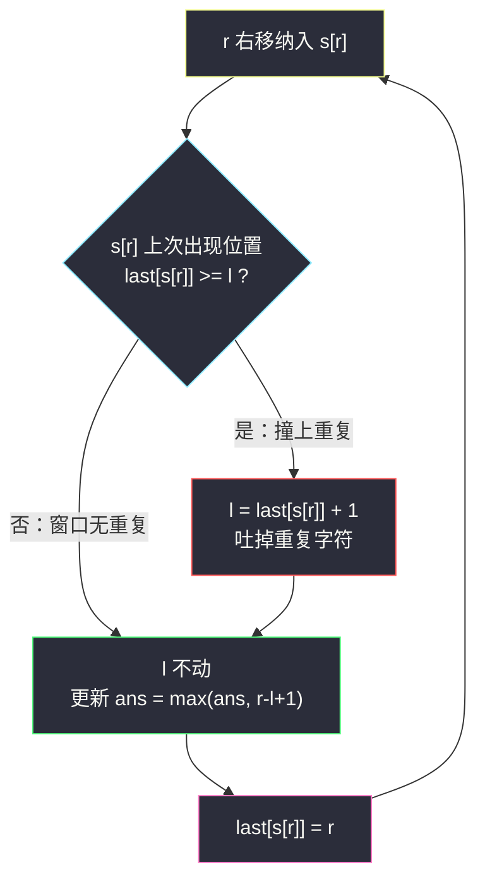
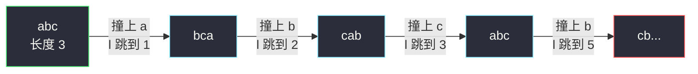

# 无重复字符的最长子串（变长滑动窗口 + 上次出现位置）

## 一、问题描述

给定一个字符串 `s`，请你找出其中**不含有重复字符**的**最长子串**的长度。

> 🔗 LeetCode 3：https://leetcode.cn/problems/longest-substring-without-repeating-characters/

**示例 1（经典）**

```
输入: s = "abcabcbb"
输出: 3
解释: 因为无重复字符的最长子串是 "abc"，所以长度为 3。
```

**示例 2**

```
输入: s = "bbbbb"
输出: 1
解释: 无重复字符的最长子串是 "b"，长度为 1。
```

**直观理解**

「子串」必须连续。要找一段**尽可能长**的连续区间，且窗口内任何字符都只出现一次——这是最典型的**变长滑动窗口**：右端不断扩张，一旦出现重复就收缩左端。

---

## 二、暴力解法（入门）

### 直观思路

枚举每个起点 `i`，从 `i` 开始尽量往右延伸，用 `HashSet` 记录已经出现过的字符，遇到重复就停下，记录以 `i` 为起点的最长无重复子串长度。

```java
public int lengthOfLongestSubstring(String str) {
    char[] s = str.toCharArray();
    int ans = 0;
    for (int i = 0; i < s.length; i++) {
        Set<Character> set = new HashSet<>();
        int j = i;
        while (j < s.length && !set.contains(s[j])) {
            set.add(s[j]);
            j++;
        }
        ans = Math.max(ans, j - i);
    }
    return ans;
}
```

### 复杂度

- **时间**：`O(n²)`。每个起点都重新扫一遍。
- **空间**：`O(字符集)`，即 `O(Σ)`。

### 🔴 瓶颈在哪里

起点从 `i` 换到 `i+1` 时，窗口里的字符**几乎全部可以复用**——只有最左边一个字符出去了，却整个 `Set` 推倒重来。`n` 到 `5×10⁴` 时就会明显超时。

---

## 三、优化探索（核心章节）

### 3.1 观察特征

| 特征 | 说明 |
|------|------|
| 连续子串 | 滑动窗口 `[l..r]` |
| 求最长 | 右端能扩就扩，**不合法才收缩** |
| 不合法 = 窗口内有重复字符 | 只与「新进来的字符上次出现在哪」有关 |

### 3.2 从暴力到优化的推导

关键观察：设当前窗口为 `[l..r-1]`（无重复），现在右端要纳入 `s[r]`：

- 如果 `s[r]` 在窗口里**没出现过**，窗口扩张成 `[l..r]`，仍然合法；
- 如果 `s[r]` 上次出现的位置是 `last[s[r]]`，那么左端必须**跳到 `last[s[r]] + 1`**，才能把那个重复的字符吐出窗口。

而且 `l` 只需要**单调右移**：新 `l = max(旧 l, last[s[r]] + 1)`，取 `max` 是因为 `last[s[r]]` 可能已经在旧 `l` 左边（那个重复不在当前窗口里）。

这样 `l` 和 `r` 都只前进不后退，整体 `O(n)`。



### 3.3 两种等价写法

课上（class049 Code02）用的是 **`last` 数组直接跳跃**：`l = Math.max(l, last[s[r]] + 1)`，一步跳到位。

更通用的窗口骨架是 **`cnts` 计数 + while 收缩**：纳入 `s[r]` 后若 `cnts[s[r]] == 2`，就不断吐左直到恢复 1。两者完全等价，`last` 版省掉循环、常数更小，但 `cnts` 版能平移到「至多 k 种字符」这类变体（如 #340、#904 水果成篮）。本篇主解对齐课上 `last` 版。

### 3.4 一句话核心

> **`l` 永远是被 `s[r]` 顶到「上次出现位置 + 1」，`last[]` 数组让左指针一步跳到位，窗口始终无重复。**

---

## 四、代码实现详解

### Java（课上版：last 数组跳跃，对齐 class049）

```java
// 无重复字符的最长子串
// 给定一个字符串 s，请你找出其中不含有重复字符的 最长子串 的长度
// 测试链接 : https://leetcode.cn/problems/longest-substring-without-repeating-characters/
public class Solution {

    public static int lengthOfLongestSubstring(String str) {
        char[] s = str.toCharArray();
        int n = s.length;
        // 每种字符上次出现的位置，-1 表示还没出现过
        int[] last = new int[256];
        Arrays.fill(last, -1);
        int ans = 0;
        for (int l = 0, r = 0; r < n; r++) {
            // 若 s[r] 上次出现在当前窗口内，左端跳过那个重复字符
            l = Math.max(l, last[s[r]] + 1);
            ans = Math.max(ans, r - l + 1);
            last[s[r]] = r;
        }
        return ans;
    }
}
```

**变量含义**

| 变量 | 含义 |
|------|------|
| `last[c]` | 字符 `c` 上次出现的下标，初始 `-1` |
| `l` | 窗口左端（**只增不减**） |
| `r` | 窗口右端（循环变量，每轮 `+1`） |
| `r - l + 1` | 当前无重复窗口的长度 |

**循环不变式**：处理完 `s[r]` 之后，子串 `s[l..r]` 内没有重复字符，且 `l` 是满足该性质的最小值（窗口无法再向左延伸）。

### Java（通用版：cnts 计数 + while 收缩）

```java
public static int lengthOfLongestSubstring2(String str) {
    char[] s = str.toCharArray();
    int[] cnts = new int[256];
    int ans = 0;
    for (int l = 0, r = 0; r < s.length; r++) {
        cnts[s[r]]++;
        while (cnts[s[r]] > 1) {          // 窗口内 s[r] 重复了
            cnts[s[l++]]--;               // 吐左，直到重复消失
        }
        ans = Math.max(ans, r - l + 1);
    }
    return ans;
}
```

### Python

```python
class Solution:
    def lengthOfLongestSubstring(self, s: str) -> int:
        last = [-1] * 256            # 每种字符上次出现的下标
        ans = 0
        l = 0
        for r, ch in enumerate(s):
            l = max(l, last[ord(ch)] + 1)
            ans = max(ans, r - l + 1)
            last[ord(ch)] = r
        return ans
```

---

## 五、具体例子演示

`s = "abcabcbb"`，逐步跟踪 `last` 跳跃版：

| r | s[r] | last[s[r]]（更新前） | l = max(l, last+1) | 窗口 | 长度 | ans |
|---|------|---------------------|--------------------|------|------|-----|
| 0 | a | -1 | 0 | `a` | 1 | 1 |
| 1 | b | -1 | 0 | `ab` | 2 | 2 |
| 2 | c | -1 | 0 | `abc` | 3 | **3** |
| 3 | a | 0 | 1 | `bca` | 3 | 3 |
| 4 | b | 1 | 2 | `cab` | 3 | 3 |
| 5 | c | 2 | 3 | `abc` | 3 | 3 |
| 6 | b | 4 | 5 | `cb` | 2 | 3 |
| 7 | b | 6 | 7 | `b` | 1 | 3 |

答案 `3`。注意 `r=6` 时 `last[b]=4` 已经小于当时的 `l=3`，`max` 保证 `l` 不回退。



---

## 六、复杂度分析

| 方法 | 时间 | 空间 | 说明 |
|------|------|------|------|
| 暴力枚举起点 | `O(n²)` | `O(Σ)` | 每个起点重扫 |
| last 数组跳跃 | `O(n)` | `O(Σ)`，Σ=256 | `l`、`r` 各走一遍 |
| cnts + while 收缩 | `O(n)` | `O(Σ)` | 每个字符进窗一次、出窗一次 |

---

## 七、方法对比与总结

| | last 跳跃版 | cnts 收缩版 |
|--|-------------|-------------|
| 左指针 | 一步跳到 `last+1` | while 一步步吐 |
| 常数 | 更小 | 略大 |
| 可推广性 | 只适合「不能重复」 | 能推广到「至多 k 种」等变体 |

**易错点**

1. `l` 必须 `Math.max(l, last[s[r]] + 1)`，**不能直接赋值**——`last` 可能指向窗口外的旧位置。
2. `ans` 的更新在 `last[s[r]] = r` **之前**做，先后顺序不影响本题结果，但 `last` 一定要在窗口更新完后再写。
3. 空串返回 0，上面的写法天然满足（循环不进）。
4. 字符集不止小写字母时（如 ASCII 全集），开 `int[256]`；更大字符集换 `HashMap`。

**模板（变长窗口求最长，对齐课上）**

```java
// for (l=0, r=0; r<n; r++) {
//     纳入 s[r]，若破坏"无重复"性质 → l 跳到重复位置 + 1
//     ans = max(ans, r - l + 1);
// }
```

---

## 八、举一反三

| 题目 | 关系 |
|------|------|
| [904. 水果成篮](https://leetcode.cn/problems/fruit-into-baskets/) | 同骨架，条件从「无重复」放宽到「至多 2 种」 |
| [159. 至多两个不同字符的最长子串](https://leetcode.cn/problems/longest-substring-with-at-most-two-distinct-characters/) | 会员题，「至多 2 种」的窗口 |
| [424. 替换后的最长重复字符](https://leetcode.cn/problems/longest-repeating-character-replacement/) | 变长窗口 + 「窗口内其他字符 ≤ k」判定 |
| [76. 最小覆盖子串](https://leetcode.cn/problems/minimum-window-substring/) | 变长窗口求**最短**，方向相反 |

**思想迁移**

- 看到「最长 + 不合法才收缩」→ 变长窗口，右端主动、左端被动。
- `last` 数组跳跃技巧也出现在「求子数组内和为 k 的最长长度」（前缀和 + 上次出现位置的哈希表）里。
