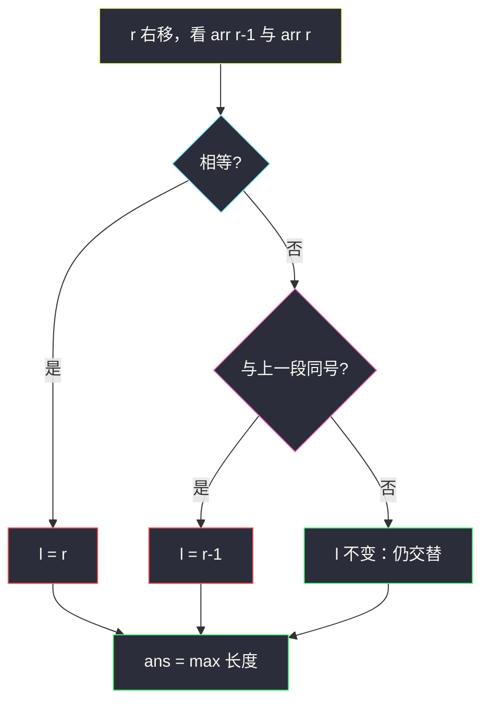

# 最长湍流子数组（状态切换窗口）

## 一、问题描述

给定整数数组 `arr`，返回 `arr` 的所有子数组（连续片段）中，**最大湍流子数组的长度**。

子数组 `arr[i..j]`（`i ≤ j`）是湍流的，当且仅当：

- 长度 1：一定是湍流；
- 长度 2：`arr[i] != arr[i+1]`；
- 长度 ≥ 3：相邻比较符号**严格交替**，即对每个 `k ∈ [i, j-2]`：

```
(arr[k] > arr[k+1] < arr[k+2])  或  (arr[k] < arr[k+1] > arr[k+2])
```

直观说：折线要像「波浪」——一边高一边低地交错，不允许平台（相等）也不允许连续同向（一直升或一直降）。

> 🔗 LeetCode 978：https://leetcode.cn/problems/longest-turbulent-subarray/

**示例 1**

```
输入：arr = [9,4,2,10,7,8,8,1,9]
输出：5
解释：arr[1..5] = [4,2,10,7,8] → 4>2<10>7<8，长度 5
```

**示例 2**

```
输入：arr = [4,8,12,16]
输出：2
解释：全程递增，最长湍流只有相邻两数（长度 2）
```

**示例 3**

```
输入：arr = [100]
输出：1
```

**直观理解**

在数组上找最长连续段，使相邻差的符号是 `+ - + - …` 或 `- + - + …`。  
一旦出现**相等**或**同号连续**，波浪断了，窗口要从合适位置重开。

---

## 二、暴力解法（入门）

### 直观思路

枚举每个起点 `l`，向右扩展，维护上一段比较符号；一旦破坏交替就停，更新最长长度。

```java
public static int maxTurbulenceSize(int[] arr) {
    int n = arr.length, ans = 1;
    for (int l = 0; l < n; l++) {
        int prev = 0; // 上一段符号：1 表示 arr[k]>arr[k+1]，-1 表示 <，0 表示尚未有段
        for (int r = l + 1; r < n; r++) {
            int cur = Integer.compare(arr[r - 1], arr[r]);
            if (cur == 0) {
                break;
            }
            if (prev != 0 && cur == prev) {
                break; // 同向，断了
            }
            prev = cur;
            ans = Math.max(ans, r - l + 1);
        }
    }
    return ans;
}
```

### 复杂度

- **时间**：`O(n²)`
- **空间**：`O(1)`

### 🔴 瓶颈在哪里

右端每走一步，合法湍流窗口的左端如何跳很有规律：

- 相等：新窗只能从当前右端单点开始；
- 同向：新的「长度 2」波浪可以从 `r-1` 开始。

不必每次从每个 `l` 重扫 → **一次扫描的状态切换窗口**。

---

## 三、优化探索（核心章节）

### 3.1 观察特征

| 特征 | 说明 |
|------|------|
| 连续子数组 | 窗口 / 线性扫描 |
| 约束是「相邻关系」 | 看 `arr[r-1]` 与 `arr[r]` 的比较符号 |
| 破坏条件两类 | **相等**；**与上一段同号** |
| 求最长 | 合法时 `ans = max(ans, r-l+1)` |

### 3.2 暴力 → 优化：状态切换窗口

`r` 从 1 扫到 `n-1`，窗口 `[l, r]` 始终是「以 `r` 结尾的最长湍流」：

```
l = 0, ans = 1
for r = 1 .. n-1:
  比较 arr[r-1] 与 arr[r]
  if 相等:
      l = r                         // 平台：只留单点
  else if r 至少有两段 且 与上一段同号:
      l = r - 1                     // 同向：新波浪从 r-1 起长度 2
  // else: 交替（或第一段），l 不变
  ans = max(ans, r - l + 1)
```

「同号」判定（两段都已不相等时）：

```
(arr[r-1] > arr[r-2]) == (arr[r] > arr[r-1])
```

为真 ⇒ 连续上升或连续下降 ⇒ 重置 `l = r - 1`。



### 3.3 关键推导问题

| 问题 | 答案 |
|------|------|
| 为何同向时 `l = r-1` 而不是 `l = r`？ | `(arr[r-1], arr[r])` 本身仍是合法长度 2 湍流，应保留 |
| 为何相等时 `l = r`？ | 相等两端不能同在湍流里，新起点只能是当前点 |
| 长度 1 / 全程相等怎么办？ | `ans` 初值 1；相等只重置，不会把答案刷成 0 |
| 和普通「条件窗口」差在哪？ | 约束不是「种类数 / 和」，而是**上一段比较符号**，所以叫状态切换 |

### 3.4 可选：DP（up / down）

令：

- `up`：以当前位置结尾、且最后一步是 **上升**（`arr[i-1] < arr[i]`）的最长湍流长度
- `down`：以当前位置结尾、最后一步是 **下降** 的最长湍流长度

转移：

```
若 arr[i] > arr[i-1]:  up = down + 1;  down = 1
若 arr[i] < arr[i-1]:  down = up + 1;  up = 1
若相等:                 up = down = 1
```

每步 `ans = max(ans, up, down)`。与窗口等价，有的人觉得更好背。

### 3.5 一句话核心

> **右端每进一步，看新边与旧边是否异号；异号则延展，同号则从 r-1 重开，相等则从 r 重开。**

---

## 四、代码实现详解

### Java（窗口 · 推荐默写）

```java
// 最长湍流子数组
// 测试链接 : https://leetcode.cn/problems/longest-turbulent-subarray/
public class Solution {

    public static int maxTurbulenceSize(int[] arr) {
        int n = arr.length;
        int ans = 1;
        int l = 0;
        for (int r = 1; r < n; r++) {
            if (arr[r] == arr[r - 1]) {
                l = r;
            } else if (r >= 2
                    && (arr[r - 1] > arr[r - 2]) == (arr[r] > arr[r - 1])) {
                // 与上一段同号：连续升或连续降
                l = r - 1;
            }
            ans = Math.max(ans, r - l + 1);
        }
        return ans;
    }
}
```

### Java（DP 对照）

```java
public static int maxTurbulenceSizeDP(int[] arr) {
    int n = arr.length;
    int ans = 1;
    int up = 1, down = 1;
    for (int i = 1; i < n; i++) {
        if (arr[i] > arr[i - 1]) {
            up = down + 1;
            down = 1;
        } else if (arr[i] < arr[i - 1]) {
            down = up + 1;
            up = 1;
        } else {
            up = 1;
            down = 1;
        }
        ans = Math.max(ans, Math.max(up, down));
    }
    return ans;
}
```

### Python（窗口）

```python
# 最长湍流子数组
# 测试链接 : https://leetcode.cn/problems/longest-turbulent-subarray/
class Solution:
    def maxTurbulenceSize(self, arr: list[int]) -> int:
        n = len(arr)
        ans = 1
        l = 0
        for r in range(1, n):
            if arr[r] == arr[r - 1]:
                l = r
            elif r >= 2 and (arr[r - 1] > arr[r - 2]) == (arr[r] > arr[r - 1]):
                l = r - 1
            ans = max(ans, r - l + 1)
        return ans
```

---

## 五、例子演示

`arr = [9,4,2,10,7,8,8,1,9]`

| r | 段 | 事件 | 窗口 `[l..r]` | 长度 | ans |
|---|-----|------|---------------|------|-----|
| 1 | 9>4 | 第一段 | `[0..1]` | 2 | 2 |
| 2 | 4>2 | 与上段同号（都降） | `l=1` → `[1..2]=[4,2]` | 2 | 2 |
| 3 | 2<10 | 异号，延展 | `[1..3]=[4,2,10]` | 3 | 3 |
| 4 | 10>7 | 异号 | `[1..4]` | 4 | 4 |
| 5 | 7<8 | 异号 | `[1..5]=[4,2,10,7,8]` | 5 | **5** |
| 6 | 8=8 | 相等 | `l=6` → `[8]` | 1 | 5 |
| 7 | 8>1 | 第一段 | `[6..7]` | 2 | 5 |
| 8 | 1<9 | 异号 | `[6..8]` | 3 | 5 |

答案 5。


---

## 六、复杂度分析

| 项目 | 复杂度 | 说明 |
|------|--------|------|
| 时间 | `O(n)` | `r` 只走一遍，`l` 只增不减 |
| 额外空间 | `O(1)` | 若干变量；DP 版同样可压成两个变量 |

---

## 七、对比总结

### 易错点

1. **同向时写成 `l = r`** → 丢掉本可作为新起点的那对相邻元素。
2. **用减法比符号却碰到相等** → 先处理 `==`，或用 `Integer.compare` / 布尔相等判断。
3. **`ans` 初值写成 0** → 空数组外至少有长度 1（题保证 `n≥1` 时答案 ≥1）。
4. **把「非严格」当湍流** → 相等直接破坏，必须断窗。

### 窗口 vs DP

| | 状态切换窗口 | up/down DP |
|--|-------------|------------|
| 直觉 | 维护当前合法段左端 | 维护两种结尾状态的长度 |
| 默写量 | 一个 `for` + 两个分支 | 一个 `for` + 三个分支 |
| 本质 | 同一问题的两种写法 | 转移更显式 |

### 模板口诀

> **新边与旧边：异号就伸，同号退到 r-1，相等退到 r。**

---

## 八、举一反三

| 题目 | 链接 | 迁移点 |
|------|------|--------|
| 376. 摆动序列 | https://leetcode.cn/problems/wiggle-subsequence/ | 也是交替升降，但是**子序列**可删 |
| 162. 寻找峰值 | https://leetcode.cn/problems/find-peak-element/ | 局部「峰」的比较关系 |
| 845. 数组中的最长山脉 | https://leetcode.cn/problems/longest-mountain-in-array/ | 先升后降的一段「山」，状态机类似 |
| 2771. 构造最长非递减子数组 | https://leetcode.cn/problems/longest-non-decreasing-subarray-from-two-arrays/ | 多状态结尾 DP |

**迁移一句**：凡是「相邻关系必须按某种模式切换」的最长连续段，优先想**状态切换窗口**或**按上一状态转移的 DP**。
