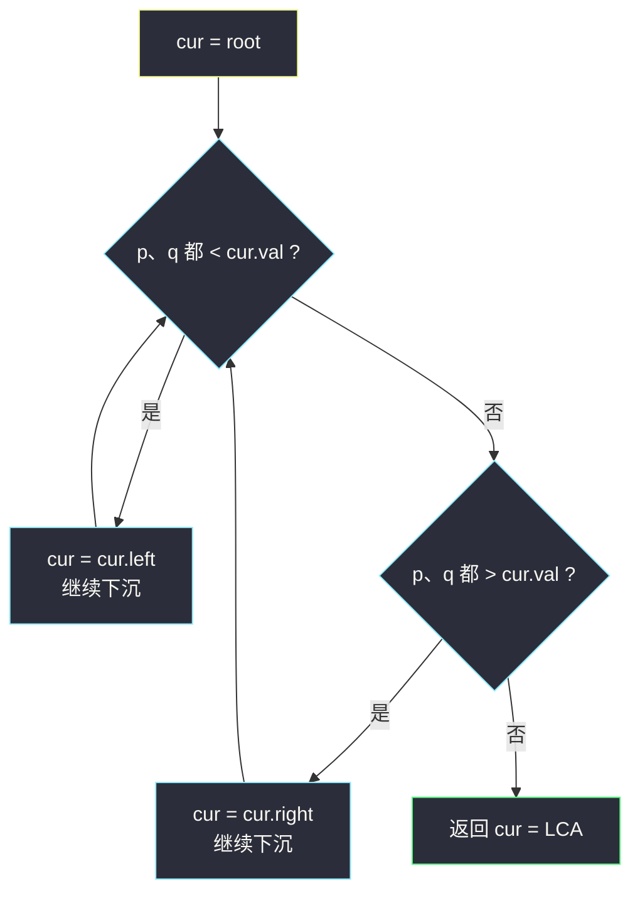
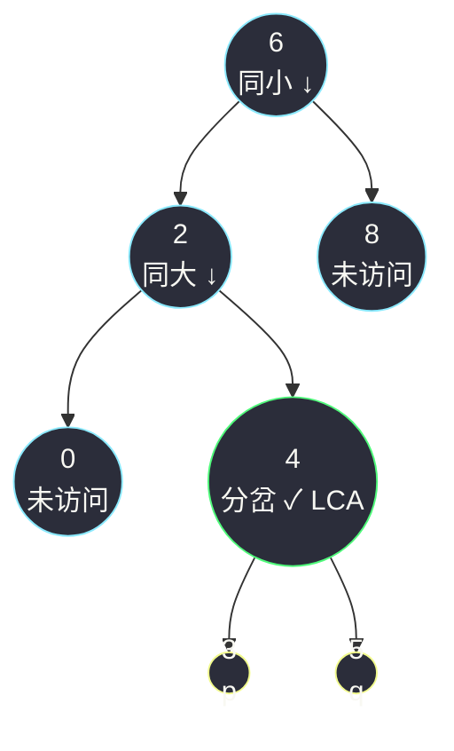

# 二叉搜索树的最近公共祖先（利用 BST 性质一路下沉）

## 一、问题描述

给出一棵**二叉搜索树（BST）**的根节点 `root`，以及树中两个节点 `p` 和 `q`，找出它们的**最近公共祖先（LCA）**。

最近公共祖先的定义：对于节点 `p`、`q`，「最近」的、同时以 `p` 和 `q` 为后代的祖先节点（**允许一个节点是它自己的祖先**）。

BST 性质回顾：任意节点，**左子树所有值 < 节点值 < 右子树所有值**（本题保证节点值互不相同）。

> 🔗 LeetCode 235：https://leetcode.cn/problems/lowest-common-ancestor-of-a-binary-search-tree/

**示例 1**

```
输入：root = [6,2,8,0,4,7,9,null,null,3,5]，p = 2，q = 8
输出：6
树形：
         6
        / \
       2   8
      / \  / \
     0  4 7   9
       / \
      3   5
2 和 8 分居根 6 的两侧 → 6 就是分岔点，也是 LCA
```

**示例 2**

```
输入：root = [6,2,8,0,4,7,9,null,null,3,5]，p = 2，q = 4
输出：2
节点 4 在 2 的子树里 → p 自己就是祖先，LCA = 2
（注意 4 不再往上看：祖先必须「最近」）
```

**直观理解**

想象你在 BST 顶部拿着手电筒找 `p` 和 `q`：

- 若两个目标**都比当前节点小** → 它们都在左子树里，往左走；
- 若两个目标**都比当前节点大** → 都在右子树里，往右走；
- 若**一大一小分居两侧**（或其中一个就是当前节点）→ 走再远就要分开了，**当前节点就是分岔点，即 LCA**。

分岔点是「p、q 从这里分道扬镳」的地方，也是它们**最深**的公共祖先。

---

## 二、暴力解法（普通二叉树的 LCA 递归）

### 直观思路

无视 BST 性质，用通用二叉树 LCA 的递归：在 `root` 为根的树里找 p、q——左边找到一个、右边找到一个，当前节点就是 LCA；都在同一边，答案递归下传。这是 class037 `Code01_LowestCommonAncestor`（普通二叉树版）的做法。

```java
class Solution {
    public TreeNode lowestCommonAncestor(TreeNode root, TreeNode p, TreeNode q) {
        if (root == null || root == p || root == q) {
            return root;    // 空树 / 碰到 p 或 q 本身
        }
        TreeNode left = lowestCommonAncestor(root.left, p, q);
        TreeNode right = lowestCommonAncestor(root.right, p, q);
        if (left != null && right != null) {
            return root;    // p、q 分居两侧 → 分岔点
        }
        return left != null ? left : right;
    }
}
```

### 复杂度

- **时间**：`O(n)`，最坏整棵树都要搜（p、q 都在最后找到的分支里）
- **空间**：`O(h)` 递归栈

### 🔴 瓶颈在哪里

它对**任何**二叉树都对，但完全没用上 BST 的**有序性**：值能告诉你「p、q 在哪一侧」，根本不需要两边都递归。  
在 BST 里，每一步比较都能**砍掉一半树**——从「盲搜全树」变成「定向下沉」，这就是本题想考的东西。

---

## 三、优化探索（核心章节）

### 3.1 观察特征

| 特征 | 说明 |
|------|------|
| 值可比大小 | BST 每个节点是一道「闸门」：小于它往左，大于它往右 |
| p、q 的分布只有三种 | 都在左、都在右、分居两侧（含「当前节点就是 p 或 q」） |
| 分居两侧 ⟺ 分岔点 | `min(p,q) < cur < max(p,q)`（或 cur 等于 p/q）时，再往下走必然只偏向一边 |
| 答案在查找路径上 | 从根往下走，**最后一个「同时罩住 p 和 q」的节点**就是 LCA，走一步少一层 |
| 迭代天然成立 | 每步只决定「左 / 右 / 停」，不回头、不回溯，循环即可，不需要递归栈 |

### 3.2 暴力 → 优化：比较大小，一路下沉

```
cur = root
循环：
    p、q 都小于 cur.val → cur = cur.left     （目标都在左）
    p、q 都大于 cur.val → cur = cur.right    （目标都在右）
    否则（分居两侧 / cur 是 p 或 q）→ 返回 cur
```

为什么「分居两侧」可以直接返回？设 `p.val < cur.val < q.val`：p 只能存在于 cur 的左子树、q 只能存在于右子树（BST 值域隔离），两者**永远不会再相遇**在更深的节点——cur 是它们能共同到达的最深处。若 `cur.val == p.val`，则 p 就是自己的祖先、q 在某棵子树里，cur 同样是最近的。

课上 class037 `Code02_LowestCommonAncestorBinarySearch` 用 `while (root.val != p.val && root.val != q.val)` + `min/max` 夹逼实现同一逻辑，思路完全一致。



### 3.3 关键推导问题

| 问题 | 答案 |
|------|------|
| 为什么不用检查 cur 是否为 null？ | p、q 本来就在树里，只要还没分岔就一直存在更深的公共方向，cur 不会走出树 |
| 「p 是 q 的祖先」时算法对吗？ | 对。下沉过程中会先遇到值等于 p.val 的节点，触发「否则」分支返回 p（示例 2） |
| 为什么不用管 p、q 谁大？ | 两个条件「都小于」「都大于」天然与 p、q 的命名顺序无关 |
| 和普通二叉树 LCA 的本质区别？ | 普通树必须**两边都搜**才知道答案；BST 用一次比较**排除一半**，是「有序性换信息」 |
| 递归版和迭代版选哪个？ | 完全等价（尾递归 ↔ 循环），迭代版省掉函数调用，更好写好讲 |
| 若树里有重复值还成立吗？ | 标准 BST 定义下互不相同；有重复时「都在左/右」的判定可能含糊，本题不用操心 |

### 3.4 一句话核心

> **同小往左，同大往右，一分岔就到站。**

---

## 四、代码实现详解

### Java（主解：迭代下沉）

```java
// 二叉搜索树的最近公共祖先
// 测试链接 : https://leetcode.cn/problems/lowest-common-ancestor-of-a-binary-search-tree/
// 思路对齐 class037 Code02_LowestCommonAncestorBinarySearch
class Solution {
    public TreeNode lowestCommonAncestor(TreeNode root, TreeNode p, TreeNode q) {
        TreeNode cur = root;
        while (true) {
            if (p.val < cur.val && q.val < cur.val) {
                cur = cur.left;     // 目标都在左子树
            } else if (p.val > cur.val && q.val > cur.val) {
                cur = cur.right;    // 目标都在右子树
            } else {
                return cur;         // 分居两侧（或 cur 即 p/q）：分岔点 = LCA
            }
        }
    }
}
```

### Java（递归版，等价）

尾递归展开成循环就是主解，两者可以互相解释；递归版更贴近「子问题」视角：当前不是分岔点时，答案必在某一侧子树里。

```java
class Solution {
    public TreeNode lowestCommonAncestor(TreeNode root, TreeNode p, TreeNode q) {
        if (p.val < root.val && q.val < root.val) {
            return lowestCommonAncestor(root.left, p, q);
        }
        if (p.val > root.val && q.val > root.val) {
            return lowestCommonAncestor(root.right, p, q);
        }
        return root;
    }
}
```

### Python（同思路）

```python
class Solution:
    def lowestCommonAncestor(self, root: 'TreeNode', p: 'TreeNode', q: 'TreeNode') -> 'TreeNode':
        cur = root
        while True:
            if p.val < cur.val and q.val < cur.val:
                cur = cur.left      # 同小往左
            elif p.val > cur.val and q.val > cur.val:
                cur = cur.right     # 同大往右
            else:
                return cur          # 一分岔就到站
```

---

## 五、具体例子演示

### 例 1：`p = 2`，`q = 8`，返回 6

```
         6
        / \
       2   8
      / \  / \
     0  4 7   9
       / \
      3   5
```

| 步骤 | cur | 比较（2 与 8 相对 cur.val） | 决策 |
|------|-----|------------------------------|------|
| 1 | **6** | 2 < 6 且 8 > 6 → **分居两侧** | 命中「否则」分支 → 返回 **6** ✅ |

一步到位：p、q 分居根节点两侧，根就是分岔点。

### 例 2：`p = 2`，`q = 4`，返回 2

| 步骤 | cur | 比较（2 与 4 相对 cur.val） | 决策 |
|------|-----|------------------------------|------|
| 1 | **6** | 2 < 6 且 4 < 6 → 同小 | 往左，cur = 2 |
| 2 | **2** | 2 == 2（不都小于：2 并不 < 2）；4 > 2（不都大于） | **分居/相等 → 返回 2** ✅ |

q = 4 深藏在 p = 2 的子树里，「p 自己当祖先」的场景由「否则」分支自然覆盖。

### 例 3：`p = 3`，`q = 5`，返回 4

| 步骤 | cur | 比较（3 与 5 相对 cur.val） | 决策 |
|------|-----|------------------------------|------|
| 1 | **6** | 3 < 6 且 5 < 6 → 同小 | cur = 2 |
| 2 | **2** | 3 > 2 且 5 > 2 → 同大 | cur = 4 |
| 3 | **4** | 3 < 4 且 5 > 4 → **分居两侧** | 返回 **4** ✅ |



青色 = 走过的下沉路径；绿 = 分岔点 4；黄 = 两个目标；标着「未访问」的青色节点（8、0）从未被比较——BST 的有序性让每次比较都白拿一半搜索空间。

### 例 4：单节点树，p = q = root

`p.val == cur.val`：不满足「都小于」也不满足「都大于」→ 返回 root。节点是自己的祖先 ✅。

---

## 六、复杂度分析

| 项目 | 普通二叉树递归（暴力） | BST 迭代（主解） |
|------|------------------------|------------------|
| 时间 | `O(n)`：最坏搜完整棵树 | `O(h)`：每步排除一半，`h` 为树高：平衡 BST `O(log n)`，链状退化 `O(n)` |
| 空间 | `O(h)` 递归栈 | **`O(1)`**：只有指针 `cur`，没有递归、没有额外结构 |

主解把空间做到**常数**——迭代 + 无需记忆路径，这是本题相对普通树 LCA 的双重收益。

---

## 七、方法对比与总结

### 两种写法对比

| | 普通树 LCA 递归 | BST 下沉迭代（主解） |
|--|------------------|----------------------|
| 用了 BST 性质吗 | ✗（对任意二叉树都对） | ✅ 值比较砍一半 |
| 时间 | `O(n)` | `O(h)` |
| 空间 | `O(h)` | `O(1)` |
| 适用面 | 任意二叉树 | 仅 BST |

### 易错点

1. **条件写错方向**：`p.val < cur.val && q.val < cur.val` 才往左；把 `&&` 写成 `||`，分居两侧时也会乱走。
2. **忘了「cur 就是 p/q」也该返回**：它落在「否则」分支里；单独写 `if (cur == p || cur == q)` 之外的判断反而容易漏。
3. **拿普通树 LCA 套 BST**：能过但答非所问——面试官出 BST 版就是想看你**用性质降复杂度**。
4. **担心 cur 走出树**：p、q 都在树内且保证存在，下沉方向永远合法，无需 null 判断（若题面不保证存在，才需要加边界）。

### 模板口诀

> **同小左、同大右，一夹在中间，就地交答案。**

---

## 八、举一反三

| 题目 | 链接 | 迁移点 |
|------|------|--------|
| 236. 二叉树的最近公共祖先 | https://leetcode.cn/problems/lowest-common-ancestor-of-a-binary-tree/ | 去掉 BST 性质后的通用版 = 本题第二章暴力（class037 Code01） |
| 剑指 Offer 68 - I. 二叉搜索树的最近公共祖先 | https://leetcode.cn/problems/er-cha-sou-suo-shu-de-zui-jin-gong-gong-zu-xian-lcof/ | 本题原样，双解对照练手 |
| 700. 二叉搜索树中的搜索 | https://leetcode.cn/problems/search-in-a-binary-search-tree/ | 单目标版的「一路下沉」，本题的退化形态 |
| 701. 二叉搜索树中的插入操作 | https://leetcode.cn/problems/insert-into-a-binary-search-tree/ | 下沉到空位再挂新节点，同一套「比较走边」 |

**迁移一句**：**BST 上一切查找类问题先问「值能不能告诉我方向」**——一次比较砍掉一半子树，是它相对普通二叉树最值钱的性质；LCA、搜索、插入、删除全是这一句的变奏。
