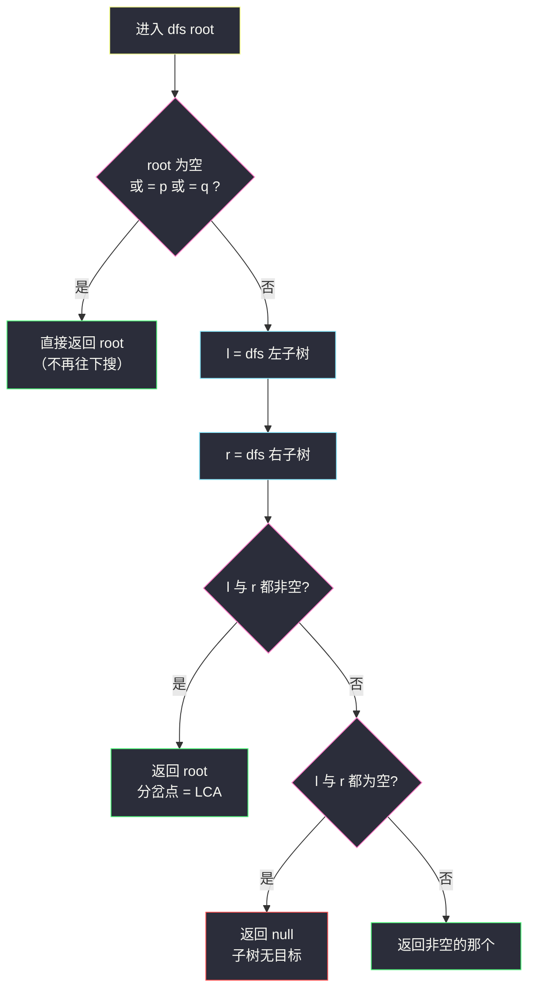
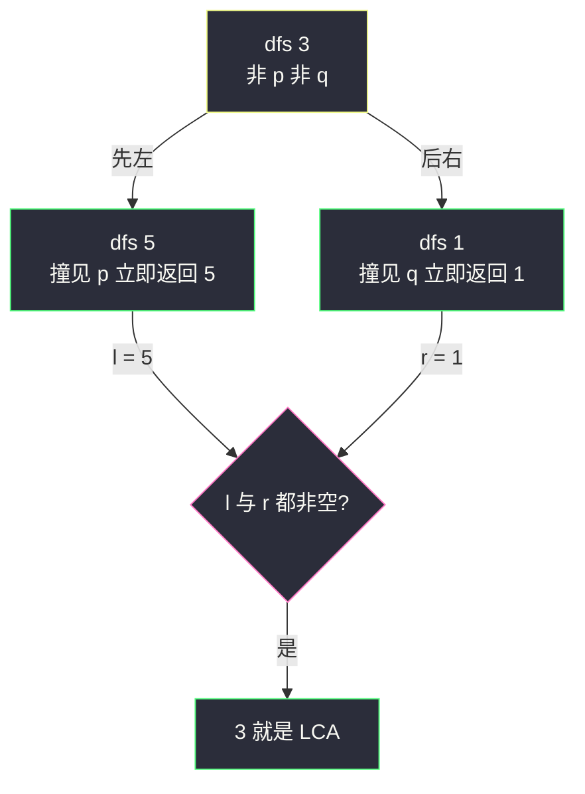

# 最近公共祖先（后序分情况递归：左右都搜到即分岔点）

## 一、问题描述

给定一棵**二叉树**的根节点 `root`，以及树中两个节点 `p` 和 `q`，找到它们的**最近公共祖先（LCA, Lowest Common Ancestor）**。

**公共祖先**：设节点 `x` 的祖先包括它自己及其所有能一路走到 `root` 的节点。`p`、`q` 的公共祖先中**离它们最近**（深度最大）的那个，就是最近公共祖先。

> 🔗 LeetCode 236：https://leetcode.cn/problems/lowest-common-ancestor-of-a-binary-tree/
>
> 题目保证：所有节点值互不相同；`p ≠ q`；`p`、`q` 都存在于树中。**节点可以是它自己的祖先。**

**示例 1**

```
输入：root = [3,5,1,6,2,0,8,null,null,7,4]，p = 5，q = 1
输出：3
树形：
          3
         / \
        5    1
       / \  / \
      6   2 0   8
         / \
        7   4
节点 5 和 1 的公共祖先只有 3，答案 3
```

**示例 2**

```
同上树，p = 5，q = 4
输出：5
解释：4 在 5 的子树里，5 是 4 的祖先，也是自己的祖先，
     最近的公共祖先就是 5 本身
```

**直观理解**

想象族谱：两人各自的「血脉链」一路向上到根，两条链**从哪里开始分岔**，分岔口就是最近公共祖先；如果一人本来就在另一人的链上（示例 2），那链上的那位就是答案。整棵树没有有序性（不是 BST），没法二分，只能**整棵搜索**——难点在怎么把「找到 p 和 q 的信息」从子树里**回传**给祖先，这正是后序递归的主场。

---

## 二、暴力解法（两条路径找分岔口）

### 直观思路

先用 DFS 分别记录「根 → p」和「根 → q」两条路径，然后从头逐位比较，**最后一个相同节点**即 LCA。这是面试中最容易想到、也最不容易错的版本：

```java
class Solution {
    public TreeNode lowestCommonAncestor(TreeNode root, TreeNode p, TreeNode q) {
        List<TreeNode> pathP = new ArrayList<>();
        List<TreeNode> pathQ = new ArrayList<>();
        dfs(root, p, pathP);
        dfs(root, q, pathQ);
        TreeNode ans = root;
        for (int i = 0; i < Math.min(pathP.size(), pathQ.size()) && pathP.get(i) == pathQ.get(i); i++) {
            ans = pathP.get(i);      // 最后一个相同的
        }
        return ans;
    }

    // 寻找 target，沿途记录路径；找到返回 true，找不到回溯撤销
    private boolean dfs(TreeNode node, TreeNode target, List<TreeNode> path) {
        if (node == null) {
            return false;
        }
        path.add(node);
        if (node == target) {
            return true;
        }
        if (dfs(node.left, target, path) || dfs(node.right, target, path)) {
            return true;
        }
        path.remove(path.size() - 1);   // 这条岔路不通，撤
        return false;
    }
}
```

### 复杂度

- **时间**：`O(n)`——两次 DFS 各扫一遍，比较路径 `O(h)`
- **空间**：`O(n)` 两条路径列表 + `O(h)` 递归栈

### 🔴 瓶颈在哪里

1. 扫了**两遍**树：找 p 一遍、找 q 一遍，信息没有复用；
2. 存了两条显式路径，`O(n)` 额外空间；
3. 路径回溯（`add` / `remove` 成对）是出 bug 高发区。

理想状态是：**一趟 DFS 同时找两个人**，答案在递归回弹的路上自然浮现——不需要任何容器。

---

## 三、优化探索（核心章节）

### 3.1 观察特征

| 特征 | 说明 |
|------|------|
| 信息必须从下往上传 | 「子树里有没有 p / q」只有孩子先回答，父亲才能汇总 → **后序** |
| 答案是「分岔点」 | p、q 分居左右子树时，左右各回传一个非空，当前节点就是 LCA |
| 祖先含自身 | 若 q 藏在 p 的子树里，递归**先撞见 p 就该停**，p 即答案 |
| p、q 保证存在 | 不存在「搜空」的分支，返回 null 只意味着「这棵子树里没有目标」 |

### 3.2 暴力 → 优化：分情况递归

定义 `dfs(root, p, q)`，返回值语义：**这棵子树中的 LCA；若 p、q 都不在，返回 null；若只找到其中一个，就返回那个节点本身（把它继续往上带）**。

```
dfs(root, p, q):
    若 root 为空，或 root 是 p，或 root 是 q
        → 直接返回 root            ← 遇到目标即止步，不再深入
    l = dfs(root.left,  p, q)      ← 先问左子树
    r = dfs(root.right, p, q)      ← 再问右子树
    l、r 都非空 → 返回 root         ← 分岔点，当前节点就是 LCA
    l、r 都为空 → 返回 null         ← 整棵子树没有目标
    一空一非空 → 返回非空的那个      ← 目标（或更深的 LCA）继续上传
```

对齐课源码 class037 `Code01_LowestCommonAncestor` 的写法——课上就是这十几行，结构题按站点风格保持简洁命名。



### 3.3 关键推导问题

| 问题 | 答案 |
|------|------|
| 为什么撞见 p 就直接返回、不搜 p 的子树？ | 若 q 就藏在 p 的子树里，p 本身就是 LCA（祖先含自身），提前返回恰好正确；若 q 不在其中，p 的子树里再怎么搜也只能多找到 p，浪费 |
| 「左右各非空」为什么就是 LCA？ | p、q 分居两侧说明当前节点是公共祖先；它的孩子不可能同时是祖先（p、q 已分开），所以是**最近**的 |
| 「一空一非空」为什么能直接透传？ | 非空侧回传的要么是 p/q 本身、要么已经是子树内更深的 LCA；当前节点此时只是「路过」，无权改变答案 |
| 树里不是 BST 吗？能不能比较大小剪枝？ | #236 是**普通二叉树**，无序！利用 `val` 比较剪枝是 #235（BST 版，站内已有题解）的做法 |
| 为什么不用管「p、q 不存在」？ | 题目保证存在。若可能不存在（#1644），就要统计真实命中次数，不能见到 p 就提前返回 |
| 递归返回值是「三义」的，不会混吗？ | 返回非空只承诺「这棵子树至少含 p、q 之一，或答案就在里面」；配合「都非空 → 我是分岔点」，三种情况恰好覆盖所有可能 |

### 3.4 一句话核心

> **撞见空或目标直接回，左右都非空我就是分岔点；一空一非空，把非空的往上带。**

---

## 四、代码实现详解

### Java（主解：后序分情况递归，对齐 class037 课上版）

```java
// 普通二叉树上寻找两个节点的最近公共祖先
// 测试链接 : https://leetcode.cn/problems/lowest-common-ancestor-of-a-binary-tree/
// 对齐 class037 Code01_LowestCommonAncestor
class Solution {
    public TreeNode lowestCommonAncestor(TreeNode root, TreeNode p, TreeNode q) {
        if (root == null || root == p || root == q) {
            return root;                     // 空或撞见目标：到头了
        }
        TreeNode l = lowestCommonAncestor(root.left, p, q);
        TreeNode r = lowestCommonAncestor(root.right, p, q);
        if (l != null && r != null) {
            return root;                     // 左右各找到一个：分岔点
        }
        if (l == null && r == null) {
            return null;                     // 整棵子树都没有
        }
        return l != null ? l : r;            // 谁非空带谁上去
    }
}
```

三个 `if` 一个都不多余，建议按「都非空 / 都空 / 一空一非空」三连背下来。

### Python（同思路）

```python
class Solution:
    def lowestCommonAncestor(self, root: 'TreeNode', p: 'TreeNode', q: 'TreeNode') -> 'TreeNode':
        if root is None or root is p or root is q:
            return root
        l = self.lowestCommonAncestor(root.left, p, q)
        r = self.lowestCommonAncestor(root.right, p, q)
        if l and r:
            return root          # 分岔点
        if l is None and r is None:
            return None
        return l if l else r
```

第二章的双路径版已能通过，这里递归版是面试默写首选。

---

## 五、具体例子演示

统一用示例 1 的树：

```
          3
         / \
        5    1
       / \  / \
      6   2 0   8
         / \
        7   4
```

### 例 1：p = 5，q = 1，答案 3

| 步骤 | 调用 | 动作 | 返回 |
|------|------|------|------|
| 1 | `dfs(3)` | 3 非空非 p 非 q，先搜左 | — |
| 2 | `dfs(5)` | **5 == p，直接返回**，6、2、7、4 整棵子树不搜 | 5 |
| 3 | 回到 `dfs(3)` | l = 5，再搜右 | — |
| 4 | `dfs(1)` | **1 == q，直接返回**，0、8 不搜 | 1 |
| 5 | 回到 `dfs(3)` | l = 5 且 r = 1 都非空 → **返回 3** ✅ | 3 |



### 例 2：p = 5，q = 4（q 藏在 p 的子树里），答案 5

| 步骤 | 调用 | 动作 | 返回 |
|------|------|------|------|
| 1 | `dfs(3)` | 先搜左 | — |
| 2 | `dfs(5)` | **5 == p，立即返回 5**；4（在 5 子树深处）从未被访问 | 5 |
| 3 | `dfs(1)` | 1 非目标；`dfs(0)` 空、`dfs(8)` 空 → 都空 | null |
| 4 | 回到 `dfs(3)` | l = 5 非空，r = null → 返回非空的 l | 5 |
| 5 | 顶层返回 | 答案 **5** ✅（q 是 p 的后代，p 即 LCA） | 5 |

**注意第 2 步**：撞见 p 就返回，根本没去 p 的子树里找 q——这不是 bug，正是「祖先含自身」语义的直接兑现。若你担心正确性，想一想：q 要么在 p 子树内（p 就是答案，提前返回恰好对），要么不在（子树里搜也白搜）。

### 例 3：p、q 在同一侧深处

树 `root = [1,2,3,4,null,null,5]`（4 在 2 下、5 在 3 下），p = 4，q = 5：`dfs(2)` → `dfs(4)` 返回 4、右空 → `dfs(2)` 返回 4；`dfs(3)` → `dfs(5)` 返回 5 → `dfs(3)` 返回 5；`dfs(1)`：l = 4、r = 5 都非空 → **返回 1**。深层找到的目标一路「透传」上来，在分岔点汇合。

---

## 六、复杂度分析

| 项目 | 双路径法（暴力） | 后序分情况递归（主解） |
|------|------------------|------------------------|
| 时间 | `O(n)`（两遍 DFS + 路径比较） | `O(n)`：每个节点最多访问一次，撞见目标即剪枝 |
| 空间 | `O(n)` 两条路径列表 + `O(h)` 栈 | `O(h)` 递归栈，`h` 为树高：平衡 `O(log n)`，链状 `O(n)` |

主解没有容器、没有回溯，空间只花在调用栈上；`O(n)` 时间已是信息论下界（最坏目标在最后才找到，每个节点都得看）。

---

## 七、方法对比与总结

### 三种写法对比

| | 双路径找分岔 | 后序分情况递归（主解） | 哈希存父指针 |
|--|--------------|------------------------|----------------|
| 时间 | `O(n)` | `O(n)` | `O(n)` |
| 空间 | `O(n)` 路径 | `O(h)` | `O(n)` 哈希 |
| 扫树次数 | 2 次 | 1 次 | 1 次（再向上跳） |
| 适用 | 好想好讲 | ✅ 面试默写首选 | 节点带父指针 / 多次查询 |

### 易错点

1. **撞见 p/q 不敢提前返回**，还去搜整棵子树：结果仍正确但退化成全树扫描；正确姿势就是一行 `return root`。
2. **「都非空返回 root」与「一空一非空透传」写混**：把透传写成 `return root` 会把 LCA 抬高到公共祖先但不是最近的。
3. **误用 BST 剪枝**（比较 `p.val`、`q.val` 与 `root.val`）：普通二叉树无序，这是 #235 的专属技巧。
4. **以为要处理 p、q 不存在**：#236 保证存在；换成 #1644（可能不存在）此代码有坑，需另行统计命中。
5. **p 与 q 相同**：题目排除；若允许相同，答案就是 p 本身，可在入口特判。

### 模板口诀

> **空或目标，立刻回；左右双非空，我就是分岔；单边非空，替它把话捎上去。**

---

## 八、举一反三

| 题目 | 链接 | 迁移点 |
|------|------|--------|
| 235. 二叉搜索树的最近公共祖先 | https://leetcode.cn/problems/lowest-common-ancestor-of-a-binary-search-tree/ | 利用 BST 有序性比较大小剪枝，本站已有题解 |
| 1644. 二叉树的最近公共祖先 II | https://leetcode.cn/problems/lowest-common-ancestor-of-a-binary-tree-ii/ | p、q 可能不存在：撞见目标不能直接返回，必须搜满统计 |
| 1123. 最深叶节点的最近公共祖先 | https://leetcode.cn/problems/lowest-common-ancestor-of-deepest-leaves/ | 后序回传「子树深度 + 候选 LCA」二元信息，分情况汇合 |
| 543. 二叉树的直径 | https://leetcode.cn/problems/diameter-of-binary-tree/ | 同为「孩子信息回传，父亲处汇合」的后序框架（本站已有题解） |

**迁移一句**：树上「两个目标的汇合点」类问题，套路都是**后序回传信息 + 在当前节点分情况判断**——LCA 回传「找到谁」，直径回传「子树深度」，最大路径和回传「单边最优」。认准「信息自底向上」，一通百通。
