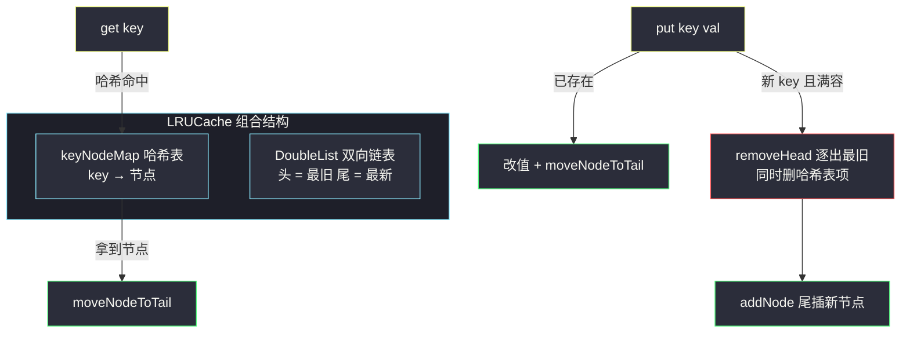
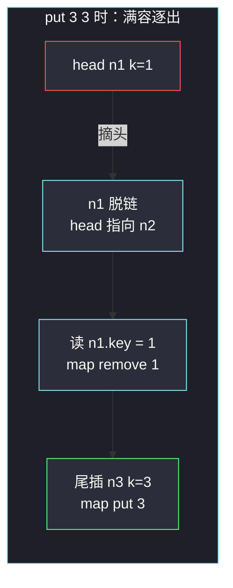

# LRU 缓存（双向链表 + HashMap）

## 一、问题描述

请你设计并实现满足 **LRU（最近最少使用）** 约束的数据结构 `LRUCache`：

- `LRUCache(int capacity)`：以正整数容量初始化；
- `get(key)`：不存在返回 `-1`，存在则返回值并**把该键变为最近使用**；
- `put(key, value)`：键存在则更新值并变最近使用；不存在则插入；若插入超容量，**逐出最久未使用**的键。

两个函数都要求 `O(1)` 平均时间。

> 🔗 LeetCode 146：https://leetcode.cn/problems/lru-cache/

**示例**

```
输入：
["LRUCache","put","put","get","put","get","put","get","get","get"]
[[2],[1,1],[2,2],[1],[3,3],[2],[4,4],[1],[3],[4]]
输出：[null,null,null,1,null,-1,null,-1,3,4]
解释：容量 2。put(1,1) put(2,2) → get(1)=1 → put(3,3) 逐出 1
     → get(2)=-1 → put(4,4) 逐出 2 → get(1)=-1 get(3)=3 get(4)=4
```

**直观理解**

LRU 要在 `O(1)` 内完成三件事：**查找**（定位 key）、**移动到头部/尾部**（更新新鲜度）、**删除最旧**（逐出）。单项数据结构都做不到：

| 需求 | 需要的结构 |
|------|-----------|
| O(1) 查 key | 哈希表 |
| O(1) 把某节点移到队尾 | 双向链表（O(1) 摘除 + O(1) 接尾） |
| O(1) 逐出最旧 | 链表头部即最旧 |

两者组合：**哈希表存 key → 链表节点**，链表按使用时间从旧（头）到新（尾）排列。

---

## 二、暴力解法

### 直观思路

用数组/线性表按插入顺序存 `(key, value)`，`get` 线性查找后把该元素移到末尾；`put` 满了删首元素。

```java
// 暴力：ArrayList 模拟，get/put 都是 O(n)
class LRUCacheBrute {
    List<int[]> list = new ArrayList<>();
    int cap;

    public LRUCacheBrute(int capacity) {
        cap = capacity;
    }

    public int get(int key) {
        for (int i = 0; i < list.size(); i++) {
            if (list.get(i)[0] == key) {
                int[] kv = list.remove(i); // 摘下
                list.add(kv);              // 挪到末尾 = 最新
                return kv[1];
            }
        }
        return -1;
    }

    public void put(int key, int value) {
        for (int i = 0; i < list.size(); i++) {
            if (list.get(i)[0] == key) {
                list.remove(i);
                break;
            }
        }
        if (list.size() == cap) {
            list.remove(0); // 逐出最旧
        }
        list.add(new int[] { key, value });
    }
}
```

### 复杂度

- **时间**：`get` / `put` 均 `O(n)`
- **空间**：`O(capacity)`

### 🔴 瓶颈在哪里

慢在「**按 key 定位**」和「**中间摘除**」两处：线性扫描找 key、`remove(i)` 整体搬移。哈希表解决定位，双向链表解决摘除——两者合璧即 `O(1)`。

---

## 三、优化探索（核心章节）

### 3.1 结构设计

对齐课上 class035 Code02 的经典实现：

- **`DoubleNode`**：携带 `key` 和 `val`（节点必须存 key，逐出时要从哈希表同步删除）；
- **`DoubleList`**：裸双向链表（无 dummy，课上原版用 head/tail 引用），提供三个原语：
  - `addNode`：尾插（新节点 = 最新）；
  - `moveNodeToTail`：把链表中某节点摘下接尾（变最新）；
  - `removeHead`：摘头返回（最旧，用于逐出）；
- **`keyNodeMap`**：`HashMap<Integer, DoubleNode>`，O(1) 定位。

### 3.2 三个操作的信息流



### 3.3 关键设计问题

| 问题 | 答案 |
|------|------|
| 为什么节点要存 key？ | `removeHead` 逐出时只知道链表节点，必须回读 `node.key` 才能同步删除哈希表项，否则表里留下脏引用 |
| 为什么用双向链表不用单向？ | `moveNodeToTail` 要 O(1) 摘节点，必须同时拿到前驱和后继；单向拿前驱要 O(n) |
| 新节点插头还是插尾？ | 约定「尾 = 最新」：新增与 touch 统一走尾插；头即最旧，逐出 O(1) |
| `put` 已存在的 key 要走逐出逻辑吗？ | 不要。更新值 + 移尾即可，容量没变 |
| 先逐出还是先插入？ | 先判断容量并逐出，再插入新节点；顺序反了会瞬间超额 |
| 两个结构谁维护一致性？ | 链表只管顺序原语，哈希表的增删都在 `LRUCache` 层同步——职责分离，互不越界 |

### 3.4 一句话核心

> **哈希表 O(1) 定位节点，双向链表 O(1) 调顺序；头是最旧、尾是最新，三个原语打天下。**

---

## 四、代码实现

### Java（主解：对齐 class035 Code02 的结构拆分）

```java
// LRU 缓存
// get / put 均 O(1)
// 测试链接 : https://leetcode.cn/problems/lru-cache/
import java.util.HashMap;

public class Solution {

    class LRUCache {

        // 双向链表节点：必须存 key，逐出时回读删哈希表
        class DoubleNode {
            public int key;
            public int val;
            public DoubleNode last;
            public DoubleNode next;

            public DoubleNode(int k, int v) {
                key = k;
                val = v;
            }
        }

        // 双向链表：头 = 最久未使用，尾 = 最近使用
        class DoubleList {
            private DoubleNode head;
            private DoubleNode tail;

            // 尾插：新节点即最新
            public void addNode(DoubleNode newNode) {
                if (newNode == null) {
                    return;
                }
                if (head == null) {
                    head = newNode;
                    tail = newNode;
                } else {
                    tail.next = newNode;
                    newNode.last = tail;
                    tail = newNode;
                }
            }

            // 把已在链表中的节点摘下、接到尾部（变最新）
            public void moveNodeToTail(DoubleNode node) {
                if (tail == node) {
                    return; // 已是最新
                }
                if (head == node) {
                    head = node.next;
                    head.last = null;
                } else {
                    node.last.next = node.next;
                    node.next.last = node.last;
                }
                node.last = tail;
                node.next = null;
                tail.next = node;
                tail = node;
            }

            // 摘头：逐出最久未使用，返回节点供上层删哈希表项
            public DoubleNode removeHead() {
                if (head == null) {
                    return null;
                }
                DoubleNode ans = head;
                if (head == tail) {
                    head = null;
                    tail = null;
                } else {
                    head = ans.next;
                    ans.next = null;
                    head.last = null;
                }
                return ans;
            }
        }

        private HashMap<Integer, DoubleNode> keyNodeMap; // O(1) 定位
        private DoubleList nodeList;                     // O(1) 调序
        private final int capacity;

        public LRUCache(int cap) {
            keyNodeMap = new HashMap<>();
            nodeList = new DoubleList();
            capacity = cap;
        }

        public int get(int key) {
            if (keyNodeMap.containsKey(key)) {
                DoubleNode ans = keyNodeMap.get(key);
                nodeList.moveNodeToTail(ans); // 变最新
                return ans.val;
            }
            return -1;
        }

        public void put(int key, int value) {
            if (keyNodeMap.containsKey(key)) {
                DoubleNode node = keyNodeMap.get(key);
                node.val = value;                 // 更新值
                nodeList.moveNodeToTail(node);    // 变最新
            } else {
                if (keyNodeMap.size() == capacity) {
                    keyNodeMap.remove(nodeList.removeHead().key); // 两个结构同步删
                }
                DoubleNode newNode = new DoubleNode(key, value);
                keyNodeMap.put(key, newNode);
                nodeList.addNode(newNode);
            }
        }
    }
}
```

### Python（同思路）

```python
class LRUCache:

    class Node:
        __slots__ = ("key", "val", "last", "next")

        def __init__(self, k: int = 0, v: int = 0):
            self.key, self.val = k, v
            self.last = self.next = None

    def __init__(self, capacity: int):
        self.cap = capacity
        self.map = {}          # key -> Node
        self.head = None       # 最旧
        self.tail = None       # 最新

    def _add_tail(self, node: "LRUCache.Node") -> None:
        if self.head is None:
            self.head = self.tail = node
        else:
            node.last, node.next = self.tail, None
            self.tail.next = node
            self.tail = node

    def _move_to_tail(self, node: "LRUCache.Node") -> None:
        if self.tail is node:
            return
        if self.head is node:
            self.head = node.next
            self.head.last = None
        else:
            node.last.next = node.next
            node.next.last = node.last
        self._add_tail(node)

    def _remove_head(self) -> "LRUCache.Node":
        old = self.head
        if self.head is self.tail:
            self.head = self.tail = None
        else:
            self.head = old.next
            self.head.last = None
        return old

    def get(self, key: int) -> int:
        if key not in self.map:
            return -1
        node = self.map[key]
        self._move_to_tail(node)
        return node.val

    def put(self, key: int, value: int) -> None:
        if key in self.map:
            node = self.map[key]
            node.val = value
            self._move_to_tail(node)
        else:
            if len(self.map) == self.cap:
                del self.map[self._remove_head().key]
            node = self.Node(key, value)
            self.map[key] = node
            self._add_tail(node)
```

---

## 五、具体例子演示

容量 `2`，完整跑一遍题目示例的操作序列，跟踪「链表（头 → 尾 = 旧 → 新）」与哈希表的变化：

| 操作 | 类型 | 哈希表 | 链表（旧→新） | 说明 |
|------|------|--------|--------------|------|
| `put(1,1)` | 新 key | {1:n₁} | `1` | 空表尾插 |
| `put(2,2)` | 新 key | {1:n₁, 2:n₂} | `1 ⇄ 2` | 尾插，1 变最旧 |
| `get(1)` | 命中 | 不变 | `2 ⇄ 1` | n₁ 摘下接尾，返回 1 |
| `put(3,3)` | 满容新 key | {2:n₂, 3:n₃} | `2 ⇄ 3` | **removeHead 逐出 1**，哈希表同步删 key=1，再尾插 3 |
| `get(2)` | 命中 | 不变 | `3 ⇄ 2` | 返回 2 |
| `put(4,4)` | 满容新 key | {3:n₃, 4:n₄} | `3 ⇄ 4` | 逐出 2（当前头），尾插 4 |
| `get(1)` | 未命中 | 不变 | `3 ⇄ 4` | 返回 -1 |
| `get(3)` | 命中 | 不变 | `4 ⇄ 3` | 返回 3 |
| `get(4)` | 命中 | 不变 | `3 ⇄ 4` | 返回 4 |

逐出瞬间的指针细节（`put(3,3)` 时）：



**`moveNodeToTail` 的两种摘法**（以 `get(1)` 为例，节点在中间）：

```
摘除前：  2 ⇄ 1 ⇄ 3        （n₁ 在中间）
1 的前驱 2 直连后继 3：2.next = 3, 3.last = 2
n₁ 接尾： tail(3).next = n₁, n₁.last = 3, tail = n₁
摘除后：  2 ⇄ 3 ⇄ 1        （n₁ 变最新）
```

---

## 六、复杂度分析

| 版本 | get | put | 空间 | 说明 |
|------|-----|-----|------|------|
| 线性表暴力 | `O(n)` | `O(n)` | `O(capacity)` | 定位、搬移都线性 |
| 哈希 + 双向链表（主解） | `O(1)` | `O(1)` | `O(capacity)` | 所有链表操作都是指针直改 |

表中 get / put 两列即两个操作的时间复杂度；空间为结构占用的容量级。

---

## 七、方法对比与总结

### 易错点

1. **节点忘存 key**：逐出时无法回读哈希表，结构不同步——最常见的 bug。
2. **只删链表忘删哈希表（或反之）**：两个结构必须同步增删，任何一侧漏掉都会状态错乱。
3. **`put` 已存在 key 时误判满容**：更新值不走逐出分支。
4. **`moveNodeToTail` 忘处理「已是尾」「是头」两种特例**：是尾直接返回；是头要先把 `head` 后移。
5. **`removeHead` 单节点情况**：`head == tail` 时要两个引用一起置空。

### 模板口诀

> **表定位、链调序；头旧尾新；更新移尾、插入判容、逐出摘头。**

---

## 八、举一反三

| 题目 | 链接 | 迁移点 |
|------|------|--------|
| 460. LFU 缓存 | https://leetcode.cn/problems/lfu-cache/ | 「频次 + 时间」双重维度，多个桶各挂一条 LRU 链 |
| 432. 全 O(1) 的数据结构 | https://leetcode.cn/problems/all-oone-data-structure/ | 哈希 + 双向链表的另一变体（class035 Code07 同族） |
| 380. O(1) 时间插入、删除和获取随机元素 | https://leetcode.cn/problems/insert-delete-getrandom-o1/ | 哈希 + 动态数组组合拳 |
| 705. 设计哈希集合 | https://leetcode.cn/problems/design-hash-set/ | 理解哈希表底层，看穿 LRU 中 map 的代价 |
| 面试题 16.25. LRU 缓存 | https://leetcode.cn/problems/lru-cache-lcci/ | 同题换皮，练默写 |

**迁移一句**：「**哈希表定位 + 链表维护序**」是一整个家族的设计范式：O(1) 定位配 O(1) 摘接，LRU / LFU / All O(1) 全靠这套组合；遇到设计题先拆「我需要 O(1) 做哪几件事」，再挑各司其职的结构拼装。
