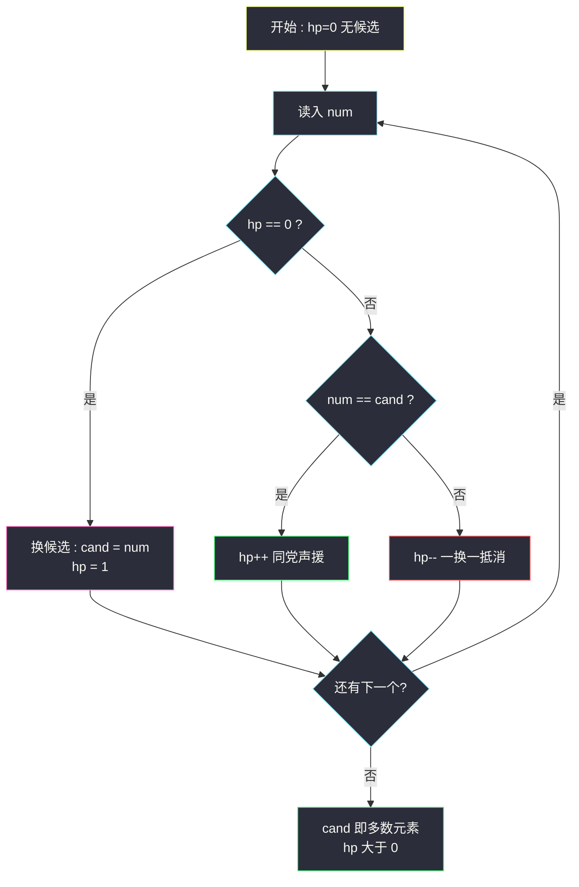

# 多数元素（Boyer-Moore 投票法 / 水王问题）

## 一、问题描述

给定一个大小为 `n` 的数组 `nums`，返回其中的**多数元素**。多数元素是指在数组中出现次数**大于 `⌊n/2⌋`** 的元素。

你可以假设数组是非空的，并且给定的数组总是存在多数元素。

> 🔗 LeetCode 169：https://leetcode.cn/problems/majority-element/

**示例 1**

```
输入：nums = [3,2,3]
输出：3
```

**示例 2**

```
输入：nums = [2,2,1,1,1,2,2]
输出：2
```

**直观理解**

课上把这题叫「**水王问题**」：论坛灌水之王发帖数超过总帖数的一半，给他每个帖子配一个「不同意见者」互相抵消，抵到最后必然还剩下水王自己的帖子——因为**没人能凑出足够多的「非水王帖」把过半的帖子全部消耗掉**。Boyer-Moore 投票法就是这套「一对一抵消」的形式化：维护一个候选者 `cand` 和它的票数 `hp`（血量），遇到自己人 `hp+1`，遇到敌人 `hp-1`，血量归零就换候选——最后活下来的必然是过半者。

---

## 二、暴力解法（入门）

### 直观思路

### 方案 A：哈希计数

用哈希表统计每个数出现次数，出现次数超过 `⌊n/2⌋` 的即为答案。

```java
public int majorityElement(int[] nums) {
    Map<Integer, Integer> cnt = new HashMap<>();
    int half = nums.length / 2;
    for (int num : nums) {
        int c = cnt.merge(num, 1, Integer::sum);
        if (c > half) {
            return num;   // 边统计边判定，提前返回
        }
    }
    return -1;            // 按题意不会走到这
}
```

### 方案 B：排序取中位

多数元素过半 → 排序后它必然**占据正中间**那个位置：`nums[n/2]` 一定属于它（无论它取值多小多大，长度过半的区间必然盖住中点）。

```java
public int majorityElement(int[] nums) {
    Arrays.sort(nums);
    return nums[nums.length / 2];
}
```

### 复杂度

- 哈希计数：时间 `O(n)`，空间 `O(n)`
- 排序取中位：时间 `O(n log n)`，空间 `O(log n)`

### 🔴 瓶颈在哪里

1. 哈希版要多存一张最多 n 键的表——**空间不是 O(1)**；
2. 排序版动了整个数组，`log` 因子在「只找一个过半数」面前是大炮打蚊子；
3. 两者都没有利用本题最深的结构：**过半意味着「它一个人能单挑其余所有数之和」**——抵消对决根本不需要记住具体是谁。

---

## 三、优化探索（核心章节）

### 3.1 观察特征

| 特征 | 结论 |
|------|------|
| 多数元素出现次数 > `⌊n/2⌋` | 它的数量严格超过其它所有数的总和——一对一消耗后必然有剩余 |
| 只要求找「是谁」，不要求计数 | 状态只需两个变量：候选者 + 血量 |
| 消耗关系只关心「是不是同一个人」 | 不同的非候选数之间互相消耗也无所谓，反正都在削弱「非多数」阵营 |

### 3.2 抵消不变式（正确性核心）

任意时刻维护 `(cand, hp)`，语义是：**「hp 个已读元素配对抵消后，还多出来的 hp 张都是 cand 的票」**。

- 遇到 `num == cand`：`hp++`（多一张自家票）；
- 遇到 `num != cand` 且 `hp > 0`：`hp--`（一张 cand 票与一张异己票同归于尽）；
- 遇到 `num != cand` 且 `hp == 0`：血量耗尽，换候选 `cand = num, hp = 1`（从此以它为基准重新配对）。

**为什么最后 `cand` 一定是多数元素？** 把整个过程按「换候选」切成若干段，每一段结束时 hp 归零，说明该段内 cand 的票与其它票**恰好两两抵消**——段内 cand 占比 ≤ 一半。所有被抵消掉的票里，多数元素的票至多一半。设多数元素总票数 > n/2，被抵消掉的至多 ⌊n/2⌋……更精确地：每次抵消消耗一张多数元素票的同时必消耗一张非多数票，非多数票总共 < n/2 张，**根本耗不完多数元素的票**，所以最后一轮的 cand（以及累计血量）必然属于多数元素。



### 3.3 关键推导问题

| 问题 | 答案 |
|------|------|
| 换候选时旧候选的票「浪费」了吗？ | 没有。旧段抵消是等价的：段内每张 cand 票都带走了一张异己票，异己总量就那么多，消耗掉对全局有利 |
| `hp` 是不是 cand 的真实出现次数？ | **不是**！它只是「配对抵消后的净胜票」。课上水王版因此要**二次扫描**重新统计真实次数，用于验证是否真的过半（LC 保证存在，可省） |
| 若数组**不保证**存在多数元素会怎样？ | 投票结束后 cand 只是「唯一可能的候选」，必须再扫一遍数真实次数验证（见主解附注，对齐课源码） |
| 不同非多数数轮流当候选，会不会互相互相「掩护」？ | 不会。任何抵消要么消耗多数票要么不消耗，非多数阵营总票数 < n/2 是硬上限，掩护不出来 |
| 为什么初始化 `cand=0, hp=0` 而不是 `cand=nums[0]`？ | hp=0 时第一个数进来走换候选分支，效果与预置 `nums[0]` 完全一致——0 值不会与任何真实元素混淆的前提是「hp==0 时不用 cand」 |

### 3.4 一句话核心

> **过半者单挑全场不败：一对一抵消到底，血量不归零的那个就是水王。**

---

## 四、代码实现详解

### Java（主解：投票法，对齐课源码 class116）

```java
// 多数元素（水王数）
// 出现次数大于 n/2 的数一定存在时，返回它
// 测试链接 : https://leetcode.cn/problems/majority-element/
class Solution {

    public int majorityElement(int[] nums) {
        int cand = 0;   // 候选者
        int hp = 0;     // 候选者的血量（净胜票）
        for (int num : nums) {
            if (hp == 0) {          // 没有候选，换人
                cand = num;
                hp = 1;
            } else if (num != cand) {
                hp--;               // 一换一抵消
            } else {
                hp++;               // 同党声援
            }
        }
        // 本题保证多数元素存在，直接返回 cand
        return cand;
    }
}
```

> 课源码：`src/class116/Code01_WaterKing.java`（水王数）。课上版本**不保证存在**多数元素，投票后再扫一遍验证真实次数（超过 `n/2` 才返回，否则返回 -1）；LC 保证存在，验证段可以省略，骨架完全同构：

```java
// 课源码的水王完整版（不保证存在时的写法）
// 复用 hp，统计 cand 真实出现的次数
hp = 0;
for (int num : nums) {
    if (num == cand) {
        hp++;
    }
}
return hp > nums.length / 2 ? cand : -1; // 验证环节不能省
```

### Python

```python
# 多数元素（水王数）
# 测试链接 : https://leetcode.cn/problems/majority-element/
class Solution:
    def majorityElement(self, nums: list[int]) -> int:
        cand, hp = 0, 0
        for num in nums:
            if hp == 0:
                cand, hp = num, 1
            elif num != cand:
                hp -= 1
            else:
                hp += 1
        return cand
```

---

## 五、具体例子演示

`nums = [2,2,1,1,1,2,2]`（n=7，多数元素 2 出现 4 次 > 3.5），完整跟踪：

| 步 | num | hp(前) | 分支 | cand | hp(后) | 说明 |
|----|-----|--------|------|------|--------|------|
| 1 | 2 | 0 | 换候选 | 2 | 1 | 血量空，2 上台 |
| 2 | 2 | 1 | 同党 | 2 | 2 | 自家票 +1 |
| 3 | 1 | 2 | 抵消 | 2 | 1 | 2 的票与 1 的票同归于尽 |
| 4 | 1 | 1 | 抵消 | 2 | 0 | 又一对抵消，血量清零 |
| 5 | 1 | 0 | 换候选 | 1 | 1 | 台上没人了，1 上台 |
| 6 | 2 | 1 | 抵消 | 1 | 0 | 1 的票与 2 的票抵消，清零 |
| 7 | 2 | 0 | 换候选 | 2 | 1 | 2 再度上台 |

扫描结束 `cand=2` ✅。注意两个细节：

- 步骤 4-6 期间候选是「1」，它一度 hp=1——但很快被抵消换人。**中途谁是候选毫无意义，只有结尾那个算数**；
- 抵消段划分：`[2,2,1,1]`（以 2 为候选，4 票两两抵消）、`[1,2]`（以 1 为候选，抵消）、剩 `[2]`——多数元素 2 的 4 张票被抵消 3 张后仍剩 1 张净胜票压轴，正是「过半者单挑不败」的体现。


**再演示验证环节为什么不能省**（水王完整版场景）：`nums = [1,2,3]` 无过半元素。投票：1 上台 hp1 → 2 抵消 hp0 → 3 上台 hp1，`cand=3`。若直接返回就错报「3 是多数元素」；二次扫描数出 3 只出现 1 次 ≤ 1（⌊3/2⌋），返回 -1 才是正确行为。

---

## 六、复杂度分析

| 项目 | 投票法（主解） | 哈希计数 | 排序取中位 |
|------|----------------|----------|------------|
| 时间 | `O(n)` 一遍扫描（不保证存在时加验证再扫一遍，仍 O(n)） | `O(n)` | `O(n log n)` |
| 空间 | `O(1)` 两个变量 | `O(n)` 哈希表 | `O(log n)` 递归栈 |

---

## 七、方法对比与总结

### 易错点

1. **以为 `hp` 是真实出现次数** → 它只是净胜票；需要真实次数必须二次扫描。
2. **在不保证存在多数元素的题面下省略验证** → 返回伪多数（如上例 `[1,2,3]` 会错报 3）。
3. **三个分支顺序写错**：`hp==0` 的判断必须最先——否则 hp=0 时还执行 `num != cand` 的 `hp--` 会变 -1，状态机崩坏。
4. **排序取中位时纠结奇偶**：`nums[n/2]` 对奇偶长度都成立，不必分情况。
5. 「随机取一个数再验证」的做法期望 O(n) 但有最坏坑；投票法无随机性、严格一遍。

### 方法对比

| | 投票法（课上推荐） | 排序中位 | 哈希 |
|--|--------------------|----------|------|
| 时间 | `O(n)` | `O(n log n)` | `O(n)` |
| 空间 | `O(1)` ✅ | `O(log n)` | `O(n)` |
| 是否需验证 | 不保证存在时需要 | 需要（排序后还要数） | 不需要（边数边判） |
| 可扩展性 | 可推广到 >n/k（摩尔投票多候选，见课源码 `class116/Code05_MoreThanNK.java`） | 不可 | 可 |

### 模板口诀

> **血空换王，同党加血，异己减血；扫完看王，不保证在还得验身。**

---

## 八、举一反三

| 题目 | 链接 | 迁移点 |
|------|------|--------|
| 229. 多数元素 II | https://leetcode.cn/problems/majority-element-ii/ | 找出现 > ⌊n/3⌋ 的数：至多 2 个候选，双候选双血量抵消（课源码 `class116/Code05_MoreThanNK.java` 的 >n/k 版） |
| 面试题 17.10. 主要元素 | https://leetcode.cn/problems/find-majority-element-lcci/ | 同款投票法，但**不保证存在**——正是课源码水王完整版「二次验证」的主场 |
| 961. 在长度 2N 的数组中重复 N 次的元素 | https://leetcode.cn/problems/n-repeated-element-in-size-2n-array/ | 哈希/随机对照/位运算多种思路对比练手 |
| 1287. 有序数组中出现次数超过 25% 的元素 | https://leetcode.cn/problems/element-appearing-more-than-25-in-sorted-array/ | 有序性加持：候选只可能出现在三个固定位置附近 |

**迁移一句**：摩尔投票的本质是**「阵营对拼、逐一抵消、剩者为王」**——凡是「出现次数超过 1/k」的找候选问题（水王家族），都可以用「k-1 个候选 + 血量」的同款状态机，O(n) 时间 O(k) 空间扫一遍；记住**验证环节是题面不给保证时的必修课**。
