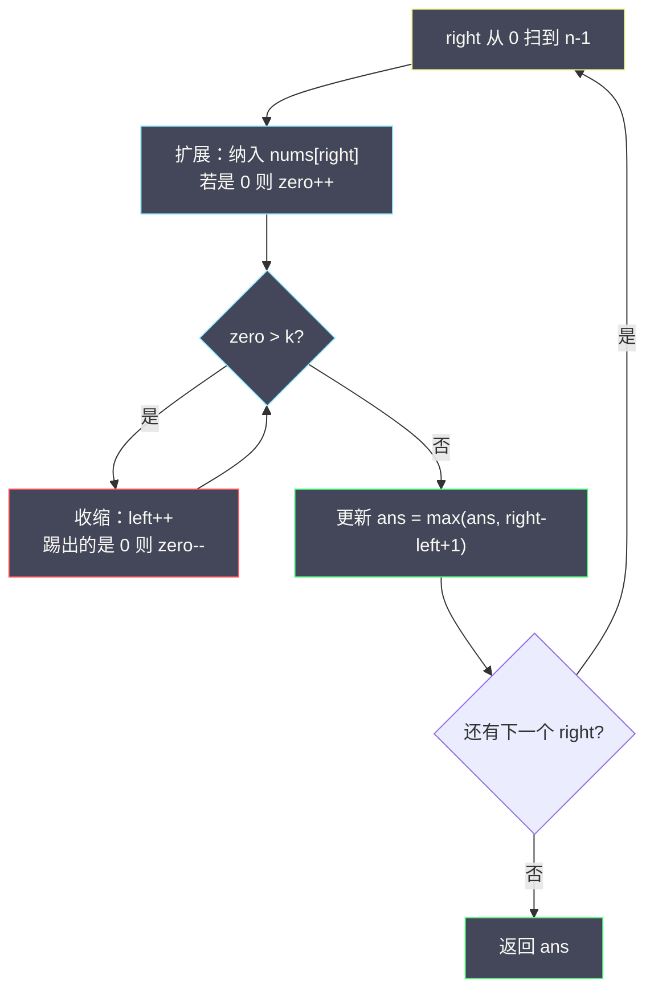
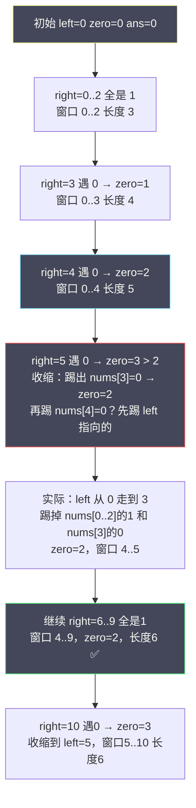

# 最大连续 1 的个数 III（滑动窗口 · 翻转至多 k 个 0）

## 一、问题描述

给定一个二进制数组 `nums`（只含 `0` / `1`）和一个整数 `k`，你可以**把至多 `k` 个 `0` 翻成 `1`**。问：翻转之后，数组里**最长连续 `1` 的长度**是多少？

本质：找一个最长的连续子数组，使得其中 `0` 的个数 `≤ k`（这些 `0` 就是你打算翻掉的）。

> 🔗 LeetCode 1004：https://leetcode.cn/problems/max-consecutive-ones-iii/

**示例 1（简单）**

```
输入：nums = [1,1,1,0,0,0,1,1,1,1,0], k = 2
输出：6
解释：把下标 5、10 的两个 0 翻成 1，得到 [1,1,1,0,0,1,1,1,1,1,1]，最长连续 1 长度为 6。
```

**示例 2（复杂）**

```
输入：nums = [0,0,1,1,0,0,1,1,1,0,1,1,0,0,0,1,1,1,1], k = 3
输出：10
解释：翻其中 3 个 0，可得到一段长度为 10 的连续 1。
```

---

## 二、暴力解法（入门）

### 直观思路

枚举每一个可能的窗口右端点 `r`，再从 `r` 往左找左端点 `l`，统计 `[l, r]` 里有多少个 `0`。只要 `0` 的个数 `≤ k`，就用 `r - l + 1` 更新答案。

```java
public int longestOnes(int[] nums, int k) {
    int n = nums.length, ans = 0;
    for (int r = 0; r < n; r++) {
        int zeros = 0;
        for (int l = r; l >= 0; l--) {
            if (nums[l] == 0) zeros++;
            if (zeros > k) break;
            ans = Math.max(ans, r - l + 1);
        }
    }
    return ans;
}
```

### 复杂度

- **时间**：`O(n²)`。`n` 到 `10^5` 时会超时。
- **空间**：`O(1)`。

### 🔴 瓶颈在哪里

对每个 `r` 都重新从右往左扫一遍统计 `0`，**窗口之间大量重复计算**。注意到：当你把右端点从 `r` 扩到 `r+1` 时，合法左端点只会右移、不会左移——这正是滑动窗口「单调性」的信号。

---

## 三、优化探索（核心章节）

### 3.1 观察特征

- 问的是**连续子数组** → 适合滑动窗口 / 双指针。
- 约束是「窗口内 `0` 的个数 ≤ k」→ 维护一个计数即可。
- 窗口越长越好，且「合法 → 再加一个左端点左边的数一定更不合法」：左端点具有**单调性**。

### 3.2 暴力 → 优化：变长窗口模板

固定右端点 `right` 一路往右扫；维护左端点 `left` 和窗口内 `0` 的个数 `zero`：

1. **扩展**：`right++`，若 `nums[right] == 0`，则 `zero++`。
2. **收缩**：当 `zero > k` 时，不断 `left++`；若踢出去的是 `0`，则 `zero--`。
3. **更新答案**：每次扩张并收缩到合法后，`ans = max(ans, right - left + 1)`。



### 3.3 关键推导问题（滑动窗口）

| 问题 | 答案 |
|------|------|
| 何时扩展右端？ | 每个元素都扩展一次，`right` 从左扫到右。 |
| 何时收缩左端？ | 窗口内 `0` 的个数 **> k** 时，一直收缩到 ≤ k。 |
| 答案在何时更新？ | 每次窗口合法后更新（也可在收缩前更新，结果等价）。 |
| 为什么是 O(n)？ | `left`、`right` **各自最多移动 n 次**，不会回退。 |

### 3.4 一句话核心思想

> **用一个窗口圈住「翻转后全是 1」的最长段；窗口内允许 ≤ k 个 0，超额就从左边吐出去。**

这和「替换后的最长重复字符」(424)、「考试的最大困扰度」(2024) 是**同一模板**：窗口内某种「坏字符」数量不超过 k。

---

## 四、代码实现详解

### Java（逐行注释）

```java
class Solution {
    public int longestOnes(int[] nums, int k) {
        int n = nums.length;
        int left = 0;          // 窗口左端（含）
        int zero = 0;          // 当前窗口内 0 的个数
        int ans = 0;           // 历史最长合法窗口长度

        for (int right = 0; right < n; right++) {
            // 1) 扩展右端：把 nums[right] 纳入窗口
            if (nums[right] == 0) {
                zero++;
            }
            // 2) 收缩左端：直到窗口内 0 的个数 ≤ k
            while (zero > k) {
                if (nums[left] == 0) {
                    zero--;
                }
                left++;
            }
            // 3) 此时 [left, right] 合法，更新答案
            //    循环不变式：窗口内 zero ≤ k
            ans = Math.max(ans, right - left + 1);
        }
        return ans;
    }
}
```

### Python（同结构）

```python
class Solution:
    def longestOnes(self, nums: list[int], k: int) -> int:
        left = 0
        zero = 0
        ans = 0
        for right, x in enumerate(nums):
            if x == 0:
                zero += 1
            while zero > k:
                if nums[left] == 0:
                    zero -= 1
                left += 1
            ans = max(ans, right - left + 1)
        return ans
```

---

## 五、具体例子演示

以 **示例 1**：`nums = [1,1,1,0,0,0,1,1,1,1,0]`，`k = 2`。



逐步轨迹（更精确）：

```
下标:  0 1 2 3 4 5 6 7 8 9 10
nums:  1 1 1 0 0 0 1 1 1 1  0
k = 2

right=0: 纳入1  zero=0  窗口[0,0]  ans=1
right=1: 纳入1  zero=0  窗口[0,1]  ans=2
right=2: 纳入1  zero=0  窗口[0,2]  ans=3
right=3: 纳入0  zero=1  窗口[0,3]  ans=4
right=4: 纳入0  zero=2  窗口[0,4]  ans=5
right=5: 纳入0  zero=3 > 2
         收缩：nums[0]=1 → left=1；nums[1]=1 → left=2；
               nums[2]=1 → left=3；nums[3]=0 → zero=2, left=4
         窗口[4,5]  ans=max(5,2)=5
right=6: 纳入1  zero=2  窗口[4,6]  ans=3 → 仍5
right=7: 纳入1  zero=2  窗口[4,7]  ans=4
right=8: 纳入1  zero=2  窗口[4,8]  ans=5
right=9: 纳入1  zero=2  窗口[4,9]  ans=6  ✅（翻掉下标4、5两个0）
right=10:纳入0  zero=3 > 2
         收缩：nums[4]=0 → zero=2, left=5
         窗口[5,10] ans=6

最终 ans = 6
```

窗口示意（`right=9` 时的最优窗口）：

```
  1 1 1 [0 0 0 1 1 1 1] 0
         ↑           ↑
       left=4     right=9
  窗口内两个 0（下标 4、5），刚好用完 k=2 次翻转
```

---

## 六、复杂度分析

| 解法 | 时间 | 空间 | 说明 |
|------|------|------|------|
| 暴力枚举端点 | O(n²) | O(1) | 每个右端点重新扫左端 |
| 滑动窗口 | **O(n)** | O(1) | left/right 各走一遍 |

---

## 七、方法对比与总结

| 版本 | 适用场景 | 面试怎么讲 |
|------|----------|------------|
| 暴力 | 理解题意 | 「我会先枚举所有子数组再优化」 |
| 滑动窗口 | 标准解、必写 | 「维护至多 k 个 0 的最长窗口，左右指针各 O(n)」 |

### 完整模板（Java）

```java
class Solution {
    public int longestOnes(int[] nums, int k) {
        int left = 0, zero = 0, ans = 0;
        for (int right = 0; right < nums.length; right++) {
            if (nums[right] == 0) zero++;
            while (zero > k) {
                if (nums[left] == 0) zero--;
                left++;
            }
            ans = Math.max(ans, right - left + 1);
        }
        return ans;
    }
}
```

### 完整模板（Python）

```python
class Solution:
    def longestOnes(self, nums: list[int], k: int) -> int:
        left = zero = ans = 0
        for right, x in enumerate(nums):
            zero += x == 0
            while zero > k:
                zero -= nums[left] == 0
                left += 1
            ans = max(ans, right - left + 1)
        return ans
```

---

## 八、举一反三

| 题目 | 关系 | 迁移点 |
|------|------|--------|
| [424. 替换后的最长重复字符](https://leetcode.cn/problems/longest-repeating-character-replacement/) | 同模板 | 窗口内「非众数」个数 ≤ k |
| [2024. 考试的最大困扰度](https://leetcode.cn/problems/maximize-the-confusion-of-an-exam/) | 同模板 | 分别对 `'T'`/`'F'` 做一遍「至多 k 次翻转」 |
| [1493. 删掉一个元素以后全为 1 的最长子数组](https://leetcode.cn/problems/longest-subarray-of-1s-after-deleting-one-element/) | 特化 | 等价于 k=1，答案再减 1（必须删一个） |
| [1004 本身](https://leetcode.cn/problems/max-consecutive-ones-iii/) | 本题 | 「坏字符计数 ≤ k」的变长窗口 |

**变形练习**：若改成「必须恰好翻转 k 个 0」，怎么改？  
提示：`恰好 k = 至多 k − 至多 (k−1)`，或收缩条件改成 `zero > k` 后额外要求 `zero == k` 才更新答案（注意边界）。

**核心迁移**：凡是「连续区间 + 某种代价不超过 k」，优先想**变长滑动窗口**：右扩代价、超额左缩、维护答案。
