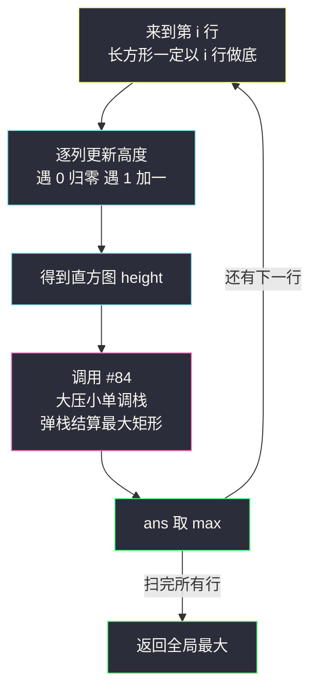
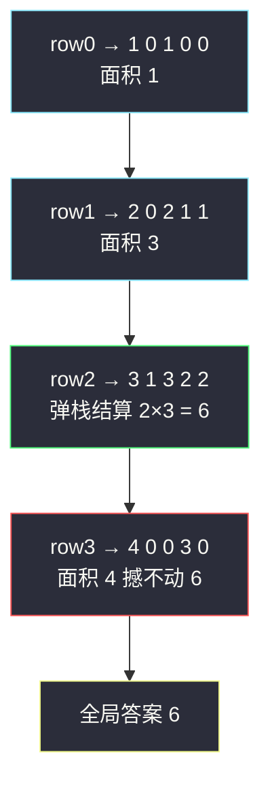

# 最大矩形（#84 逐行复用 · 直方图压缩）

## 一、问题描述

给定一个仅包含 `0` 和 `1`、大小 `rows × cols` 的二维二进制矩阵，找出**只包含 `1` 的最大矩形**，并返回其面积。

> 🔗 LeetCode 85：https://leetcode.cn/problems/maximal-rectangle/
>
> 约束：`1 <= rows, cols <= 200`，`matrix[i][j]` 为 `'0'` 或 `'1'`（字符）。矩阵只有 0/1，且规模 `200 × 200`，暗示「按行做文章」的 `O(rows × cols)` 解法。

**示例 1**

```
输入：matrix = [
  ["1","0","1","0","0"],
  ["1","0","1","1","1"],
  ["1","1","1","1","1"],
  ["1","0","0","1","0"]
]
输出：6
解释：最大矩形在第 1~2 行、第 2~4 列：2 行 × 3 列 = 6
```

**示例 2**

```
输入：matrix = [["0"]]
输出：0
```

**直观理解**

矩阵里的全 1 矩形看着毫无头绪，但换一个视角就豁然开朗：**任何全 1 矩形都「以某一行做底」**。固定底边为第 `i` 行，往上连续 1 的个数就是这一行每列的「柱高」——把第 `i` 行当作地平线，矩阵上半部分变成了一个**直方图**，而「底边贴着第 i 行的最大全 1 矩形」=「这个直方图里的最大矩形」= **#84**！逐行维护柱高数组、逐行调用 #84，取全局最大即答案。课源码 class052 `Code05_MaximalRectangle` 原题，注释一针见血：**「来到 i 行，长方形一定要以 i 行做底！加工高度数组（压缩数组）」**。

```
以第 2 行做底的直方图（往上数连续 1 的个数）：

3 |  ██        ██
2 |  ██        ██  ██  ██
1 |  ██  ██    ██  ██  ██        ← height = [3,1,3,2,2]
0 +-----------------------
     0   1    2   3   4         最大矩形：高 2 × 宽 3（第 2~4 列）= 6
```

---

## 二、暴力解法（枚举矩形四边界）

### 直观思路

枚举矩形的上下边界 `r1 <= r2` 与左右边界 `c1 <= c2`，检查区域内是否全 1，是则用面积更新答案：

```java
class Solution {
    public int maximalRectangle(char[][] matrix) {
        int n = matrix.length, m = matrix[0].length, ans = 0;
        for (int r1 = 0; r1 < n; r1++)
            for (int r2 = r1; r2 < n; r2++)
                for (int c1 = 0; c1 < m; c1++)
                    for (int c2 = c1; c2 < m; c2++) {
                        if (allOne(matrix, r1, r2, c1, c2)) {
                            ans = Math.max(ans, (r2 - r1 + 1) * (c2 - c1 + 1));
                        }
                    }
        return ans;
    }

    private boolean allOne(char[][] g, int r1, int r2, int c1, int c2) {
        for (int i = r1; i <= r2; i++)
            for (int j = c1; j <= c2; j++)
                if (g[i][j] == '0') return false;
        return true;
    }
}
```

### 复杂度

- **时间**：`O(n² · m² · nm)`——四重边界枚举再加全检，天文数字，示例 1 都要跑很久
- **空间**：`O(1)`

### 🔴 瓶颈在哪里

1. 把矩形当「四维对象」硬枚举，完全无视「全 1」结构；
2. 即使优化到枚举「左上角 + 向右向下延伸」也是 `O(n³m³)` 级别，方向就错了；
3. 正确的视角是**降维**：二维矩阵按行切片，每一行只问一个一维问题——「以我为底的直方图里最大矩形是多少」。

---

## 三、优化探索（核心章节）

### 3.1 观察特征

| 特征 | 说明 |
|------|------|
| 全 1 矩形必有底边所在行 | 枚举「底边 = 第 i 行」不重不漏地覆盖所有候选矩形 |
| 以第 i 行为底，每列有唯一柱高 | `height[j]` = 第 j 列从第 i 行往上连续 1 的个数——遇 0 归零、遇 1 加一 |
| 一行一世界，行与行解耦 | 第 i 行的直方图只依赖第 i-1 行的 `height`，增量更新 `O(m)` |
| 一维问题已被 #84 解决 | 直方图最大矩形 = #84 的大压小单调栈，`O(m)` 一行 |

### 3.2 暴力 → 优化：逐行压缩 + 逐行 #84

`height[]` 的维护只看当前格：`grid[i][j] == '0'` 则 `height[j] = 0`（地基断了），否则 `height[j] + 1`（在地基上再加一层）。每更新完一行，就对这个直方图跑一遍 #84 的大压小单调栈：

```
maximalRectangle:
    height = 长度 m 的全 0 数组
    ans = 0
    for i in 0..n-1:                       ← 逐行
        for j in 0..m-1:
            height[j] = grid[i][j] == '0' ? 0 : height[j] + 1   ← 压缩成直方图
        ans = max(ans, largestRectangleArea(height))            ← 复用 #84
    return ans
```



### 3.3 关键推导问题

| 问题 | 答案 |
|------|------|
| 为什么逐行做底不重不漏？ | 任何全 1 矩形都有唯一的「最下面一行」，它恰好在处理到那一行时被算到；其他行做底时它要么高不够、要么宽不够，都不会被重复计入更大值——取 max 天然去重 |
| `height[j] = 0 : height[j]+1` 为什么对？ | 第 i 行第 j 列是 0，任何以 i 为底的矩形都跨不过这根「断柱」，高度清零；是 1 则往上接续第 i-1 行的高度。**不需要回头看整个矩阵**，一列的历史就存在 height[j] 一个变量里 |
| 会不会漏掉「不以整行为底」的矩形？ | 不会。矩形底边所在的那一行就是它的「底」，处理该行时该矩形完全落在直方图某个矩形内；反之直方图结算出的矩形都能还原回矩阵里的全 1 矩形——一一对应 |
| 为什么不每行重算高度？ | 重算是 `O(n·m)` 每行、总计 `O(n²·m)`；增量维护一列一变量，每行 `O(m)`，这就是「压缩数组」的价值（课注释原文用的正是这个词） |
| #84 里的清算阶段还需要吗？ | 需要，原样保留——每行的直方图是独立完整的一维问题，遍历 + 清算两阶段一个不能少（或用高度 0 的哨兵合并） |
| 与 #221 最大正方形什么关系？ | 同样逐行 DP 的思想，但正方形要「边长相等」，用 `min(左,上,左上)+1` 的 DP 就够；矩形宽高自由，必须单调栈找两侧更矮——正方形是 DP 的菜，矩形是单调栈的菜 |
| 复杂度为什么是 `O(n·m)`？ | n 行 × (更新 m + #84 的 m) = `O(n·m)`，恰好等于读一遍矩阵——已经是理论下界（每个格子至少要看一眼） |

### 3.4 一句话核心

> **每一行都是一张直方图：遇 1 加高、遇 0 归零，#84 原封搬来逐行结算。**

---

## 四、代码实现详解

### Java（主解：逐行压缩 + #84 单调栈，对齐 class052 课源码）

```java
// 最大矩形：仅含 1 的最大矩形面积
// 测试链接 : https://leetcode.cn/problems/maximal-rectangle/
// 对齐课源码 class052 Code05_MaximalRectangle（内嵌 Code04 的直方图结算）
class Solution {
    public int maximalRectangle(char[][] grid) {
        int n = grid.length, m = grid[0].length, ans = 0;
        int[] height = new int[m];                  // 以当前行为底的直方图
        for (int i = 0; i < n; i++) {
            // 来到 i 行，长方形一定要以 i 行做底：加工高度数组（压缩数组）
            for (int j = 0; j < m; j++) {
                height[j] = grid[i][j] == '0' ? 0 : height[j] + 1;
            }
            ans = Math.max(ans, largestRectangleArea(height));
        }
        return ans;
    }

    // ===== 以下即 #84 原题：大压小，弹栈结算 =====
    private int largestRectangleArea(int[] height) {
        int m = height.length, ans = 0;
        Deque<Integer> stack = new ArrayDeque<>();   // 大压小：底到顶递增，存下标
        for (int i = 0; i < m; i++) {                // 遍历阶段
            while (!stack.isEmpty() && height[stack.peek()] >= height[i]) {
                int cur = stack.pop();               // 违规即答案
                int left = stack.isEmpty() ? -1 : stack.peek();
                ans = Math.max(ans, height[cur] * (i - left - 1));
            }
            stack.push(i);
        }
        while (!stack.isEmpty()) {                   // 清算阶段：右边界按 m
            int cur = stack.pop();
            int left = stack.isEmpty() ? -1 : stack.peek();
            ans = Math.max(ans, height[cur] * (m - left - 1));
        }
        return ans;
    }
}
```

课源码把 `largestRectangleArea` 写成操作静态数组 `height/stack` 的版本（省一次传参），结算公式 `height[cur] * (i - left - 1)`、`left = r == 0 ? -1 : stack[r-1]` 完全一致；站点版参数化传递 `height`，更符合「#84 是个独立黑盒」的心智模型。

### Python（主解同思路，#84 用哨兵版）

```python
class Solution:
    def maximalRectangle(self, matrix: list[list[str]]) -> int:
        m = len(matrix[0])
        height = [0] * m
        ans = 0
        for row in matrix:                          # 逐行压缩
            for j, c in enumerate(row):
                height[j] = 0 if c == '0' else height[j] + 1
            ans = max(ans, self._histogram(height))
        return ans

    # #84 原题：大压小单调栈（末尾哨兵 0 合并清算）
    def _histogram(self, height: list[int]) -> int:
        stack: list[int] = []
        best = 0
        for i in range(len(height) + 1):
            h = 0 if i == len(height) else height[i]
            while stack and height[stack[-1]] >= h:
                cur = stack.pop()
                left = stack[-1] if stack else -1
                best = max(best, height[cur] * (i - left - 1))
            stack.append(i)
        return best
```

---

## 五、具体例子演示

### 例 1：示例 1 的矩阵，答案 `6`

**第一幕：逐行压缩出直方图**（`0` 断柱归零，`1` 接高）

| 行 | matrix[i] | 更新后 height | 本行 #84 最大面积 | 说明 |
|----|-----------|---------------|-------------------|------|
| 0 | `1 0 1 0 0` | [1,0,1,0,0] | 1 | 三根孤柱，最高 1×1 |
| 1 | `1 0 1 1 1` | [2,0,2,1,1] | 3 | 第 2~4 列连成高 1 宽 3 |
| 2 | `1 1 1 1 1` | [3,1,3,2,2] | **6** | 第 2~4 列高 2 宽 3 = 6 ✅ |
| 3 | `1 0 0 1 0` | [4,0,0,3,0] | 4 | 第 0 列孤柱 4×1 |

全局 ans = max(1, 3, 6, 4) = **6** ✅——答案在第 2 行「做底」时被结算出来。

**第二幕：对第 2 行的直方图 `[3,1,3,2,2]` 完整跑一遍 #84**（大压小，栈记法：左侧为底，括号内为高度）：

| 步 | i（高） | 栈顶比较 | 动作与结算 | 栈（底→顶） |
|----|---------|----------|-----------|-------------|
| 1 | 0 (3) | 栈空 | 入栈 | [0(3)] |
| 2 | 1 (1) | 3 >= 1 违规 | 弹 0：left=-1，宽 1-(-1)-1=1，面积 `3×1=3`；入栈 | [1(1)] |
| 3 | 2 (3) | 1 < 3 | 入栈 | [1(1), 2(3)] |
| 4 | 3 (2) | 3 >= 2 违规 | 弹 2：left=1，宽 3-1-1=1，面积 `3×1=3`；1 < 2 停；入栈 | [1(1), 3(2)] |
| 5 | 4 (2) | 2 >= 2 违规 | 弹 3：left=1，宽 4-1-1=2，面积 `2×2=4`（相等也弹，结算偏小无妨）；1 < 2 停；入栈 | [1(1), 4(2)] |
| 6 | 清算 | — | 弹 4：left=1，宽 5-1-1=3，面积 `2×3=6`（**补全**第 5 步相等的偏小结算）；弹 1：left=-1，宽 5，面积 `1×5=5` | [] |

本行最大 **6** ✅。第 5、6 步合看正是 #84 讲的「相等柱：先弹的算小、清算的补全」。



**关键看点**：矩阵行数再多、图案再花，每一行都只是「一张直方图」；第 3 行的第 0 列 `1` 让 height[0] 攒到 4，但两边的 0 把它锁成孤柱——**高柱没有宽度陪跑，终究拼不过 2×3 的小钢炮**，这正是弹栈结算「高与宽博弈」的矩阵级重演。

### 例 2：全 1 矩阵 `3 × 4`

height 逐行涨到 [1,1,1,1] → [2,2,2,2] → [3,3,3,3]；第 2 行直方图 [3,3,3,3] 清算时整段等高，弹到最后那根结算 `3×4=12` ✅——答案 = 整个矩阵，直觉与算法一致。

### 例 3：单行 `["0","1","1","0"]`

height = [0,1,1,0]；#84 结算第 1~2 列的 `1×2=2` ✅。单行矩阵退化成「区间全是 1 的最长段」，单调栈照样工作——降维打击到一维后连特判都不用。

---

## 六、复杂度分析

| 项目 | 暴力四边界枚举 | 逐行压缩 + #84（主解） |
|------|----------------|--------------------------|
| 时间 | `O(n²m²·nm)` | **`O(n·m)`**：n 行 ×（更新 O(m) + 直方图单调栈 O(m)），读完矩阵即算完，理论下界 |
| 空间 | `O(1)` | `O(m)`：height 数组 + 每行的单调栈（可复用同一个） |

**细节**：#84 的单调栈每根柱子入栈一次、出栈至多一次，单行是严格 `O(m)`；n 行叠加不放大——每行的直方图是独立问题，栈在该行结束时必然清空，无跨行残留。

---

## 七、方法对比与总结

### 写法对比

| | 暴力枚举边界 | 逐行压缩 + #84（主解） | 前缀和/DP 杂法（每行每列扫段） |
|--|--------------|--------------------------|--------------------------------|
| 时间 | 不可用 | `O(n·m)` | `O(n·m·(n+m))` |
| 思路 | 四维硬枚举 | 降维：每行一张直方图 | 枚举每格向右/向下的延伸 |
| 代码量 | 长且超时 | ✅ 「#84 黑盒 + 5 行压缩」 | 中等但上限低 |
| 面试定位 | 只配当反面教材 | ✅ 必须默写 | 可作铺垫跳板 |

### 易错点

1. **矩阵存的是字符 `'0'/'1'`**：Java 里 `grid[i][j] == 1` 永假，必须 `== '0'`/`== '1'`——本题最著名的低级坑。
2. **height 更新写反**：`'0' ? height[j]+1 : 0` 恰好颠倒，直方图全错；记「**遇 0 归零**」。
3. **#84 黑盒里改公式**：结算宽度 `i - left - 1`、清算右边界 `m`，两处 `-1`、一处边界值，抄错任意一处整行作废。
4. **行内结算完忘清栈**：#84 函数版天然隔离；若手写内联又漏了清算阶段，下一行的残留栈会把上一行的下标当成柱子，直接崩。
5. **只对「看起来大的行」跑 #84**：每一行都必须跑——第 3 行孤柱 4 的存在说明小行也可能反超直觉（例 1 中虽然没赢，反例随手构造：第一行一根 10 高，后面全 0）。
6. **把本题当 #221 最大正方形用 min-DP**：正方形约束「边长相等」才配 `min+1` 递推；矩形宽高自由，必须找两侧更矮的单调栈。

### 模板口诀

> **矩阵竖着看，每行是直方图；1 加高、0 归零，#84 一行跑一梭。**

---

## 八、举一反三

| 题目 | 链接 | 迁移点 |
|------|------|--------|
| 84. 柱状图中最大的矩形 | https://leetcode.cn/problems/largest-rectangle-in-histogram/ | 本题的地基：内层单调栈原题原码（站内本批已有题解 largest-rectangle-in-histogram.md） |
| 221. 最大正方形 | https://leetcode.cn/problems/maximal-square/ | 同「逐行视角」但换 DP：`dp = min(左, 上, 左上) + 1`，正方形与矩形的分水岭 |
| 1277. 统计全为 1 的正方形子矩阵 | https://leetcode.cn/problems/count-square-submatrices-with-all-ones/ | #221 的计数版，同一 min-DP 统计个数 |
| 1504. 统计全 1 子矩形 | https://leetcode.cn/problems/count-submatrices-with-all-ones/ | 逐行直方图 + 计数：单调栈统计「以每根柱为高的子矩形个数」 |
| 42. 接雨水 | https://leetcode.cn/problems/trapping-rain-water/ | 单调栈家族镜像题：找两侧更高、结算水量（站内已有题解 trapping-rain-water.md） |

**迁移一句**：二维问题先问「**能不能按行/按列切成一维**」——每行维护一个增量状态（本题 height、#221 的 dp 行），一维问题再用已练熟的武器（单调栈、DP）收掉；Hard 套 Hard 的题，多半是「一个新视角 + 一道旧 Hard」的拼接。
