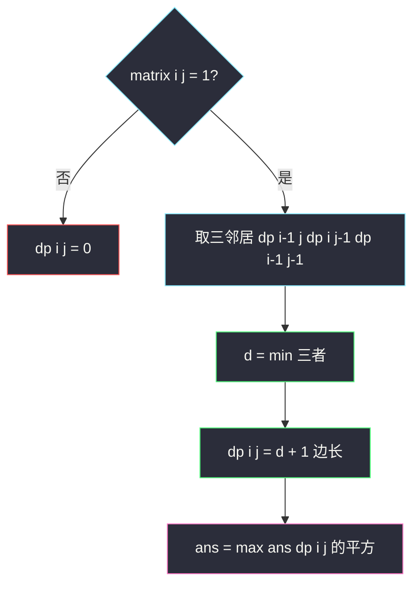
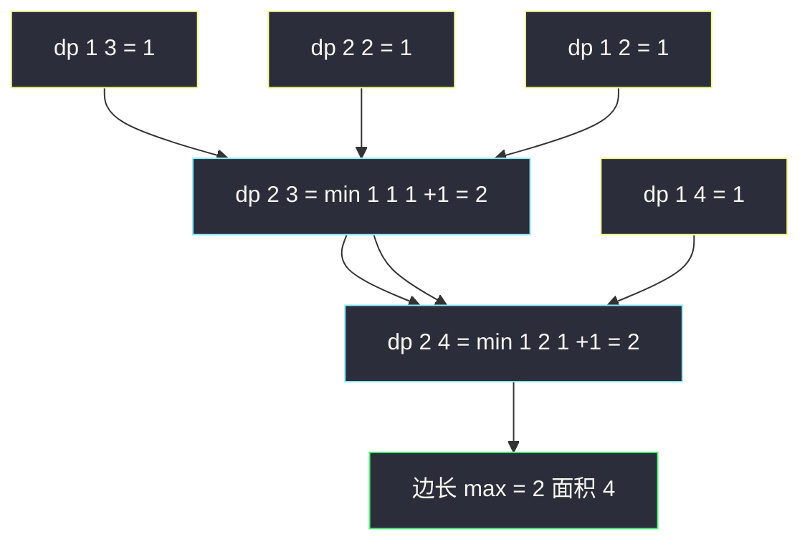

# 最大正方形（dp[i][j] = min(三个邻居) + 1）

## 一、问题描述

在一个由 `'0'` 和 `'1'` 组成的二维矩阵内，找到只包含 `'1'` 的**最大正方形**，并返回其面积。

> 🔗 LeetCode 221：https://leetcode.cn/problems/maximal-square/

**示例 1**

```
输入：matrix = [["1","0","1","0","0"],
               ["1","0","1","1","1"],
               ["1","1","1","1","1"],
               ["1","0","0","1","0"]]
输出：4
解释：最大正方形边长为 2，面积 4（在右中部）
```

**示例 2**

```
输入：matrix = [["0","1"],["1","0"]]
输出：1
```

**直观理解**

前面的网格 DP（[#62](./unique-paths.md)/[#64](./minimum-path-sum.md)/[#931](./minimum-falling-path-sum.md)）dp 的含义都是「**路径**走到这格怎样」；本题换了一种问法——**以这格为右下角**，最多能撑起多大的全 1 正方形？

```
dp[i][j] = 以(i,j)为右下角的全1正方形最大边长
matrix[i][j] = 0 → dp[i][j] = 0
matrix[i][j] = 1 → dp[i][j] = min(左, 上, 左上) + 1
```

`min` 里的三个邻居像三根**木桶板**：任何一根短了，正方形就只能是它限制的大小——这就是经典的「木桶效应」转移。

> 📚 课源码定位：左程云课没有本题原题，按 `class067/Code01` 网格 DP 骨架对齐（可变参数 `i, j` → 二维表 + 空间压缩）。同家族参考：`class048/Code02_LargestOneBorderedSquare.java`（边框为 1 的最大正方形，用「左侧连续 1 + 上方连续 1」两维事实表判断边框），是「正方形 DP 家族」的姊妹题。

---

## 二、暴力解法（入门）

### 直观思路

枚举**每个格子作为左上角**，再枚举边长 `k`，检查 `k x k` 区域是否全 1：

```java
// 最大正方形：暴力枚举左上角 + 边长 + 全 1 检查
// 时间复杂度 O(n * m * min(n,m)^3)，n=300 时必然超时
public static int maximalSquare1(char[][] matrix) {
    int n = matrix.length;
    int m = matrix[0].length;
    int ans = 0;
    for (int i = 0; i < n; i++) {
        for (int j = 0; j < m; j++) {          // 枚举左上角
            if (matrix[i][j] == '0') {
                continue;
            }
            int k = i + 1, limit = Math.min(n - i, m - j);
            while (k <= i + limit) {           // 枚举边长（先验证旧边长，再尝试扩 1）
                if (!allOne(matrix, i, j, k)) {
                    break;
                }
                ans = Math.max(ans, k * k);
                k++;
            }
        }
    }
    return ans;
}

// 检查以(i,j)为左上角、边长k的区域是否全1
public static boolean allOne(char[][] matrix, int i, int j, int k) {
    for (int a = i; a < i + k; a++) {
        for (int b = j; b < j + k; b++) {
            if (matrix[a][b] == '0') {
                return false;
            }
        }
    }
    return true;
}
```

### 复杂度

- **时间**：`O(n x m x min(n,m)^3)`（左上角 x 边长 x 检查面积）
- **空间**：`O(1)`

### 🔴 瓶颈在哪里

同一个「右下角区域是否全 1」的信息被反复检查：边长 `k` 检查过的格子，边长 `k+1` 又几乎全部重查。**子结构信息没有传递**——如果「以 `(i,j)` 为右下角能撑边长 `d`」能一步推出「以 `(i+1,j+1)` 能撑多少」，就省掉所有重复检查。

---

## 三、优化探索（核心章节）

### 3.1 dp 定义换视角：从「左上角」换成「右下角」

暴力枚举左上角 + 扩边长，检查的是**整个区域**；把视角换到**右下角**，三个邻居恰好是三个方向的「前置事实」：

- `dp[i-1][j]`（上）：正上方能撑起多大的正方形
- `dp[i][j-1]`（左）：左边能撑多大
- `dp[i-1][j-1]`（左上）：斜对角能撑多大

**为什么是 min + 1？** 设三者最小值为 `d`。以 `(i,j)` 为右下角要撑起边长 `k` 的正方形，需要：

1. 上方连续 1 至少 `k-1` 行——由 `dp[i-1][j] ≥ k-1` 保证（它自身还含 `k-1` 列宽度）；
2. 左边连续 1 至少 `k-1` 列——由 `dp[i][j-1] ≥ k-1` 保证；
3. 左上角 `k-1` 的区域也全 1——由 `dp[i-1][j-1] ≥ k-1` 保证（它覆盖去掉最右列、最下行后的 `k-1` 方块）。

三者同时成立的最大 `k` 就是 `min(三个邻居) + 1`；任何一个邻居不达标（板短了），正方形就被它限死——**木桶效应**。



### 3.2 初始化与填表顺序

```
dp[0][j] = matrix[0][j]（首行：自身是1则边长1）
dp[i][0] = matrix[i][0]（首列同理）
i 从上到下、j 从左到右（依赖上、左、左上三个更小下标）
答案 = max(dp[i][j]) 的平方（边长最大值，不一定是右下角！）
```

注意与路径题的差别：路径题答案固定在终点格，本题答案要**扫全表取 max**——最大正方形可能出现在任何位置。

### 3.3 关键推导问题

| 问题 | 答案 |
|------|------|
| 为什么 min 而不是 max？ | 三邻居是**必要条件**而非机会：任何一方向撑不住，正方形就不成立；取 min 才是三者同时满足 |
| 左上邻居为什么不可省？ | 反例：第一行一排 1、第一列一排 1，但 `(1,1)` 是 0 时，只看上/左会高估 |
| `matrix[i][j]=0` 为什么直接 0？ | 右下角是 0 的正方形不存在，连边长 1 都没有 |
| 答案为什么不在右下角？ | dp 含义是「以该格为右下角」，最大正方形的位置未知，须全表取 max |
| 压缩时左上角怎么拿？ | 与 #931 同款：`pre` 变量暂存「上一行左上」的旧值 |

### 3.4 一句话核心

> **右下角视角 + 木桶效应：dp[i][j] = min(左, 上, 左上) + 1，全表取边长最大值再平方。**

---

## 四、代码实现详解

### Java（主解：二维填表）

```java
// 最大正方形
// 在一个由 '0' 和 '1' 组成的二维矩阵内
// 找到只包含 '1' 的最大正方形，并返回其面积
// 测试链接 : https://leetcode.cn/problems/maximal-square/
// 对齐 class067/Code01 网格 DP 骨架；正方形家族参考 class048/Code02
public class Solution {

    // 时间复杂度 O(n * m)，空间复杂度 O(n * m)
    public static int maximalSquare(char[][] matrix) {
        int n = matrix.length;
        int m = matrix[0].length;
        // dp[i][j] : 以(i,j)为右下角的全1正方形最大边长
        // 转移 : matrix=0 → 0；matrix=1 → min(上, 左, 左上) + 1
        // 依赖方向 : 上、左、左上 → 从上到下、从左到右填表
        int[][] dp = new int[n][m];
        int side = 0;
        for (int i = 0; i < n; i++) {
            for (int j = 0; j < m; j++) {
                if (matrix[i][j] == '1') {
                    if (i == 0 || j == 0) {
                        dp[i][j] = 1; // 首行首列：只能撑边长 1
                    } else {
                        dp[i][j] = Math.min(dp[i - 1][j],
                                  Math.min(dp[i][j - 1], dp[i - 1][j - 1])) + 1;
                    }
                    side = Math.max(side, dp[i][j]); // 全表取边长最大
                }
            }
        }
        return side * side;
    }
}
```

### Java（进阶：空间压缩，pre 暂存左上）

```java
public class Solution {

    // 一行数组滚动：dp[j] 旧值 = 上方；dp[j-1] 新值 = 左；pre = 左上旧值
    // 时间 O(n * m)，空间 O(m)
    public static int maximalSquare2(char[][] matrix) {
        int n = matrix.length;
        int m = matrix[0].length;
        int[] dp = new int[m];
        int side = 0;
        for (int i = 0; i < n; i++) {
            int pre = 0; // 上一行 (i-1, j-1) 的旧值；i=0 时左上不存在，取 0
            for (int j = 0; j < m; j++) {
                int tmp = dp[j]; // 先留旧值：本轮结束后当下一轮的 pre
                if (matrix[i][j] == '1') {
                    if (i == 0 || j == 0) {
                        dp[j] = 1;
                    } else {
                        dp[j] = Math.min(dp[j], Math.min(dp[j - 1], pre)) + 1;
                        //       上(旧)      左(新)          左上
                    }
                    side = Math.max(side, dp[j]);
                } else {
                    dp[j] = 0;
                }
                pre = tmp;
            }
        }
        return side * side;
    }
}
```

### Python（同思路）

```python
# 最大正方形：二维填表，O(n*m) / O(n*m)
class Solution:
    def maximalSquare(self, matrix: List[List[str]]) -> int:
        n, m = len(matrix), len(matrix[0])
        # dp[i][j]：以(i,j)为右下角的全1正方形最大边长 = min(上,左,左上)+1
        dp = [[0] * m for _ in range(n)]
        side = 0
        for i in range(n):
            for j in range(m):
                if matrix[i][j] == '1':
                    if i == 0 or j == 0:
                        dp[i][j] = 1
                    else:
                        dp[i][j] = min(dp[i-1][j], dp[i][j-1], dp[i-1][j-1]) + 1
                    side = max(side, dp[i][j])
        return side * side
```

```python
# 空间压缩：一行数组 + pre 暂存左上，O(n*m) / O(m)
class Solution:
    def maximalSquare(self, matrix: List[List[str]]) -> int:
        m = len(matrix[0])
        dp = [0] * m
        side = 0
        for row in matrix:
            pre = 0
            for j, ch in enumerate(row):
                tmp = dp[j]
                if ch == '1':
                    dp[j] = 1 if j == 0 else min(dp[j], dp[j-1], pre) + 1
                    side = max(side, dp[j])
                else:
                    dp[j] = 0
                pre = tmp
        return side * side
```

---

## 五、具体例子演示

以示例 1 的 `4 x 5` 矩阵为例（`1` 记为数字），端到端跟踪填表：

```
matrix = 1  0  1  0  0
         1  0  1  1  1
         1  1  1  1  1
         1  0  0  1  0
```

### 第 1 步：首行首列（自身是 1 则边长 1）

| dp | j=0 | j=1 | j=2 | j=3 | j=4 |
|----|-----|-----|-----|-----|-----|
| i=0 | 1 | 0 | 1 | 0 | 0 |
| i=1 | 1 | ? | ? | ? | ? |
| i=2 | 1 | ? | ? | ? | ? |
| i=3 | 1 | ? | ? | ? | ? |

### 第 2 步：逐格填充（只列非零格的转移）

| 格子 | 上 | 左 | 左上 | min | dp 值 | 说明 |
|------|----|----|------|-----|-------|------|
| (1,2) | 1 | 0 | 0 | 0 | **1** | 左是 0（矩阵(1,1)=0），被限死 |
| (1,3) | 0 | 1 | 1 | 0 | **1** | 上方 (0,3)=0 限制 |
| (1,4) | 0 | 1 | 1 | 0 | **1** | 同上 |
| (2,1) | 0 | 1 | 1 | 0 | **1** | 上方 (1,1)=0 |
| (2,2) | 1 | 1 | 0 | 0 | **1** | 左上 (1,1)=0，斜角板短 |
| (2,3) | 1 | 1 | 1 | 1 | **2** | 三板齐 → 2x2 正方形 |
| (2,4) | 1 | 2 | 1 | 1 | **2** | 木桶短板 = 左上(1,3) |
| (3,3) | 2 | 0 | 0 | 0 | **1** | 左边 (3,2)=0 塌了 |

| dp | j=0 | j=1 | j=2 | j=3 | j=4 |
|----|-----|-----|-----|-----|-----|
| i=1 | 1 | 0 | 1 | 1 | 1 |
| i=2 | 1 | 1 | 1 | **2** | **2** |
| i=3 | 1 | 0 | 0 | 1 | 0 |

### 第 3 步：全表取边长 max

`side = 2`（出现在 `(2,3)` 与 `(2,4)`），面积 `2 x 2 = 4`，与示例一致。



`(2,4)` 处最能看懂木桶效应：左边 `dp=2` 很长，但上方与左上都只有 1，短板是 1 → 边长只能 2。

---

## 六、复杂度分析

| 版本 | 时间 | 空间 | 说明 |
|------|------|------|------|
| 暴力枚举 | `O(n x m x min(n,m)^3)` | `O(1)` | 重复检查区域，n=m=300 必超时 |
| 前缀和优化暴力 | `O(n x m x min(n,m))` | `O(n x m)` | 区域和判断 O(1)，仍不够快 |
| 二维填表（主解） | `O(n x m)` | `O(n x m)` | 每格 O(1) 木桶转移 |
| 一行数组滚动 | `O(n x m)` | `O(m)` | pre 暂存左上旧值 |

---

## 七、方法对比与总结

### 「区域统计」型网格 DP 的共性

```
路径题    : dp 是"到这格的最优/计数"，答案在特定终点
正方形题  : dp 是"以这格为角的区域指标"，答案扫全表取 max
本质不变  : 依赖更小下标的邻居，从上到下、从左到右填
```

### 易错点

1. **min 写成 max**：三邻居是约束（必要条件），取 min 才对；取 max 是「机会最大」的错觉。
2. **答案取 `dp[n-1][m-1]`**：最大正方形位置未知，必须**全表取 max**。
3. **返回边长忘了平方**：dp 存的是边长，面积要 `side * side`。
4. **首行首列漏初始化**：`i==0 || j==0` 且值为 1 时边长恰为 1，不能进 min 转移。
5. **压缩版 pre 时机错**：先 `tmp = dp[j]` 存旧值、转移后再 `pre = tmp`；顺序反了会把本行值当左上。

### 模板口诀

> **右下角视角，木板三块取最短 +1；全表扫 max 拿边长，平方才是面积。**

---

## 八、举一反三

| 题目 | 链接 | 迁移点 |
|------|------|--------|
| 85. 最大矩形 | https://leetcode.cn/problems/maximal-rectangle/ | 正方形改**矩形**：min+1 失效，改用「每列连续 1 高度 + 直方图最大矩形」（本站已收录题解） |
| 1277. 统计全为 1 的正方形子矩阵 | https://leetcode.cn/problems/count-square-submatrices-with-all-ones/ | 同一张 dp 表，答案改 `sum(dp)`（边长 d 的正方形恰有 d 个以该格为右下角） |
| 1139. 最大的以 1 为边界的正方形 | https://leetcode.cn/problems/largest-1-bordered-square/ | 「全 1」改「边框 1」，课上 `class048/Code02` 用连续 1 事实表判断边框 |
| 931. 下降路径最小和 | https://leetcode.cn/problems/minimum-falling-path-sum/ | 同样三邻居依赖（上/左上/右上），压缩同款 pre 技巧 |
| 64. 最小路径和 | https://leetcode.cn/problems/minimum-path-sum/ | 网格 DP 基础骨架 |

**迁移一句**：`min(三邻居) + 1` 是「**正方形/正立方体撑边长**」类问题的通用转移——只要 dp 含义是「以该格为角的合法图形最大边长」，且合法性能被三个方向的更小事实约束，这个木桶公式就成立（同表求和即可秒 #1277；高维立方体同理可推）。
