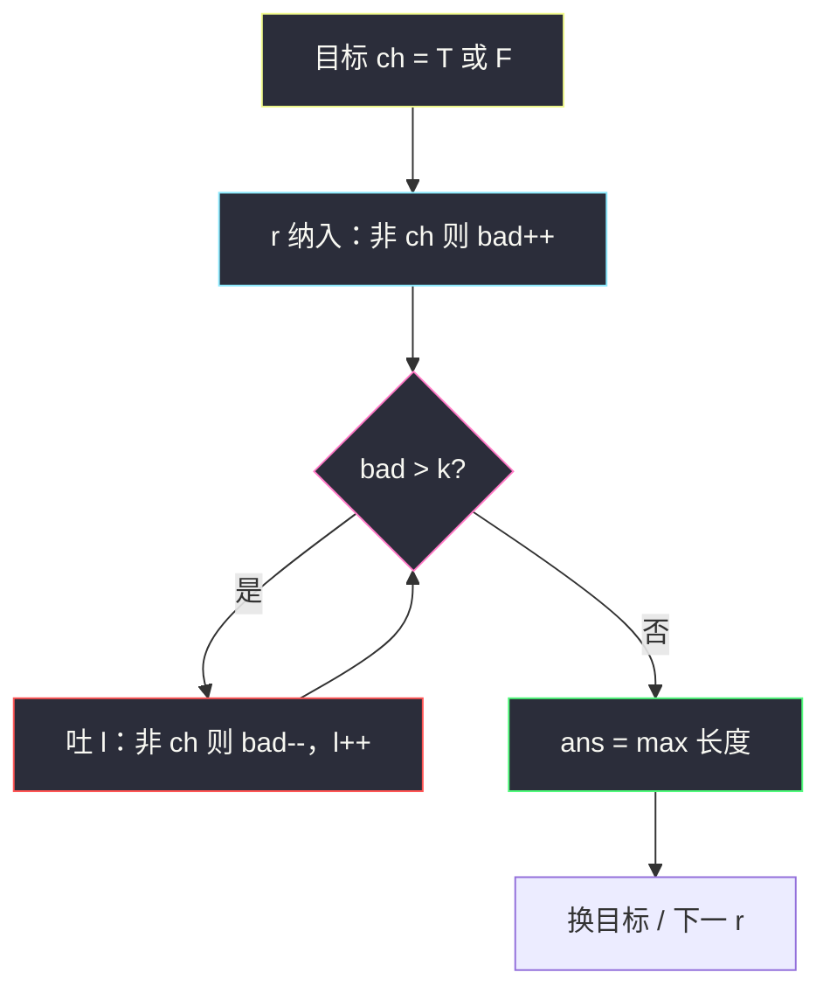
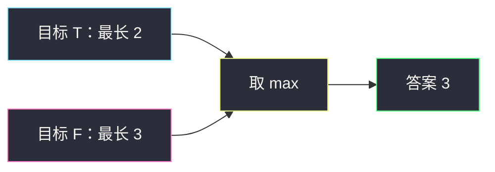

# 考试的最大困扰度（翻转窗口 · 同 424 / 1004）

## 一、问题描述

一位老师给了学生一份由 `'T'`（True）和 `'F'`（False）组成的答案串 `answerKey`，以及一个整数 `k`。

你可以**至多改 `k` 次**答案（`'T'↔'F'`）。  
改完后，「最大连续相同答案」的长度，就是这场考试的**最大困扰度**。请返回这个最大可能长度。

> 🔗 LeetCode 2024：https://leetcode.cn/problems/maximize-the-confusion-of-an-exam/

**示例 1**

```
输入：answerKey = "TTFF", k = 2
输出：4
解释：把两个 'F' 都改成 'T'，得到 "TTTT"，长度 4。
```

**示例 2**

```
输入：answerKey = "TFFT", k = 1
输出：3
解释：把第一个 'T' 改成 'F' → "FFFT" 里有 "FFF"；
或把最后一个 'T' 改成 'F' → "TFFF"。最长都是 3。
```

**示例 3**

```
输入：answerKey = "TTFTTFTT", k = 1
输出：5
解释：把下标 4 的 'F' 改成 'T' → 一段连续 5 个 'T'。
```

**直观理解（你写过的题）**

这就是站内已经写过的同一模板：

| 题 | 窗口想变成 | 至多改 / 翻 |
|----|------------|-------------|
| [1004. 最大连续 1 的个数 III](https://leetcode.cn/problems/max-consecutive-ones-iii/) | 全是 `1` | 翻 ≤ k 个 `0` |
| [424. 替换后的最长重复字符](https://leetcode.cn/problems/longest-repeating-character-replacement/) | 全是某一种字母 | 改 ≤ k 个「非众数」 |
| **本题 2024** | 全是 `'T'` **或** 全是 `'F'` | 翻 ≤ k 次 |

答案只有两种字母，所以可以：

1. **跑两遍 1004**：一遍「最多翻 k 个非 T」；一遍「最多翻 k 个非 F」；取较大；
2. **直接套 424**：字符集只有 2，窗口内「长度 − 众数次数 ≤ k」。

两种写法本质相同。

---

## 二、暴力解法（入门）

### 直观思路

枚举每个子串，统计 `'T'` / `'F'` 个数。要变成全相同，至少改 `min(T数, F数)` 次；若 ≤ k，用长度更新答案。

```java
public static int maxConsecutiveAnswers(String answerKey, int k) {
    char[] s = answerKey.toCharArray();
    int n = s.length, ans = 0;
    for (int l = 0; l < n; l++) {
        int t = 0, f = 0;
        for (int r = l; r < n; r++) {
            if (s[r] == 'T') t++;
            else f++;
            if (Math.min(t, f) <= k) {
                ans = Math.max(ans, r - l + 1);
            }
        }
    }
    return ans;
}
```

### 复杂度

- **时间**：`O(n²)`
- **空间**：`O(1)`

### 🔴 瓶颈在哪里

每个左端都重扫。右扩时合法左端只会右移 → 变长滑动窗口。

---

## 三、优化探索（核心章节）

### 3.1 观察特征

| 特征 | 说明 |
|------|------|
| 连续子串 | 滑动窗口 |
| 两种目标 | 全 T 或全 F，取更长 |
| 约束 | 窗口内「少数派」个数 ≤ k |
| 与旧题 | 1004 的二值版 + 目标可选两端 |

### 3.2 写法 A：对目标各跑一遍（最像 1004）

固定目标字符 `ch`（先 `'T'` 再 `'F'`）：窗口内非 `ch` 的个数就是要翻的次数，`> k` 就吐左。

```
ans = max(
  最长窗：坏字符 = 非 'T'，坏 ≤ k,
  最长窗：坏字符 = 非 'F'，坏 ≤ k
)
```



### 3.3 写法 B：直接套 424（众数）

窗口内保留出现更多的那种答案，少数派全部翻掉：

```
需要翻转次数 = (r - l + 1) - max(cntT, cntF)
while 次数 > k: 吐左
```

一遍扫完，不必分两次目标。

### 3.4 关键推导问题

| 问题 | 答案 |
|------|------|
| 为何要考虑两种目标？ | 最优可能是刷成全 T，也可能全 F；只做一边会漏 |
| 写法 A / B 哪个对？ | 都对；A 更好对照 1004，B 更好对照 424 |
| 何时吐左？ | 「坏字符数」或「长度−众数」超过 k |
| 和 1004 唯一差别？ | 1004 目标钉死是 1；这里要对 T、F 各算一遍（或用众数自动选） |

### 3.5 一句话核心

> **找最长窗口，使其中较少的那种答案个数 ≤ k（把它们翻成另一种）；T/F 两边取 max，或直接用「长度 − 众数 ≤ k」。**

---

## 四、代码实现详解

### Java（写法 A · 对照 1004，推荐先掌握）

```java
// 考试的最大困扰度
// 测试链接 : https://leetcode.cn/problems/maximize-the-confusion-of-an-exam/
public class Solution {

    public static int maxConsecutiveAnswers(String answerKey, int k) {
        char[] s = answerKey.toCharArray();
        return Math.max(maxConsecutive(s, k, 'T'), maxConsecutive(s, k, 'F'));
    }

    // 最多把 k 个「非 ch」翻成 ch，求最长连续 ch
    private static int maxConsecutive(char[] s, int k, char ch) {
        int ans = 0, bad = 0;
        for (int l = 0, r = 0; r < s.length; r++) {
            if (s[r] != ch) {
                bad++;
            }
            while (bad > k) {
                if (s[l++] != ch) {
                    bad--;
                }
            }
            ans = Math.max(ans, r - l + 1);
        }
        return ans;
    }
}
```

### Java（写法 B · 对照 424）

```java
public static int maxConsecutiveAnswers(String answerKey, int k) {
    char[] s = answerKey.toCharArray();
    int[] cnts = new int[2]; // 0→'F'，1→'T'（随便映射）
    int maxCnt = 0, ans = 0;
    for (int l = 0, r = 0; r < s.length; r++) {
        int idx = s[r] == 'T' ? 1 : 0;
        cnts[idx]++;
        maxCnt = Math.max(maxCnt, cnts[idx]);
        while (r - l + 1 - maxCnt > k) {
            int li = s[l++] == 'T' ? 1 : 0;
            cnts[li]--;
            // maxCnt 可不回减（同 424）；要严格可重算 max(cnts[0], cnts[1])
        }
        ans = Math.max(ans, r - l + 1);
    }
    return ans;
}
```

### Python（写法 A）

```python
# 考试的最大困扰度
# 测试链接 : https://leetcode.cn/problems/maximize-the-confusion-of-an-exam/
class Solution:
    def maxConsecutiveAnswers(self, answerKey: str, k: int) -> int:
        def max_consecutive(ch: str) -> int:
            ans = bad = l = 0
            for r, c in enumerate(answerKey):
                if c != ch:
                    bad += 1
                while bad > k:
                    if answerKey[l] != ch:
                        bad -= 1
                    l += 1
                ans = max(ans, r - l + 1)
            return ans

        return max(max_consecutive('T'), max_consecutive('F'))
```

---

## 五、例子演示

`answerKey = "TFFT"`，`k = 1`

**目标全 T（翻非 T）：**

| r | 窗口 | bad(F) | 动作 | 长度 |
|---|------|--------|------|------|
| 0 | T | 0 | | 1 |
| 1 | TF | 1 | | 2 |
| 2 | TFF | 2 | `bad>1`，吐 T → FF，再吐 F → F | 1 |
| 3 | FT | 1 | | 2 |

目标 T 最长 2。

**目标全 F：**

| r | 窗口 | bad(T) | 动作 | 长度 |
|---|------|--------|------|------|
| 0 | T | 1 | | 1 |
| 1 | TF | 1 | | 2 |
| 2 | TFF | 1 | | **3** |
| 3 | TFFT | 2 | 吐 T → FFT，bad=1 | 3 |

目标 F 最长 3 → 答案 **3**。



---

## 六、复杂度分析

| 项目 | 写法 A | 写法 B |
|------|--------|--------|
| 时间 | `O(n)`（两遍各 O(n)） | `O(n)` |
| 额外空间 | `O(1)` | `O(1)` |

---

## 七、对比总结

### 你忘的那几道，对照记

| | 1004 | 424 | **2024** |
|--|------|-----|----------|
| 字母表 | `{0,1}` | `{A..Z}` | `{T,F}` |
| 目标 | 固定 `1` | 窗口众数 | T 或 F（或众数） |
| 坏字符 | `0` | 非众数 | 非目标 / 少数派 |
| 收缩 | `zero > k` | `len - maxCnt > k` | 同左 |

### 易错点

1. **只跑一遍目标** → 漏掉刷成另一种答案的更优解。
2. **把「困扰度」理解成整串翻转次数** → 题目要的是翻转后**最长连续相同**的长度。
3. **吐窗时忘了减 bad** → 与 1004 同样坑。

### 模板口诀

> **最多翻 k 个异类；T、F 各滑一遍，取更长（或直接长度减众数）。**

---

## 八、举一反三

| 题目 | 链接 | 关系 |
|------|------|------|
| 1004. 最大连续 1 的个数 III | https://leetcode.cn/problems/max-consecutive-ones-iii/ | 本题目标固定时的特化 |
| 424. 替换后的最长重复字符 | https://leetcode.cn/problems/longest-repeating-character-replacement/ | 字母更多时的一般化 |
| 487. 最大连续 1 的个数 II | https://leetcode.cn/problems/max-consecutive-ones-ii/ | k = 1 的 1004 |
| 1493. 删掉一个元素以后全为 1 的最长子数组 | https://leetcode.cn/problems/longest-subarray-of-1s-after-deleting-one-element/ | 「必须删 1 个 0」的变体 |

**迁移一句**：见到「最多改 / 翻 k 次，让某一段全变成同一种」，先想变长窗口里的**坏字符计数**。
