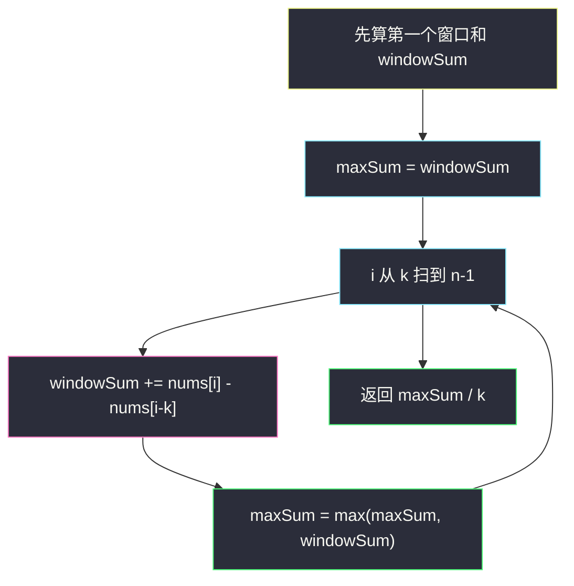
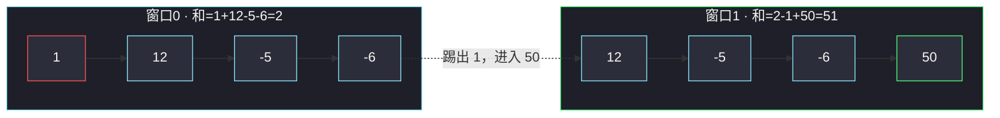
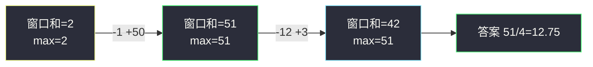

# 子数组最大平均数 I（定长滑动窗口入门）

## 一、问题描述

给你一个由 `n` 个整数组成的数组 `nums`，以及一个整数 `k`。  
请你找出长度恰好等于 `k` 的连续子数组，使其**平均数最大**，并返回该最大平均数。

> 答案的误差在 `10⁻⁵` 以内都算正确。

> 🔗 LeetCode 643：https://leetcode.cn/problems/maximum-average-subarray-i/

**示例 1（简单）**

```
输入：nums = [1,12,-5,-6,50,3], k = 4
输出：12.75
解释：子数组 [12,-5,-6,50] 的和是 51，平均数 51/4 = 12.75，是所有长度为 4 的子数组中最大的。
```

**示例 2（边界）**

```
输入：nums = [5], k = 1
输出：5.0
解释：只有一个长度为 1 的子数组，就是它自己。
```

**直观理解**

长度固定为 `k` → 不是「变长窗口」，而是**定长窗口**：窗口像传送带一样，每次右端进一个、左端出一个，整段始终保持长度 `k`。

---

## 二、暴力解法（入门）

### 直观思路

枚举每一个长度为 `k` 的子数组起点 `i`（`i` 从 `0` 到 `n-k`），对区间 `[i, i+k-1]` 求和，再除以 `k`，取最大值。

```java
public double findMaxAverage(int[] nums, int k) {
    int n = nums.length;
    double ans = Double.NEGATIVE_INFINITY;
    for (int i = 0; i <= n - k; i++) {
        int sum = 0;
        for (int j = i; j < i + k; j++) {
            sum += nums[j];
        }
        ans = Math.max(ans, (double) sum / k);
    }
    return ans;
}
```

### 复杂度

- **时间**：`O(n·k)`。每个窗口都重新加一遍 `k` 个数。
- **空间**：`O(1)`。

### 🔴 瓶颈在哪里

相邻两个长度为 `k` 的窗口，其实只差**一头一尾**：

```
窗口 i  :  [a, b, c, d]
窗口 i+1:     [b, c, d, e]
```

后者 = 前者 − `a` + `e`。暴力却每次重新加 `b+c+d+e`，把中间 `k-2` 个重复加了无数遍。  
`n` 到 `10⁵`、`k` 也很大时就会超时——必须**复用上一次的窗口和**。

---

## 三、优化探索（核心章节）

### 3.1 观察特征

| 特征 | 说明 |
|------|------|
| 连续子数组 | 适合滑动窗口 |
| **长度固定为 k** | 定长窗口，不用「扩到不合法再缩」那套变长模板 |
| 比的是平均数 | `avg = sum / k`，`k` 恒定 → **比 sum 就等于比 avg**，可先找最大和，最后再除一次 |

### 3.2 暴力 → 优化：定长窗口「滑」一下

1. **初始化**：先算出第一个窗口 `[0, k-1]` 的和 `windowSum`，记为 `maxSum`。
2. **滑动**：`i` 从 `k` 扫到 `n-1`：
   - 右边进入 `nums[i]`
   - 左边踢出 `nums[i - k]`
   - `windowSum += nums[i] - nums[i - k]`
   - `maxSum = max(maxSum, windowSum)`
3. **返回**：`maxSum / k`（转成 `double`）



窗口滑动示意（`k = 4`）：



### 3.3 关键问题（定长窗口）

- **何时移动？** 每一步都同时移动左右边界：右进一、左出一，长度始终 `k`。
- **维护什么？** 只要维护当前窗口和（或其它可 O(1) 增减的统计量）。
- **为何不用除法进循环？** `k` 不变，`sum` 最大 ⇒ `sum/k` 最大；循环里只比整数和，最后除一次即可，还避开浮点比较的麻烦。

### 3.4 一句话核心

> **定长滑动窗口：先算第一个窗口，之后每次「+进 −出」，O(1) 得到下一个窗口，全程 O(n)。**

---

## 四、代码实现详解

### Java（逐行说明）

```java
class Solution {
    public double findMaxAverage(int[] nums, int k) {
        // 1) 第一个窗口 [0 .. k-1] 的和
        int windowSum = 0;
        for (int i = 0; i < k; i++) {
            windowSum += nums[i];
        }
        int maxSum = windowSum; // 目前最优就是第一个窗口

        // 2) 窗口右端从 k 滑到 n-1
        //    循环不变式：进入本轮前，windowSum = 区间 [i-k, i-1] 的和
        for (int i = k; i < nums.length; i++) {
            // 右端进入 nums[i]，左端踢出 nums[i-k]
            windowSum += nums[i] - nums[i - k];
            // 现在 windowSum = 区间 [i-k+1, i] 的和
            if (windowSum > maxSum) {
                maxSum = windowSum;
            }
        }

        // 3) 最大和 / k → 最大平均
        return (double) maxSum / k;
    }
}
```

**变量含义**

| 变量 | 含义 |
|------|------|
| `windowSum` | 当前长度为 `k` 的窗口元素之和 |
| `maxSum` | 历史见过的最大窗口和 |
| `i` | 当前窗口的**右端下标**（滑动阶段） |
| `i - k` | 刚好被踢出窗口的那个下标 |

**循环不变式（滑动阶段）**  
进入第 `i` 轮循环之前：`windowSum` 等于子数组 `nums[i-k .. i-1]` 的和。  
本轮加 `nums[i]`、减 `nums[i-k]` 之后：等于 `nums[i-k+1 .. i]` 的和。

### Python（同结构）

```python
class Solution:
    def findMaxAverage(self, nums: list[int], k: int) -> float:
        # 第一个窗口
        window_sum = sum(nums[:k])
        max_sum = window_sum

        # 定长滑窗：右进左出
        for i in range(k, len(nums)):
            window_sum += nums[i] - nums[i - k]
            if window_sum > max_sum:
                max_sum = window_sum

        return max_sum / k
```

---

## 五、具体例子演示

以 `nums = [1, 12, -5, -6, 50, 3]`，`k = 4` 逐步跟踪。

### 步骤 0：初始窗口

```
下标:  0   1   2   3   4   5
值:    1  12  -5  -6  50   3
窗口: [========]
```

- `windowSum = 1+12+(-5)+(-6) = 2`
- `maxSum = 2`

### 步骤 1：`i = 4`，进入 50，踢出 1

```
值:    1  12  -5  -6  50   3
窗口:     [========]
```

- `windowSum = 2 - 1 + 50 = 51`
- `maxSum = max(2, 51) = 51` ← 更新

### 步骤 2：`i = 5`，进入 3，踢出 12

```
值:    1  12  -5  -6  50   3
窗口:         [========]
```

- `windowSum = 51 - 12 + 3 = 42`
- `maxSum = max(51, 42) = 51` ← 不变

### 结束

```
最大和 maxSum = 51
最大平均 = 51 / 4 = 12.75
```

对应子数组正是 `[12, -5, -6, 50]`。



**再看一个极简例**：`nums = [5], k = 1`  
只有初始窗口，`windowSum = 5`，滑动循环一次都不进，直接返回 `5.0`。

---

## 六、复杂度分析

| 方法 | 时间 | 空间 | 说明 |
|------|------|------|------|
| 暴力枚举 | `O(n·k)` | `O(1)` | 每个窗口重算一遍和 |
| 定长滑窗 | `O(n)` | `O(1)` | 每个元素最多进窗一次、出窗一次 |

`n ≤ 10⁵` 时，定长滑窗稳过；暴力在 `k` 很大时会 TLE。

---

## 七、方法对比与总结

| | 暴力 | 定长滑窗 |
|--|------|----------|
| 想法 | 每个起点重新求和 | 相邻窗口差分更新 |
| 关键操作 | 双层循环 | `+ nums[i] - nums[i-k]` |
| 适用 | 理解题意 | **定长最值 / 定长统计** 的默认写法 |

**模板（Java）**

```java
// 定长窗口求「窗口和」相关最值
int sum = 0;
for (int i = 0; i < k; i++) sum += nums[i];
int best = sum;
for (int i = k; i < nums.length; i++) {
    sum += nums[i] - nums[i - k];
    best = Math.max(best, sum); // 或其它统计
}
```

**模板（Python）**

```python
s = sum(nums[:k])
best = s
for i in range(k, len(nums)):
    s += nums[i] - nums[i - k]
    best = max(best, s)
```

**易错点**

1. 滑动时踢出的下标是 `i - k`，不是 `i - k + 1`（想清楚：右端到 `i` 时，窗口是 `[i-k+1, i]`，踢掉的是旧窗口左端 `i-k`）。
2. 返回类型是 `double`：Java 里要写 `(double) maxSum / k`，不要写成整数除法再强转。
3. `maxSum` 初值用第一个窗口和，不要用 `0`——数组可能全是负数。

---

## 八、举一反三

| 题目 | 关系 |
|------|------|
| [1456. 定长子串中元音的最大数目](https://leetcode.cn/problems/maximum-number-of-vowels-in-a-substring-of-given-length/) | 同样定长窗口，维护的是「元音个数」而不是和 |
| [1343. 大小为 K 且平均值大于等于阈值的子数组数目](https://leetcode.cn/problems/number-of-sub-arrays-of-size-and-average-greater-than-or-equal-to-threshold/) | 定长窗口 + 计数，逻辑几乎同构 |
| [209. 长度最小的子数组](https://leetcode.cn/problems/minimum-size-subarray-sum/) | **变长**窗口：和 ≥ target 时收缩，对比定长模板 |
| [1004. 最大连续 1 的个数 III](https://leetcode.cn/problems/max-consecutive-ones-iii/) | 变长窗口 + 约束计数，进阶练习 |

**思想迁移**

- 题面出现「长度为 k 的连续段 / 子数组 / 子串」→ 先想**定长滑窗**。
- 题面出现「最长 / 最短，且满足某某条件」→ 多半是**变长滑窗**。
- 两者共用「左右边界 + 窗口内统计量」骨架；差别只在：定长每步必进出各一，变长按合法性决定是否收缩。
