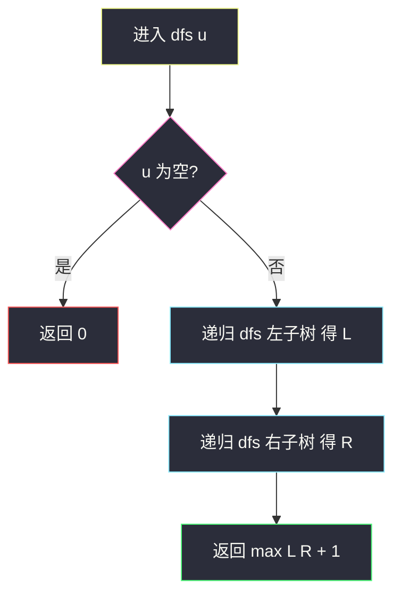
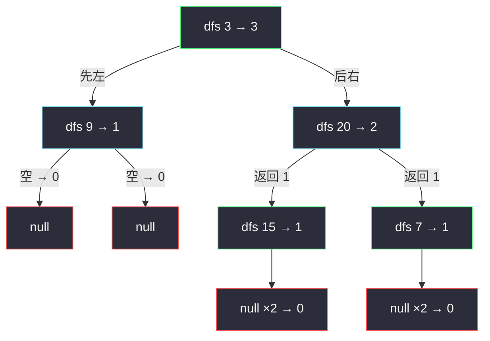

# 二叉树的最大深度（后序递归：max(左, 右) + 1）

## 一、问题描述

给出一棵二叉树的根节点 `root`，返回它的**最大深度**。

二叉树的**最大深度**是指从根节点到**最远叶子节点**的最长路径上的**节点个数**。

> 🔗 LeetCode 104：https://leetcode.cn/problems/maximum-depth-of-binary-tree/

**示例 1**

```
输入：root = [3,9,20,null,null,15,7]
输出：3
树形：
       3
      / \
     9   20
         / \
        15  7
最长路径 3 → 20 → 15（或 3 → 20 → 7），共 3 个节点
```

**示例 2**

```
输入：root = [1,null,2]
输出：2
树形：
    1
     \
      2
```

**直观理解**

「整棵树有多深」可以拆成「两棵子树各自多深，取更深的那边，再加上根自己占的一层」：

```
depth(u) = max(depth(u.left), depth(u.right)) + 1
```

空树深度为 0，叶子节点深度为 1。把每个节点该问的问题问清楚，答案就自己浮上来了——这是**递归分治**在二叉树上最经典的应用。

---

## 二、暴力解法（入门）

### 直观思路

不建立递归模型，最直白的角度是**一层一层往下数**：BFS 层序遍历，队列里放当前层的所有节点，处理完一层 `depth++`，队列空了数出的层数就是最大深度。

```java
public int maxDepth(TreeNode root) {
    if (root == null) {
        return 0;
    }
    Queue<TreeNode> queue = new ArrayDeque<>();
    queue.offer(root);
    int depth = 0;
    while (!queue.isEmpty()) {
        depth++;                       // 开始处理新的一层
        int size = queue.size();       // 当前层节点数，先记下来！
        for (int i = 0; i < size; i++) {
            TreeNode cur = queue.poll();
            if (cur.left != null) {
                queue.offer(cur.left);
            }
            if (cur.right != null) {
                queue.offer(cur.right);
            }
        }
    }
    return depth;
}
```

### 复杂度

- **时间**：`O(n)`，每个节点进出队列各一次
- **空间**：`O(w)`，`w` 为最宽一层的节点数，最坏 `O(n)`

### 🔴 瓶颈在哪里

这版**完全正确**，但代码长、分层逻辑（先记 `size` 再循环）容易写错，而且它只解决了「数层数」这一道题。  
真正值得带走的是**子树深度**的递归模型——「先问左右孩子，再算自己」的后序框架，能直接迁移到直径、平衡、最大路径和等一大批题。递归版 3 行搞定，复杂度反而更好。

---

## 三、优化探索（核心章节）

### 3.1 观察特征

| 特征 | 说明 |
|------|------|
| 子问题结构清晰 | 「以 u 为根的树的深度」= 左子树深度、右子树深度取 max 再 +1 |
| 最简子问题（base case） | 空树深度为 0；叶子节点左空右空，max(0,0)+1 = 1 |
| 必须先拿到左右答案 | 自己的答案**依赖**左右子树的结果 → **后序**（左 → 右 → 根） |
| 结构天然二分 | 大树的问题拆成两棵小树的同一问题，规模严格变小，递归必然终止 |

### 3.2 暴力 → 优化：后序递归一行式

定义递归函数 `dfs(u)`：返回以 `u` 为根的子树深度。

```
dfs(u):
    若 u 为空  → 返回 0
    否则       → 返回 max(dfs(u.left), dfs(u.right)) + 1
```

与课源码 class036 `Code04_DepthOfBinaryTree` 的 `maxDepth` 完全一致（课上就是这一行）。结构题按站点风格选「简洁易懂」版，这里课上写法本身就极简，直接采用。



### 3.3 关键推导问题

| 问题 | 答案 |
|------|------|
| 为什么 +1？ | 路径要**数节点个数**，根自己占一层，所以孩子贡献的层数加 1 |
| 空树为什么返回 0 而不是 -1？ | 数节点语义下，没有节点就是 0 层；且叶子 = max(0,0)+1 = 1，自动正确 |
| 深度和高度是不是一回事？ | 数值相同：深度自上往下数，高度自下往上数；本题按「节点个数」算，两者在本题等价 |
| 为什么必须后序？ | `+1` 之前要先拿到 `max(左, 右)`，而左右答案藏在子树里，只能等子树递归返回 |
| 这已经是最优了吗？ | 是。每个节点至少要看一次，`O(n)` 是下界；递归版一次遍历就出答案 |
| 递归会爆栈吗？ | 树深 `h` 决定栈深；LC 数据 `n ≤ 10⁴`，链状树深 10⁴ 层通常没问题，极端环境可改迭代（Morris 遍历 / 显式栈） |

### 3.4 一句话核心

> **空树 0 层，叶子 1 层；其余节点 = 更深的孩子 + 1——max(左, 右) + 1。**

---

## 四、代码实现详解

### Java（主解：后序递归，课上版）

```java
// 求二叉树的最大深度
// 测试链接 : https://leetcode.cn/problems/maximum-depth-of-binary-tree/
// 对齐 class036 Code04_DepthOfBinaryTree
public class Solution {

    public static int maxDepth(TreeNode root) {
        return root == null ? 0
                : Math.max(maxDepth(root.left), maxDepth(root.right)) + 1;
    }
}
```

一行搞定，但面试时建议能**边写边讲**：「空树返回 0；先递归拿左右子树深度，取 max 加 1 返回」。

### Java（可选视角：前序传深度参数）

不靠返回值，改为「自顶向下」把当前深度 `d` 作为参数传下去，到每个节点更新全局答案。两种视角等价，后序版显然更短。

```java
public class Solution {

    private int ans = 0;

    public int maxDepth(TreeNode root) {
        dfs(root, 1);   // 根所在层深度为 1
        return ans;
    }

    private void dfs(TreeNode node, int d) {
        if (node == null) {
            return;
        }
        ans = Math.max(ans, d);
        dfs(node.left, d + 1);
        dfs(node.right, d + 1);
    }
}
```

BFS 层序版见第二章代码，三种写法复杂度对比见第六章。

### Python（同思路）

```python
# 后序递归：max(左, 右) + 1
class Solution:
    def maxDepth(self, root: Optional[TreeNode]) -> int:
        if root is None:
            return 0
        return max(self.maxDepth(root.left), self.maxDepth(root.right)) + 1
```

```python
# BFS 层序计数（与第二章 Java 版同思路）
class Solution:
    def maxDepth(self, root: Optional[TreeNode]) -> int:
        if root is None:
            return 0
        queue = deque([root])
        depth = 0
        while queue:
            depth += 1
            for _ in range(len(queue)):   # len(queue) 就是当前层节点数
                node = queue.popleft()
                if node.left:
                    queue.append(node.left)
                if node.right:
                    queue.append(node.right)
        return depth
```

---

## 五、具体例子演示

### 例 1：`root = [3,9,20,null,null,15,7]`

调用从根进入，**一路递到底，返回时逐层合成**。下面按时间顺序跟踪递归栈：

| 步骤 | 递归动作 | 栈（底→顶） | 说明 |
|------|----------|------------|------|
| 1 | 调用 `dfs(3)` | 3 | 从根出发 |
| 2 | 调用 `dfs(3.left)` = `dfs(9)` | 3, 9 | 先算左子树 |
| 3 | 调用 `dfs(9.left)` = 空 | 3, 9, 空 | 空返回 0 |
| 4 | 调用 `dfs(9.right)` = 空 | 3, 9, 空 | 空返回 0 |
| 5 | `dfs(9)` 返回 max(0,0)+1 = **1** | 3 | 左子树深度 1 |
| 6 | 调用 `dfs(3.right)` = `dfs(20)` | 3, 20 | 再算右子树 |
| 7 | `dfs(15)` → 空、空 → 返回 **1** | 3, 20, 15 | 叶子 |
| 8 | `dfs(7)` → 空、空 → 返回 **1** | 3, 20, 7 | 叶子 |
| 9 | `dfs(20)` 返回 max(1,1)+1 = **2** | 3 | 右子树深度 2 |
| 10 | `dfs(3)` 返回 max(1,2)+1 = **3** | 空 | 答案 3 |



信息流：0 从 `null` 层层回传，叶子合成 1，`20` 合成 2，根合成 3——**答案自底向上汇聚**。

### 例 2：`root = [1,null,2]`（右链）

| 步骤 | 动作 | 返回 |
|------|------|------|
| 1 | `dfs(1)`：左为空 → 0，再调用右子树 | — |
| 2 | `dfs(2)`：左右都空 → max(0,0)+1 = 1 | 1 |
| 3 | `dfs(1)` 拿到 max(0,1)+1 = 2 | **2** |

### 例 3：空树 `root = []`

`dfs(null)` 直接命中 base case，返回 **0**——这就是空树返回 0 的意义。

---

## 六、复杂度分析

| 项目 | 后序递归（主解） | BFS 层序 |
|------|-----------------|----------|
| 时间 | `O(n)`，每个节点恰好访问一次 | `O(n)`，每个节点入队出队各一次 |
| 空间 | `O(h)` 递归栈，`h` 为树高：平衡树 `O(log n)`，链状树 `O(n)` | `O(w)` 队列，`w` 为最宽一层：平衡树 `O(n)`，链状树 `O(1)` |

有趣的对比：树越「瘦高」递归越吃亏、BFS 越省；树越「矮胖」反过来。总量都不超过 `O(n)`。

---

## 七、方法对比与总结

### 三种写法对比

| | 后序递归 | 前序传参 | BFS 层序 |
|--|---------|---------|----------|
| 代码量 | 1 行核心 | 需要全局/成员变量 `ans` | 最长，要处理分层 |
| 视角 | 自底向上，信息由孩子回传 | 自顶向下，深度作为参数下传 | 按层横向扫 |
| 可迁移性 | 直径 / 平衡 / 树形 DP 的地基 | 路径和、根到叶问题 | 层序遍历系（右视图、Z 字形） |
| 推荐 | ✅ 首选 | 理解视角即可 | 了解即可 |

### 易错点

1. **忘 +1**：写成 `max(maxDepth(left), maxDepth(right))`，答案永远差一层。
2. **空树返回 -1 或 1**：数节点语义下必须返回 0，否则叶子深度算成 2。
3. **把「深度」当边数**：本题数**节点个数**（示例 2 输出 2 而非 1）；换算成边数是答案 -1。
4. **拿它去写最小深度**：`#111` 最小深度**不能**简单把 `max` 换成 `min`——单侧为空时另一侧不算，必须像课上 `minDepth` 那样专门处理「只有一边为空」的分支。
5. **BFS 分层忘记先记 `size`**：边弹边 `queue.size()` 会把下一层也算进来。

### 模板口诀

> **空树 0，叶子 1；先左右、后取大，自己再 +1。**

---

## 八、举一反三

| 题目 | 链接 | 迁移点 |
|------|------|--------|
| 111. 最小深度 | https://leetcode.cn/problems/minimum-depth-of-binary-tree/ | 同一后序框架，但 min 要小心单侧为空（class036 Code04 同文件后半段） |
| 110. 平衡二叉树 | https://leetcode.cn/problems/balanced-binary-tree/ | 后序求深度时顺带比较左右深度差，一次遍历判平衡 |
| 543. 二叉树的直径 | https://leetcode.cn/problems/diameter-of-binary-tree/ | 后序求深度时顺带更新 `L + R`（本站已有题解） |
| 559. N 叉树的最大深度 | https://leetcode.cn/problems/maximum-depth-of-n-ary-tree/ | `max` 从两个孩子扩成所有孩子，框架不变 |

**迁移一句**：二叉树上凡是要「关于整棵树的统计量」，先写出**子树上的子问题定义**，再决定信息从孩子往上传（后序）还是从根往下传（前序传参）——本题就是这条公理最干净的样子。
