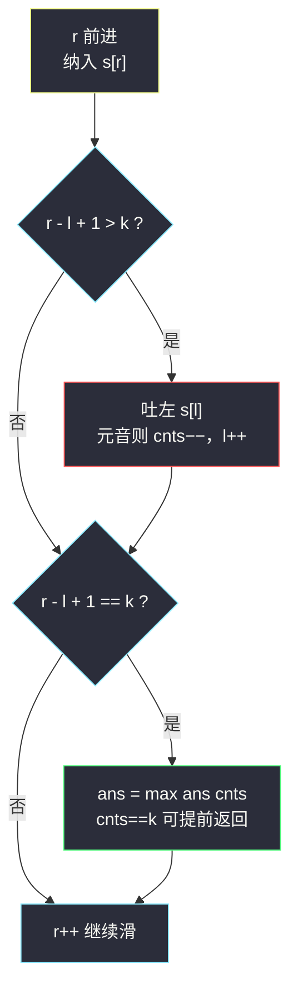
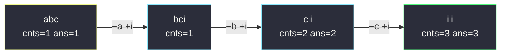

# 定长子串中元音的最大数目（定长滑动窗口计数）

## 一、问题描述

给你字符串 `s` 和整数 `k`，请返回长度为 `k` 的**单个子字符串**中可能包含的**元音的最大数目**。

英文中的元音字母为 `a`、`e`、`i`、`o`、`u`。

> 🔗 LeetCode 1456：https://leetcode.cn/problems/maximum-number-of-vowels-in-a-substring-of-given-length/

**示例 1**

```
输入：s = "abciiidef", k = 3
输出：3
解释：子字符串 "iii" 包含 3 个元音字母
```

**示例 2**

```
输入：s = "aeiou", k = 2
输出：2
解释：任意长度为 2 的子字符串都包含 2 个元音
```

**直观理解**

窗口长度**固定**为 `k`——不是「不合法才收缩」的变长窗口，而是**定长窗口**：像传送带一样，右端进一个字符、左端出一个字符，窗口始终恰好盖住 `k` 个字符。  
要统计的只有一件事：**窗口里有多少个元音**。一个字符是不是元音，与它左右邻居无关，所以「进窗 +1、出窗 −1」就能 O(1) 维护。

---

## 二、暴力解法（入门）

### 直观思路

枚举每个长度为 `k` 的子串起点 `i`（从 `0` 到 `n-k`），老老实实数一遍窗口里的元音个数。

```java
public int maxVowels(String s, int k) {
    int n = s.length(), ans = 0;
    for (int i = 0; i + k <= n; i++) {
        int cnt = 0;
        for (int j = i; j < i + k; j++) {
            if (isVowel(s.charAt(j))) {
                cnt++;
            }
        }
        ans = Math.max(ans, cnt);
    }
    return ans;
}

private boolean isVowel(char c) {
    return c == 'a' || c == 'e' || c == 'i' || c == 'o' || c == 'u';
}
```

### 复杂度

- **时间**：`O(n·k)`。每个窗口都从头数 `k` 个字符。
- **空间**：`O(1)`。

### 🔴 瓶颈在哪里

相邻两个窗口只差**一头一尾**：

```
窗口 i  :  [a, b, c, d]
窗口 i+1:     [b, c, d, e]
```

中间 `b, c, d` 被重复数了一遍又一遍。  
`s` 长度到 `10⁵` 且 `k` 很大时必然超时——必须**复用上一个窗口的计数**。

---

## 三、优化探索（核心章节）

### 3.1 观察特征

| 特征 | 说明 |
|------|------|
| 连续子串 | 适合滑动窗口 |
| **长度固定为 k** | 定长窗口：每步右进一、左出一，不必判断「何时收缩」 |
| 元音是单字符属性 | 窗口统计量 `cnts` 可 O(1) 增减：进窗的字符是元音就 +1，出窗的是元音就 −1 |
| 答案上限是 k | 一旦 `cnts == k`，不可能更大，可以立刻提前返回 |

### 3.2 暴力 → 优化：定长窗口「滑」起来

沿用课上 class049 滑动窗口专题的骨架（如 `Code01_MinimumSizeSubarraySum.java`：`for (l = 0, r = 0; r < n; r++)`，右端驱动），叠加「超长才吐左」的定长规则：

```
for (l = 0, r = 0; r < n; r++) {
    纳入 s[r]        // 元音则 cnts++
    if (r - l + 1 > k) {   // 超过定长
        吐左 s[l]           // 元音则 cnts--
        l++
    }
    if (r - l + 1 == k) {  // 恰好 k 长，才统计答案
        ans = max(ans, cnts)
    }
}
```



窗口滑动示意（`k = 3`，`s = "abciiidef"`）：

```mermaid
flowchart LR
    subgraph W0["窗口 abc · cnts=1"]
        direction LR
        a0["a"] --> a1["b"] --> a2["c"]
    end
    a2 -.->|"踢出 a，进入 i"| b0
    subgraph W1["窗口 bci · cnts=1"]
        direction LR
        b0["b"] --> b1["c"] --> b2["i"]
    end
    b2 -.->|"踢出 b，进入 i"| c0
    subgraph W2["窗口 cii · cnts=2"]
        direction LR
        c0["c"] --> c1["i"] --> c2["i"]
    end

    style W0 fill:#1e1f29,stroke:#8be9fd,color:#f8f8f2
    style W1 fill:#1e1f29,stroke:#8be9fd,color:#f8f8f2
    style W2 fill:#1e1f29,stroke:#50fa7b,color:#f8f8f2
    style a0 fill:#2b2d3a,stroke:#ff5555,color:#f8f8f2
    style a1 fill:#2b2d3a,stroke:#8be9fd,color:#f8f8f2
    style a2 fill:#2b2d3a,stroke:#8be9fd,color:#f8f8f2
    style b0 fill:#2b2d3a,stroke:#ff5555,color:#f8f8f2
    style b1 fill:#2b2d3a,stroke:#8be9fd,color:#f8f8f2
    style b2 fill:#2b2d3a,stroke:#50fa7b,color:#f8f8f2
    style c0 fill:#2b2d3a,stroke:#8be9fd,color:#f8f8f2
    style c1 fill:#2b2d3a,stroke:#50fa7b,color:#f8f8f2
    style c2 fill:#2b2d3a,stroke:#50fa7b,color:#f8f8f2
```



### 3.3 关键推导问题

| 问题 | 答案 |
|------|------|
| 为什么用 `r - l + 1 > k` 判断吐左？ | `r` 每轮必 +1；只有窗口**超过**定长才需要左端出窗，吐完恰好回到 `k` |
| 为什么统计前要判 `r - l + 1 == k`？ | 前 `k-1` 步窗口还没长满，不是合法子串，不能计入答案 |
| `cnts` 为什么能 O(1) 维护？ | 「是否元音」只看单字符，进窗/出窗各判一次即可 |
| 什么时候可以提前返回？ | `cnts` 达到 `k`（窗口全是元音）就是理论上限，再滑也不可能更大 |
| 定长和变长窗口差在哪？ | 定长：每步必进出各一；变长：按合法性与目标决定「扩张 / 收缩」（如 209、76） |

### 3.4 一句话核心

> **定长窗口：右进一个、左出一个，元音计数同进同退；窗口每滑一格 O(1)，全程一遍 O(n)。**

---

## 四、代码实现详解

### Java（课上窗口风格）

```java
// 定长子串中元音的最大数目
// 测试链接 : https://leetcode.cn/problems/maximum-number-of-vowels-in-a-substring-of-given-length/
public class Solution {

    public static int maxVowels(String str, int k) {
        char[] s = str.toCharArray();
        int n = s.length;
        int cnts = 0; // 窗口内元音个数 : s[l...r]
        int ans = 0;
        for (int l = 0, r = 0; r < n; r++) {
            if (isVowel(s[r])) {
                cnts++; // 新字符进窗
            }
            if (r - l + 1 > k) { // 超过定长，左端出窗
                if (isVowel(s[l])) {
                    cnts--;
                }
                l++;
            }
            if (r - l + 1 == k) { // 恰好 k 长，才统计
                ans = Math.max(ans, cnts);
                if (ans == k) { // 全是元音，已到上限
                    return ans;
                }
            }
        }
        return ans;
    }

    public static boolean isVowel(char c) {
        return c == 'a' || c == 'e' || c == 'i' || c == 'o' || c == 'u';
    }
}
```

**变量含义**

| 变量 | 含义 |
|------|------|
| `l` / `r` | 窗口左右端下标（闭区间 `s[l..r]`） |
| `cnts` | 当前窗口内元音个数 |
| `ans` | 历史见过的最大元音数 |
| `isVowel` | 元音判定小工具，`l`、`r` 两处共用 |

**循环不变式**：任何一轮做完后，`cnts` 恰等于子串 `s[l..r]` 中的元音个数；且窗口长度 ≤ `k`。  
因此「窗口长满 `k` 时取 `max`」拿到的就是每个合法子串的真实元音数。

### Python（同思路）

```python
class Solution:
    def maxVowels(self, s: str, k: int) -> int:
        vowel = set("aeiou")
        cnts = 0
        ans = 0
        l = 0
        for r, ch in enumerate(s):
            if ch in vowel:
                cnts += 1          # 进窗
            if r - l + 1 > k:      # 超长，吐左
                if s[l] in vowel:
                    cnts -= 1
                l += 1
            if r - l + 1 == k:     # 恰好 k 长，统计
                ans = max(ans, cnts)
                if ans == k:       # 已到上限
                    return ans
        return ans
```

---

## 五、例子演示

以 `s = "abciiidef"`，`k = 3` 为例（`n = 9`），逐步跟踪。

```
下标:  0  1  2  3  4  5  6  7  8
字符:  a  b  c  i  i  i  d  e  f
```

| r | 进窗 | 吐左 | l | 窗口 | cnts | ans |
|---|------|------|---|------|------|-----|
| 0 | a 是元音，cnts=1 | 不吐（长 1） | 0 | `a` | 1 | 0（未满 3） |
| 1 | b 不是 | 不吐（长 2） | 0 | `ab` | 1 | 0 |
| 2 | c 不是 | 不吐（长 3） | 0 | `abc` | 1 | **1**（满 3，首次统计） |
| 3 | i 是元音，cnts=2 | 长 4 > 3：s[0]=a 是元音，cnts=1，l=1 | 1 | `bci` | 1 | 1 |
| 4 | i 是元音，cnts=2 | 长 4：s[1]=b 不是，l=2 | 2 | `cii` | 2 | **2** |
| 5 | i 是元音，cnts=3 | 长 4：s[2]=c 不是，l=3 | 3 | `iii` | 3 | **3** → cnts == k，提前返回 3 |

逐步看指针：

```
r=2 窗口长满:  [a  b  c] i  i  i  d  e  f     cnts=1, ans=1
r=3 滑一步:     a [b  c  i] i  i  d  e  f     吐 a(-1) 进 i(+1) → cnts=1
r=4 再滑:       a  b [c  i  i] i  d  e  f     吐 b(0)  进 i(+1) → cnts=2, ans=2
r=5 再滑:       a  b  c [i  i  i] d  e  f     吐 c(0)  进 i(+1) → cnts=3, ans=3 收工
```



**再验一个**：`s = "leetcode"`，`k = 3`。  
窗口依次 `lee`(2) → `eet`(2) → `etc`(1) → `tco`(1) → `cod`(1) → `ode`(2)，全程最大 `2`，返回 `2`。

---

## 六、复杂度分析

| 方法 | 时间 | 空间 | 说明 |
|------|------|------|------|
| 暴力枚举 | `O(n·k)` | `O(1)` | 每个窗口重新数一遍 |
| **定长滑窗** | **`O(n)`** | **`O(1)`** | 每个字符最多进窗一次、出窗一次 |

`n ≤ 10⁵` 时定长滑窗稳过；`l`、`r` 都只单向前进，从不回退。

---

## 七、对比总结

### 易错点

1. **只进不出** → 窗口越滑越长，答案虚高。
2. **窗口没满就统计答案** → 少了判 `r - l + 1 == k`，把不足 `k` 的串也算进去。
3. **吐左时判错字符** → 要判的是**离开窗口的** `s[l]`（旧左端），不是 `s[r]`。
4. **提前返回写错位置** → 必须在更新 `ans` 之后判 `ans == k`，否则漏判当前窗口。
5. 元音只有小写 5 个 → 题目保证全小写，不必处理大写。

### 和 643 的关系（同一骨架换统计量）

| | 643 子数组最大平均数 | 1456 定长子串元音数目 |
|--|---------------------|----------------------|
| 窗口长度 | 固定 `k` | 固定 `k` |
| 维护统计量 | 窗口和 `sum` | 元音个数 `cnts` |
| 进/出更新 | `+nums[i]` / `−nums[i-k]` | 元音 `+1` / 元音 `−1` |
| 骨架 | **完全相同** | **完全相同** |

### 定长窗口模板（Java）

```java
// 定长窗口通用骨架：维护统计量 cnts
for (int l = 0, r = 0, cnts = 0; r < n; r++) {
    纳入(s[r]);                    // cnts 相应更新
    if (r - l + 1 > k) {
        吐左(s[l++]);              // cnts 相应还原
    }
    if (r - l + 1 == k) {
        ans = Math.max(ans, cnts); // 满窗才统计
    }
}
```

**模板口诀**：右进一、左出一，进出成对；没满不算、满窗取最、触顶就撤。

---

## 八、举一反三

| 题目 | 链接 | 迁移点 |
|------|------|--------|
| 643. 子数组最大平均数 I | https://leetcode.cn/problems/maximum-average-subarray-i/ | 同骨架，统计量换成窗口和 |
| 1343. 大小为 K 且平均值大于等于阈值的子数组数目 | https://leetcode.cn/problems/number-of-sub-arrays-of-size-and-average-greater-than-or-equal-to-threshold/ | 定长窗口 + 条件计数 |
| 438. 找到字符串中所有字母异位词 | https://leetcode.cn/problems/find-all-anagrams-in-a-string/ | 定长窗口 + 频次统计 |
| 1052. 爱生气的书店老板 | https://leetcode.cn/problems/grumpy-bookstore-owner/ | 定长窗口在「分钟」维度上取最大挽回收益 |

**迁移一句**：题面出现「长度为 k 的连续子串 / 子数组 + 求最值或计数」→ 闭眼写**定长滑窗**：`+进 −出`，满窗统计。
