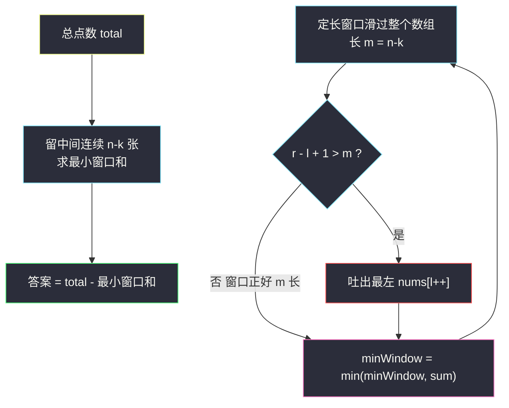

# 可获得的最大卡牌点数（正难则反 + 定长滑动窗口）

## 一、问题描述

几张卡牌排成一行，每张卡牌都有一个点数 `cardPoints[i]`。每次行动你可以从行的**开头或末尾**拿一张卡牌，你必须恰好拿 `k` 张卡牌。你的点数就是你拿到手中的所有卡牌的点数之和。返回你可以获得的最大点数。

> 🔗 LeetCode 1423：https://leetcode.cn/problems/maximum-points-you-can-obtain-from-cards/

**示例 1（经典）**

```
输入：cardPoints = [1,2,3,4,5,6,1], k = 3
输出：12
解释：第一次拿 1（开头），之后两次拿 6 和 5（末尾），最优点是 1 + 6 + 5 = 12。
```

**示例 2**

```
输入：cardPoints = [2,2,2], k = 2
输出：4
解释：无论拿哪两张都是 4。
```

**直观理解**

「开头拿 `i` 张、末尾拿 `k-i` 张」——拿走的牌永远分布在**两端**，剩下的牌必然是**中间的一段连续子数组**。这是本题最漂亮的转化：**研究「拿什么」很难枚举，研究「剩什么」一目了然。**

---

## 二、暴力解法（入门）

### 直观思路

枚举左端拿 `i` 张（`i = 0..k`），则右端拿 `k - i` 张，用前缀和直接算两端之和取最大。

```java
public int maxScore(int[] cardPoints, int k) {
    int n = cardPoints.length;
    int[] pre = new int[n + 1];          // 前缀和
    for (int i = 0; i < n; i++) pre[i + 1] = pre[i] + cardPoints[i];
    int ans = 0;
    for (int i = 0; i <= k; i++) {       // 左端 i 张，右端 k-i 张
        int left = pre[i];
        int right = pre[n] - pre[n - (k - i)];
        ans = Math.max(ans, left + right);
    }
    return ans;
}
```

### 复杂度

- **时间**：`O(n + k)`，其实已经不错。
- **空间**：`O(n)` 前缀和数组。

### 🔴 瓶颈在哪里

本质上是在枚举 `k+1` 种「左/右分割」。但换一个视角——剩下的 `n - k` 张牌是**一段连续区间**，问题等价于「长度恰为 `n - k` 的子数组的最小和」。这是**定长滑动窗口**的标准形态，可以做到 `O(n)` 时间、`O(1)` 空间，而且和窗口专题的其他题共用同一套骨架。

---

## 三、优化探索（核心章节）

### 3.1 观察特征

| 特征 | 说明 |
|------|------|
| 恰好拿 `k` 张，且只能从两端拿 | 剩下的是**连续的** `n - k` 张 |
| 求拿走的最大和 | = 总和 − 剩下的最小和（**正难则反**） |
| 剩余子数组长度固定为 `n - k` | **定长滑动窗口** |

### 3.2 从暴力到优化的推导

```
拿走的牌 = [0..i) ∪ [n-(k-i)..n)   ← 枚举困难：两端各自扩张，组合爆炸感
      ↓ 等价转化
剩下的牌 = [i .. n-(k-i))          ← 一段连续区间，长度恰为 n-k
      ↓
最大化拿走的和 = total − 最小化「长度为 n-k 的子数组和」
      ↓
定长窗口滑过去，每次右进一个、左出一个，O(1) 更新窗口和
```



两端与中间的关系示意（`k = 3`，剩 `n - k` 张）：

```text
[ 1  2  3 | 4  5  6 | 1 ]
  ←拿走→   ←留下→    ←拿走→
   左 2 张   剩 4 张    右 1 张
```

### 3.3 边界：k == n

`m = n - k = 0`，全部拿走，直接返回 `total`。写代码时先特判，避免空窗口参与更新。

### 3.4 一句话核心

> **两端取 k 张 ⇔ 中间留一段连续的 n−k 张；最大化拿走的 = 总和 − 最小化留下的（定长窗口求最小和）。**

---

## 四、代码实现详解

> 说明：未在左程云课源码仓库（`class001..class2xx`）中定位到本题原题，主解按 `class049` 滑动窗口专题的**定长窗口骨架**对齐书写。

### Java（定长窗口版，主解）

```java
// 可获得的最大卡牌点数
// 每次从开头或末尾拿一张，恰好拿 k 张，返回能获得的最大点数
// 转化：两端拿 k 张 ⇔ 中间留下连续 n-k 张 → 定长窗口求最小和
// 测试链接 : https://leetcode.cn/problems/maximum-points-you-can-obtain-from-cards/
public class Solution {

    public static int maxScore(int[] cardPoints, int k) {
        int n = cardPoints.length;
        int total = 0;
        for (int num : cardPoints) {
            total += num;
        }
        int m = n - k;                    // 剩下窗口的固定长度
        if (m == 0) {
            return total;                 // 全拿
        }
        int minWindow = Integer.MAX_VALUE;
        for (int l = 0, r = 0, sum = 0; r < n; r++) {
            sum += cardPoints[r];         // 纳入右端
            if (r - l + 1 > m) {          // 超过定长，吐出最左
                sum -= cardPoints[l++];
            }
            if (r - l + 1 == m) {         // 窗口恰好 m 长，统计最小和
                minWindow = Math.min(minWindow, sum);
            }
        }
        return total - minWindow;
    }
}
```

**变量含义**

| 变量 | 含义 |
|------|------|
| `total` | 全部卡牌点数之和 |
| `m` | 留下窗口的固定长度 `n - k` |
| `sum` | 当前窗口 `cardPoints[l..r]` 的和 |
| `minWindow` | 长度为 `m` 的窗口的最小和 |

**循环不变式**：执行到 `if (r - l + 1 == m)` 判断时，`sum` 恰好等于子数组 `cardPoints[l..r]` 的和且窗口长度为 `m`。

### Java（前缀和枚举版，作对照）

```java
public static int maxScore2(int[] cardPoints, int k) {
    int n = cardPoints.length;
    int[] pre = new int[n + 1];
    for (int i = 0; i < n; i++) pre[i + 1] = pre[i] + cardPoints[i];
    int ans = 0;
    for (int i = 0; i <= k; i++) {        // 左端 i 张 + 右端 k-i 张
        ans = Math.max(ans, pre[i] + pre[n] - pre[n - k + i]);
    }
    return ans;
}
```

### Python

```python
class Solution:
    def maxScore(self, cardPoints: list[int], k: int) -> int:
        total = sum(cardPoints)
        m = len(cardPoints) - k           # 剩下窗口的固定长度
        if m == 0:
            return total
        min_window = float("inf")
        l = sum_ = 0
        for r in range(len(cardPoints)):
            sum_ += cardPoints[r]
            if r - l + 1 > m:
                sum_ -= cardPoints[l]
                l += 1
            if r - l + 1 == m:
                min_window = min(min_window, sum_)
        return total - min_window
```

---

## 五、具体例子演示

`cardPoints = [1,2,3,4,5,6,1]`，`k = 3`，`total = 22`，`m = 4`。定长窗口逐步跟踪：

| r | 纳入 | sum | 吐左后 | 窗口（长 4） | minWindow |
|---|------|-----|--------|--------------|-----------|
| 0 | 1 | 1 | — | 长度 1，不统计 | ∞ |
| 1 | 2 | 3 | — | 长度 2，不统计 | ∞ |
| 2 | 3 | 6 | — | 长度 3，不统计 | ∞ |
| 3 | 4 | 10 | 不用吐 | `[1,2,3,4]` 和 10 | **10** |
| 4 | 5 | 15 | 长度 5 > 4 → 吐 1 → 14 | `[2,3,4,5]` 和 14 | 10 |
| 5 | 6 | 20 | 吐 2 → 18 | `[3,4,5,6]` 和 18 | 10 |
| 6 | 1 | 19 | 吐 3 → 16 | `[4,5,6,1]` 和 16 | 10 |

`minWindow = 10`，答案 `22 − 10 = 12`——对应留下 `[1,2,3,4]`，拿走两端 `[5,6]` 和 `[1]`，即 `1 + 6 + 5 = 12`。✅


**再看示例 2**：`[2,2,2]`，`k = 2`，`m = 1`。长度 1 的窗口最小和 = 2，答案 `6 − 2 = 4`。✅

---

## 六、复杂度分析

| 方法 | 时间 | 空间 | 说明 |
|------|------|------|------|
| 枚举左右张数 | `O(n + k)` | `O(n)` | 前缀和数组 |
| 定长滑动窗口 | `O(n)` | `O(1)` | 一趟扫完，无额外数组 |

---

## 七、方法对比与总结

| | 枚举左右分割 | 定长窗口（正难则反） |
|--|--------------|----------------------|
| 视角 | 直接想「拿什么」 | 反过来想「剩什么」 |
| 代码量 | 前缀和 + 一层循环 | 一层循环 + 常数变量 |
| 可迁移性 | 只适用于本题 | 「总和 − 窗口最值」是通用套路 |

**易错点**

1. `k == n`（`m == 0`）必须特判：全部拿走，直接返回 `total`。
2. 定长骨架的更新顺序：**先纳入右端 → 超长再吐左 → 长度恰好 `m` 才统计**，顺序乱了会把长度不对的窗口记进答案。
3. 求的是留下窗口的**最小**和（因为要最大化拿走的），别顺手写成 max。
4. 别把「两端取 k 张」误解成可以中间取牌——题目限制只能开头/末尾，这是转化成立的前提。

**模板（定长窗口，对齐课上骨架）**

```java
// for (l=0, r=0, sum=0; r<n; r++) {
//     sum += nums[r];            // 纳入
//     if (r-l+1 > m) 吐左;        // 定长控制
//     if (r-l+1 == m) 更新答案;   // 只在满长时统计
// }
```

---

## 八、举一反三

| 题目 | 关系 |
|------|------|
| [643. 子数组最大平均数 I](https://leetcode.cn/problems/maximum-average-subarray-i/) | 同为定长窗口，统计量从「最小区间和」换成「最大区间和」 |
| [1052. 爱生气的书店老板](https://leetcode.cn/problems/grumpy-bookstore-owner/) | 「整体 − 不干预窗口」的反向视角，和本题同一层思想 |
| [2134. 最少交换次数来组合所有的 1 II](https://leetcode.cn/problems/minimum-swaps-to-group-all-1s-together-ii/) | 环形定长窗口，骨架升级版 |
| [1456. 定长子串中元音的最大数目](https://leetcode.cn/problems/maximum-number-of-vowels-in-a-substring-of-given-length/) | 定长窗口 + 计数，统计量换成元音个数 |

**思想迁移**

- 「两端取 / 前后缀配合」的问题，先问一句：**剩下的东西是不是连续的？** 是，就转成窗口问题。
- 「最大化 A」当 A 直接枚举麻烦时，尝试 `A = 总量 − B`，把目标换成最小化 B。
