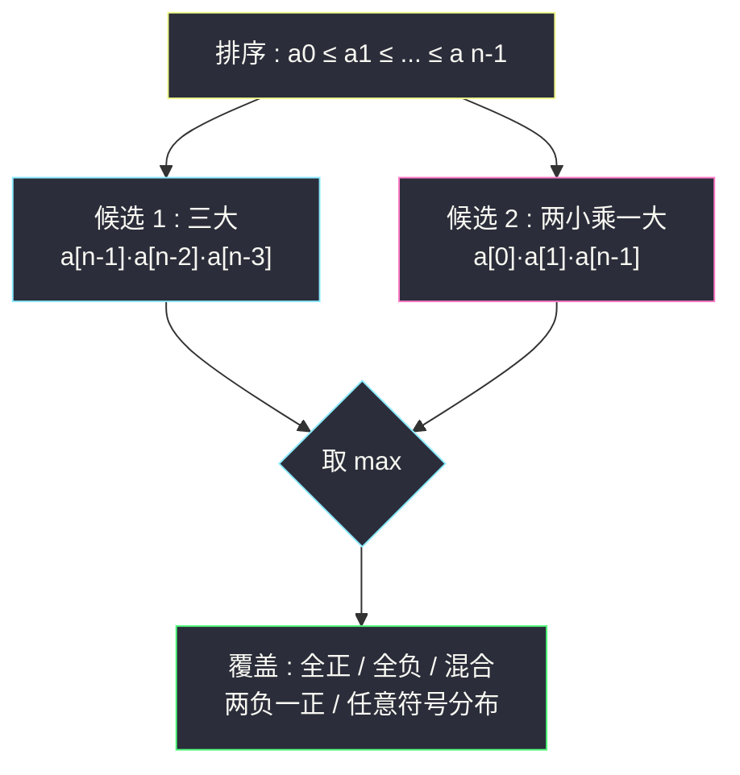

# 三个数的最大乘积（排序取两端 / 一次遍历维护最值）

## 一、问题描述

给你一个整型数组 `nums`，在数组中找出由**三个数字**组成的**最大乘积**，并输出这个乘积。

> 🔗 LeetCode 628：https://leetcode.cn/problems/maximum-product-of-three-numbers/

**示例 1**

```
输入：nums = [1,2,3]
输出：6
```

**示例 2（负数登场，本题灵魂）**

```
输入：nums = [1,2,3,4]
输出：24
```

**示例 3**

```
输入：nums = [-1,-2,-3]
输出：-6   （只能全取，三个负数相乘为负）
```

**直观理解**

「三个数的最大乘积」表面是组合枚举，其实只有两种候选形态：**三个最大的正数**（同号大数连乘）或者**两个最小（绝对值最大）的负数 x 最大的正数**（负负得正，两个大负数一乘变成超大正数，再乘最大正数）。负数的存在把直觉上的「取最大三个」打成陷阱——`[-10,-10,5,2]` 里最大乘积是 `(-10)·(-10)·5 = 500` 而不是 `5·2·?`。排序一次，这两种候选都乖乖趴在数组两端。

---

## 二、暴力解法（入门）

### 直观思路

三重循环枚举所有 `i < j < k` 组合，取乘积最大值。

```java
public int maximumProduct(int[] nums) {
    int n = nums.length;
    long ans = Long.MIN_VALUE;
    for (int i = 0; i < n; i++) {
        for (int j = i + 1; j < n; j++) {
            for (int k = j + 1; k < n; k++) {
                ans = Math.max(ans,
                    (long) nums[i] * nums[j] * nums[k]);  // long 防中途溢出
            }
        }
    }
    return (int) ans;
}
```

### 复杂度

- **时间**：`O(n³)`——`n = 10⁴` 时约 1.6×10¹¹ 次乘法，必然超时
- **空间**：`O(1)`

### 🔴 瓶颈在哪里

**绝大多数枚举出来的三元组毫无胜算**：最大乘积只可能由「数组里最大的三个数」或「最小的两个数配最大的一个数」产生——这两种形态各自只依赖 5 个关键数（top3 + bottom2），扫一遍就能全拿到，三重循环纯属陪跑。

---

## 三、优化探索（核心章节）

### 3.1 观察特征：最大乘积只有两种形态

排序后数组 `a[0] ≤ a[1] ≤ ... ≤ a[n-1]`。任取三个数，乘积要尽可能大，只有两条路：

| 形态 | 取哪些 | 适用场景 |
|------|--------|----------|
| 形态 ① 三大 | `a[n-1] · a[n-2] · a[n-3]` | 全正数 / 混合但正数足够强 |
| 形态 ② 两小乘一大 | `a[0] · a[1] · a[n-1]` | 存在两个大负数时，负负得正 |

**为什么不可能有第三种？** 分类讨论：

- 取到的负数个数为 0（全正）：自然是最大的三个正数——形态 ①；
- 负数个数为 1：乘积为负，除非别无选择（全负数组也归入此列，见下），否则不会被选；全负时最大乘积 = 绝对值最小的三个（即最大的三个）连乘，仍是「数组里最大的三个」——形态 ① 覆盖；
- 负数个数为 2：负负得正后乘最大的正数——形态 ②；
- 负数个数为 3：乘积为负，同「负数个数为 1」的分析，取最大的三个（绝对值最小）——形态 ① 覆盖。

结论：**答案 = max(形态①, 形态②)**，与其它任何组合无关。



### 3.2 关键推导问题

| 问题 | 答案 |
|------|------|
| 为什么候选 ② 是 `a[0]·a[1]·a[n-1]` 而不是 `a[0]·a[1]·a[n-2]`？ | 两个负数乘积已是正数 `P = a[0]·a[1]`，再乘的数越大越好，`a[n-1]` 是全场最大 |
| 候选 ② 要不要算 `a[0]·a[1]·a[n-2]` 之类的变体？ | 不用：第三因子取最大必然不劣，枚举次大的只会更小或相等 |
| 有 0 会怎样？ | 0 不参与两种形态的「最优路径」判断——分类讨论已覆盖：如 `[-5,-4,0,3]` 候选① = 0，候选② = 60，取 60 正确 |
| 全负数组 `-3,-2,-1` 候选谁赢？ | 候选① = -1·-2·-3 = -6；候选② = -3·-2·-1 = -6，两者相等且就是唯一答案——「最大三个」在全负时就是绝对值最小三个，形态①自动正确 |
| `n == 3` 怎么办？ | 两种候选公式都退化为全数组乘积，直接正确，无需特判 |
| 不排序能做到多快？ | 一遍扫描维护 max1≥max2≥max3 和 min1≤min2 五个变量，`O(n)` 时间 `O(1)` 空间，见 3.3 |

### 3.3 进一步：一次遍历版（免排序）

排序版 `O(n log n)` 已经够用；若追求极致，一遍扫描同时维护**最大的三个数**与**最小的两个数**：

- 读到 `x`：依次与 `max1/max2/max3` 比较下沉插入；再与 `min1/min2` 比较上浮插入；
- 结束后答案仍是 `max(max1·max2·max3, min1·min2·max1)`——**与排序版公式完全一致**，因为五个极值就是排序后「两端那五个位置」的内容。

### 3.4 一句话核心

> **最大乘积只有两个候选人：三大，或两小乘一大——把两个候选都算出来取 max，负数陷阱自动免疫。**

---

## 四、代码实现详解

> 说明：课源码仓库未收录 #628 原题（`class090/Code02_MaximumProduct.java` 是「整数 n 拆 k 份求最大乘积」的另一道题）。主解按排序/一次遍历求最值的通用骨架书写，简洁易懂优先。

### Java（主解：排序 + 两端公式）

```java
// 三个数的最大乘积
// 测试链接 : https://leetcode.cn/problems/maximum-product-of-three-numbers/
class Solution {

    public int maximumProduct(int[] nums) {
        Arrays.sort(nums);
        int n = nums.length;
        // 候选1：三个最大数；候选2：两个最小数(可能是大负数) x 最大数
        return Math.max(
                nums[n - 1] * nums[n - 2] * nums[n - 3],
                nums[0] * nums[1] * nums[n - 1]);
    }
}
```

### Java（一遍扫描 O(n) 版）

```java
class Solution {

    public int maximumProduct(int[] nums) {
        // max1 >= max2 >= max3 : 最大的三个
        // min1 <= min2         : 最小的两个（可能是绝对值最大的负数）
        int max1 = Integer.MIN_VALUE, max2 = max1, max3 = max1;
        int min1 = Integer.MAX_VALUE, min2 = min1;
        for (int x : nums) {
            if (x > max1)      { max3 = max2; max2 = max1; max1 = x; }
            else if (x > max2) { max3 = max2; max2 = x; }
            else if (x > max3) { max3 = x; }
            if (x < min1)      { min2 = min1; min1 = x; }
            else if (x < min2) { min2 = x; }
        }
        return Math.max(max1 * max2 * max3, min1 * min2 * max1);
    }
}
```

### Python

```python
# 三个数的最大乘积（排序版）
# 测试链接 : https://leetcode.cn/problems/maximum-product-of-three-numbers/
class Solution:
    def maximumProduct(self, nums: list[int]) -> int:
        nums.sort()
        return max(
            nums[-1] * nums[-2] * nums[-3],   # 三大
            nums[0] * nums[1] * nums[-1],     # 两小乘一大
        )
```

```python
# 一遍扫描版
class Solution:
    def maximumProduct(self, nums: list[int]) -> int:
        max1 = max2 = max3 = float("-inf")
        min1 = min2 = float("inf")
        for x in nums:
            if x > max1:
                max1, max2, max3 = x, max1, max2
            elif x > max2:
                max2, max3 = x, max2
            elif x > max3:
                max3 = x
            if x < min1:
                min1, min2 = x, min1
            elif x < min2:
                min2 = x
        return max(max1 * max2 * max3, min1 * min2 * max1)
```

---

## 五、具体例子演示

**例 A：`nums = [-10, -10, 5, 2]`（负数陷阱主场）**

排序后：`[-10, -10, 2, 5]`（n=4）。

| 候选 | 计算 | 结果 |
|------|------|------|
| ① 三大 | `5 · 2 · (-10)` | -100 |
| ② 两小乘一大 | `(-10) · (-10) · 5` | **500** ✅ |

直觉「取最大三个 5,2,-10」给出 -100，全靠候选 ② 翻盘——两个 -10 负负得正后 100 再乘 5 得 500。**为什么第二小可以不是 -10 而公式仍对**：此数组里最小的两个恰好都是 -10；一般地，`a[0]·a[1]` 的乘积是「任取两个数」里最大或接近最大的正积，公式取的就是这个极端。

**例 B：`nums = [1, 2, 3, 4]`（正常场景）**

排序后 `[1,2,3,4]`。候选① = `4·3·2 = 24` ✅；候选② = `1·2·4 = 8`。取 max = 24，与示例 2 一致。

**例 C：`nums = [-1, -2, -3]`（全负）**

排序后 `[-3,-2,-1]`。候选① = `-1·-2·-3 = -6`；候选② = `-3·-2·-1 = -6`。max = -6，与示例 3 一致——全负时两候选相等且唯一。

**一遍扫描版跟踪例 A**（初始 max1..3 = -∞, min1..2 = +∞）：

| x | max1/max2/max3 | min1/min2 |
|---|-----------------|-----------|
| -10 | -10 / -∞ / -∞ | -10 / +∞ |
| -10 | -10 / -10 / -∞ | -10 / -10 |
| 5 | 5 / -10 / -10 | 不变 |
| 2 | 5 / 2 / -10 | 不变 |

结束：`max(5·2·(-10), (-10)·(-10)·5) = max(-100, 500) = 500` ✅，与排序版一致。

---

## 六、复杂度分析

| 项目 | 排序版（主解） | 一遍扫描版 | 暴力三重循环 |
|------|----------------|------------|--------------|
| 时间 | `O(n log n)` 排序主导 | `O(n)` 单趟 | `O(n³)` 超时 |
| 空间 | `O(log n)` 排序递归栈 | `O(1)` 五个变量 | `O(1)` |

---

## 七、方法对比与总结

### 易错点

1. **只算「最大三个」** → `[-10,-10,5,2]` 直接错成 -100；负负得正候选绝不能漏。
2. **候选 ② 写成 `a[0]·a[1]·a[n-2]`** → 第三因子不是最大，白白丢解（如 `[−10,−10,1,5,6]`：`a[0]a[1]a[4]=600` vs `a[0]a[1]a[3]=500`）。
3. **一遍扫描版的插入顺序**：更新 max 链时先比较 `max1` 再 `max2` 再 `max3`，命中即停（else if 链），写成三个独立 if 会重复下沉。
4. 数值范围：本题 `3 ≤ nums[i] ≤ 1000` 或 `-1000 ≤ nums[i] ≤ 1000`（题面保证非负或一般版），三个 1000 相乘 10⁹ 在 int 边缘（2.1×10⁹ 以内安全）；若范围放宽务必用 long。
5. 暴力版忘转 `long` 比较乘积——中途溢出会得到错误 max。

### 方法对比

| | 排序 + 两端公式 | 一遍扫描五变量 | 暴力枚举 |
|--|------------------|-----------------|----------|
| 时间 | `O(n log n)` | `O(n)` ✅ | `O(n³)` |
| 代码量 | 3 行 ✅ | 15 行 | 8 行 |
| 心智负担 | 最低，面试首选 | 要维护插入逻辑 | 无 |

**面试建议**：先说排序版讲清两个候选的推导（这才是考点），再补一句「可以一遍扫描 O(n)」展示功力。

### 模板口诀

> **排序两端取候选：三大一比，两小乘一大；负负得正别忘记，取个 max 完事。**

---

## 八、举一反三

| 题目 | 链接 | 迁移点 |
|------|------|--------|
| 152. 乘积最大子数组 | https://leetcode.cn/problems/maximum-product-subarray/ | 「负负得正」的进阶场：同时维护最大/最小乘积两个 DP 状态 |
| 414. 第三大的数 | https://leetcode.cn/problems/third-maximum-number/ | 同款一遍扫描维护 top3 三变量的纯练习 |
| 561. 数组拆分 | https://leetcode.cn/problems/array-partition/ | 同属「排序后位置即信息」家族：排序取偶数下标配对求和 |
| 747. 至少是其他数字两倍的最大数 | https://leetcode.cn/problems/largest-number-at-least-twice-of-others/ | 一遍扫描维护 top1/top2 的同款多变量插入练习 |
| 88. 合并两个有序数组 | https://leetcode.cn/problems/merge-sorted-array/ | 同分类的排序基础题：数组两端信息的高效利用（[站内题解](/solutions/base/merge-sorted-array.md)） |

**迁移一句**：**「有序化之后，极值信息全部集中在两端」**——涉及最大/最小 k 个数的组合最值题，排序后答案几乎总由「头 k 个」与「尾 k 个」的少数几种拼接产生；把候选形态枚举穷尽再取 max，就是这类题的全部。
