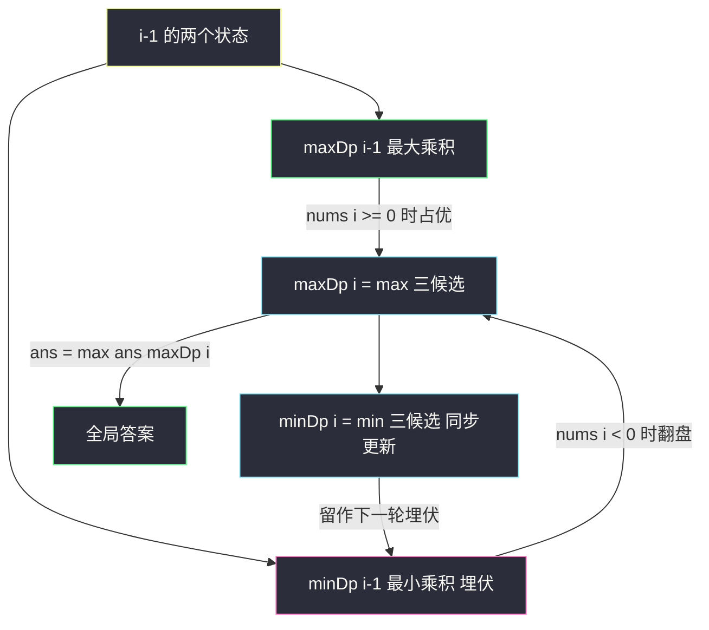

# 乘积最大子数组（同时维护最大与最小：负负得正的翻盘）

## 一、问题描述

给你一个整数数组 `nums`，请你找出数组中**乘积最大**的非空连续子数组，并返回该子数组所对应的乘积。

> 🔗 LeetCode 152：https://leetcode.cn/problems/maximum-product-subarray/

**示例 1**

```
输入：nums = [2, 3, -2, 4]
输出：6
解释：子数组 [2, 3] 的乘积最大，为 6。
```

**示例 2**

```
输入：nums = [-2, 0, -1]
输出：0
解释：结果不能为 2，因为 [-2, -1] 不是连续子数组。
```

**直观理解**

它就是 [#53 最大子数组和](https://leetcode.cn/problems/maximum-subarray/)（站内本批题解）的「乘法版」：同样是按右端点分类、同样有「单开 / 接上」二选一。但乘法有一条加法没有的规则——**负数乘负数会翻盘**：目前乘积最小的（很负的数），再乘一个负数瞬间变成最大的。所以只维护「以 i 结尾的最大乘积」不够，必须**同时维护最大和最小**两个状态。

> 课源码出处：class071 Code01_MaximumProductSubarray.java（乘积最大子数组）。课上还特别注明：测试数据更新后中间结果会溢出 int，改用 `double`，思路不变。

---

## 二、暴力解法（入门）

### 直观思路

枚举子数组左右端点，把乘积全算一遍取最大：

```java
// 乘积最大子数组：暴力枚举
public static int maxProduct0(int[] nums) {
    int n = nums.length;
    int ans = Integer.MIN_VALUE;
    for (int l = 0; l < n; l++) {
        long product = 1;
        for (int r = l; r < n; r++) {
            product *= nums[r];      // r 右扩一格，乘积增量累乘
            ans = Math.max(ans, (int) Math.max(product, Integer.MIN_VALUE));
        }
    }
    return ans;
}
```

### 复杂度

- **时间**：`O(n²)`
- **空间**：`O(1)`

### 🔴 瓶颈在哪里

`n` 到几万就超时。更关键的是——它没有暴露出「负负得正」的结构信息，优化的路子从「分类讨论」里来，不从枚举里来。

---

## 三、优化探索（核心章节）

### 3.1 观察特征

| 特征 | 说明 |
|------|------|
| 以 i 结尾分类 | 与 #53 相同：`dp[i]` = 必须以 `i` 结尾的子数组的最优值 |
| 单开 / 接上 | 以 `i` 结尾：要么只有 `nums[i]`，要么接在以 `i-1` 结尾的子数组后面 |
| **乘法翻盘** | 接上时，`nums[i]` 为负，则「以 i-1 结尾的最小（最负）」乘上它反而最大 |
| 状态需要两个 | 最大值一个状态装不下，必须 max/min 成对维护 |

### 3.2 dp 定义与转移推导（对齐 class071）

沿用 #53 的定义，但每个位置拆成两个状态：

```
maxDp[i] : 必须以 i 结尾的子数组能取得的最大乘积
minDp[i] : 必须以 i 结尾的子数组能取得的最小乘积（最负，等待翻盘）

maxDp[i] = max( nums[i],                      单开
                max(maxDp[i-1] * nums[i],     接在最大后面
                    minDp[i-1] * nums[i]) )   接在最小后面（负负翻盘）
minDp[i] = min( nums[i],
                min(minDp[i-1] * nums[i],
                    maxDp[i-1] * nums[i]) )
答案 = max(maxDp[0..n-1])
```

**为什么必须留 min？** 例：`[2, -5, -2, ...]`。以 `-5` 结尾的最小乘积是 `-10`，看着毫无用处；但下一个数是负数 `-2` 时，`-10 × -2 = 20` 直接成为全局最大。**最小值是「埋伏」状态**——只要后面出现负数，它就翻盘成最大。

依赖方向：`maxDp[i]`、`minDp[i]` 只依赖 `i-1` 的两个值 → 从左到右一遍；两行表各留一个变量即可滚动。



### 3.3 关键推导问题

| 问题 | 答案 |
|------|------|
| 为什么不维护「前缀乘积的正负号个数」？ | 溢出会炸，且推导绕；双状态 max/min 一行转移就够 |
| 0 怎么处理？ | `nums[i]=0` 时三候选里 `nums[i]=0` 自然胜出——0 把一切乘积拦腰截断，之后的子数组从 0 之后重新开始，「单开」分支自动完成断开 |
| 为什么 Java 要用 `double`？ | 课上注明：测试数据增强后中间乘积会溢出 int（极限数据乘积超过 32 位），`double` 有 53 位精度足够，最后转回 int |
| 两行表顺序有讲究吗？ | 计算 `curmax`、`curmin` 必须先用旧值算完再统一覆盖，和 #746 滚动变量同理 |
| 答案为什么不在 `minDp` 里取？ | 乘积最大子数组的「最优」只关心最大值；最小值仅为转移服务 |

### 3.4 一句话核心

> **以 i 结尾同留 max/min 两个状态，三候选（单开、接 max、接 min）分别取 max/min；负数一来，埋伏的 min 翻盘成 max。**

---

## 四、代码实现详解

### Java（主解：滚动变量，课上原版，double 防溢出）

```java
// 乘积最大子数组
// 给你一个整数数组 nums，找出数组中乘积最大的非空连续子数组
// 测试链接 : https://leetcode.cn/problems/maximum-product-subarray/
// 对齐 class071 Code01_MaximumProductSubarray：max/min 双状态 + 滚动变量
public class Solution {

    // maxDp[i] / minDp[i] : 必须以 i 结尾的最大/最小乘积
    // 课上注明：测试数据增强后中间乘积溢出 int，用 double 承载，思路不变
    // 时间复杂度 O(n)，空间复杂度 O(1)
    public static int maxProduct(int[] nums) {
        // min : minDp[i-1]，埋伏状态
        // max : maxDp[i-1]
        double ans = nums[0], min = nums[0], max = nums[0], curmin, curmax;
        for (int i = 1; i < nums.length; i++) {
            // 三候选：单开 nums[i]、接在最大后面、接在最小后面（负负翻盘）
            curmin = Math.min(nums[i], Math.min(min * nums[i], max * nums[i]));
            curmax = Math.max(nums[i], Math.max(min * nums[i], max * nums[i]));
            min = curmin;
            max = curmax;
            ans = Math.max(ans, max);
        }
        return (int) ans;
    }
}
```

### Java（演进版：显式双行 dp 表）

```java
// 演进过程：显式 maxDp / minDp 两张表（帮助理解双状态怎么来的）
public class Solution {

    public static int maxProduct2(int[] nums) {
        int n = nums.length;
        // maxDp[i] / minDp[i]：必须以 i 结尾的最大 / 最小乘积
        double[] maxDp = new double[n];
        double[] minDp = new double[n];
        maxDp[0] = minDp[0] = nums[0];
        double ans = nums[0];
        for (int i = 1; i < n; i++) {
            double x = nums[i];
            maxDp[i] = Math.max(x, Math.max(maxDp[i - 1] * x, minDp[i - 1] * x));
            minDp[i] = Math.min(x, Math.min(maxDp[i - 1] * x, minDp[i - 1] * x));
            ans = Math.max(ans, maxDp[i]);
        }
        return (int) ans;
    }
}
```

### Python（同思路）

```python
# 乘积最大子数组：滚动变量版，O(n) / O(1)
class Solution:
    def maxProduct(self, nums: list[int]) -> int:
        ans = mx = mn = nums[0]
        for x in nums[1:]:
            # 先用旧值算完再统一覆盖（curmax/curmin 防止串档）
            curmax = max(x, mx * x, mn * x)
            curmin = min(x, mx * x, mn * x)
            mx, mn = curmax, curmin
            ans = max(ans, mx)
        return ans
```

```python
# 显式双行 dp 表版（帮助理解）
class Solution:
    def maxProduct(self, nums: list[int]) -> int:
        n = len(nums)
        max_dp = [0] * n
        min_dp = [0] * n
        max_dp[0] = min_dp[0] = nums[0]
        ans = nums[0]
        for i in range(1, n):
            x = nums[i]
            max_dp[i] = max(x, max_dp[i - 1] * x, min_dp[i - 1] * x)
            min_dp[i] = min(x, max_dp[i - 1] * x, min_dp[i - 1] * x)
            ans = max(ans, max_dp[i])
        return ans
```

---

## 五、具体例子演示

### 例 A：`nums = [2, 3, -2, 4]`（正数为主，接 max 稳赢）

| i | nums[i] | 三候选（单开 / max·x / min·x） | maxDp[i] | minDp[i] | ans |
|---|---------|-------------------------------|----------|----------|-----|
| 0 | 2 | — | 2 | 2 | 2 |
| 1 | 3 | 3 / 6 / 6 | **6** | 3 | 6 |
| 2 | -2 | -2 / -12 / -6 | -2 | **-12** | 6 |
| 3 | 4 | 4 / -8 / -48 | 4 | -48 | 6 |

`i=2` 时 `minDp` 掉到 -12 埋伏起来，可惜后面是正数 4 没能翻盘。最终 `ans = 6`，对应子数组 `[2, 3]`。

### 例 B：`nums = [2, -5, -2, -4, 3]`（min 翻盘的经典局）

| i | nums[i] | 三候选（单开 / max·x / min·x） | maxDp[i] | minDp[i] | ans | 备注 |
|---|---------|-------------------------------|----------|----------|-----|------|
| 0 | 2 | — | 2 | 2 | 2 | |
| 1 | -5 | -5 / -10 / -10 | -5 | **-10** | 2 | min 埋伏 -10 |
| 2 | -2 | -2 / 10 / **20** | **20** | -2 | 20 | **-10 × -2 = 20 翻盘！** |
| 3 | -4 | -4 / -80 / **8** | 8 | **-80** | 20 | min 再次埋伏 -80 |
| 4 | 3 | 3 / 24 / -240 | **24** | -240 | **24** | 接 max（8×3=24）胜出 |

最终 `ans = 24`，对应子数组 `[-2, -4, 3]`（乘积 24）。全程两次「min 翻盘」都发生在 `i=2`（-10×-2=20）和 `i=3`（-2×-4=8 挤掉单开）——若不维护 min，这两步都会漏。

### 例 C：`nums = [-2, 0, -1]`（0 截断一切）

| i | nums[i] | 三候选 | maxDp[i] | minDp[i] | ans |
|---|---------|--------|----------|----------|-----|
| 0 | -2 | — | -2 | -2 | -2 |
| 1 | 0 | 0 / 0 / 0 | 0 | 0 | 0 |
| 2 | -1 | -1 / 0 / 0 | 0 | -1 | 0 |

0 把两侧隔开，`[-2, -1]` 不连续无法相乘，`ans = 0` ✓。注意「单开」分支在 0 处自动完成断链，无需特判。

---

## 六、复杂度分析

| 版本 | 时间 | 空间 | 说明 |
|------|------|------|------|
| 暴力枚举 | `O(n²)` | `O(1)` | 枚举端点增量累乘 |
| 显式双行 dp 表 | `O(n)` | `O(n)` | maxDp/minDp 两张表 |
| 滚动变量（主解） | `O(n)` | `O(1)` | 每行只留 max/min 两个变量 |

---

## 七、方法对比与总结

### 与 #53 的对照（本家族两张牌）

| | #53 最大子数组和 | #152 乘积最大子数组 |
|---|---|---|
| 分类方式 | 以 i 结尾 | 以 i 结尾 |
| 单开/接上 | `max(nums[i], dp[i-1]+nums[i])` | `max(nums[i], max(min·x, max·x))` |
| 状态个数 | 1 个 | **2 个（max/min 成对）** |
| 断开条件 | 前缀和为负 | 遇 0 / 候选里「单开」胜出 |
| 翻盘 | 不存在（加法单调） | **负负得正** |

### 易错点

1. **只维护 max**：漏掉负负翻盘，`[2,-5,-2]` 会错答 2（正解 20）。
2. **滚动时先覆盖再算**：必须先用旧 `min`、旧 `max` 算出 `curmin`、`curmax`，再统一赋值；否则 `curmax` 会用到被覆盖的新 `min`。
3. **Java 用 int 溢出**：极限数据中间乘积超 32 位，按课上用 `double` 承载、返回时转 int。
4. **ans 初值**：取 `nums[0]` 而不是 0——全负数组（如 `[-2]`）答案是 -2。
5. **以为 0 要特判**：不用。三候选里 `nums[i]=0` 自然胜出，状态归零后从下一位重新单开。

### 模板口诀

> **结尾分类照 #53，乘法翻盘要双态；单开接 max 接 min，三候选取极值再滚。**

---

## 八、举一反三

| 题目 | 链接 | 迁移点 |
|------|------|--------|
| 53. 最大子数组和（站内本批题解） | https://leetcode.cn/problems/maximum-subarray/ | 本家族的加法版，Kadane 单状态 |
| 1567. 乘积为正的最长子数组长度 | https://leetcode.cn/problems/maximum-length-of-subarray-with-positive-product/ | 同样「正/负成对维护」，状态换成最长长度 |
| 918. 环形子数组的最大和 | https://leetcode.cn/problems/maximum-sum-circular-subarray/ | Kadane 思想 + 环形拆解，class070 Code03 |
| 152. 本题的进阶：返回子数组本身 | https://leetcode.cn/problems/maximum-product-subarray/ | 在双行表上回溯来源即可 |
| 713. 乘积小于 K 的子数组 | https://leetcode.cn/problems/subarray-product-less-than-k/ | 乘积 + 滑动窗口（正数专属），对比维护方式差异 |

**迁移一句**：凡是「转移不是单调的」（乘法遇负、开方、异或），就把**所有可能成为最终最优的候选都升格成状态**一起滚动——max/min 双态是最常见的形态，异或前缀（如 [523. 连续的子数组和](https://leetcode.cn/problems/continuous-subarray-sum/) 思想）是同一招的变体。
