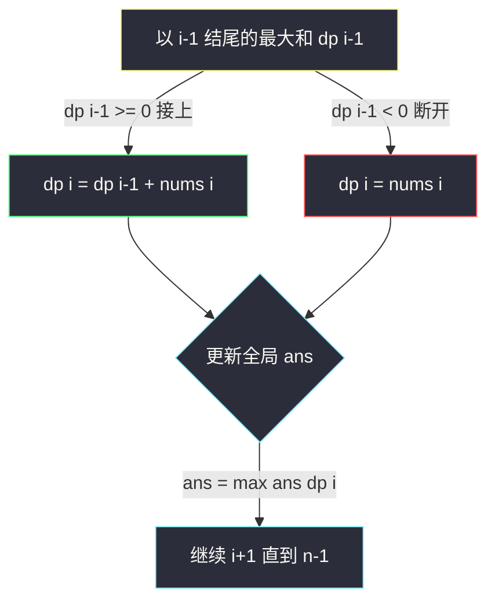

# 最大子数组和（Kadane 算法：以 i 结尾的分类讨论）

## 一、问题描述

给你一个整数数组 `nums`，请你找出一个**非空连续子数组**（子数组是数组中连续的一部分），使它的累加和最大，返回这个最大累加和。

> 🔗 LeetCode 53：https://leetcode.cn/problems/maximum-subarray/

**示例 1**

```
输入：nums = [-2, 1, -3, 4, -1, 2, 1, -5, 4]
输出：6
解释：连续子数组 [4, -1, 2, 1] 的累加和最大，为 6。
```

**示例 2**

```
输入：nums = [5, 4, -1, 7, 8]
输出：23
解释：整个数组的累加和最大，为 23。
```

**直观理解**

子数组有 `O(n²)` 个，全枚举肯定可以但慢。DP 的经典切入：**按「子数组的右端点」分类**——任何子数组一定以某个下标 `i` 结尾；枚举右端点，问「必须以 `i` 结尾的最大子数组和」，全局答案就是这 `n` 个「必须」里的最大值。

> 课源码出处：class070 Code01_MaximumSubarray.java（子数组最大累加和），含 dp 版、空间压缩版和附加问题（返回子数组左右端点）。

---

## 二、暴力解法（入门）

### 直观思路

枚举所有子数组的左右端点 `l`、`r`，累加求和取最大：

```java
// 最大子数组和：暴力枚举
public static int maxSubArray0(int[] nums) {
    int n = nums.length;
    int ans = Integer.MIN_VALUE;
    for (int l = 0; l < n; l++) {
        for (int r = l; r < n; r++) {
            int sum = 0;
            for (int k = l; k <= r; k++) {
                sum += nums[k];
            }
            ans = Math.max(ans, sum);
        }
    }
    return ans;
}
```

### 复杂度

- **时间**：`O(n³)`（枚举 `l`、`r` 再求和）
- **空间**：`O(1)`

顺手一提：把最内层求和改成「`r` 向右扩一格，`sum` 增量累加」，就是 `O(n²)` 前缀暴力。但只要还要逐个枚举起点，就快不起来。

### 🔴 瓶颈在哪里

同一个右端点 `r`，被不同左端点反复利用却每次从头算。**大量重复计算**——这是 DP 的经典信号。

---

## 三、优化探索（核心章节）

### 3.1 观察特征

| 特征 | 说明 |
|------|------|
| 以结尾分类 | 任何子数组必以某个 `i` 结尾，「右端点」是天然的可变参数 |
| 相邻依赖 | 以 `i` 结尾的最优，与以 `i-1` 结尾的最优只差「接不接」一个决定 |
| 无后效性 | 「前面的和是多少」概括了全部历史，怎么来的不重要 |

### 3.2 dp 定义与转移推导（对齐 class070）

```
dp[i] : 子数组必须以 i 位置的数做结尾，往左能延伸出来的最大累加和
dp[0] = nums[0]
dp[i] = max(nums[i], dp[i-1] + nums[i])
        ↑ 单开炉灶          ↑ 接在前缀后面
答案 = max(dp[0], dp[1], ..., dp[n-1])
```

**为什么对？** 以 `i` 结尾的子数组，左边一段要么为空（和就是 `nums[i]`），要么非空——非空时左边那段必然以 `i-1` 结尾，取其中最好的 `dp[i-1]`，总和为 `dp[i-1] + nums[i]`。两类**不重不漏**。

**关键判断**：`dp[i-1] + nums[i]` 什么时候会输给 `nums[i]`？当 `dp[i-1] < 0`，前面的累加是拖累，果断单开。这就是 Kadane 算法的灵魂一句话——**前面的和是负的就断开重来**。

依赖方向：`dp[i]` 只依赖 `dp[i-1]`，从左到右一遍；答案在填表过程中顺手取 `max`。



### 3.3 关键推导问题

| 问题 | 答案 |
|------|------|
| 为什么定义「必须以 i 结尾」？ | 加上「结尾」约束后，相邻状态才有干净的单步依赖；全局答案在所有 `dp[i]` 里取 max |
| 「答案 = max(dp[i])」会不会漏掉更长的数组？ | 不会，任何子数组都以某下标结尾，已被某个 `dp[i]` 覆盖 |
| 数组全负数怎么办？ | 照样成立：如 `[-3, -1]`，dp = [-3, -1]，答案 -1（非空子数组，必须选一个） |
| 能压缩空间吗？ | `dp[i]` 只依赖 `dp[i-1]`，一个变量 `pre` 滚动即可（课上 maxSubArray2） |
| dp 数组本身还要存吗？ | 求最大和不用存；若要**还原子数组本身**，要么留 dp 表回溯，要么用课上 `extra` 的区间追踪法 |

### 3.4 一句话核心

> **dp[i] = max(nums[i], dp[i-1] + nums[i])：前面是负的就断开；答案取所有 dp[i] 的最大值。**

---

## 四、代码实现详解

### Java（主解：dp + 空间压缩，课上 maxSubArray2）

```java
// 最大子数组和
// 给你一个整数数组 nums，返回非空子数组的最大累加和
// 测试链接 : https://leetcode.cn/problems/maximum-subarray/
// 对齐 class070 Code01_MaximumSubarray 的 dp 与空间压缩写法
public class Solution {

    // dp[i] : 子数组必须以 i 位置的数做结尾，往左能延伸出来的最大累加和
    // dp[i] = max(nums[i], dp[i-1] + nums[i])，只依赖前一项，滚动变量 pre
    // 时间复杂度 O(n)，空间复杂度 O(1)
    public static int maxSubArray(int[] nums) {
        int n = nums.length;
        int ans = nums[0];
        // pre : dp[i-1]，依赖方向从左到右
        for (int i = 1, pre = nums[0]; i < n; i++) {
            pre = Math.max(nums[i], pre + nums[i]);
            ans = Math.max(ans, pre);
        }
        return ans;
    }
}
```

### Java（演进版：显式 dp 表 + 课上附加问题：还原子数组区间）

```java
// 演进过程：显式填 dp 表（帮助理解），再附课上 extra：返回子数组的 left/right/sum
public class Solution {

    // 显式 dp 表版本
    public static int maxSubArray1(int[] nums) {
        int n = nums.length;
        int[] dp = new int[n];
        dp[0] = nums[0];
        int ans = nums[0];
        for (int i = 1; i < n; i++) {
            dp[i] = Math.max(nums[i], dp[i - 1] + nums[i]);
            ans = Math.max(ans, dp[i]);
        }
        return ans;
    }

    // ===== 以下为 class070 Code01 的附加问题实现 =====
    // 找到拥有最大累加和的子数组，返回开头 left、结尾 right、累加和 sum
    // 思路：pre >= 0 就继续吸收（不换开头）；pre < 0 就换开头 l = r
    public static int left, right, sum;

    public static int[] findMaxSubarray(int[] nums) {
        sum = Integer.MIN_VALUE;
        int l = 0;
        for (int r = 0, pre = Integer.MIN_VALUE; r < nums.length; r++) {
            if (pre >= 0) {
                pre += nums[r];  // 吸收前面的累加和有利可图，不换开头
            } else {
                pre = nums[r];   // 前缀已是负资产，换开头
                l = r;
            }
            if (pre > sum) {
                sum = pre;
                left = l;
                right = r;
            }
        }
        return new int[] { left, right, sum };
    }
}
```

### Python（同思路）

```python
# 最大子数组和：滚动变量版，O(n) / O(1)
class Solution:
    def maxSubArray(self, nums: list[int]) -> int:
        ans = pre = nums[0]
        for x in nums[1:]:
            pre = max(x, pre + x)   # 前面是负的就断开
            ans = max(ans, pre)
        return ans
```

```python
# 显式 dp 表版（帮助理解 dp 表怎么来的）
class Solution:
    def maxSubArray(self, nums: list[int]) -> int:
        n = len(nums)
        dp = [0] * n
        dp[0] = nums[0]
        ans = nums[0]
        for i in range(1, n):
            dp[i] = max(nums[i], dp[i - 1] + nums[i])
            ans = max(ans, dp[i])
        return ans
```

---

## 五、具体例子演示

以 `nums = [-2, 1, -3, 4, -1, 2, 1, -5, 4]` 为例，逐格填 dp 表，每步标出转移来源。

| i | nums[i] | 候选 A：单开 nums[i] | 候选 B：接上 dp[i-1]+nums[i] | dp[i] | 全局 ans |
|---|---------|---------------------|------------------------------|-------|----------|
| 0 | -2 | — | — | -2（初值） | -2 |
| 1 | 1 | **1** | -2+1 = -1 | 1（单开） | 1 |
| 2 | -3 | -3 | 1+(-3) = **-2** | -2（接上） | 1 |
| 3 | 4 | **4** | -2+4 = 2 | 4（单开） | 4 |
| 4 | -1 | -1 | 4+(-1) = **3** | 3（接上） | 4 |
| 5 | 2 | 2 | 3+2 = **5** | 5（接上） | 5 |
| 6 | 1 | 1 | 5+1 = **6** | 6（接上） | **6** |
| 7 | -5 | -5 | 6+(-5) = **1** | 1（接上） | 6 |
| 8 | 4 | 4 | 1+4 = **5** | 5（接上） | 6 |

最终返回 `ans = 6`。顺着「接上」链回看：`dp[6]=6` ← `dp[5]=5` ← `dp[4]=3` ← `dp[3]=4`（此处单开），对应子数组 `[4, -1, 2, 1]`，与示例一致。

观察两处「单开」：`i=1`（前缀 -2 是负资产）、`i=3`（前缀 -2 仍是负资产）——正是 Kadane「负了就断」的体现。

---

## 六、复杂度分析

| 版本 | 时间 | 空间 | 说明 |
|------|------|------|------|
| 暴力枚举 | `O(n³)` | `O(1)` | 枚举 l、r 再求和 |
| 前缀暴力 | `O(n²)` | `O(1)` | r 右扩增量累加 |
| 显式 dp 表 | `O(n)` | `O(n)` | dp 数组保留可回溯子数组 |
| 滚动变量（主解） | `O(n)` | `O(1)` | 只留 dp[i-1] |
| 分治（进阶） | `O(n log n)` | `O(log n)` | 线段树式四元组合并，为改题（如区间查询）铺路 |

---

## 七、方法对比与总结

### 易错点

1. **ans 初值写成 0**：全负数组（如 `[-3, -1]`）会错答 0。初值必须取 `nums[0]`（子数组非空）。
2. **dp 定义丢掉「必须以 i 结尾」**：一旦省略「结尾」约束，`dp[i-1]` 与 `dp[i]` 之间就没有单步依赖，转移推不出来。
3. **压缩时把 ans 更新放进 if 里**：每轮都要 `ans = max(ans, pre)`，断开那轮的 `pre = nums[i]` 也可能是全局最优（如全负数组）。
4. **以为要枚举左端点**：左端点信息已被「断开/接上」这一个决定吸收掉，不需要显式枚举。

### 模板口诀

> **以 i 结尾分类谈，前负断开后接盘；滚个 pre 记 dp，ans 全程取 max。**

---

## 八、举一反三

| 题目 | 链接 | 迁移点 |
|------|------|--------|
| 152. 乘积最大子数组（站内本批题解） | https://leetcode.cn/problems/maximum-product-subarray/ | max 换乘积后要**同时维护最大与最小**（负数翻盘），class071 Code01 |
| 918. 环形子数组的最大和 | https://leetcode.cn/problems/maximum-sum-circular-subarray/ | 环 = 全和 − 最小子数组和，课上 class070 Code03 原题 |
| 53 附加：返回子数组本身 | https://leetcode.cn/problems/maximum-subarray/ | 课上 `extra` 的区间追踪法（第四节已附） |
| 1749. 任意子数组和的绝对值的最大值 | https://leetcode.cn/problems/maximum-absolute-sum-of-any-subarray/ | max 版 + min 版各跑一遍 Kadane |
| 363. 矩形区域不超过 K 的最大数值和 | https://leetcode.cn/problems/max-sum-of-rectangle-no-larger-than-k/ | 一维 Kadane 压行后 + 有序集合二分 |

**迁移一句**：所有「子数组最值」题的第一反应都是**按右端点分类 + 单开/接上二选一**；当「接上」不再是简单相加（乘积、异或、绝对值），就把需要的候选（最大/最小、前缀异或值）都留在状态里——这正是 #152 的入口。
