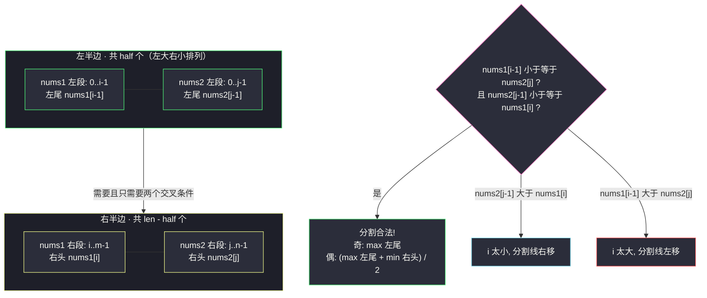
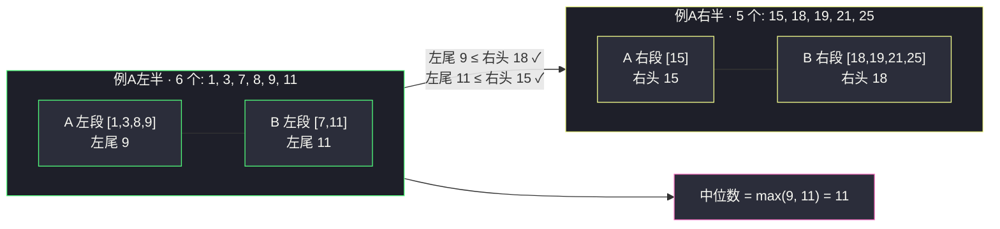

# 寻找两个正序数组的中位数（Hard·分割线二分）

## 一、问题描述

给定两个大小分别为 `m` 和 `n` 的**正序（从小到大）**数组 `nums1` 和 `nums2`。请你找出并返回这两个正序数组的**中位数**。

算法的时间复杂度应该为 `O(log (m+n))`。

> 🔗 LeetCode 4：https://leetcode.cn/problems/median-of-two-sorted-arrays/

**示例 1**

```
输入：nums1 = [1,3], nums2 = [2]
输出：2.00000
解释：合并数组 = [1,2,3]，中位数 2
```

**示例 2**

```
输入：nums1 = [1,2], nums2 = [3,4]
输出：2.50000
解释：合并数组 = [1,2,3,4]，中位数 (2 + 3) / 2 = 2.5
```

**直观理解**

中位数把所有元素**对半劈开**：左半边都 ≤ 它，右半边都 ≥ 它。  
与其真的把两个数组「合并再找中间」，不如直接在两个数组上各画一条**分割线**，让「左边总共 half 个元素、左边全体 ≤ 右边全体」。分割线的位置是单调可二分的——这就是本题 `O(log min(m, n))` 的全部秘密，也是整个二分家族的巅峰应用。

---

## 二、暴力解法（入门）

### 直观思路

归并两个有序数组成一个有序大数组，按总长度的奇偶取中点：

```java
public double findMedianSortedArrays(int[] nums1, int[] nums2) {
    int m = nums1.length, n = nums2.length;
    int[] merged = new int[m + n];
    int i = 0, j = 0, idx = 0;
    while (i < m && j < n) {
        merged[idx++] = nums1[i] <= nums2[j] ? nums1[i++] : nums2[j++];
    }
    while (i < m) merged[idx++] = nums1[i++];
    while (j < n) merged[idx++] = nums2[j++];
    int mid = (m + n) / 2;
    if (((m + n) & 1) == 1) {
        return merged[mid];
    }
    return (merged[mid - 1] + merged[mid]) / 2.0;
}
```

### 复杂度

- **时间**：`O(m + n)`，全部扫完
- **空间**：`O(m + n)`

### 🔴 瓶颈在哪里

题目要求 `O(log (m+n))`。更进一步：其实中位数只需要「正中间那一两个值」，两侧大半元素根本不用归并——我们要把「找中点」变成「对分割线位置二分」。

---

## 三、优化探索（核心章节·推导要扎实）

### 3.1 第一步：中位数 ⇔ 一条「对半分割线」

设总长度 `len = m + n`，规定**左半边的元素个数**：

- `len` 为奇数：`half = (len + 1) / 2`（左边多放一个，中位数 = 左边最大值）
- `len` 为偶数：`half = len / 2`（两边各半，中位数 = (左边最大 + 右边最小) / 2）

两种情况统一写成 `half = (len + 1) / 2`（整数除法自动下取整）。

现在设想在 `nums1` 上画分割线：左边放 `i` 个元素（下标 `0 .. i-1`），那么 `nums2` 左边必须放 `j = half - i` 个。两条线一画，「合并数组的左半部分」就齐了。

### 3.2 第二步：分割线合法的充要条件

**目标**：左边的所有元素 ≤ 右边的所有元素。

利用各数组内部已有有序性：`nums1[i-1] ≤ nums1[i]` 和 `nums2[j-1] ≤ nums2[j]`（同数组内部）天然成立。于是「整体有序」只差**交叉两个方向**：

```
分割合法 ⇔ nums1[i-1] <= nums2[j]  且  nums2[j-1] <= nums1[i]
          （数组1的左尾 ≤ 数组2的右头）（数组2的左尾 ≤ 数组1的右头）
```

数组边界处取哨兵：`i = 0` 时左尾视为 `-∞`；`i = m` 时右头视为 `+∞`（j 同理）。哨兵让边界情况无需特判。



### 3.3 第三步：i 的合法性具有单调性 → 二分

固定 `i` 看 `nums1[i-1] <= nums2[half - i]`：

- `i` 越大 → `nums1[i-1]` 越大（取更靠右的尾）且 `nums2[half-i]` 越小（j 变小）→ 条件**由真变假，单调！**
- 于是「满足条件最大的 i」唯一存在，且取到最大 i 时另一个交叉条件 `nums2[j-1] <= nums1[i]` 自动成立（否则 `i+1` 也满足条件，与最大性矛盾）。

⇒ 二分找**最大的 i 满足 `nums1[i-1] <= nums2[half - i]`**（`i ∈ [0, m]`），一步到位。

### 3.4 第四步：在短数组上二分

令 `nums1` 为较短的那个（`m <= n`）。这保证对任意 `i ∈ [0, m]`：

- `j = half - i >= half - m = (m+n+1)/2 - m >= (n)/2 - ... >= 0`（短数组贡献上限受控，j 不会为负）
- `j = half - i <= half <= n`（j 不越上界）

即**哨兵之外永远不用判 j 越界**。复杂度也因此是 `O(log min(m, n))`，比题目要求的还强。

### 3.5 关键问题

| 问题 | 答案 |
|------|------|
| 为什么 `half = (m+n+1)/2`？ | 奇数时左边比右边多 1 个，中位数恰是左边最大值，不用再碰右边；偶数时 `+1` 被整除丢弃，无副作用 |
| 两个交叉条件为什么不用在代码里都判？ | 二分取「最大 i」使第一个条件成立，第二个条件由最大性自动保证（反证见 3.3） |
| 中点为何上取整 `i = (l + r + 1) / 2`？ | 模板是「找最大满足值 + `r = i - 1`」收缩；若配下取整，`l = i` 可能让区间不动 → 死循环。与 #153「找最小 + 下取整」正好成对 |
| `nums1[i-1] == nums2[j]` 算合法吗？ | 算：中位数允许两边相等，`<=` 而非 `<` |
| 一个数组为空怎么办？ | 交换后短数组是空数组，`i = 0`、`j = half` 直接命中，哨兵把条件全放行，天然正确 |

### 3.6 一句话核心

> **短数组上二分分割线 i（j = half - i 自动确定），「左尾 ≤ 右头」的单调性支撑二分，合法分割处取 max 左尾 / min 右头即中位数。**

---

## 四、代码实现详解

### Java（主解：分割线二分）

> 说明：课源码未收录本题原题，主解按 class006 二分家族模板对齐（`l/r` 命名、`while l < r` 收缩、`(l + r + 1) >> 1` 上取整中点 + `r = i - 1` 的「找最大满足值」骨架）。

```java
// 寻找两个正序数组的中位数
// 测试链接 : https://leetcode.cn/problems/median-of-two-sorted-arrays/
public class Solution {

    public static double findMedianSortedArrays(int[] nums1, int[] nums2) {
        // 始终在较短的数组上二分，保证 j = half - i 不越界
        if (nums1.length > nums2.length) {
            int[] tmp = nums1;
            nums1 = nums2;
            nums2 = tmp;
        }
        int m = nums1.length, n = nums2.length;
        int half = (m + n + 1) / 2;   // 左半边应放元素个数
        // 找最大的 i (0 <= i <= m) 满足 nums1[i-1] <= nums2[half - i]
        int l = 0, r = m;
        while (l < r) {
            int i = (l + r + 1) >> 1; // 上取整，配合 r = i - 1 防死循环
            int j = half - i;
            if (nums1[i - 1] <= nums2[j]) {
                l = i;                // i 还能更大
            } else {
                r = i - 1;            // nums1[i-1] 太大，i 过头了
            }
        }
        int i = l, j = half - i;
        // 哨兵处理边界：分割线贴住数组两端时取 ±∞
        int left1 = (i == 0) ? Integer.MIN_VALUE : nums1[i - 1];
        int left2 = (j == 0) ? Integer.MIN_VALUE : nums2[j - 1];
        int right1 = (i == m) ? Integer.MAX_VALUE : nums1[i];
        int right2 = (j == n) ? Integer.MAX_VALUE : nums2[j];
        int leftMax = Math.max(left1, left2);
        int rightMin = Math.min(right1, right2);
        if (((m + n) & 1) == 1) {
            return leftMax;                       // 奇数：左半多放的那一个
        }
        return (leftMax + rightMin) / 2.0;        // 偶数：中间两值平均
    }
}
```

### Python

```python
# 寻找两个正序数组的中位数
# 测试链接 : https://leetcode.cn/problems/median-of-two-sorted-arrays/
class Solution:
    def findMedianSortedArrays(self, nums1: list[int], nums2: list[int]) -> float:
        # 保证在短数组上二分
        if len(nums1) > len(nums2):
            nums1, nums2 = nums2, nums1
        m, n = len(nums1), len(nums2)
        half = (m + n + 1) // 2
        # 找最大的 i 满足 nums1[i-1] <= nums2[half - i]
        l, r = 0, m
        while l < r:
            i = (l + r + 1) >> 1   # 上取整防死循环
            j = half - i
            if nums1[i - 1] <= nums2[j]:
                l = i
            else:
                r = i - 1
        i = l
        j = half - i
        left1 = nums1[i - 1] if i > 0 else float("-inf")
        left2 = nums2[j - 1] if j > 0 else float("-inf")
        right1 = nums1[i] if i < m else float("inf")
        right2 = nums2[j] if j < n else float("inf")
        left_max = max(left1, left2)
        right_min = min(right1, right2)
        if (m + n) % 2 == 1:
            return float(left_max)
        return (left_max + right_min) / 2
```

---

## 五、例子演示

### 例 A（主跟踪）：`A = [1,3,8,9,15]`，`B = [7,11,18,19,21,25]`

合并后是 `[1,3,7,8,9,11,15,18,19,21,25]`（共 11 个，中位数是第 6 个 = 11）。看算法怎么不合并找到它：

`m = 5, n = 6, len = 11`（奇），`half = (11+1)/2 = 6`。二分区间 `l = 0, r = 5`：

| 轮次 | l | r | i=(l+r+1)/2 | j=half-i | nums1[i-1] | nums2[j] | 判断 | 动作 |
|------|---|---|-------------|----------|------------|----------|------|------|
| 1 | 0 | 5 | 3 | 3 | A[2]=8 | B[3]=19 | 8 ≤ 19 ✓ | `l = 3`（i 还能更大） |
| 2 | 3 | 5 | 4 | 2 | A[3]=9 | B[2]=18 | 9 ≤ 18 ✓ | `l = 4` |
| 3 | 4 | 5 | 5 | 1 | A[4]=15 | B[1]=11 | 15 ≤ 11 ✗ | `r = 4`（i 过头） |
| 4 | 4 | 4 | — | — | `l == r` 汇合 | — | — | **i = 4, j = 2** |

分割结果：A 左段 `[1,3,8,9]`，B 左段 `[7,11]`，左半共 6 个 `{1,3,7,8,9,11}`；右半 `{15,18,19,21,25}`。  
验证另一交叉条件：`nums2[j-1]=11 <= nums1[i]=15` ✓（由最大性自动成立）。  
奇数长度 → `leftMax = max(9, 11) = 11` → **返回 11.0** ✅

### 例 B（官方示例 1，奇数小例）：`nums1 = [1,3]`，`nums2 = [2]`

短数组是 `nums2`，交换后 `nums1 = [2] (m=1)`，`nums2 = [1,3] (n=2)`。`half = (1+2+1)/2 = 2`。二分 `l = 0, r = 1`：

| 轮次 | l | r | i | j=2-i | nums1[i-1] | nums2[j] | 判断 | 动作 |
|------|---|---|---|-------|------------|----------|------|------|
| 1 | 0 | 1 | 1 | 1 | nums1[0]=2 | nums2[1]=3 | 2 ≤ 3 ✓ | `l = 1`，汇合 |

分割：左半 = `[2] + [1]` = `{1, 2}`，右半 = `{3}`。`leftMax = max(2, 1) = 2`，总长 3 奇 → **返回 2.0** ✅

### 例 C（官方示例 2，偶数）：`nums1 = [1,2]`，`nums2 = [3,4]`

`m = n = 2, len = 4`（偶），`half = (4+1)/2 = 2`。二分 `l = 0, r = 2`：

| 轮次 | l | r | i=(l+r+1)/2 | j=2-i | nums1[i-1] | nums2[j] | 判断 | 动作 |
|------|---|---|-------------|-------|------------|----------|------|------|
| 1 | 0 | 2 | 1 | 1 | 1 | nums2[1]=4 | 1 ≤ 4 ✓ | `l = 1` |
| 2 | 1 | 2 | 2 | 0 | 2 | nums2[0]=3（哨兵兜底） | 2 ≤ 3 ✓ | `l = 2`，汇合 |

分割：左半 = `[1,2] + 空` = `{1,2}`，右半 = `空 + [3,4]` = `{3,4}`。  
`leftMax = max(2, -∞) = 2`，`rightMin = min(+∞, 3) = 3`，偶数 → `(2 + 3) / 2 = 2.5` → **返回 2.5** ✅  
注意 j = 0 时左尾用 `-∞` 哨兵、i = m 时右头用 `+∞` 哨兵，两条边界一次展示。



---

## 六、复杂度分析

| 项目 | 复杂度 | 说明 |
|------|--------|------|
| 时间 | `O(log min(m, n))` | 只在短数组上下标域上二分，优于题目要求的 `O(log (m+n))` |
| 空间 | `O(1)` | 常数变量，哨兵不建数组 |

---

## 七、对比总结

### 方法对比

| 方法 | 时间 | 空间 | 说明 |
|------|------|------|------|
| 双指针归并全量 | `O(m + n)` | `O(m + n)` | 直观好写，不满足题目要求 |
| 双指针只走到中点 | `O((m+n)/2)` | `O(1)` | 省了归并数组但仍是线性 |
| 分割线二分（主解） | `O(log min(m, n))` | `O(1)` | 最优解，面试含金量天花板 |

### 易错点

1. **忘交换保证短数组**：j = half - i 可能为负或超过 n，越界崩溃。
2. **中点用下取整**：`l = i` + 下取整中点在 `l = r - 1` 时永远停在原地 → 死循环；「找最大满足值」必须配**上取整 + r = i - 1**。
3. **half 公式写成 `len / 2`**：奇数长度时左半少放一个，中位数会错误地取到右半。
4. **边界不加哨兵**：`i = 0` 访问 `nums1[-1]`、`j = n` 访问 `nums2[n]` 直接越界；±∞ 哨兵一行解决。
5. **两个交叉条件都写进循环判断**：能过但绕；「最大 i」的单调性已把第二个条件免费送给你。

### 模板口诀

> **短数组分长补半，二分分割线位置；左尾右头交叉验，max 左 min 右定乾坤。**

---

## 八、举一反三

| 题目 | 链接 | 迁移点 |
|------|------|--------|
| 378. 有序矩阵中第 K 小的元素 | https://leetcode.cn/problems/kth-smallest-element-in-a-sorted-matrix/ | 「不求合并、只做判定」的高级二分思想，值域版 |
| 34. 在排序数组中查找元素的第一个和最后一个位置 | https://leetcode.cn/problems/find-first-and-last-position-of-element-in-sorted-array/ | 与本题同为「找边界」二分：一个在单数组下标域，一个在分割线位置域 |
| 410. 分割数组的最大值 | https://leetcode.cn/problems/split-array-largest-sum/ | 同样是「二分一个分割方案 + 单调验证」的 Hard 结构 |
| 295. 数据流的中位数 | https://leetcode.cn/problems/find-median-from-data-stream/ | 对顶堆维护中位数；与本题静态双数组解法互补 |

**迁移一句**：本题把「二分」推到极致——不搜具体值、不搜下标，而是**二分一个决策（分割线放在哪）**并用 O(1) 单调判定验证。理解了「答案空间单调 ⇒ 可二分」，#4、#410、#378 这类 Hard 就只剩工程细节。
