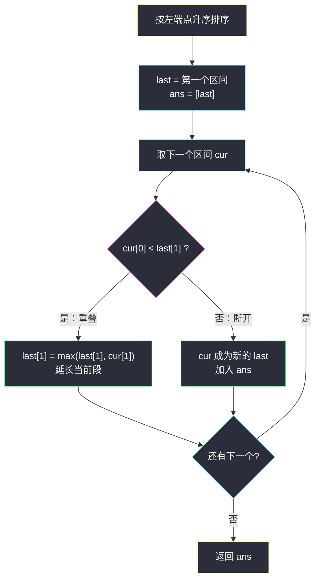
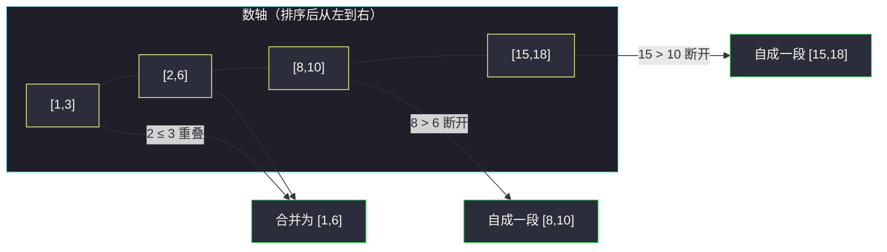

# 合并区间（排序 + 线性合并）

## 一、问题描述

以数组 `intervals` 表示若干个区间的集合，其中单个区间为 `intervals[i] = [start_i, end_i]`。请你合并所有重叠的区间，并返回一个**不重叠的区间数组**，它恰好覆盖输入中的所有区间。

> 🔗 LeetCode 56：https://leetcode.cn/problems/merge-intervals/

**示例 1**

```
输入：intervals = [[1,3],[2,6],[8,10],[15,18]]
输出：[[1,3],[2,6],[8,10],[15,18]] → [[1,6],[8,10],[15,18]]
解释：区间 [1,3] 和 [2,6] 重叠，将它们合并为 [1,6]。
```

**示例 2（单区间）**

```
输入：intervals = [[1,4],[4,5]]
输出：[[1,5]]
解释：区间 [1,4] 和 [4,5] 可视为重叠区间（端点相等也算接触）。
```

**直观理解**

区间是一堆「长短不一的线段」摊在数轴上，合并 = 把**互相连通（含端点相接）**的线段粘成一根。乱序时你不知道谁挨着谁；可一旦按**左端点从小到大**排好，重叠的区间必然**连续地挤在一起**——从左往右扫一遍，能接上就延长当前线段，接不上就开新线段。本题是整个「区间家族」（#57 插入、#452 射气球、#435 去重）的地基。

---

## 二、暴力解法（入门）

### 直观思路

不排序，直接对每对区间两两检查：只要 `a` 与 `ans` 里已有区间重叠就合并进它，反复多轮直到没有任何区间能再合并。更朴素一点的写法：双重循环，把当前区间与结果集里每个区间比较，重叠则吸收合并。

```java
public int[][] merge(int[][] intervals) {
    List<int[]> ans = new ArrayList<>();
    for (int[] cur : intervals) {
        // 把 cur 与 ans 中所有能重叠的区间合并成一个再放回去
        boolean merged = true;
        while (merged) {
            merged = false;
            for (int i = 0; i < ans.size(); i++) {
                if (overlap(cur, ans.get(i))) {   // 两区间相交
                    cur = union(cur, ans.remove(i)); // 吸收、删除旧区间
                    merged = true;                  // 吸收后可能还能再吞别人
                    break;
                }
            }
        }
        ans.add(cur);
    }
    return ans.toArray(new int[0][]);
}

private boolean overlap(int[] a, int[] b) {
    return a[0] <= b[1] && b[0] <= a[1];
}

private int[] union(int[] a, int[] b) {
    return new int[]{Math.min(a[0], b[0]), Math.max(a[1], b[1])};
}
```

### 复杂度

- **时间**：最坏 `O(n²)`——每个新区间都要和结果集里的区间反复比对、吸收。
- **空间**：`O(n)` 结果集。

### 🔴 瓶颈在哪里

1. 「谁和谁可能重叠」完全没有结构——任意两个区间都可能相交，只能两两试探；
2. 合并出新大区间后又要回头重新试探（一次吸收可能触发连锁合并），多轮空转。

根源是**乱序**：重叠信息散落各处。排好序之后，「能与当前区间合并的区间」一定**紧挨着排在后面**，连锁合并被压缩成一次从左到右的扫描。

---

## 三、优化探索（核心章节）

### 3.1 观察特征

| 特征 | 结论 |
|------|------|
| 输出的是区间本身，与输入顺序无关 | 允许**排序**重排输入 |
| 区间只有两个端点，重叠关系可 O(1) 判定 | 排序后相邻判定即可，无需数据结构 |
| 按**左端点升序**排序后 | 若 `intervals[i]` 与前面区间不重叠，则 `intervals[i+1..]` 中左端点更靠右，更不可能回头重叠 |

### 3.2 排序后线性合并

排序后从左到右扫，维护结果集最后一个区间 `last = ans.get(ans.size()-1)`：

- **`cur[0] <= last[1]`**：当前区间左端点没超过 last 的右端点 → 重叠（含端点相接），**延长**：`last[1] = max(last[1], cur[1])`；
- **否则**：`cur` 和后面的一切都与 last 不相交 → **开新段**，加入 `ans`。

关键在 `last[1] = max(...)`：当前区间可能**整个被 last 包住**（如 `[1,10]` 后跟 `[2,3]`），右端点只能扩不能缩。



### 3.3 关键推导问题

| 问题 | 答案 |
|------|------|
| 为什么按左端点排，不按右端点排？ | 我们判断「新段是否接得上」只需要盯住**已合并段的右端点**；左端点有序保证：一旦断开，后面所有区间左端点更大，绝无回头路 |
| 端点相等算不算重叠？ | 算。`[1,4]` 与 `[4,5]` 要合并成 `[1,5]`，所以判定条件是 `cur[0] <= last[1]`（≤ 不是 <） |
| `last[1] = max(last[1], cur[1])` 为什么要取 max？ | 防止「包住」退化：`[1,10]` 之后来 `[2,3]`，若直接覆盖成 3 就把区间截短了 |
| 不重不漏的论证？ | 每个区间恰好被访问一次；被并入 last 的区间其所覆盖的数轴范围完全被新 last 覆盖（两区间连续的并仍是区间，因为相交）；断开时 cur 与 last 无交且之后更无交 |
| 会不会有区间「隔着一段」再重叠？ | 不会。左端点有序 + cur 与 last 无交 ⟹ 后续区间左端点 ≥ cur[0] > last[1]，均与 last 无交 |

### 3.4 一句话核心

> **左端点排序让重叠区间连续；从左到右只维护「当前段的右端点」，接得上就延长，接不上就另起一段。**

---

## 四、代码实现详解

> 说明：课源码仓库未单独收录 #56；主解按课上区间处理体系（class027「最多线段重合问题」、class089/Code04_MeetingRoomsII 的「排序 + 端点扫描」骨架）书写，排序规则与判定条件即课上标准写法。

### Java（主解：排序 + 线性合并）

```java
// 合并区间
// 测试链接 : https://leetcode.cn/problems/merge-intervals/
class Solution {

    public int[][] merge(int[][] intervals) {
        // 按左端点升序，重叠的区间从此连续相邻
        Arrays.sort(intervals, (a, b) -> a[0] - b[0]);
        List<int[]> ans = new ArrayList<>();
        for (int[] cur : intervals) {
            int[] last = ans.get(ans.size() - 1);
            if (cur[0] <= last[1]) {
                // 重叠：延长当前段，右端点只能扩不能缩
                last[1] = Math.max(last[1], cur[1]);
            } else {
                // 断开：当前段结束，另起一段
                ans.add(cur);
            }
        }
        return ans.toArray(new int[0][]);
    }
}
```

提交时先放第一个区间再进循环更直观：

```java
public int[][] merge(int[][] intervals) {
    Arrays.sort(intervals, (a, b) -> a[0] - b[0]);
    List<int[]> ans = new ArrayList<>();
    ans.add(intervals[0]);                    // 第一个区间直接开段
    for (int i = 1; i < intervals.length; i++) {
        int[] last = ans.get(ans.size() - 1);
        int[] cur = intervals[i];
        if (cur[0] <= last[1]) {
            last[1] = Math.max(last[1], cur[1]);
        } else {
            ans.add(cur);
        }
    }
    return ans.toArray(new int[0][]);
}
```

### Python（同思路）

```python
class Solution:
    def merge(self, intervals: list[list[int]]) -> list[list[int]]:
        intervals.sort(key=lambda x: x[0])
        ans = [intervals[0][:]]
        for l, r in intervals[1:]:
            if l <= ans[-1][1]:               # 接得上：延长
                ans[-1][1] = max(ans[-1][1], r)
            else:                             # 接不上：另起一段
                ans.append([l, r])
        return ans
```

---

## 五、具体例子演示

`intervals = [[1,3],[2,6],[8,10],[15,18]]`。

**第 0 步：排序**（左端点升序，本例恰好已有序）：

```
[1,3]  [2,6]  [8,10]  [15,18]
```

**逐步扫描**（`last` 永远是 ans 里最后一段）：

| 步骤 | cur | last（扫描前） | 判定 `cur[0] ≤ last[1]` | 动作 | ans |
|------|-----|----------------|--------------------------|------|-----|
| 1 | `[1,3]` | —（空） | — | 开段 | `[[1,3]]` |
| 2 | `[2,6]` | `[1,3]` | 2 ≤ 3 ✔ | `last[1] = max(3,6) = 6` | `[[1,6]]` |
| 3 | `[8,10]` | `[1,6]` | 8 ≤ 6 ✘ | 断开，开新段 | `[[1,6],[8,10]]` |
| 4 | `[15,18]` | `[8,10]` | 15 ≤ 10 ✘ | 断开，开新段 | `[[1,6],[8,10],[15,18]]` |

**数轴视角**（重叠者被粘成一根）：



**再看包住情形** `[[1,10],[2,3],[4,5]]`（排序后顺序不变）：

- `[1,10]` 开段，last = `[1,10]`；
- `[2,3]`：2 ≤ 10 ✔，`last[1] = max(10,3) = 10`（**不取 max 就会错截成 3**）；
- `[4,5]`：4 ≤ 10 ✔，`last[1] = max(10,5) = 10`；
- 最终 `[[1,10]]`，正确。

---

## 六、复杂度分析

| 项目 | 排序 + 线性合并（主解） | 暴力吸收 |
|------|------------------------|----------|
| 时间 | `O(n log n)`：排序主导；扫描一遍 `O(n)` | `O(n²)` |
| 空间 | `O(log n)` 快排递归栈（不计输出）；额外 `O(1)` | `O(n)` 结果集反复增删 |

---

## 七、方法对比与总结

| | 暴力两两吸收 | 排序 + 线性合并 |
|--|--------------|------------------|
| 结构依赖 | 无序也能跑，但两两试探 | 必须先排序，换来「重叠必相邻」 |
| 连锁合并 | 多轮回头重试 | 一次扫描天然完成 |
| 复杂度 | `O(n²)` | `O(n log n)` |

**易错点**

1. **忘排序**或按右端点排错序：判定「断开」依赖左端点单调。
2. 判定用 `cur[0] < last[1]`（少了等号）：`[1,4],[4,5]` 该合并成 `[1,5]`，端点相接算重叠。
3. `last[1] = cur[1]` 直接覆盖：包住情形（`[1,10]` 后跟 `[2,3]`）把区间截短。
4. 忘记 `intervals` 里元素是长度 2 的数组，比较器写成 `a - b` 编译不过，要 `a[0] - b[0]`。

**模板口诀**

> **左端点排好队，接得上就拉长右边界；一旦断开即成段，后面谁也别回头。**

---

## 八、举一反三

| 题目 | 链接 | 迁移点 |
|------|------|--------|
| 57. 插入区间 | https://leetcode.cn/problems/insert-interval/ | 已有序时单点插入合并的三段式（[站内题解](/solutions/base/insert-interval.md)） |
| 452. 用最少数量的箭引爆气球 | https://leetcode.cn/problems/minimum-number-of-arrows-to-burst-balloons/ | 区间不重叠计数的对偶：合并的反面是「保留多少互不相交段」（[站内题解](/solutions/base/minimum-number-of-arrows-to-burst-balloons.md)） |
| 435. 无重叠区间 | https://leetcode.cn/problems/non-overlapping-intervals/ | 与 #452 同骨架：右端点排序 + 不相交计数，答案 = 总数 − 保留数 |
| 986. 区间列表的交集 | https://leetcode.cn/problems/interval-list-intersections/ | 两指针扫两组有序区间，判定相交取 `max(l1,l2), min(r1,r2)` |

**迁移一句**：区间题的第一反应永远是「**先按某个端点排序**」——合并类按左端点，计数/去重类按右端点；排序把散乱的重叠关系变成一条链上的相邻判定。
