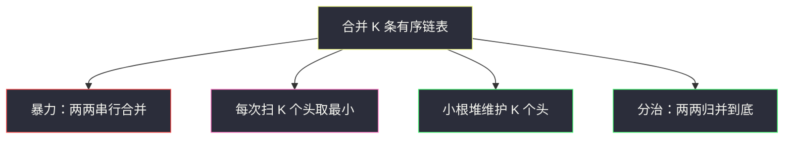
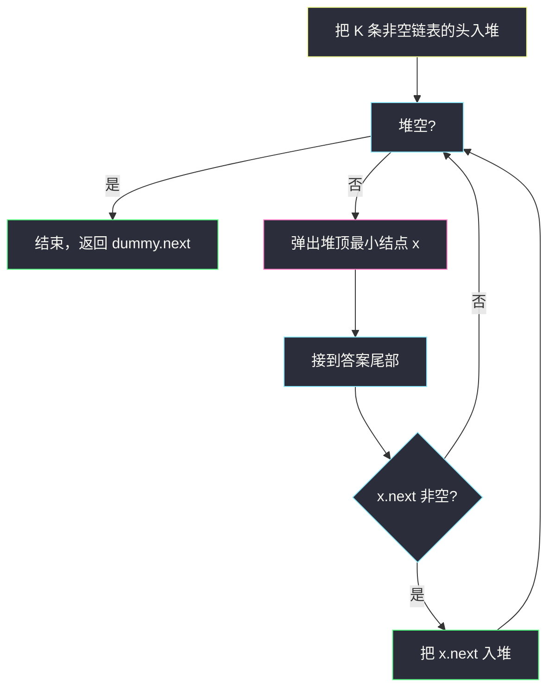
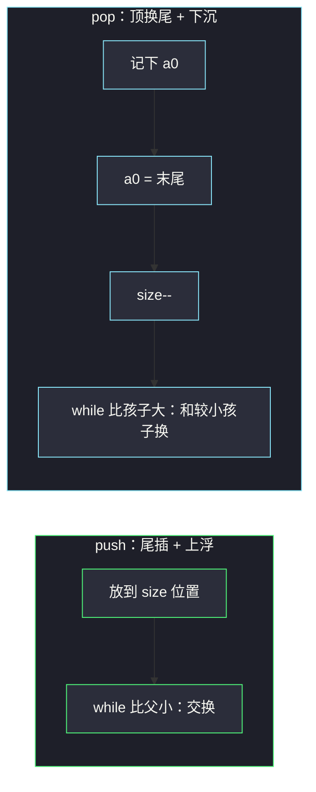
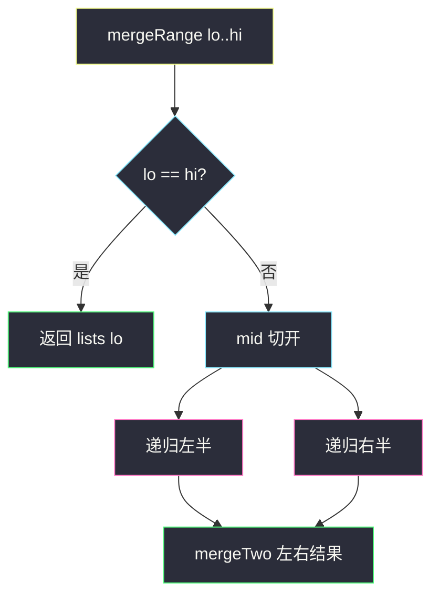

# 合并 K 个升序链表（逐条合并 → 手写堆 → 分治）

## 一、问题描述

给你一个链表数组，每个链表都已经**按升序排列**。  
请把所有链表合并成一条**升序**链表，并返回合并后的头结点。

> 🔗 LeetCode 23：https://leetcode.cn/problems/merge-k-sorted-lists/

**示例 1**

```
输入：lists = [[1,4,5],[1,3,4],[2,6]]
输出：[1,1,2,3,4,4,5,6]
解释：
  链表1: 1 → 4 → 5
  链表2: 1 → 3 → 4
  链表3: 2 → 6
合并后: 1 → 1 → 2 → 3 → 4 → 4 → 5 → 6
```

**示例 2（边界）**

```
输入：lists = []
输出：[]

输入：lists = [[]]
输出：[]
```

**直观理解**

就是多路归并：手里有 K 条已经排好序的队伍，要合成一条总队伍，始终从各队队首里挑**最小**的那个人出列。

```
队1: 1 → 4 → 5
队2: 1 → 3 → 4
队3: 2 → 6
每次看队首 → 选出最小 → 接到结果后面 → 该队前进一人
```

---

## 二、暴力解法（入门）：一条一条合并

### 直观思路

你已经会 [21. 合并两个有序链表](https://leetcode.cn/problems/merge-two-sorted-lists/)。  
那就把 K 条当成：先合并第 1、2 条，结果再和第 3 条合并……直到全部合完。

```java
class Solution {
    public ListNode mergeKLists(ListNode[] lists) {
        ListNode ans = null;
        for (ListNode list : lists) {
            ans = mergeTwo(ans, list);
        }
        return ans;
    }

    private ListNode mergeTwo(ListNode a, ListNode b) {
        ListNode dummy = new ListNode(0), tail = dummy;
        while (a != null && b != null) {
            if (a.val <= b.val) {
                tail.next = a;
                a = a.next;
            } else {
                tail.next = b;
                b = b.next;
            }
            tail = tail.next;
        }
        tail.next = (a != null) ? a : b;
        return dummy.next;
    }
}
```

### 复杂度

设一共 N 个结点，K 条链表。

- 第 i 次合并时，左边结果大约有 `(i/K)·N` 个结点，和一条平均 `N/K` 的链表合并 → 花费约 `O(i·N/K)`。
- 总时间约 `O(N + 2N/K + … + N) ≈ O(KN)`。
- 空间：`O(1)` 额外（不计递归栈；这里是迭代合并）。

### 🔴 瓶颈在哪里

前面已经排好的长链，后面每次合并都要再扫一遍——**早期结点被反复比较**。  
K 很大时，`O(KN)` 偏慢。目标：每次「在 K 个头里找最小」不要花 `O(K)`，或减少重复扫描。

---

## 三、优化探索（核心：三种正经解法）

### 3.1 观察特征

| 特征 | 说明 |
|------|------|
| 每条已有序 | 只需在「当前 K 个头」里选最小 |
| 多路归并 | 堆 / 分治都是归并排序的多路版 |
| 总结点数 N | 每个结点最终只应被处理常数～`log K` 次 |

### 3.2 方案总览



| 方案 | 时间 | 额外空间 | 特点 |
|------|------|----------|------|
| 串行两两合并 | `O(KN)` | `O(1)` | 最好写，偏慢 |
| 每轮扫 K 个头 | `O(KN)` | `O(1)` | 思路直接，仍慢 |
| **手写小根堆** | **`O(N log K)`** | `O(K)` | 面试常考，本章重点学堆 |
| **分治两两归并** | **`O(N log K)`** | `O(log K)` 栈 | 不依赖堆，也很经典 |

---

### 3.3 方案 A：每轮在 K 个头里找最小（过渡）

```java
class Solution {
    public ListNode mergeKLists(ListNode[] lists) {
        ListNode dummy = new ListNode(0), tail = dummy;
        while (true) {
            int best = -1;
            for (int i = 0; i < lists.length; i++) {
                if (lists[i] == null) continue;
                if (best == -1 || lists[i].val < lists[best].val) {
                    best = i;
                }
            }
            if (best == -1) break; // 全部空了
            tail.next = lists[best];
            tail = tail.next;
            lists[best] = lists[best].next;
        }
        return dummy.next;
    }
}
```

每个结点被选出时都扫一遍 K 个头 → `O(KN)`。  
下一步：用**堆**把「找最小」从 `O(K)` 降到 `O(log K)`。

---

### 3.4 方案 B（重点）：小根堆 —— 从零认识堆

#### 3.4.1 堆是什么？

**二叉堆**是一棵「近似完全二叉树」，用**数组**存：

```
下标:     0
        /   \
       1     2
      / \   / \
     3   4 5   6
```

| 关系 | 公式 |
|------|------|
| 父结点 | `(i - 1) / 2` |
| 左孩子 | `2*i + 1` |
| 右孩子 | `2*i + 2` |

**小根堆性质**：任意结点 ≤ 它的两个孩子 → **堆顶（下标 0）永远是最小**。

本题：堆里最多放 K 个「链表当前头」，每次取出最小头接到答案，若它还有 `next`，再把 `next` 扔进堆。



#### 3.4.2 两个核心操作：上浮 / 下沉

**入堆 `push`**：放到数组末尾，然后**上浮（sift up）**——不断和父结点比，更小就交换，直到堆序恢复。

**出堆 `pop`**：取出下标 0；把末尾元素挪到堆顶，然后**下沉（sift down）**——和更小的孩子交换，直到堆序恢复。

```
上浮示意（新插入 1）：
      2              1
     / \     →      / \
    5   3          5   2
   /              / \
  1              ·   3
```

```
下沉示意（弹出 1 后，把 5 放到顶再沉）：
      5              2
     / \     →      / \
    2   3          5   3
```

#### 3.4.3 手写小根堆（存 ListNode，按 val 比较）

下面**不用** `PriorityQueue`，自己实现，方便你学透。

```java
/** 小根堆：数组实现，比较结点的 val */
class MinHeap {
    private final ListNode[] a;
    private int size;

    MinHeap(int capacity) {
        a = new ListNode[capacity];
        size = 0;
    }

    boolean isEmpty() {
        return size == 0;
    }

    void push(ListNode node) {
        a[size] = node;
        siftUp(size);
        size++;
    }

    ListNode pop() {
        ListNode top = a[0];
        size--;
        a[0] = a[size];
        a[size] = null; // 帮助 GC，非必须
        if (size > 0) siftDown(0);
        return top;
    }

    /** 新来的往上冒：比父小就换 */
    private void siftUp(int i) {
        while (i > 0) {
            int p = (i - 1) / 2;
            if (a[i].val >= a[p].val) break;
            swap(i, p);
            i = p;
        }
    }

    /** 堆顶被换过：往下沉，和更小的孩子换 */
    private void siftDown(int i) {
        while (true) {
            int l = 2 * i + 1;
            int r = 2 * i + 2;
            int smallest = i;
            if (l < size && a[l].val < a[smallest].val) smallest = l;
            if (r < size && a[r].val < a[smallest].val) smallest = r;
            if (smallest == i) break;
            swap(i, smallest);
            i = smallest;
        }
    }

    private void swap(int i, int j) {
        ListNode t = a[i];
        a[i] = a[j];
        a[j] = t;
    }
}
```

**用堆合并 K 条链表：**

```java
class Solution {
    public ListNode mergeKLists(ListNode[] lists) {
        if (lists == null || lists.length == 0) return null;

        MinHeap heap = new MinHeap(lists.length);
        for (ListNode head : lists) {
            if (head != null) heap.push(head);
        }

        ListNode dummy = new ListNode(0), tail = dummy;
        while (!heap.isEmpty()) {
            ListNode x = heap.pop();   // 当前最小头
            tail.next = x;
            tail = x;
            if (x.next != null) {
                heap.push(x.next);     // 该链下一个候选人入堆
            }
        }
        return dummy.next;
    }
}
```

**复杂度**：每个结点入堆、出堆各一次，堆大小 ≤ K → **`O(N log K)`**，空间 **`O(K)`**。

#### 3.4.4 堆操作图解（帮助建立肌肉记忆）



**口诀**：

- 小根堆顶最小；
- 插入尾部往上浮；
- 删除顶部末尾补，再往下沉找位置；
- 父子下标：`父=(i-1)/2`，`左=2i+1`，`右=2i+2`。

---

### 3.5 方案 C：分治两两归并

把 K 条链表两两配对合并，得到 `⌈K/2⌉` 条，再两两合并……像归并排序的合并树。

```
lists:  L0  L1  L2  L3  L4
         \  /    \  /    |
          M01     M23    L4
            \     /      /
             \   /      /
              M0123    /
                \     /
                 \   /
                最终结果
```

每一层总共扫过约 O(N) 个结点，共 `⌈log K⌉` 层 → **`O(N log K)`**。

```java
class Solution {
    public ListNode mergeKLists(ListNode[] lists) {
        if (lists == null || lists.length == 0) return null;
        return mergeRange(lists, 0, lists.length - 1);
    }

    private ListNode mergeRange(ListNode[] lists, int lo, int hi) {
        if (lo == hi) return lists[lo];
        int mid = lo + (hi - lo) / 2;
        ListNode left = mergeRange(lists, lo, mid);
        ListNode right = mergeRange(lists, mid + 1, hi);
        return mergeTwo(left, right);
    }

    private ListNode mergeTwo(ListNode a, ListNode b) {
        ListNode dummy = new ListNode(0), tail = dummy;
        while (a != null && b != null) {
            if (a.val <= b.val) {
                tail.next = a;
                a = a.next;
            } else {
                tail.next = b;
                b = b.next;
            }
            tail = tail.next;
        }
        tail.next = (a != null) ? a : b;
        return dummy.next;
    }
}
```

也可以**迭代版**：在数组里原地两两合并，直到只剩一条（避免递归栈）。

```java
class Solution {
    public ListNode mergeKLists(ListNode[] lists) {
        if (lists == null || lists.length == 0) return null;
        int n = lists.length;
        while (n > 1) {
            int idx = 0;
            for (int i = 0; i < n; i += 2) {
                if (i + 1 < n) {
                    lists[idx++] = mergeTwo(lists[i], lists[i + 1]);
                } else {
                    lists[idx++] = lists[i];
                }
            }
            n = idx;
        }
        return lists[0];
    }

    private ListNode mergeTwo(ListNode a, ListNode b) {
        ListNode dummy = new ListNode(0), tail = dummy;
        while (a != null && b != null) {
            if (a.val <= b.val) { tail.next = a; a = a.next; }
            else { tail.next = b; b = b.next; }
            tail = tail.next;
        }
        tail.next = (a != null) ? a : b;
        return dummy.next;
    }
}
```



### 3.6 核心思想（各一句话）

- **串行合并**：会 mergeTwo，就循环 K-1 次。
- **扫头**：每步在 K 个头里找最小。
- **堆**：用小根堆动态维护「当前候选头」，取最小 `O(log K)`。
- **分治**：归并树，每层 O(N)，共 log K 层。

---

## 四、代码实现详解

### 4.1 手写堆完整版（Java，推荐精读）

见 **3.4.3**：`MinHeap` + `mergeKLists`。  
变量含义：

| 名字 | 含义 |
|------|------|
| `a[]` | 堆数组，`a[0]` 是最小头 |
| `size` | 当前堆中元素个数 |
| `siftUp` | 插入后恢复堆序 |
| `siftDown` | 删除堆顶后恢复堆序 |
| `dummy/tail` | 串结果链表 |

### 4.2 手写堆（Python）

```python
class MinHeap:
    def __init__(self):
        self.a: list[ListNode] = []

    def __bool__(self) -> bool:
        return bool(self.a)

    def push(self, node: ListNode) -> None:
        self.a.append(node)
        self._sift_up(len(self.a) - 1)

    def pop(self) -> ListNode:
        top = self.a[0]
        last = self.a.pop()
        if self.a:
            self.a[0] = last
            self._sift_down(0)
        return top

    def _sift_up(self, i: int) -> None:
        a = self.a
        while i > 0:
            p = (i - 1) // 2
            if a[i].val >= a[p].val:
                break
            a[i], a[p] = a[p], a[i]
            i = p

    def _sift_down(self, i: int) -> None:
        a = self.a
        n = len(a)
        while True:
            l, r = 2 * i + 1, 2 * i + 2
            smallest = i
            if l < n and a[l].val < a[smallest].val:
                smallest = l
            if r < n and a[r].val < a[smallest].val:
                smallest = r
            if smallest == i:
                break
            a[i], a[smallest] = a[smallest], a[i]
            i = smallest


class Solution:
    def mergeKLists(self, lists: list[ListNode | None]) -> ListNode | None:
        heap = MinHeap()
        for head in lists:
            if head:
                heap.push(head)
        dummy = tail = ListNode(0)
        while heap:
            x = heap.pop()
            tail.next = x
            tail = x
            if x.next:
                heap.push(x.next)
        return dummy.next
```

> 学完手写后，竞赛里可以用 `heapq`；面试若要求手写，就按上面默写 `siftUp/siftDown`。

### 4.3 分治版（Python）

```python
class Solution:
    def mergeKLists(self, lists: list[ListNode | None]) -> ListNode | None:
        if not lists:
            return None

        def merge_two(a: ListNode | None, b: ListNode | None) -> ListNode | None:
            dummy = tail = ListNode(0)
            while a and b:
                if a.val <= b.val:
                    tail.next, a = a, a.next
                else:
                    tail.next, b = b, b.next
                tail = tail.next
            tail.next = a or b
            return dummy.next

        def merge_range(lo: int, hi: int) -> ListNode | None:
            if lo == hi:
                return lists[lo]
            mid = (lo + hi) // 2
            return merge_two(merge_range(lo, mid), merge_range(mid + 1, hi))

        return merge_range(0, len(lists) - 1)
```

---

## 五、具体例子演示

`lists = [[1,4,5],[1,3,4],[2,6]]`，用手写堆。

**① 初始入堆三个头：`1, 1, 2`**

数组可能长这样（一种合法小根堆）：

```
      1
     / \
    1   2
```

**② 弹出 1**（假设来自链表1），接到答案；把 `4` 入堆。

```
堆中候选: 1(链2), 2(链3), 4(链1)
答案: 1
```

**③ 弹出 1**（链2），接入；把 `3` 入堆。

```
堆: 2, 3, 4
答案: 1 → 1
```

**④ 弹出 2**，接入；把 `6` 入堆。

```
堆: 3, 4, 6
答案: 1 → 1 → 2
```

**⑤** 依次弹出 `3 → 4 → 4 → 5 → 6`，堆空。

```
最终: 1 → 1 → 2 → 3 → 4 → 4 → 5 → 6
```


**分治视角同一例子**：先 `merge(L0,L1)` 得 `1→1→3→4→4→5`，再和 `L2` 合并得最终结果。

---

## 六、复杂度分析

设总结点数为 N，链表条数为 K。

| 方法 | 时间 | 额外空间 | 说明 |
|------|------|----------|------|
| 串行两两合并 | `O(KN)` | `O(1)` | 早期结点反复扫描 |
| 每轮扫 K 个头 | `O(KN)` | `O(1)` | 找最小太贵 |
| **手写小根堆** | **`O(N log K)`** | `O(K)` | 每结点入/出堆一次 |
| **分治归并** | **`O(N log K)`** | `O(log K)` 递归 | 共 log K 层，每层 O(N) |

---

## 七、方法对比与总结

| | 串行 merge | 扫头 | 堆 | 分治 |
|--|------------|------|----|------|
| 难度 | 最低 | 低 | 中（手写堆要练） | 中 |
| 面试 | 第一版 | 过渡 | **常考** | **常考** |
| 依赖 | mergeTwo | — | 堆结构 | mergeTwo |

**怎么选？**

- 想练基本功 / 堆还不熟 → **手写小根堆**（本题最佳学习路径）。
- 不想写堆、已会 mergeTwo → **分治**更干净。
- 库函数可用时：Java `PriorityQueue`，Python `heapq`（注意 Python 不能直接比 `ListNode`，要压 `(val, id, node)`）。

**易错点**

1. 空链表、`lists` 为空要处理。
2. 堆里只放**非空**头；弹出后记得把 `next` 入堆。
3. `siftDown` 要和**较小的**孩子交换（小根堆）。
4. 分治 `lo == hi` 返回 `lists[lo]`，不要越界。
5. `mergeTwo` 最后把剩余尾巴接上。

**手写堆默写骨架**

```java
push: a[size]=x; siftUp(size); size++;
pop:  top=a[0]; a[0]=a[--size]; siftDown(0); return top;
siftUp:   while i>0 && a[i]<a[parent]: swap; i=parent;
siftDown: while 有更小的孩子: swap; i=孩子;
```

---

## 八、举一反三

| 题目 | 关系 |
|------|------|
| [21. 合并两个有序链表](https://leetcode.cn/problems/merge-two-sorted-lists/) | 本题的二路基础 |
| [148. 排序链表](https://leetcode.cn/problems/sort-list/) | 链表归并排序 |
| [88. 合并两个有序数组](https://leetcode.cn/problems/merge-sorted-array/) | 数组二路归并 |
| [215. 数组中的第K个最大元素](https://leetcode.cn/problems/kth-largest-element-in-an-array/) | 继续练堆 |
| [295. 数据流的中位数](https://leetcode.cn/problems/find-median-from-data-stream/) | 对顶堆 |

**思想迁移**

```
多路有序序列要合成一路
  ↓
每次取各路「当前最小」
  ↓
候选集用小根堆维护          或        归并树两两合并
  O(N log K)                         O(N log K)
```

**记忆口诀**：

- 堆：K 个头进小堆，弹出最小再塞 next。  
- 分治：两两归并像归排，一层扫完 N，层数 log K。  
- 堆实现：尾插上浮、顶换尾再下沉。
