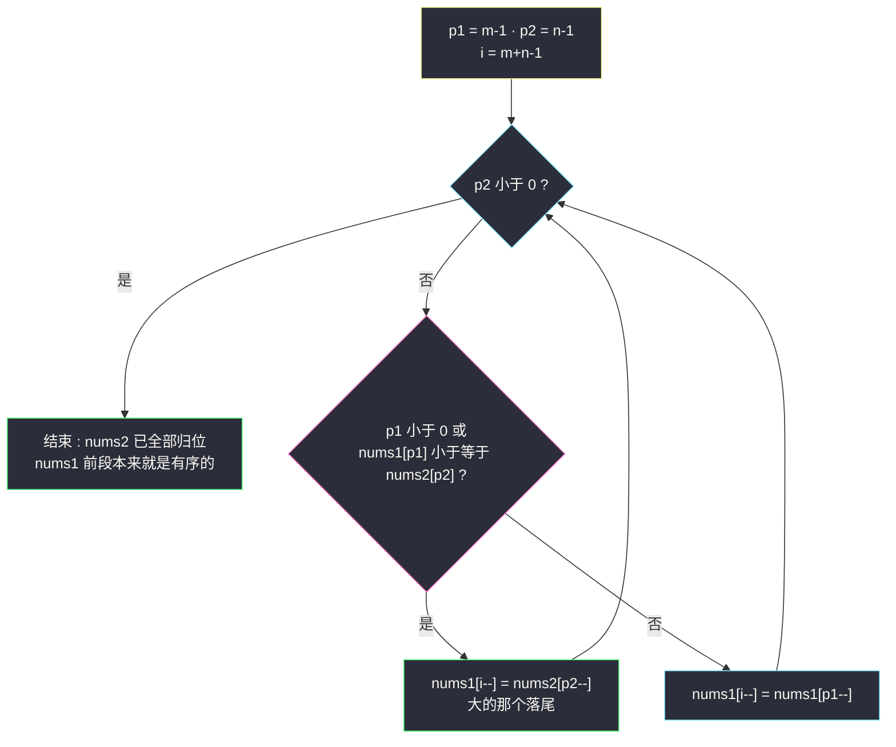
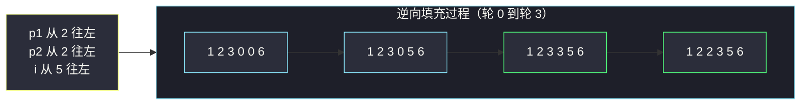

# 合并两个有序数组（逆向双指针，从尾部填充）

## 一、问题描述

给你两个按**非递减顺序**排列的整数数组 `nums1` 和 `nums2`，以及两个整数 `m` 和 `n`，分别表示 `nums1` 和 `nums2` 中的元素数目。

请你**合并** `nums2` 到 `nums1` 中，使合并后的数组同样按非递减顺序排列。

注意：`nums1` 的初始长度为 `m + n`，其中前 `m` 个元素表示应合并的元素，后 `n` 个元素为 `0`（占位），不应成为最终产品的一部分；最终的答案应**存储在数组 `nums1`** 中。

> 🔗 LeetCode 88：https://leetcode.cn/problems/merge-sorted-array/

**示例 1**

```
nums1 = [1,2,3,0,0,0], m = 3
nums2 = [2,5,6],       n = 3
输出：[1,2,2,3,5,6]
```

**示例 2**

```
nums1 = [1],  m = 1
nums2 = [],   n = 0
输出：[1]
```

**直观理解**

这就是归并排序里最核心的原子操作——`merge`：两条有序队列谁小谁先出，排成一条更长的有序队列。本题的特别之处是**目的地就是 nums1 本身**，而且它的**尾部恰好空着 n 个格子**。如果按习惯「从小到大」正面合并，写入位置会和 nums1 尚未处理的元素打架；反过来「**从大到小**」填尾部，每次写的都是当前最大值，写到哪都不会覆盖还没处理的数据——一次方向反转，原地合并零辅助空间。

---

## 二、暴力解法（入门）

### 直观思路

最省脑子的做法：把 `nums2` 直接拼到 `nums1` 尾部，然后整体排序。

```java
public void merge(int[] nums1, int m, int[] nums2, int n) {
    for (int i = 0; i < n; i++) {
        nums1[m + i] = nums2[i];   // 先拼接
    }
    Arrays.sort(nums1);            // 再整体排序
}
```

### 复杂度

- **时间**：`O((m+n) log (m+n))`——拼接 O(n) + 排序主导
- **空间**：`O(log (m+n))` 排序递归栈（不计原地因素）

### 🔴 瓶颈在哪里

**题目白送了「两个数组各自有序」这个信息，整体排序把它扔得一干二净**：两条已排好的序列合并本来只需各走一遍，`O(m+n)` 线性就能完成；`log` 因子纯属浪费。另外 `Arrays.sort` 的实现细节（双轴快排/插入混合）在面试里也说不清「你做了什么」。

---

## 三、优化探索（核心章节）

### 3.1 观察特征

| 特征 | 结论 |
|------|------|
| 两数组各自有序 | 归并：每次比较两队伍首（或尾），胜者出队——`O(m+n)` |
| 输出目的地 = nums1，尾部有 n 个空位 | 有地方写，问题只剩「写入顺序会不会破坏未读数据」 |
| 正向填充的冲突 | 写入位置 `i = m+n-1` 逐个向前……等等——正向是从头写，若当前写入位 <= nums1 待读位就会覆盖 |

**正向为什么不行（细节）**：假设从小到大填，`i` 指向 nums1 已写区末尾（初始 0）。当 nums2 的较小值源源不断写入时，写入指针会追上甚至越过 nums1 的读取指针，把还没参与比较的 `nums1[k]` 覆盖掉。要救就得开辅助数组（课上归并排序的 `help` 数组正是为此）。

**逆向为什么天然安全**：

- 读指针 `p1 = m-1`（nums1 有数据区的末尾）、`p2 = n-1`（nums2 末尾）、写指针 `i = m+n-1`（整个目标区末尾）；
- 每轮取 `nums1[p1]` 与 `nums2[p2]` 中**较大者**写入 `nums1[i]`；
- **不变式**：`i` 永远 ≥ `p1`（因为 `i - p1 = n - 已写个数 ≥ 0`……更准确地说：`i = p1 + p2 + 1`，只要 `p2 ≥ 0` 就有 `i > p1`）。写入位置永远在读取位置的**右侧或自身**，绝不会覆盖 nums1 未读的元素。



### 3.2 关键推导问题

| 问题 | 答案 |
|------|------|
| 循环条件为什么是 `p2 >= 0` 而不是 `p1 >= 0 && p2 >= 0`？ | nums2 的元素必须全部搬进 nums1；而 nums1 剩下的 `p1+1` 个本来就待在正确的前缀位置上，不用动 |
| `p1 < 0` 时还剩什么工作？ | nums1 的数已全部归位，把 nums2 剩余部分（`0..p2`）依次从尾往前复制即可——包含在 `nums1[i--] = nums2[p2--]` 分支里 |
| 会不会覆盖 nums1 未处理数据？ | 不会。写入前 `i = p1 + p2 + 1 ≥ p1 + 0 + 1 > p1`（当 `p2 ≥ 0`）；写大者保证 nums1 后段有序 |
| 为什么取「较大者」而不是较小者？ | 尾部位置放的是全局视角下的「当前剩余最大值」；若从小到大正向填，取小者但写入位置冲突——方向与比较方向必须配套 |
| 与归并排序的 merge 有何异同？ | 完全同构，只是课上归并（`class021`）用 `help` 辅助数组**正向**取小者；本题利用尾部空位改为**逆向**取大者，省掉辅助数组 |

### 3.3 一句话核心

> **谁大谁先住进尾巴：三个指针从后往前走，写入位永远在读取位右侧——方向一反，原地合并，零辅助空间。**

---

## 四、代码实现详解

> 说明：课源码仓库未单独收录 #88 原题。主解采用课上归并排序 `class021/Code02_MergeSort.java` 的 `merge` 骨架（双指针比较 + 逐个归位），把方向反转为「从尾部取大者填」，正是该骨架在「目标区自带空位」条件下的原地变体。

### Java（主解：逆向三指针）

```java
// 合并两个有序数组
// 测试链接 : https://leetcode.cn/problems/merge-sorted-array/
class Solution {

    public void merge(int[] nums1, int m, int[] nums2, int n) {
        int p1 = m - 1;      // nums1 有数据部分的末尾
        int p2 = n - 1;      // nums2 的末尾
        int i = m + n - 1;   // 整个目标区（nums1 全长）的末尾
        while (p2 >= 0) {    // nums2 全部归位即结束
            if (p1 < 0 || nums1[p1] <= nums2[p2]) {
                nums1[i--] = nums2[p2--]; // 较大者（或 nums1 已空）落尾
            } else {
                nums1[i--] = nums1[p1--];
            }
        }
    }
}
```

**变量含义**

| 变量 | 含义 |
|------|------|
| `p1` | nums1 **已读区**右边界，指向下一个待比较的 nums1 元素 |
| `p2` | nums2 **已读区**右边界 |
| `i` | nums1 **已写区**右边界（下一个落笔处） |

**不变式**：任意时刻 `nums1[i+1 .. m+n-1]` 是已就位的全局最大值序列（降序视角下有序）；`i = p1 + p2 + 1` 恒成立。

### Python

```python
# 合并两个有序数组
# 测试链接 : https://leetcode.cn/problems/merge-sorted-array/
class Solution:
    def merge(self, nums1: list[int], m: int, nums2: list[int], n: int) -> None:
        p1, p2, i = m - 1, n - 1, m + n - 1
        while p2 >= 0:
            if p1 < 0 or nums1[p1] <= nums2[p2]:
                nums1[i] = nums2[p2]
                p2 -= 1
            else:
                nums1[i] = nums1[p1]
                p1 -= 1
            i -= 1
```

---

## 五、具体例子演示

`nums1 = [1,2,3,0,0,0]`（m=3），`nums2 = [2,5,6]`（n=3）。初始 `p1=2, p2=2, i=5`。

| 轮 | p1 | p2 | i | nums1[p1] | nums2[p2] | 比较与动作 | 数组状态 |
|----|----|----|----|-----------|-----------|-----------|----------|
| 0 | 2 | 2 | 5 | 3 | 6 | 6 较大 → `nums1[5]=6`，p2→1 | `[1,2,3,0,0,6]` |
| 1 | 2 | 1 | 4 | 3 | 5 | 5 较大 → `nums1[4]=5`，p2→0 | `[1,2,3,0,5,6]` |
| 2 | 2 | 0 | 3 | 3 | 2 | 3 较大 → `nums1[3]=3`，p1→1 | `[1,2,3,3,5,6]` |
| 3 | 1 | 0 | 2 | 2 | 2 | 相等 → 按 `<=` 走 nums2：`nums1[2]=2`，p2→-1 | `[1,2,2,3,5,6]` |
| 4 | 1 | -1 | — | — | — | `p2 < 0` → **退出循环** | `[1,2,2,3,5,6]` ✅ |

注意轮 4：p1 还指着 `nums1[1]=2`，但它本来就待在正确的位置上（前缀有序），什么都不用做。这正是「循环条件只看 p2」的体现。

**对照演示「正向为什么会踩坑」**：若从小到大填，第一轮 `nums2[0]=2` 想写 `nums1[0]`，可那里的 `1` 还没参与比较；写到第三轮 `5` 想落 `nums1[2]` 时，原 `3` 已被 `2` 覆盖——数据丢失。逆向填充从头到尾没有一次覆盖。



---

## 六、复杂度分析

| 项目 | 逆向双指针（主解） | 拼接 + 整体排序（暴力） | 正向 + help 辅助数组 |
|------|--------------------|--------------------------|------------------------|
| 时间 | `O(m+n)` 每个元素恰好被读一次、写一次 | `O((m+n) log (m+n))` | `O(m+n)` |
| 空间 | `O(1)` 完全原地 | `O(log (m+n))` | `O(m+n)` 辅助数组 |

---

## 七、方法对比与总结

### 易错点

1. **循环条件写成 `p1 >= 0 && p2 >= 0`** → nums2 还剩数据就提前退出，尾部空位没填满。
2. **比较写成 `nums1[p1] < nums2[p2]`（丢等号）** → 相等时走 nums1 分支，最终也能对，但要保证两分支覆盖完备；规范写法 `<=` 配合 `p1 < 0` 短路最稳。
3. **忘了 `p1 < 0` 的保护** → nums1 先耗尽时 `nums1[p1]` 越界（-1 下标）。
4. **初始化 `p1 = nums1.length - 1`** → 应为 `m - 1`，尾部空位不是数据。
5. Python 里 `nums1[i--]` 这种写法不存在，赋值与自减必须拆开。

### 方法对比

| | 逆向双指针 | help 辅助数组（课上 merge 原型） |
|--|-------------|----------------------------------|
| 方向 | 从尾往头，取大者 | 从头往尾，取小者 |
| 空间 | `O(1)` | `O(m+n)` |
| 前提 | 目标区尾部有空位 | 无要求，通用 |

### 模板口诀

> **三指齐立尾，谁大谁进尾；p2 清零即收工，p1 剩余自然有序。**

---

## 八、举一反三

| 题目 | 链接 | 迁移点 |
|------|------|--------|
| 21. 合并两个有序链表 | https://leetcode.cn/problems/merge-two-sorted-lists/ | 同一个 merge 骨架搬到链表：dummy + 尾插 |
| 977. 有序数组的平方 | https://leetcode.cn/problems/squares-of-a-sorted-array/ | 「负数平方后大者集中在两端」——同样逆向双指针从两头取大者填尾（[站内题解](/solutions/base/squares-of-a-sorted-array.md)） |
| 912. 排序数组 | https://leetcode.cn/problems/sort-an-array/ | 本题的 merge 正是归并排序的核心原子操作（[站内题解](/solutions/base/sort-an-array.md)） |
| 4. 寻找两个正序数组的中位数 | https://leetcode.cn/problems/median-of-two-sorted-arrays/ | merge 思路的极限优化：不真合并，二分定位第 k 小 |

**迁移一句**：**「目标区自带空位 → 反着填」** 是数组原地算法的通用逃生门（合并、去重挪动、区间平移都常用）；正向冲突时第一反应应该是「从另一头做会不会就不冲突了」。
