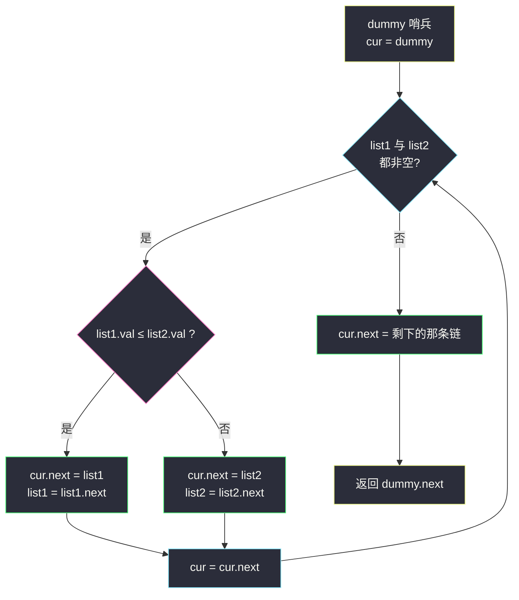
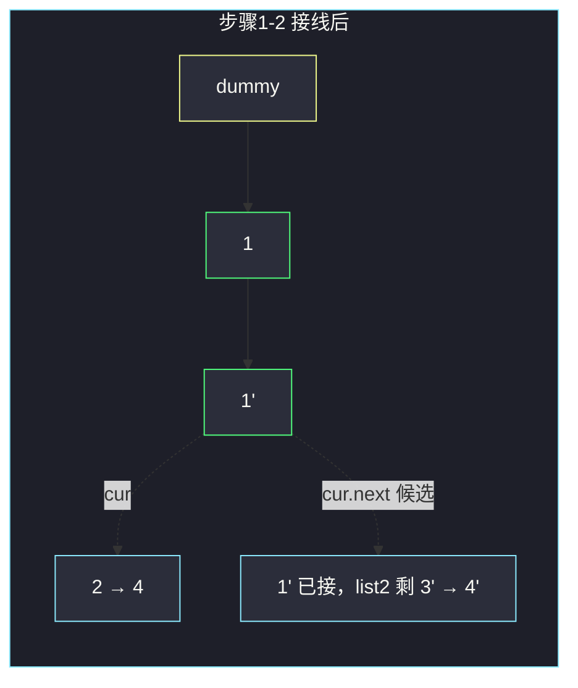

# 合并两个有序链表（归并穿针引线 + dummy 哨兵）

## 一、问题描述

将两个**升序**链表合并为一个新的升序链表并返回。新链表是通过拼接给定的两个链表的所有节点组成的（**不新建节点**，原地重连）。

> 🔗 LeetCode 21：https://leetcode.cn/problems/merge-two-sorted-lists/

**示例 1**

```
输入：list1 = [1,2,4], list2 = [1,3,4]
输出：[1,1,2,3,4,4]
```

**示例 2（边界）**

```
输入：list1 = [], list2 = [0]
输出：[0]
解释：一条链为空，直接返回另一条。
```

**直观理解**

两条链各自有序 → 这就是**归并排序里的 merge 步骤**：  
每次比较两条链当前的「队头」，把较小的那个节点接到结果链尾部，对应链前进一格；一条链走完后，把另一条剩下的整段直接挂上去。

---

## 二、暴力解法（入门）

### 直观思路

不管什么指针技巧：把两条链的所有值读进一个数组，排序后**新建节点**串成一条新链。

```java
public ListNode mergeTwoLists(ListNode list1, ListNode list2) {
    List<Integer> vals = new ArrayList<>();
    for (ListNode p = list1; p != null; p = p.next) vals.add(p.val);
    for (ListNode p = list2; p != null; p = p.next) vals.add(p.val);
    Collections.sort(vals);

    ListNode dummy = new ListNode(-1), cur = dummy;
    for (int v : vals) {
        cur.next = new ListNode(v);
        cur = cur.next;
    }
    return dummy.next;
}
```

### 复杂度

- **时间**：`O((m+n) log(m+n))`，`m`、`n` 是两条链长度
- **空间**：`O(m+n)`，数组 + 新建的整条链

### 🔴 瓶颈在哪里

完全丢掉了「**两条链各自已经有序**」这个条件，白白排序、白白建链。  
两路本身有序，本来一次线性扫描就能归出来——这题就是**二路归并**在链表上的样子。

---

## 三、优化探索（核心章节）

### 3.1 观察特征

| 特征 | 说明 |
|------|------|
| 两条链各自升序 | 任何时刻，两条链未处理部分的**头部就是各自最小值**，全局下一个该输出的必然是两者中较小的那个 |
| 不许新建节点 | 「接上原节点」而不是「拷贝值」→ 穿针引线，只改 `next` 指针 |
| 一条链为空的边界 | 循环条件用 `list1 != null && list2 != null`，剩下的整段尾巴一次挂上 |

### 3.2 暴力 → 优化：穿针引线二路归并

1. 设一个**哨兵节点 `dummy`**，`cur` 指针从 `dummy` 出发——`cur` 永远指向结果链的**最后一个节点**。
2. 两条链都非空时循环：
   - `list1.val <= list2.val` → `cur.next = list1`，`list1 = list1.next`
   - 否则 → `cur.next = list2`，`list2 = list2.next`
   - `cur = cur.next`（针脚后移）
3. 循环结束时必有一条链为空，`cur.next = 非空的那条`（可能为 `null`，也正好成立）。
4. 返回 `dummy.next`——哨兵帮我们免掉「结果链头结点是谁」的特判。

**为什么要 dummy（哨兵）？**  
没有它，第一个节点必须写 `if (head == null) head = ...` 单独处理；有了它，**头结点和后续所有节点走同一套接线逻辑**，循环体没有任何特判。这是链表题最好用的「免边界」技巧。



### 3.3 关键推导问题

| 问题 | 答案 |
|------|------|
| 为什么每次接较小的队头一定正确？ | 反证：若下一步该输出 `x` 但接了更大的 `y`，则 `x` 只能排在 `y` 之后，违反升序 |
| 比较时用 `<=` 还是 `<`？ | 都对。`<=` 让值相等时优先接 `list1`，结果稳定（LC 不检查顺序） |
| 剩下的尾巴还要逐个接吗？ | 不用。剩余部分本身有序且全部 ≥ 已接部分，整段 `cur.next = 剩余头` 即可 |
| 会不会断链？ | 接线顺序是先 `cur.next = 队头`，再让该队头链前进；被接节点的原 `next` 在它成为队头前不会被改，安全 |
| 递归写法行不行？ | 行且很短：小头 `head.next = merge(小头.next, 另一条)`，但栈深 `O(m+n)`，长链上不如迭代稳 |

### 3.4 一句话核心

> **哨兵定头，双指针比队头，小的接上、针脚后移；一条走空，整段挂尾。**

---

## 四、代码实现详解

### Java（主解：dummy 哨兵迭代版，面试默写版）

```java
// 合并两个有序链表（归并穿针引线 + dummy 哨兵）
// 测试链接 : https://leetcode.cn/problems/merge-two-sorted-lists/
class Solution {
    public ListNode mergeTwoLists(ListNode list1, ListNode list2) {
        // 哨兵节点：统一「结果链头是谁」的边界，免特判
        ListNode dummy = new ListNode(-1);
        ListNode cur = dummy; // cur 永远指向结果链最后一个节点
        while (list1 != null && list2 != null) {
            if (list1.val <= list2.val) {
                cur.next = list1;
                list1 = list1.next;
            } else {
                cur.next = list2;
                list2 = list2.next;
            }
            cur = cur.next;
        }
        // 剩下的那条链（可能为 null）整段挂上
        cur.next = (list1 != null) ? list1 : list2;
        return dummy.next;
    }
}
```

### Java（课上写法：class010，不设哨兵、先选小头）

课源码 `src/class010/MergeTwoLists.java` 的写法不用哨兵：先比较两个头，把**较小者定为结果头**，再从它后面开始穿：

```java
// 课上写法：先选小的一边当头，省一个哨兵节点
// 测试链接 : https://leetcode.cn/problems/merge-two-sorted-lists/
public static ListNode mergeTwoLists(ListNode head1, ListNode head2) {
    if (head1 == null || head2 == null) {
        return head1 == null ? head2 : head1;
    }
    // 1. 较小者做结果头
    ListNode head = head1.val <= head2.val ? head1 : head2;
    ListNode cur1 = head.next;              // 小头所在链的剩余部分
    ListNode cur2 = head == head1 ? head2 : head1; // 另一条链
    ListNode pre = head;                    // 等价于主解的 cur
    // 2. 之后的接线逻辑与主解完全相同
    while (cur1 != null && cur2 != null) {
        if (cur1.val <= cur2.val) {
            pre.next = cur1;
            cur1 = cur1.next;
        } else {
            pre.next = cur2;
            cur2 = cur2.next;
        }
        pre = pre.next;
    }
    pre.next = cur1 != null ? cur1 : cur2;
    return head;
}
```

两版**算法完全同构**，只是处理「第一个节点」的方式不同：课上版省一个节点但开头多两行；dummy 版全程无特判，更好默写。链表题按站点规范以简洁版为主解。

### Python

```python
# 合并两个有序链表（归并穿针引线 + dummy 哨兵）
# 测试链接 : https://leetcode.cn/problems/merge-two-sorted-lists/
class Solution:
    def mergeTwoLists(self, list1: ListNode, list2: ListNode) -> ListNode:
        dummy = cur = ListNode(-1)  # 哨兵；cur 是结果链的针脚
        while list1 and list2:
            if list1.val <= list2.val:
                cur.next = list1
                list1 = list1.next
            else:
                cur.next = list2
                list2 = list2.next
            cur = cur.next
        cur.next = list1 if list1 else list2  # 剩下的整段挂上
        return dummy.next
```

---

## 五、例子演示

以 `list1 = 1→2→4`，`list2 = 1→3→4` 为例。记 `list2` 的节点为 `1' 3' 4'`。

**初始**：`dummy(-1)`，`cur = dummy`

| 步 | 比较队头 | 动作 | 结果链（dummy 出发） | 剩余 list1 | 剩余 list2 |
|----|----------|------|----------------------|-----------|-----------|
| 1 | `1` vs `1'` | 取左（`<=` 稳定），`cur.next=1`，list1 前进 | -1→1 | 2→4 | 1'→3'→4' |
| 2 | `2` vs `1'` | 取右，`cur.next=1'`，list2 前进 | -1→1→1' | 2→4 | 3'→4' |
| 3 | `2` vs `3'` | 取左，`cur.next=2`，list1 前进 | -1→1→1'→2 | 4 | 3'→4' |
| 4 | `4` vs `3'` | 取右，`cur.next=3'`，list2 前进 | …→2→3' | 4 | 4' |
| 5 | `4` vs `4'` | 取左，`cur.next=4`，list1 前进 | …→3'→4 | null | 4' |
| 6 | list1 空 | 循环结束，`cur.next = 4'` 整段挂尾 | …→4→4' | — | — |

返回 `dummy.next`，即 `1→1→2→3→4→4`。



**边界演示（示例 2）**：`list1 = []` → 循环一次都不进，`cur.next = list2`，返回 `0`。哨兵方案下空链不需要任何特殊代码。

---

## 六、复杂度分析

| 项目 | 复杂度 | 说明 |
|------|--------|------|
| 时间 | `O(m + n)` | 每个节点恰好被比较、接上一次；尾巴整段 O(1) 挂上 |
| 空间 | `O(1)` | 只用 `dummy / cur / list1 / list2` 几个指针，节点全部复用 |

递归版时间同为 `O(m+n)`，但栈深 `O(m+n)`，链长上百万时会爆栈——迭代版是唯一工程向选择。

---

## 七、对比总结

### 易错点

1. **忘了接尾巴**：循环结束后必须 `cur.next = 剩余链`，漏掉则链被截断。
2. **用 `list1.next` 前进后比较**：应先接线再前进，顺序写反会丢节点。
3. **返回 `dummy` 而不是 `dummy.next`**：哨兵的值（如 `-1`）是假的，不能进答案。
4. **新建节点拼链**（暴力习惯）：题目要求拼接原节点，新建既费空间又不符合链表归并的考点。
5. **`==` 比较 Integer 缓存坑**：如果值存在 `Integer` 里用 `==` 比较，超出 `[-128,127]` 会错，一律用 `.val` 的数值比较。

### 迭代 vs 递归

| | 迭代（主解） | 递归 |
|--|--------------|------|
| 时间 | `O(m+n)` | `O(m+n)` |
| 空间 | `O(1)` | `O(m+n)` 栈 |
| 代码 | 一个 while | 三行，但依赖系统栈 |
| 适用 | 面试默认 | 讲递归归并思路时 |

### 模板口诀

> **dummy 定头免特判，双头小者先接线；一条走空挂整尾，返回 dummy.next。**

这个 merge 是「链表归并排序」（148）和「合并 K 条链表」（23，两两 merge 或小根堆）的底层积木，必须肌肉记忆。

---

## 八、举一反三

| 题目 | 链接 | 迁移点 |
|------|------|--------|
| 23. 合并 K 个升序链表 | https://leetcode.cn/problems/merge-k-sorted-lists/ | K 路归并 = 两两调本题，或小根堆每次取最小头 |
| 88. 合并两个有序数组 | https://leetcode.cn/problems/merge-sorted-array/ | 同一归并，改成数组且**从尾部往前**填避免覆盖 |
| 148. 排序链表 | https://leetcode.cn/problems/sort-list/ | 快慢指针切半 → 递归排两条 → **本题 merge** |
| 206. 反转链表 | https://leetcode.cn/problems/reverse-linked-list/ | 同样是「只动 next 指针」的穿针引线基本功 |

**迁移一句**：凡「两条有序序列合成一条」——数组、链表、归并树、外部排序——骨架永远是**比队头、接小者、挂尾巴**。
