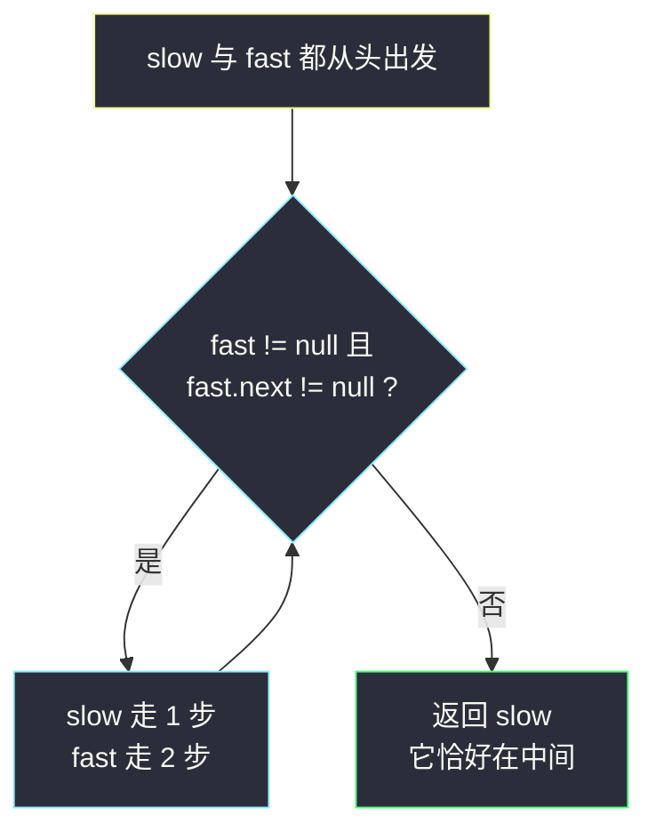
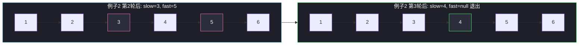

# 链表的中间结点（快慢指针找中点）

## 一、问题描述

给你单链表的头结点 `head`，请你找出并返回链表的**中间结点**。如果有两个中间结点，返回**第二个**中间结点。

> 🔗 LeetCode 876：https://leetcode.cn/problems/middle-of-the-linked-list/

**示例 1**

```
输入：head = [1,2,3,4,5]
输出：[3,4,5]
（节点 3 是中间节点，返回以它开头的这段链表）
```

**示例 2**

```
输入：head = [1,2,3,4,5,6]
输出：[4,5,6]
（两个中间节点 3 和 4，返回第二个）
```

**直观理解**

链表没有下标、没有 `length`，「中间在哪」本身就需要走过去才知道。最直白的办法是数一遍长度再走一半——但这要**两遍扫描**。

想象两个人在跑道上同时出发：一个的速度是另一个的**两倍**。当快的人到达终点时，慢的人恰好跑了一半——这就是快慢指针。

这道题是链表双指针的地基题：234 回文链表、143 重排链表、148 排序链表，全都拿「找中点」当第一块积木。

---

## 二、暴力解法（两遍扫描）

### 思路

第一遍数出长度 `n`，中间结点就是第 `⌊n / 2⌋ + 1` 个（下标从 1 开始）；第二遍从头走 `⌊n / 2⌋` 步即到。

```java
class Solution {
    public ListNode middleNode(ListNode head) {
        int n = 0;
        for (ListNode cur = head; cur != null; cur = cur.next) {
            n++;
        }
        ListNode cur = head;
        for (int i = 0; i < n / 2; i++) {
            cur = cur.next;
        }
        return cur;
    }
}
```

（另一路暴力：把节点全部塞进 `ArrayList`，直接返回 `list.get(n / 2)`，时间 `O(n)`、空间 `O(n)`，不再展开。）

### 复杂度

- **时间**：`O(n)`（但扫了两遍）
- **空间**：`O(1)`

### 🔴 瓶颈在哪里

1. 必须先知道全貌（长度）才能定位中点——**依赖随机访问/计数**，链表不擅长。
2. 面试官会追问：「只允许走一遍呢？」
3. 数组版暴力还额外背 `O(n)` 空间。

---

## 三、优化探索（核心章节）

### 3.1 观察特征

| 特征 | 说明 |
|------|------|
| 单向单链 | 只能从前往后走，没有回头路 |
| 中点 = 一半路程 | 位置信息可以用「**同时出发的两个指针**」携带 |
| 快慢配速 2:1 | 任意时刻快指针走的步数是慢指针的**两倍**；快到终点，慢恰在中点 |

### 3.2 快慢指针（等距追踪）

两个指针都从 `head` 出发：

- `slow` 每次走 **1** 步；
- `fast` 每次走 **2** 步；
- 循环条件：`fast != null && fast.next != null`（快指针还能再跳两步才继续）。

`fast` 到达链尾时，`slow` 恰好走过一半路程，停在中间结点上。

**循环不变式**：每一轮结束后，`fast` 走过的步数恰好是 `slow` 的两倍。所以 `fast` 走完全程 n 步时，`slow` 走了 `n / 2` 步——正是中点位置。

### 3.3 偶数长度为什么恰好返回「第二个」中点

设偶数长度 n = 6，链表 `1→2→3→4→5→6`：

- 循环条件 `fast != null && fast.next != null` 会执行 `n / 2 = 3` 轮；
- 第 3 轮后 `fast` 落在 `null`（越过了最后一个节点），`slow` 走了 3 步停在**第 4 个节点**——即第二个中点 ✅。

对照**课上（class034/Code04 回文链表）的找中点骨架**：

```java
while (fast.next != null && fast.next.next != null) {
    slow = slow.next;
    fast = fast.next.next;
}
```

这个版本偶数长度停在**第一个**中点（`fast` 停在最后一个节点上不动了），适合回文题「从后半段第一个节点开始反转」的需求。

**两版模板对照（高频易混，务必分清）**：

| 循环条件 | 奇数长度停在哪 | 偶数长度停在哪 | 适用 |
|----------|---------------|---------------|------|
| `fast != null && fast.next != null`（本题） | 正中间 | **后**一个中点 | 876、143、148 |
| `fast.next != null && fast.next.next != null`（课上版） | 正中间 | **前**一个中点 | 234 回文链表 |

### 3.4 关键推导问题

| 问题 | 答案 |
|------|------|
| 为什么 `fast` 判空要写在前面？ | 短路求值：`fast == null` 时访问 `fast.next` 会空指针异常 |
| 空链表 / 单节点？ | 循环一次不进，直接返回 `head`（null 或单节点自身），天然正确 |
| 快指针会不会「跳过」终点导致死循环？ | 不会：`fast` 或 `fast.next` 为 null 时条件立即失败退出 |
| 一遍扫描如何「不知道长度就定位一半」？ | 用 2:1 配速把位置关系编码进两个指针的相对距离里 |

### 3.5 一句话核心

> **快的跑两步，慢的跑一步；快的到终点，慢的正好在中点。**



---

## 四、代码实现详解

### Java（快慢指针 · 主解）

```java
class Solution {
    public ListNode middleNode(ListNode head) {
        ListNode slow = head, fast = head;
        while (fast != null && fast.next != null) {
            slow = slow.next;      // 慢指针走 1 步
            fast = fast.next.next; // 快指针走 2 步
        }
        return slow;
    }
}
```

### Java（前中点变体 · 备注）

如果某题需要偶数长度取**第一个**中点（如 234 回文链表方便反转后半段），只改循环条件：

```java
while (fast.next != null && fast.next.next != null) {
    slow = slow.next;
    fast = fast.next.next;
}
```

### Python（同思路）

```python
class Solution:
    def middleNode(self, head: ListNode | None) -> ListNode | None:
        slow = fast = head
        while fast and fast.next:
            slow = slow.next
            fast = fast.next.next
        return slow
```

Python 里 `while fast and fast.next` 即两个判空的短路写法，与 Java 逻辑完全一致。

---

## 五、具体例子演示

### 例子 1：奇数长度 `[1,2,3,4,5]`

初始：`slow = 1`，`fast = 1`。

| 轮次 | 判断条件 | slow | fast | 说明 |
|------|----------|------|------|------|
| — | 初始 | 1 | 1 | 同一起点 |
| 1 | fast=1, fast.next=2 均非空 → 进 | 2 | 3 | 各前进 |
| 2 | fast=3, fast.next=4 均非空 → 进 | 3 | 5 | fast 到达最后一个节点 |
| 3 | fast.next=null → **退出** | 3 | 5 | 返回 slow = **3** ✅ |

```
轮2结束（退出）时：
1 → 2 → 3 → 4 → 5 → null
    ↑slow（第 3 个 = 正中间）
            ↑fast（终点）
```

### 例子 2：偶数长度 `[1,2,3,4,5,6]`

初始：`slow = 1`，`fast = 1`。

| 轮次 | 判断条件 | slow | fast | 说明 |
|------|----------|------|------|------|
| — | 初始 | 1 | 1 | |
| 1 | fast=1, fast.next=2 均非空 → 进 | 2 | 3 | |
| 2 | fast=3, fast.next=4 均非空 → 进 | 3 | 5 | fast 到最后一个节点 |
| 3 | fast=5, fast.next=6 均非空 → 进 | 4 | **null** | fast 越过终点 |
| 4 | fast=null → **退出** | 4 | null | 返回 slow = **4** ✅（第二个中点） |

```
轮3结束（退出）时：
1 → 2 → 3 → 4 → 5 → 6 → null
         ↑slow（第 4 个 = 后一个中点）
                  ↑fast 越过终点落在 null
```



（图中粉色 = 该轮指针所停节点；绿色 = 最终答案。）

**极简边界**：`head = []` 时 `fast = null`，循环不进，返回 `null`；`head = [7]` 时 `fast.next = null`，同样不进循环，返回节点 7 自己。

---

## 六、复杂度分析

| 方法 | 时间 | 额外空间 | 说明 |
|------|------|----------|------|
| 两遍扫描 | `O(n)` | `O(1)` | 先数长度再走一半 |
| 数组下标 | `O(n)` | `O(n)` | 依赖额外数组 |
| **快慢指针** | **`O(n)`** | **`O(1)`** | 主解：一遍扫描，只走一次 |

快指针总共走 `n` 步、慢指针 `n / 2` 步，加起来仍是一个 `O(n)` 量级，但链表只被**从头到尾摸了一遍**。

---

## 七、方法对比与总结

### 易错点

1. **判空顺序写反**（`fast.next != null && fast != null`）→ `fast` 为 null 时先访问 `fast.next`，空指针异常。
2. **用错模板版本** → 本题要求偶数取**第二个**中点，必须用 `fast != null && fast.next != null`；写成课上回文版会返回第一个中点，示例 2 直接错。
3. **忘记两指针同起点** → 有人让 `fast` 先走一步「对齐奇偶」，反而把两个中点的规则搞乱，本题不需要。
4. **担心 fast 跳过 null 检查** → 条件里 `fast != null` 兜住了跳两步落空的情况，不会越界。

### 三种方法对比

| | 两遍扫描 | 数组下标 | 快慢指针 |
|--|---------|---------|---------|
| 时间 | `O(n)` 两遍 | `O(n)` 一遍 | `O(n)` 一遍 |
| 空间 | `O(1)` | `O(n)` | `O(1)` |
| 一遍完成 | ❌ | ✅ | ✅ |
| 面试默写 | 保底 | 不推荐 | ✅ 首选 |

### 模板口诀

> **同起同发，快二慢一；快到终点，慢在中点。偶数取后要记牢：判空条件是 `fast` 当先。**

---

## 八、举一反三

| 题目 | 链接 | 迁移点 |
|------|------|--------|
| 234. 回文链表 | https://leetcode.cn/problems/palindrome-linked-list/ | 用「前中点」版找中点 + 反转后半段 + 逐个比对 |
| 143. 重排链表 | https://leetcode.cn/problems/reorder-list/ | 找中点、反转后半、交错拼接三连 |
| 148. 排序链表 | https://leetcode.cn/problems/sort-list/ | 快慢指针找中点是归并分割的第一步 |
| 141. 环形链表 | https://leetcode.cn/problems/linked-list-cycle/ | 快慢指针判断有环（2:1 配速的另一种用途） |
| 19. 删除链表的倒数第 N 个结点 | https://leetcode.cn/problems/remove-nth-node-from-end-of-list/ | 双指针「先让 fast 走 N 步」制造等距 |

**迁移一句**：链表题需要「中间、一半、倒数第 k」这类**位置信息**时，第一反应就是双指针配速制造距离差，而不是数长度。
