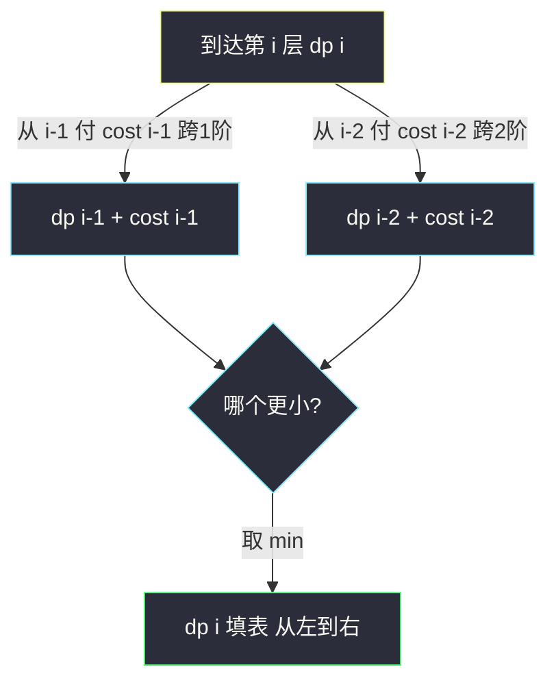

# 使用最小花费爬楼梯（爬楼梯带代价：min 版递推）

## 一、问题描述

给定一个整数数组 `cost`，`cost[i]` 是从楼梯第 `i` 个台阶**向上爬**的花费。一旦支付这个费用，可以选择向上爬 1 个或 2 个台阶。

可以选择从下标为 `0` 或下标为 `1` 的台阶作为初始阶梯开始爬。数组长度为 `n`，楼顶是「第 `n` 层」（即越过数组末尾之后的虚拟顶层）。求到达楼顶的**最小花费**。

> 🔗 LeetCode 746：https://leetcode.cn/problems/min-cost-climbing-stairs/

**示例 1**

```
输入：cost = [10, 15, 20]
输出：15
解释：从 cost[1] 出发，付 15 向上爬两步，直达楼顶。总花费 15。
```

**示例 2**

```
输入：cost = [1, 100, 1, 1, 1, 100, 1, 1, 100, 1]
输出：6
解释：最优路径为 1 → 100(下标) 跳过 → 依次走 1,1(下标0) ... 实际路径：
     从下标 0 出发，走 0 → 2 → 4 → 6 → 7（付1+1+1+1） → 跳到楼顶(付1)，共 6。
```

**直观理解**

本题是站内已有题解 [#70 爬楼梯](https://leetcode.cn/problems/climbing-stairs/) 的姊妹题：走法规则完全相同（每次 1 或 2 阶），只是问题从「**计数**有多少种走法」变成「**求最小**总花费」。递推骨架不变，`+` 变 `min`，每步再叠加踏上台阶的代价。

> 课源码说明：左程云课上没有 #746 原题（class098 Code03_ClimbingStairs 只讲 #70）。本题按课上**爬楼梯/一维线性 DP 同体系骨架**（可变参数法：一个可变参数 `i`，就是一张一维表）对齐，注释风格与 class066 斐波那契课一致。

---

## 二、暴力解法（入门）

### 直观思路

与爬楼梯一样按**最后一步**分类：要「到达第 `i` 层」，要么从第 `i-1` 层付 `cost[i-1]` 跨 1 阶，要么从第 `i-2` 层付 `cost[i-2]` 跨 2 阶。直接从顶向下递归：

```java
// 最小花费爬楼梯：直接递归（对齐 class066 斐波那契课 f1 的写法）
// f(i) = 到达第 i 层的最小花费
public static int minCost1(int[] cost) {
    return f1(cost, cost.length);
}

public static int f1(int[] cost, int i) {
    if (i <= 1) {
        return 0; // 第 0 层、第 1 层可作为起点，不花钱
    }
    return Math.min(f1(cost, i - 1) + cost[i - 1],   // 从 i-1 跨一步，付踏上 i-1 的钱
                    f1(cost, i - 2) + cost[i - 2]);  // 从 i-2 跨两步，付踏上 i-2 的钱
}
```

### 复杂度

- **时间**：`O(2ⁿ)`，递归树指数展开
- **空间**：`O(n)`，递归栈深度

### 🔴 瓶颈在哪里

与 #70 完全相同的病：`f(i)` 被反复求解。`f(40)` 就会超时。**重叠子问题**就是突破口——一旦发现「从顶向下的分类讨论」里子问题重复出现，就该上缓存/填表。

---

## 三、优化探索（核心章节）

### 3.1 观察特征

| 特征 | 说明 |
|------|------|
| 无后效性 | 「怎么到第 i 层」不影响后续，`f(i)` 只由 `f(i-1)`、`f(i-2)` 与 `cost` 决定 |
| 重叠子问题 | 暴力递归里 `f(i)` 大量重复 |
| 求最小值 | 递推从 `+` 变 `min`，且每步叠加 `cost[i-1]` / `cost[i-2]` |
| 只依赖最近两项 | 又是斐波那契型依赖，可滚动变量压到 O(1) 空间 |

### 3.2 关键一步：换 dp 定义视角

「到达第 `i` 层的最小花费」要小心 `cost[i]` 的支付时机——**踏上第 `i` 层时支付 `cost[i]`，且楼顶本身没有 cost**。为了让递推干净，约定：

```
dp[i] : 到达第 i 层（还没打算离开它）时的最小总花费
dp[0] = 0, dp[1] = 0        // 两层都可作为免费起点
dp[i] = min(dp[i-1] + cost[i-1],   // 从 i-1 层付钱跨 1 阶
            dp[i-2] + cost[i-2])   // 从 i-2 层付钱跨 2 阶
答案 = dp[n]（n = cost.length，虚拟楼顶层）
```

依赖方向：`dp[i]` 只看 `i-1`、`i-2` → 从左往右填表；只留最近两项 → 滚动变量。



### 3.3 关键推导问题

| 问题 | 答案 |
|------|------|
| 为什么 `dp[0]=dp[1]=0`？ | 题目允许从下标 0 或 1 出发，「出发」这个动作不花钱，花钱的是「踏上台阶后向上爬」 |
| `cost[i]` 什么时候付？ | 离开第 `i` 阶向上跳时付。所以转移到 `dp[i]` 用的是 `cost[i-1]`、`cost[i-2]`，楼顶（第 n 层）没有 cost，不付费 |
| 和 #70 爬楼梯差在哪？ | 同一条依赖链：#70 是「计数」用 `+`，本题是「最小值」用 `min`，并在边上加边权 |
| 遍历顺序？ | 依赖更小的下标，从 `i=2` 到 `i=n` 从左往右 |
| 能空间压缩吗？ | 能，只依赖前两项，两个滚动变量即可 |

### 3.4 一句话核心

> **把「最后一步」分类成跨 1 阶 / 跨 2 阶两条带权边，dp[i] = min(dp[i-1]+cost[i-1], dp[i-2]+cost[i-2])，从 dp[0]=dp[1]=0 滚到 dp[n]。**

---

## 四、代码实现详解

### Java（主解：滚动变量版，课上爬楼梯骨架）

```java
// 使用最小花费爬楼梯
// cost[i] 是从楼梯第 i 个台阶向上爬的费用
// 每次可以爬 1 或者 2 个台阶，可以从下标 0 或 1 的位置开始
// 测试链接 : https://leetcode.cn/problems/min-cost-climbing-stairs/
// 对齐 class098 Code03_ClimbingStairs / class066 斐波那契课的空间压缩骨架
public class Solution {

    // dp[i] : 到达第 i 层的最小花费
    // dp[i] = min(dp[i-1] + cost[i-1], dp[i-2] + cost[i-2])
    // 只依赖前两项，滚动变量即可。时间 O(n)，空间 O(1)
    public static int minCostClimbingStairs(int[] cost) {
        int n = cost.length;
        int lastLast = 0; // dp[0]
        int last = 0;     // dp[1]
        for (int i = 2, cur; i <= n; i++) {
            // 依赖方向：dp[i-1]/dp[i-2] -> dp[i]，从左往右填
            cur = Math.min(last + cost[i - 1], lastLast + cost[i - 2]);
            lastLast = last;
            last = cur;
        }
        return last; // dp[n]
    }
}
```

### Java（演进版：记忆化 → 显式填表）

```java
// 演进过程：先记忆化，再自底向上显式填 dp 表（帮助理解 dp 表怎么来的）
public class Solution {

    // 记忆化搜索：递归 + 缓存
    public static int minCost2(int[] cost) {
        int[] dp = new int[cost.length + 1];
        Arrays.fill(dp, -1);
        return f2(cost, cost.length, dp);
    }

    public static int f2(int[] cost, int i, int[] dp) {
        if (i <= 1) {
            return 0;
        }
        if (dp[i] != -1) {
            return dp[i];
        }
        int ans = Math.min(f2(cost, i - 1, dp) + cost[i - 1],
                           f2(cost, i - 2, dp) + cost[i - 2]);
        dp[i] = ans;
        return ans;
    }

    // 自底向上：显式 dp 表
    public static int minCost3(int[] cost) {
        int n = cost.length;
        int[] dp = new int[n + 1];
        dp[0] = 0;
        dp[1] = 0;
        for (int i = 2; i <= n; i++) {
            dp[i] = Math.min(dp[i - 1] + cost[i - 1], dp[i - 2] + cost[i - 2]);
        }
        return dp[n];
    }
}
```

### Python（同思路）

```python
# 最小花费爬楼梯：滚动变量版，O(n) / O(1)
class Solution:
    def minCostClimbingStairs(self, cost: list[int]) -> int:
        n = len(cost)
        last_last, last = 0, 0  # dp[0], dp[1]
        for i in range(2, n + 1):
            cur = min(last + cost[i - 1], last_last + cost[i - 2])
            last_last, last = last, cur
        return last  # dp[n]
```

```python
# 自底向上填表版（帮助理解 dp 表）
class Solution:
    def minCostClimbingStairs(self, cost: list[int]) -> int:
        n = len(cost)
        dp = [0] * (n + 1)  # dp[0]=dp[1]=0
        for i in range(2, n + 1):
            dp[i] = min(dp[i - 1] + cost[i - 1], dp[i - 2] + cost[i - 2])
        return dp[n]
```

---

## 五、具体例子演示

以示例 2 `cost = [1, 100, 1, 1, 1, 100, 1, 1, 100, 1]`（`n = 10`）为例，逐格填 dp 表。每一步标出转移来源。

| i | cost[i-1] / cost[i-2] | 候选 1：dp[i-1]+cost[i-1] | 候选 2：dp[i-2]+cost[i-2] | dp[i] | 来源 |
|---|---|---|---|---|---|
| 0 | — | — | — | 0 | 起点（免费） |
| 1 | — | — | — | 0 | 起点（免费） |
| 2 | cost[1]=100 / cost[0]=1 | 0+100 = 100 | 0+1 = **1** | 1 | 从第 0 层跨 2 阶 |
| 3 | cost[2]=1 / cost[1]=100 | 1+1 = **2** | 0+100 = 100 | 2 | 从第 2 层跨 1 阶 |
| 4 | cost[3]=1 / cost[2]=1 | 2+1 = **3** | 1+1 = 2 | 2 | 从第 2 层跨 2 阶 |
| 5 | cost[4]=1 / cost[3]=1 | 2+1 = **3** | 2+1 = 3 | 3 | 两者并列，均可 |
| 6 | cost[5]=100 / cost[4]=1 | 3+100 = 103 | 2+1 = **3** | 3 | 从第 4 层跨 2 阶（跳过 100） |
| 7 | cost[6]=1 / cost[5]=100 | 3+1 = **4** | 2+100 = 102 | 4 | 从第 6 层跨 1 阶 |
| 8 | cost[7]=1 / cost[6]=1 | 4+1 = **5** | 3+1 = 4 | 4 | 从第 6 层跨 2 阶 |
| 9 | cost[8]=100 / cost[7]=1 | 4+100 = 104 | 4+1 = **5** | 5 | 从第 7 层跨 2 阶（越过第 8 层的 100） |
| 10 | cost[9]=1 / cost[8]=100 | 5+1 = **6** | 4+100 = 104 | 6 | 从第 9 层跨 1 阶上楼顶 |

循环结束返回 `dp[10] = 6`，与示例一致。

回溯最优路径（一路沿着「来源」列往回走）：第 10 层 ← 第 9 层 ← 第 7 层 ← 第 6 层 ← 第 4 层 ← 第 2 层 ← 第 0 层。即走法 `0 → 2 → 4 → 6 → 7 → 9 → 顶`，付费 `1+1+1+1+1+1 = 6`，在第 7 层直接跨 2 阶越过第 8 层的 100。

再用最小示例 `cost = [10, 15, 20]` 复核：`dp[2] = min(0+15, 0+10) = 10`，`dp[3] = min(10+20, 0+15) = 15` ✓。

---

## 六、复杂度分析

| 版本 | 时间 | 空间 | 说明 |
|------|------|------|------|
| 暴力递归 | `O(2ⁿ)` | `O(n)` | 递归树指数展开 |
| 记忆化搜索 | `O(n)` | `O(n)` | 每个 f(i) 只算一次 |
| 自底向上填表 | `O(n)` | `O(n)` | 显式 dp 数组 |
| 滚动变量（主解） | `O(n)` | `O(1)` | 只留最近两项 |

---

## 七、方法对比与总结

### 与 #70 爬楼梯的对照（一图记住）

```
#70  计数：f(i) = f(i-1) + f(i-2)                    边无边权
#746 最小：dp(i) = min(dp(i-1)+cost[i-1], dp[i-2)+cost[i-2])   边带权，min 融合
```


### 易错点

1. **把楼顶也收费**：楼顶是第 `n` 层（越界一层），`cost` 只有 `0..n-1`，转移到 `dp[n]` 用 `cost[n-1]` / `cost[n-2]`，别写出 `cost[n]` 数组越界。
2. **初始值想成 `dp[0]=cost[0]`**：错。`cost[i]` 是「离开第 i 阶」时才付，出发站上去不付费，`dp[0]=dp[1]=0`。
3. **滚动更新顺序**：先算 `cur` 再挪 `lastLast = last; last = cur`，顺序反了会覆盖旧值。
4. **返回值**：返回 `dp[n]` 不是 `dp[n-1]`——要「越过」整个数组才算到顶。

### 模板口诀

> **最后一步两条边，一步两步各带钱；min 过边权再融合，滚到第 n 层就是答案。**

---

## 八、举一反三

| 题目 | 链接 | 迁移点 |
|------|------|--------|
| 70. 爬楼梯（站内已有题解） | https://leetcode.cn/problems/climbing-stairs/ | 同骨架的计数版：`+` 融合、无边权 |
| 64. 最小路径和 | https://leetcode.cn/problems/minimum-path-sum/ | min 融合搬到网格版，课上 class067 同体系骨架 |
| 152. 乘积最大子数组（站内本批题解） | https://leetcode.cn/problems/maximum-product-subarray/ | 「多个候选都保留」的进阶：同时维护最大最小 |
| 740. 删除并获得点数 | https://leetcode.cn/problems/delete-and-earn/ | 排序去重后退化成爬楼梯型「选/不选」递推（打家劫舍家族） |

**迁移一句**：线性 DP 里「一步可选 1/2、每步带代价」是一整族题的原子模板——计数用 `+`，最值用 `min`/`max`，边权换成 `cost[i]`、点权换成 `nums[i]`，骨架永远不变。
