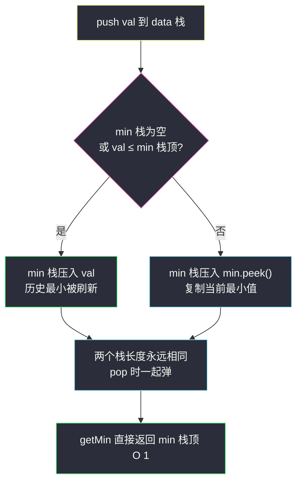
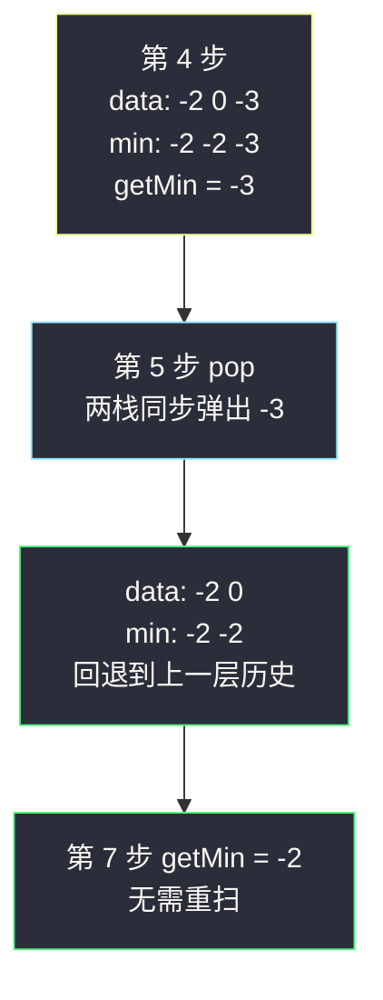

# 最小栈（辅助栈同步：数据栈照常放值，最小栈每步跟一份「当前最小」）

## 一、问题描述

设计一个支持 `push`、`pop`、`top` 操作，并能在**常数时间**内检索到最小元素的栈：

- `MinStack()` 初始化堆栈对象
- `void push(int val)` 将元素 val 压入栈
- `void pop()` 删除栈顶元素
- `int top()` 获取栈顶元素
- `int getMin()` 获取栈中最小元素

> 🔗 LeetCode 155：https://leetcode.cn/problems/min-stack/
>
> 约束：`-2^31 <= val <= 2^31 - 1`；`pop`、`top`、`getMin` 保证在非空栈上调用；最多调用 `3 * 10^4` 次。

**示例 1**

```
输入：
["MinStack", "push", "push", "push", "getMin", "pop", "top", "getMin"]
[[], [-2], [0], [-3], [], [], [], []]
输出：
[null, null, null, null, -3, null, 0, -2]

解释：
MinStack minStack = new MinStack();
minStack.push(-2);   // 栈：[-2]
minStack.push(0);    // 栈：[-2, 0]
minStack.push(-3);   // 栈：[-2, 0, -3]
minStack.getMin();   // 返回 -3
minStack.pop();      // 栈：[-2, 0]
minStack.top();      // 返回 0
minStack.getMin();   // 返回 -2
```

**直观理解**

`push` / `pop` / `top` 用一个栈天然就是 `O(1)`，本题真正的考点只有一个：**getMin 怎么也做到 `O(1)`**。麻烦在于最小值是「跟着栈的当前内容走的」——如果只记一个全局变量 `min`，一旦最小值被 pop 掉，你不知道新的最小是谁，因为**历史信息已经丢了**。所以最小值的历史必须和数据一起进栈、一起出栈：再开一个辅助栈 `min`，与数据栈同步，第 `i` 层永远记录「数据栈前 `i+1` 个元素的最小值」。课源码 class015 `GetMinStack.MinStack1` 就是这个双栈同步版，一行判断、两个栈同步升降，好讲好默写。

---

## 二、暴力解法（getMin 时现场扫一遍）

### 直观思路

只用一个数据栈。`getMin` 被调用时，把栈里元素全部倒进临时栈、边倒边比出最小，再倒回去：

```java
class MinStack {
    private Deque<Integer> data = new ArrayDeque<>();

    public void push(int val) {
        data.push(val);
    }

    public void pop() {
        data.pop();
    }

    public int top() {
        return data.peek();
    }

    public int getMin() {
        Deque<Integer> temp = new ArrayDeque<>();
        int min = Integer.MAX_VALUE;
        while (!data.isEmpty()) {        // 倒出来，边倒边比
            int v = data.pop();
            min = Math.min(min, v);
            temp.push(v);
        }
        while (!temp.isEmpty()) {        // 倒回去，恢复原序
            data.push(temp.pop());
        }
        return min;
    }
}
```

### 复杂度

- **时间**：`push` / `pop` / `top` 是 `O(1)`；`getMin` 是 `O(n)`——每次都全栈倒两遍
- **空间**：`O(n)` 数据栈 + `O(n)` 临时栈

### 🔴 瓶颈在哪里

1. **重复计算**：栈内容明明只变了一个元素，却要为一次 `getMin` 重扫全栈；连续 `k` 次 `getMin` 就是 `O(n·k)`；
2. **信息没有随元素沉淀**：「当前栈的最小值」明明在每次 push/pop 时就能顺手维护，却非要等查询时才算——典型的「该增量的没增量」。

---

## 三、优化探索（核心章节）

### 3.1 观察特征

| 特征 | 说明 |
|------|------|
| 最小值随栈内容动态变化 | pop 掉最小值后，新最小是「它入栈之前」的某个历史值——历史必须可回溯 |
| 单一变量存不下历史 | 一个 `min` 变量只能记住最新一层，pop 之后无法回退 |
| 栈的变更只在栈顶 | push/pop 都发生在顶端，最小值的变化也只需要「跟着栈顶走」一步更新 |
| 每层栈状态的最小值只依赖上一层 | `min(前 i+1 个) = min(前 i 个, 第 i+1 个)`——天然递推，天然可以每层存一份 |

### 3.2 暴力 → 优化：辅助栈同步记录

开两个栈：`data` 照常存数据；`min` 与 `data` **严格同长同步**，`min` 的第 `i` 层存「`data` 前 `i+1` 个元素的最小值」。

```
push(val):
    data.push(val)
    若 min 空 或 val <= min 顶:
        min.push(val)               ← val 刷新了历史最小
    否则:
        min.push(min.peek())        ← 最小值没变，复制一份顶上
pop():
    data.pop()
    min.pop()                       ← 两栈同步降，历史自动回退
getMin():
    return min.peek()               ← 栈顶就是「当前全部元素的最小值」
```

**不变式**：任意时刻，`min` 从底到顶第 `i` 个元素 = `data` 从底到顶前 `i+1` 个元素的最小值。于是 `min.peek()` 恒等于「当前栈的最小值」，`getMin` 读一下栈顶即可。



### 3.3 关键推导问题

| 问题 | 答案 |
|------|------|
| 为什么一个 `min` 变量不够？ | 栈 `[-2, 0, -3]` 的 min 是 -3；pop 掉 -3 后 min 应回退到 -2——变量只知道「最新」，不知道「上一层」，历史断层 |
| 为什么 pop 不需要比较？ | 同步等长版里 `min` 栈每层都存了「当时的最小」，两栈一起弹，下一层自动就是 pop 之后的最小——这正是「每层存一份」换来的简化 |
| `val <= min.peek()` 里的等号能否去掉？ | **不能**。相等时若不入 min 栈（省空间版），后面 pop 掉一个重复最小值，min 栈也弹掉了，但栈里还剩一个同样小的值，`getMin` 就错了。重复值必须「来一个记一个」 |
| 有更省空间的版本吗？ | 有：min 栈只在 `val < min.peek()` 时才压（严格更小才记），pop 时若 `data` 弹出的值等于 `min` 栈顶才跟着弹。空间变省，但 pop 多了比较、容易写错——面试讲同步版、提一嘴省空间版即可 |
| min 栈里元素有什么性质？ | 从底到顶**不增**（≤ 关系），因为新压的要么更小、要么复制当前顶 |
| `getMin` 保证非空调用，还要防御吗？ | LC 保证合法；工程里可先判空抛异常，刷题按题意省略 |

### 3.4 一句话核心

> **数据栈放值，最小栈放「此刻为止的最小」；两栈同生共死，历史最小随 pop 自动回退。**

---

## 四、代码实现详解

### Java（主解：双栈同步，对齐 class015 课上版）

```java
// 最小栈：push/pop/top/getMin 全 O(1)
// 测试链接 : https://leetcode.cn/problems/min-stack/
// 对齐 class015 GetMinStack.MinStack1（课上用 Stack，站点版用 ArrayDeque）
class MinStack {
    private Deque<Integer> data = new ArrayDeque<>();   // 数据栈
    private Deque<Integer> min  = new ArrayDeque<>();   // 同步最小栈：第 i 层 = 前 i+1 个的最小

    public MinStack() {}

    public void push(int val) {
        data.push(val);
        if (min.isEmpty() || val <= min.peek()) {
            min.push(val);              // val 刷新了历史最小
        } else {
            min.push(min.peek());       // 最小没变，复制一份
        }
    }

    public void pop() {
        data.pop();
        min.pop();                      // 同步降层，历史自动回退
    }

    public int top() {
        return data.peek();
    }

    public int getMin() {
        return min.peek();
    }
}
```

### Java（可选：压栈省空间变体）

```java
// 变体：min 栈只在「严格更小」时增长；pop 靠值比较决定要不要跟弹
class MinStack2 {
    private Deque<Integer> data = new ArrayDeque<>();
    private Deque<Integer> min  = new ArrayDeque<>();

    public void push(int val) {
        data.push(val);
        if (min.isEmpty() || val < min.peek()) {
            min.push(val);
        }
    }

    public void pop() {
        if (data.pop().equals(min.peek())) {   // 弹的恰好是当前最小，min 跟着弹
            min.pop();
        }
    }

    public int top()        { return data.peek(); }
    public int getMin()     { return min.peek(); }
}
```

注意 `equals` 而不是 `==`：`Integer` 缓存只覆盖 -128~127，栈里存的引用比较会踩坑。

### Python（同思路：同步等长版）

```python
class MinStack:
    def __init__(self):
        self.data: list[int] = []      # 数据栈
        self.min: list[int] = []       # 同步最小栈

    def push(self, val: int) -> None:
        self.data.append(val)
        if not self.min or val <= self.min[-1]:
            self.min.append(val)       # 刷新历史最小
        else:
            self.min.append(self.min[-1])  # 复制当前最小

    def pop(self) -> None:
        self.data.pop()
        self.min.pop()                 # 同步降层

    def top(self) -> int:
        return self.data[-1]

    def getMin(self) -> int:
        return self.min[-1]
```

---

## 五、具体例子演示

### 例 1：LC 示例逐步跟踪（栈记法：右侧为栈顶）

| 步 | 操作 | data 栈（底→顶） | min 栈（底→顶） | 返回 | 说明 |
|----|------|------------------|-----------------|------|------|
| 1 | `push(-2)` | [-2] | [-2] | — | min 空直接压 val |
| 2 | `push(0)` | [-2, 0] | [-2, -2] | — | 0 > -2，复制 -2 |
| 3 | `push(-3)` | [-2, 0, -3] | [-2, -2, -3] | — | -3 ≤ -2，压 -3 |
| 4 | `getMin()` | [-2, 0, -3] | [-2, -2, -3] | **-3** | min 栈顶即答案 |
| 5 | `pop()` | [-2, 0] | [-2, -2] | — | 两栈同步弹，-3 的历史一起带走 |
| 6 | `top()` | [-2, 0] | [-2, -2] | **0** | data 栈顶 |
| 7 | `getMin()` | [-2, 0] | [-2, -2] | **-2** | ✅ 最小值自动回退到 -2 |

**第 5 → 7 步是全题精华**：pop 之后最小值从 -3「回退」到 -2，没有重新扫描——因为 -2 这层历史在 push(0) 时就已存好。



### 例 2：重复最小值（等号派上用场）

`push(2), push(1), push(1), getMin, pop, getMin, pop, getMin`：

| 步 | 操作 | data | min | 返回 | 说明 |
|----|------|------|-----|------|------|
| 1 | `push(2)` | [2] | [2] | — | 压 val |
| 2 | `push(1)` | [2, 1] | [2, 1] | — | 1 ≤ 2，压 1 |
| 3 | `push(1)` | [2, 1, 1] | [2, 1, 1] | — | **1 ≤ 1，等号生效**，再压一份 1 |
| 4 | `getMin()` | [2, 1, 1] | [2, 1, 1] | **1** | |
| 5 | `pop()` | [2, 1] | [2, 1] | — | 弹掉一个 1，min 还有 1 顶着 |
| 6 | `getMin()` | [2, 1] | [2, 1] | **1** | ✅ 栈里仍有一个 1 |
| 7 | `pop()` | [2] | [2] | — | 第二个 1 也走了 |
| 8 | `getMin()` | [2] | [2] | **2** | ✅ 回退到 2 |

若第 3 步省掉那次入 min（去掉等号），第 5 步 pop 会把 min 栈唯一的 1 弹掉，第 6 步 `getMin` 就错报 2——**等号不是装饰，是正确性**。

---

## 六、复杂度分析

| 项目 | 暴力倒扫 | 双栈同步（主解） | 压栈省空间变体 |
|------|----------|------------------|----------------|
| push | `O(1)` | `O(1)` | `O(1)` |
| pop | `O(1)` | `O(1)` | `O(1)` |
| top | `O(1)` | `O(1)` | `O(1)` |
| getMin | `O(n)` | **`O(1)`** | **`O(1)`** |
| 空间 | `O(n)` | `O(n)`（两个栈各 n） | `O(n)`，min 栈最坏仍 n（元素不增时） |

省空间变体的最坏情形：序列一直不增（如 5,4,3,2,1），每次 push 都刷新最小，min 栈照样全长——**空间优化只在「最小值刷新次数少」的数据上生效，最坏不保证**。

---

## 七、方法对比与总结

### 写法对比

| | 暴力倒扫 | 双栈同步（主解） | 压栈省空间 |
|--|----------|------------------|------------|
| getMin | `O(n)` | `O(1)` | `O(1)` |
| pop 实现 | 无比较 | 无比较（同步弹） | 要比较值 |
| 正确性难度 | 低 | 低（等长不变式兜底） | 中（等号 + equals 陷阱） |
| 面试定位 | 讲思路起点 | ✅ 必须默写 | 口头提一嘴加分 |

### 易错点

1. **`val <= min.peek()` 丢等号**：重复最小值场景必错（见例 2）。
2. **同步版 pop 里写条件判断**：等长版两栈无条件一起弹；写成「值相等才弹」是把两个版本揉在一起，必乱。
3. **省空间版用 `==` 比 `Integer`**：超出 -128~127 缓存范围后比较的是引用；Python 无此坑。
4. **min 栈初值塞哨兵**：往 min 栈先压 `Integer.MAX_VALUE` 再判断——能用，但 `peek` 前的空判断被哨兵隐藏，两套逻辑混着容易错；不如老老实实判 `isEmpty()`。
5. **用 `Stack` 类**：古老且加锁慢，站点统一 `ArrayDeque`（课源码用 `Stack` 行为等价）。

### 模板口诀

> **数据栈放值，最小栈放当下最小；同步压同步弹，历史随栈自动回。**

---

## 八、举一反三

| 题目 | 链接 | 迁移点 |
|------|------|--------|
| 232. 用栈实现队列 | https://leetcode.cn/problems/implement-queue-using-stacks/ | 双容器协作设计题（本站已有题解）：in/out 分工 + 两条倒数据铁律 |
| 225. 用队列实现栈 | https://leetcode.cn/problems/implement-stack-using-queues/ | 镜像设计题（本站已有题解）：单队列旋转 |
| 622. 设计循环队列 | https://leetcode.cn/problems/design-circular-queue/ | 数组实现队列的本征结构：l/r 回绕 + size 计数（本站题解） |
| 641. 设计循环双端队列 | https://leetcode.cn/problems/design-circular-deque/ | 循环队列的双端升级版（本站题解），两篇对照读 |
| 895. 最大频率栈 | https://leetcode.cn/problems/maximum-frequency-stack/ | 「辅助容器同步维护聚合信息」的进阶：按频率分桶的栈组 |

**迁移一句**：设计类题的通用套路是**「主容器管数据，辅助容器管聚合」**——最小栈同步最小值、双栈队列倒手顺序、双堆各管一半大小。聚合信息跟着主容器的变更同步更新，查询才敢要 `O(1)`。
