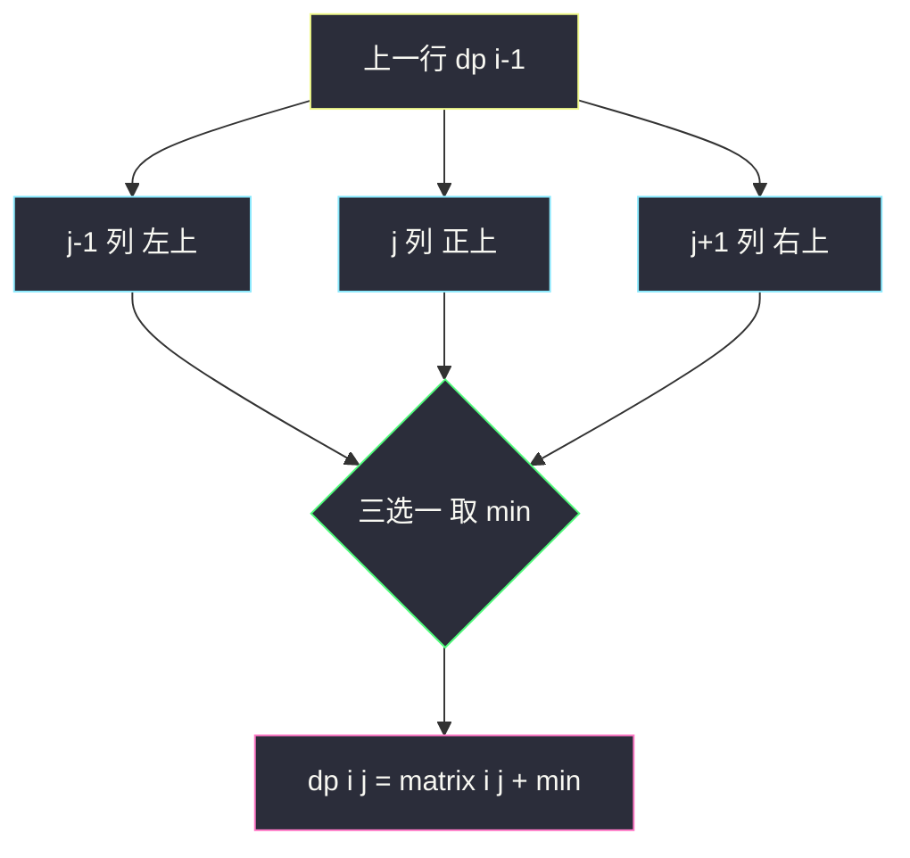
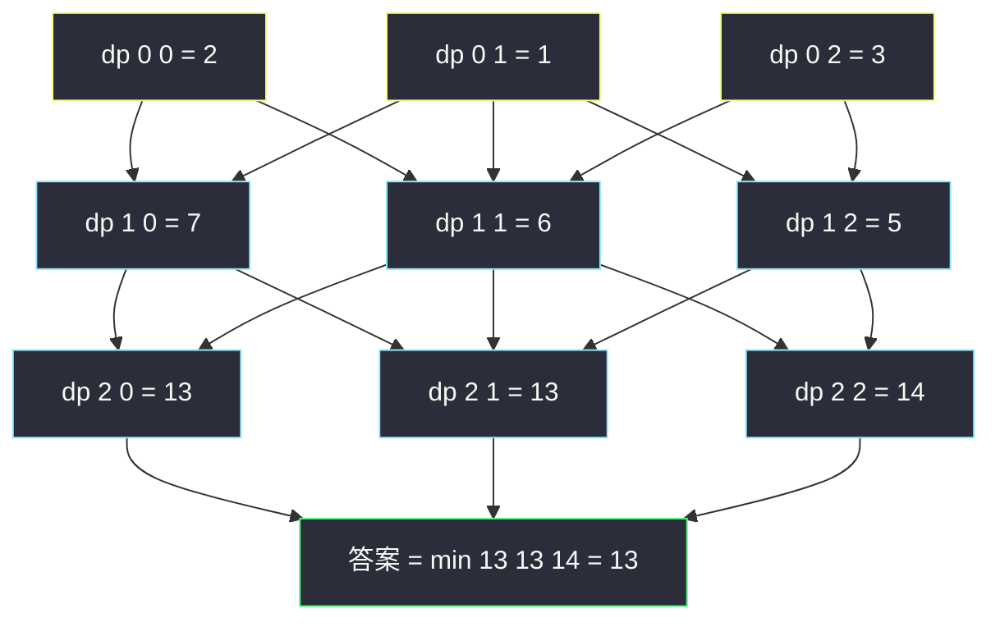

# 下降路径最小和（三方向网格 DP）

## 一、问题描述

给你一个 `n x n` 的**方形**整数矩阵 `matrix`，请你计算并返回**从第一行任一元素出发、到最后一行任一元素结束**的最小**下降路径和**。下降路径中每一步可以选择**正下方、左下方、右下方**三个方向中相邻的元素之一（即从 `(i, j)` 可以走到 `(i+1, j-1)`、`(i+1, j)`、`(i+1, j+1)`）。

> 🔗 LeetCode 931：https://leetcode.cn/problems/minimum-falling-path-sum/

**示例 1**

```
输入：matrix = [[2,1,3],[6,5,4],[7,8,9]]
输出：13
解释：下面是两条最小下降路径（加粗）：
    2  1  3          2  1  3
    6  5  4   或     6  5  4
    7  8  9          7  8  9
路径和均为 1 + 5 + 7 = 13 或 1 + 4 + 8 = 13
```

**示例 2**

```
输入：matrix = [[-19,57],[-40,-5]]
输出：-59
解释：-19 + (-40) = -59
```

**直观理解**

与 [#64 最小路径和](./minimum-path-sum.md) 的区别只有一处：依赖方向从「上、左」变成「**左上、正上、右上**」三个方向。转移骨架不变——

```
dp[i][j] = matrix[i][j] + min( dp[i-1][j-1], dp[i-1][j], dp[i-1][j+1] )
```

起点从固定左上角变成「第一行任意格」，于是**初值是一整行**；终点是「最后一行任意格」，答案是**末行取 min**。这题是「依赖方向可以任意定义」的最好练习。

> 📚 课源码定位：左程云课没有本题原题，按 `class067/Code01_MinimumPathSum.java` 网格 DP 骨架（可变参数 `i, j` → 二维表、按依赖方向定填表顺序、空间压缩）对齐，仅把来源方向扩成三个。

---

## 二、暴力解法（入门）

### 直观思路

自顶向下递归：`f(i, j)` = **从第一行任意起点走，最后到达 `(i,j)` 的最小下降路径和**。按「最后一步从哪来」分三类（左上、正上、右上），取 min 加当前格：

```java
// 下降路径最小和：直接递归
// f(i, j) : 到达(i,j)的最小下降路径和（起点在第一行任意格）
public static int minFallingPathSum1(int[][] matrix) {
    int n = matrix.length;
    int ans = Integer.MAX_VALUE;
    for (int j = 0; j < n; j++) {
        ans = Math.min(ans, f1(matrix, n - 1, j)); // 终点在最后一行任意格
    }
    return ans;
}

public static int f1(int[][] matrix, int i, int j) {
    if (i == 0) {
        return matrix[0][j]; // 第一行：起点，直接落地
    }
    int best = f1(matrix, i - 1, j); // 正上
    if (j - 1 >= 0) {
        best = Math.min(best, f1(matrix, i - 1, j - 1)); // 左上
    }
    if (j + 1 < matrix.length) {
        best = Math.min(best, f1(matrix, i - 1, j + 1)); // 右上
    }
    return matrix[i][j] + best;
}
```

### 复杂度

- **时间**：`O(3^n)` 宽松上界（每步三个方向；子问题重复求解）
- **空间**：`O(n)`，递归栈深度

### 🔴 瓶颈在哪里

`f(i, j)` 被「下方相邻三个格子」分别调用，同一子问题在递归树里反复展开。`n = 100` 必超时。套路照旧：**缓存子问题 → 填表**。

---

## 三、优化探索（核心章节）

### 3.1 与 #64 逐项对照

| 要素 | #64 最小路径和 | #931 下降路径最小和 |
|------|----------------|---------------------|
| 可变参数 | `i, j` → 二维表 | 同左 |
| dp 定义 | `(0,0)` 到 `(i,j)` 的最小和 | 到达 `(i,j)` 的最小下降和（起点=第一行任意格） |
| 来源方向 | 上、左（2 个） | 左上、正上、右上（**3 个**） |
| 初值 | `dp[0][0]` 一格 | `dp[0][j] = matrix[0][j]` **一整行** |
| 边界特判 | 首行/首列 | `j=0` 无左上、`j=n-1` 无右上 |
| 答案 | 右下角一格 | **末行取 min** |

### 3.2 转移与填表顺序

```
dp[0][j] = matrix[0][j]
dp[i][j] = matrix[i][j] + min(dp[i-1][j-1], dp[i-1][j], dp[i-1][j+1])
答案 = min(dp[n-1][0..n-1])
顺序：i 从上到下（依赖上一行）；j 任意方向（三个来源都在上一行）
```

空间压缩：只依赖上一行 → 一行数组。**注意坑**：`dp[j]` 更新要用旧值 `dp[j-1]`（上一行左上），若从左到右扫，`dp[j-1]` 已被刷成**本行**左格——必须用一个临时变量 `pre` 暂存「上一行的 `dp[j-1]`」，这正是三方向依赖与 #64 两方向依赖的区别。



### 3.3 关键推导问题

| 问题 | 答案 |
|------|------|
| 为什么初值是一整行？ | 起点允许第一行任意格，`dp[0][j]` 各自独立成路径 |
| 为什么答案是末行取 min？ | 终点允许最后一行任意格，每个终点的 dp 都是一条完整下降路径 |
| 会不会来回横跳？ | 不会：每步强制到下一行，行号单调递增，天然无环 |
| 负数影响？ | 无影响，转移是枚举来源取 min，非贪心 |
| 溢出风险？ | `n ≤ 100`，`|matrix[i][j]| ≤ 100`，路径和最多 `10^4` 量级，`int` 安全 |

### 3.4 一句话核心

> **三个来源取 min 加自身：初值一整行、答案末行取 min，一行数组加一个 pre 变量滚到底。**

---

## 四、代码实现详解

### Java（主解：自底向上填表）

```java
// 下降路径最小和
// 给你一个 n x n 的方形整数矩阵 matrix
// 返回从第一行任一元素出发到最后一行任一元素结束的最小下降路径和
// 测试链接 : https://leetcode.cn/problems/minimum-falling-path-sum/
// 对齐 class067/Code01 网格 DP 骨架（可变参数 i,j → 二维表 + 空间压缩）
public class Solution {

    // 时间复杂度 O(n^2)，空间复杂度 O(n^2)
    public static int minFallingPathSum(int[][] matrix) {
        int n = matrix.length;
        // dp[i][j] : 到达(i,j)的最小下降路径和
        // 转移 : dp[i][j] = matrix[i][j] + min(dp[i-1][j-1], dp[i-1][j], dp[i-1][j+1])
        // 依赖方向 : 上一行三个相邻位 → i 从上到下
        int[][] dp = new int[n][n];
        for (int j = 0; j < n; j++) {
            dp[0][j] = matrix[0][j]; // 第一行：任意格都可作为起点
        }
        for (int i = 1; i < n; i++) {
            for (int j = 0; j < n; j++) {
                int best = dp[i - 1][j];                     // 正上
                if (j - 1 >= 0) {
                    best = Math.min(best, dp[i - 1][j - 1]); // 左上
                }
                if (j + 1 < n) {
                    best = Math.min(best, dp[i - 1][j + 1]); // 右上
                }
                dp[i][j] = matrix[i][j] + best;
            }
        }
        int ans = dp[n - 1][0];
        for (int j = 1; j < n; j++) {
            ans = Math.min(ans, dp[n - 1][j]); // 终点任意，末行取 min
        }
        return ans;
    }
}
```

### Java（进阶：空间压缩，注意 pre 变量）

```java
public class Solution {

    // 一行数组滚动：dp[j] 旧值 = 上一行正上；pre 暂存上一行左上
    // 时间 O(n^2)，空间 O(n)
    public static int minFallingPathSum2(int[][] matrix) {
        int n = matrix.length;
        int[] dp = matrix[0].clone(); // 想象中 dp 表的第 0 行
        for (int i = 1; i < n; i++) {
            int pre = dp[0]; // 本轮开始前，dp[0] 是上一行的 (i-1,0)
            for (int j = 0; j < n; j++) {
                int best = dp[j];                       // 旧值 = 上一行正上
                if (j - 1 >= 0) {
                    best = Math.min(best, pre);         // pre = 上一行左上
                }
                if (j + 1 < n) {
                    best = Math.min(best, dp[j + 1]);   // 还没刷 = 上一行右上
                }
                int cur = matrix[i][j] + best;
                pre = dp[j]; // 留给下一轮当「上一行左上」
                dp[j] = cur;
            }
        }
        int ans = dp[0];
        for (int j = 1; j < n; j++) {
            ans = Math.min(ans, dp[j]);
        }
        return ans;
    }
}
```

### Python（同思路）

```python
# 下降路径最小和：二维填表，O(n^2) / O(n^2)
class Solution:
    def minFallingPathSum(self, matrix: List[List[int]]) -> int:
        n = len(matrix)
        # dp[i][j]：到达(i,j)的最小下降路径和，来自上一行左上/正上/右上
        dp = [row[:] for row in matrix]  # 第 0 行直接当初值
        for i in range(1, n):
            for j in range(n):
                best = dp[i - 1][j]
                if j > 0:
                    best = min(best, dp[i - 1][j - 1])
                if j + 1 < n:
                    best = min(best, dp[i - 1][j + 1])
                dp[i][j] = matrix[i][j] + best
        return min(dp[n - 1])
```

```python
# 空间压缩：一行数组 + pre 暂存上一行左上，O(n^2) / O(n)
class Solution:
    def minFallingPathSum(self, matrix: List[List[int]]) -> int:
        n = len(matrix)
        dp = matrix[0][:]
        for i in range(1, n):
            pre = dp[0]
            for j in range(n):
                best = dp[j]
                if j > 0:
                    best = min(best, pre)
                if j + 1 < n:
                    best = min(best, dp[j + 1])
                pre, dp[j] = dp[j], matrix[i][j] + best
        return min(dp)
```

---

## 五、具体例子演示

以示例 1 的 `3 x 3` 矩阵为例，端到端跟踪填表：

```
matrix = 2  1  3
         6  5  4
         7  8  9
```

### 第 1 步：初始化第一行（整行都是起点）

| dp | j=0 | j=1 | j=2 |
|----|-----|-----|-----|
| i=0 | 2 | 1 | 3 |

### 第 2 步：填第二行（i=1）

| 格子 | 候选来源（上一行） | 取 | 计算 | dp 值 |
|------|--------------------|----|------|-------|
| (1,0) | 左上越界、正上 dp[0][0]=2、右上 dp[0][1]=1 | **1** | 6 + 1 | **7** |
| (1,1) | 左上 dp[0][0]=2、正上 dp[0][1]=1、右上 dp[0][2]=3 | **1** | 5 + 1 | **6** |
| (1,2) | 左上 dp[0][1]=1、正上 dp[0][2]=3、右上越界 | **1** | 4 + 1 | **5** |

| dp | j=0 | j=1 | j=2 |
|----|-----|-----|-----|
| i=1 | 7 | 6 | 5 |

### 第 3 步：填第三行（i=2）

| 格子 | 候选来源 | 取 | 计算 | dp 值 |
|------|----------|----|------|-------|
| (2,0) | 正上 dp[1][0]=7、右上 dp[1][1]=6 | **6** | 7 + 6 | **13** |
| (2,1) | 左上 dp[1][0]=7、正上 dp[1][1]=6、右上 dp[1][2]=5 | **5** | 8 + 5 | **13** |
| (2,2) | 左上 dp[1][1]=6、正上 dp[1][2]=5 | **5** | 9 + 5 | **14** |

### 第 4 步：末行取 min

`min(13, 13, 14) = 13`，对应两条最优路径：`1 → 5 → 7`（13）与 `1 → 4 → 8`（13），与示例一致。



每个节点汇聚**三条**入边（边界格两条）——这就是「三方向」的形状；起点整行黄框、末行取 min 出绿框答案。

---

## 六、复杂度分析

| 版本 | 时间 | 空间 | 说明 |
|------|------|------|------|
| 暴力递归 | `O(3^n)` 宽松上界 | `O(n)` | 重复子问题指数展开 |
| 记忆化搜索 | `O(n^2)` | `O(n^2)` | 每个 f(i,j) 只算一次 |
| 二维填表（主解） | `O(n^2)` | `O(n^2)` | n x n 格子每格 O(1) 转移 |
| 一行数组滚动 | `O(n^2)` | `O(n)` | 多一个 pre 暂存变量 |

---

## 七、方法对比与总结

### 网格 DP 依赖方向总表（本家族至此集齐三种）

| 题 | 来源方向 | 压缩注意 |
|----|----------|----------|
| #62/#63/#64 | 上、左 | `dp[j] += dp[j-1]` 或 `min(dp[j], dp[j-1])`，直接扫 |
| #120 | 下、右下（自底向上） | `min(dp[j], dp[j+1])`，直接扫 |
| **#931 本题** | 左上、正上、右上 | **需要 pre 暂存上一行左上** |

### 易错点

1. **压缩版丢 pre 变量**：`dp[j-1]` 一旦刷成新值就丢掉「上一行左上」，答案悄悄错——这是本题最经典的坑。
2. **初值/答案位置弄反**：初值在**第一行整行**，答案在**最后一行取 min**；不是 `dp[0][0]` 到 `dp[n-1][n-1]`。
3. **边界方向漏判**：`j=0` 没有左上、`j=n-1` 没有右上，越界方向必须跳过。
4. **pre 更新时机**：算完 `dp[j]` 再 `pre = dp[j]`（旧值），顺序颠倒会把本行值传下去。

### 模板口诀

> **首行整行当起点，三来源取 min 加自身；末行整体取 min，滚动要带 pre。**

---

## 八、举一反三

| 题目 | 链接 | 迁移点 |
|------|------|--------|
| 64. 最小路径和 | https://leetcode.cn/problems/minimum-path-sum/ | 两方向网格最值，本题的前置（本站已收录题解） |
| 120. 三角形最小路径和 | https://leetcode.cn/problems/triangle/ | 依赖向下的三角形变体 |
| 1289. 下降路径最小和 II | https://leetcode.cn/problems/minimum-falling-path-sum-ii/ | 来源扩成**上一行任意列**，转移内维护上一行 min/max 后 O(1) 取 |
| 62. 不同路径 | https://leetcode.cn/problems/unique-paths/ | 同家族计数入门 |
| 2435. 矩阵中和能被 K 整除的路径 | https://leetcode.cn/problems/paths-in-matrix-whose-sum-is-divisible-by-k/ | 路径计数 + 余数维 → 三维表，课上 `class069/Code04` 原型 |

**迁移一句**：网格 DP 的全部变化只有三处——**来源方向集合、初值位置、答案位置**；先把这三样列出来再写代码，任何「变形网格」题都是同一道题。
