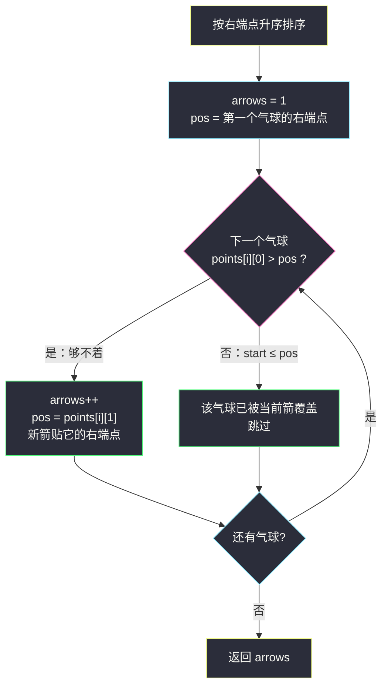
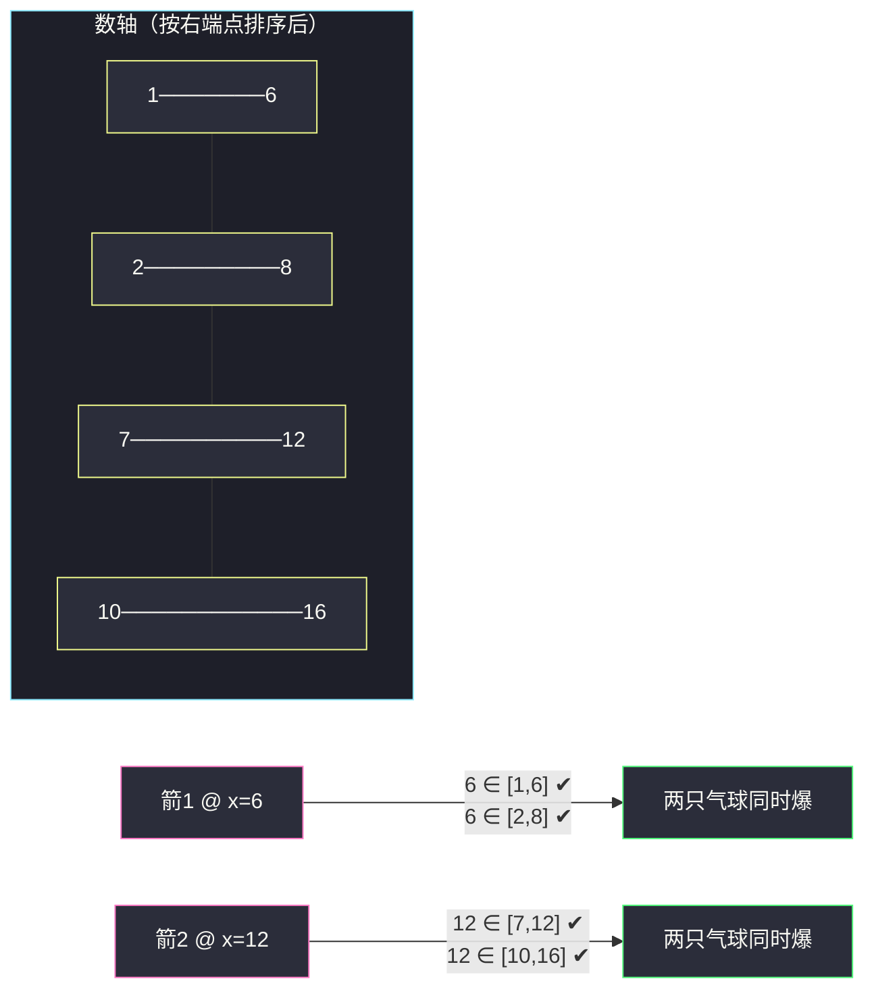

# 用最少数量的箭引爆气球（右端点排序 + 贪心射箭）

## 一、问题描述

在二维空间中有若干球形的气球，球形气球会被**起始和结束坐标**记录在水平方向上，`points[i] = [x_start, x_end]`。一支弓箭可以**垂直地**沿着 x 轴从不同的点完全射穿（一支箭可以引爆的气球区间为 `[x_start, x_end]`，只要箭的 x 坐标落在该区间内即引爆，**含端点**）。给你一个数组 `points`，返回引爆所有气球所必须弓箭的**最小数量**。

> 🔗 LeetCode 452：https://leetcode.cn/problems/minimum-number-of-arrows-to-burst-balloons/

**示例 1**

```
输入：points = [[10,16],[2,8],[1,6],[7,12]]
输出：2
解释：气球可以用 2 支箭引爆：
- 在 x = 6 处射箭（引爆 [2,8] 和 [1,6]）
- 在 x = 11 处射箭（引爆 [10,16] 和 [7,12]）
```

**示例 2（互不相交）**

```
输入：points = [[1,2],[3,4],[5,6],[7,8]]
输出：4
解释：每个气球都需要一支单独的箭。
```

**直观理解**

一支箭的坐标 x 若引爆多个气球，说明这些气球的区间有**公共点 x**。「最少箭」= 把气球按「能被同一支箭覆盖」**分组**，组数最少——等价于：**最多能有多少组气球，每组内部存在公共交**。这反过来就是经典的「不相交区间计数」：一支箭贴着「当前组内最右的右端点」射，能覆盖的尽量覆盖；覆盖不了时被迫再开新组。最少箭数 = 最大的**互不相交（严格按右端点递增）**区间数。

---

## 二、暴力解法（入门）

### 直观思路

枚举所有「射箭方案」当然爆炸。退一步的暴力：每次选一个 x 坐标射箭，把所有能被引爆的气球去掉，直到气球清空，用回溯找最少箭数。或者更朴素地：枚举每个气球区间的端点作为箭位（最优箭位总可以取某个区间的端点），用集合覆盖式搜索。

```java
// 伪代码：回溯暴力
int ans = n;                          // 最坏每球一箭
void dfs(List<int[]> rest, int used) {
    if (rest.isEmpty()) { ans = Math.min(ans, used); return; }
    // 枚举第一只气球 rest.get(0) 的两个端点作为箭位（可证明最优解中
    // 存在一支箭恰好射在某个气球的端点上）
    for (int x : new int[]{rest.get(0)[0], rest.get(0)[1]}) {
        List<int[]> next = new ArrayList<>();
        for (int[] p : rest) if (p[0] > x || p[1] < x) next.add(p); // 剩下没炸的
        dfs(next, used + 1);
    }
}
```

### 复杂度

- **时间**：指数级——分支因子 2、深度至多 n，`O(2^n)`。
- **空间**：`O(n)` 递归栈。

### 🔴 瓶颈在哪里

1. 搜索空间里全是**冗余**：选哪个气球先射、箭放在端点还是区间内，本质不影响答案；
2. 「谁跟谁能共用一支箭」这一结构信息完全没被利用——区间**按右端点排序**后，贪心策略是一维的、一次扫描即出。

---

## 三、优化探索（核心章节）

### 3.1 观察特征

| 特征 | 结论 |
|------|------|
| 一支箭 = 一个点 x，能覆盖所有包含 x 的区间 | 问题变成「用最少点命中所有区间」 |
| 点命中区间的充要条件 `start ≤ x ≤ end` | 若固定先命中某个区间，x 取该区间**右端点**最划算（向右延伸的覆盖潜力最大） |
| 区间按右端点升序后 | 「下一只能免箭的气球」必然是第一个 `start > 当前箭位` 的气球 |

### 3.2 贪心策略：箭位贴右端点

1. 所有气球按**右端点升序**排序；
2. 第一支箭放在排序后第一个气球的右端点 `pos = points[0][1]`；
3. 从左往右扫：若某气球 `points[i][0] > pos`（注意是**严格大于**，因为端点相接时 `start == pos` 也能被这支箭引爆），说明当前箭够不着它 → **新箭一支**，`pos = points[i][1]`；
4. 否则该气球的右端点 ≥ pos（排序保证），它已被当前箭覆盖，跳过。

**交换论证（正确性）**：设最优解的第一支箭为 x*，x* 命中排序后的第一个气球；把 x* 换成第一个气球的右端点 `p1`，所有原本被 x* 命中的气球（右端点均 ≥ p1，因为排序后第一个气球右端点最小…… 严格说：任何与第一个气球能被同一支箭命中的气球，其区间都包含 p1）依然被命中——所以「贴右端点射」不劣。对剩余气球归纳，贪心解 = 最优解。



### 3.3 关键推导问题

| 问题 | 答案 |
|------|------|
| 为什么按**右端点**排序，不是左端点？ | 箭位由「当前最早结束的气球」决定；右端点排序保证当前箭位 pos 是剩余气球中**最早结束**的右端，任何与它共箭的气球都只看 `start ≤ pos` 一个条件 |
| 判定为什么用严格大于 `>`，不是 `≥`？ | 箭落在端点上也能引爆（题目闭区间）；`start == pos` 时还够得着，不应换箭。这一点与 #435（开区间删法）恰好相反，是两题最易混之处 |
| 为什么换新箭时 `pos = points[i][1]` 而不保持原来的 pos？ | 旧箭确定够不着它了；它是剩余气球中右端点最小的（排序保证），新箭贴它右端最优 |
| 贪心不会错过「更优的合并」吗？ | 不会，见 3.2 交换论证：贴右端点射的每一步都可无损替换最优解中的对应箭 |
| 端点数值很大（±2³¹）会怎样？ | Java 比较器不能用 `a[1] - b[1]` 相减（溢出），要用 `Integer.compare`，经典坑 |

### 3.4 一句话核心

> **按右端点排序，箭永远贴着「最早结束的气球」的右端点射；谁够不着谁触发新箭——最少箭数 = 一路收下的「右端点严格递增」链长度。**

---

## 四、代码实现详解

> 说明：课源码仓库未单独收录 #452；课上区间贪心同体系见 class027/Code02_MaxCover.java（最多线段重合问题：按端点排序 + 小根堆扫描，思想同为「排序建立扫描结构」）。本题主解为区间族标准「右端点排序 + 贪心计数」骨架。

### Java（主解：右端点排序 + 贪心）

```java
// 用最少数量的箭引爆气球
// 测试链接 : https://leetcode.cn/problems/minimum-number-of-arrows-to-burst-balloons/
class Solution {

    public int findMinArrowShots(int[][] points) {
        if (points.length == 0) {
            return 0;
        }
        // 按右端点升序；端点可能到 ±2^31，禁止相减比较器！
        Arrays.sort(points, (a, b) -> Integer.compare(a[1], b[1]));
        int arrows = 1;
        long pos = points[0][1];       // 当前箭位：第一个气球的右端点
        for (int i = 1; i < points.length; i++) {
            if (points[i][0] > pos) {  // 严格大于：够不着才换箭（端点相接仍可引爆）
                arrows++;
                pos = points[i][1];    // 新箭贴新气球的右端点
            }
        }
        return arrows;
    }
}
```

### Python（同思路）

```python
class Solution:
    def findMinArrowShots(self, points: list[list[int]]) -> int:
        if not points:
            return 0
        points.sort(key=lambda p: p[1])   # 按右端点升序
        arrows, pos = 1, points[0][1]
        for s, e in points[1:]:
            if s > pos:                   # 够不着：新箭
                arrows += 1
                pos = e
        return arrows
```

---

## 五、具体例子演示

`points = [[10,16],[2,8],[1,6],[7,12]]`。

**第 0 步：按右端点升序排序**（右端依次为 6、8、12、16）：

```
排序前：[10,16] [2,8] [1,6] [7,12]
排序后：[1,6]   [2,8] [7,12] [10,16]
```

**逐步扫描**（pos 为当前箭位）：

| 步骤 | 气球 | start 与 pos 比较 | 动作 | arrows | pos |
|------|------|-------------------|------|--------|-----|
| 1 | `[1,6]` | — | 开第一支箭，贴右端 6 | 1 | 6 |
| 2 | `[2,8]` | 2 ≤ 6 ✔ | 已被 x=6 覆盖（6 落在 [2,8] 内），跳过 | 1 | 6 |
| 3 | `[7,12]` | 7 > 6 ✘ | 够不着，开新箭贴右端 12 | 2 | 12 |
| 4 | `[10,16]` | 10 ≤ 12 ✔ | 被 x=12 覆盖，跳过 | 2 | 12 |

**答案 2**，箭位 x=6 与 x=12，与官方解释一致（题面示例给的是 x=6 与 x=11，箭位不唯一但数量唯一）。



**边界：端点相接** `points = [[1,2],[2,3],[3,4],[4,5]]`：

- 排序（右端 2,3,4,5）后顺序不变；箭 1 @ pos=2；
- `[2,3]`：`2 > 2` ✘（**不严格大于**）→ x=2 恰在 [2,3] 左端点，同一支箭引爆，跳过；
- `[3,4]`：`3 > 2` ✔ → 新箭 @ pos=4；
- `[4,5]`：`4 > 4` ✘ → 被 x=4 引爆，跳过；
- 答案 **2**。若判定误写成 `>=`，会得出 3——端点相接是本题与 #435 最大的语义差异点。

---

## 六、复杂度分析

| 项目 | 右端点排序 + 贪心（主解） | 回溯暴力 |
|------|---------------------------|----------|
| 时间 | `O(n log n)`：排序主导，扫描一遍 `O(n)` | `O(2^n)` |
| 空间 | `O(log n)` 排序递归栈，额外 `O(1)` | `O(n)` |

---

## 七、方法对比与总结

| | 回溯枚举箭位 | 右端点排序贪心 |
|--|----------------|------------------|
| 核心动作 | 试探每个可能端点，覆盖后递归 | 一次扫描，箭位始终贴最早结束的气球右端 |
| 正确性来源 | 全枚举天然正确 | 交换论证：贴右端点不劣于任意最优箭位 |
| 复杂度 | 指数 | `O(n log n)` |

**易错点**

1. **比较器溢出**：`a[1] - b[1]` 在端点为 `[-2147483648, 2147483647]` 时溢出反序，必须 `Integer.compare`（本题经典 WA 点）；
2. 判定写成 `points[i][0] >= pos`：端点相接（`[1,2],[2,3]`）本可一箭双爆，被拆成两箭；
3. 按左端点排序：需要额外维护「已覆盖区间的最小右端点」作箭位（如 `[[1,100],[2,3]]`，箭位须取 min(100,3)=3 而非 100，否则 3 不在箭上）；按右端点排序时 pos 天然就是当前最小右端点，后续区间只看 `start ≤ pos` 一个条件即可，无需额外维护；
4. 空数组忘记返回 0。

**模板口诀**

> **右端排序箭贴尾，够得着就白嫖，够不着再开新箭；端点相接算命中，比较器防溢出。**

---

## 八、举一反三

| 题目 | 链接 | 迁移点 |
|------|------|--------|
| 435. 无重叠区间 | https://leetcode.cn/problems/non-overlapping-intervals/ | 对偶题：最少删除 = n − 最大不相交数；注意 #435 端点相接**算**相交，判定条件与本题相反 |
| 56. 合并区间 | https://leetcode.cn/problems/merge-intervals/ | 区间家族地基：排序后求并（[站内题解](/solutions/base/merge-intervals.md)） |
| 57. 插入区间 | https://leetcode.cn/problems/insert-interval/ | 有序区间上单点插入合并（[站内题解](/solutions/base/insert-interval.md)） |
| 1288. 删除被覆盖区间 | https://leetcode.cn/problems/remove-covered-intervals/ | 排序 + 维护「当前最大右端点」，判定覆盖关系 |

**迁移一句**：区间「计数 / 去重 / 射箭」一族共用一个骨架——**按右端点排序 + 贪心保留**；想清楚「端点相接算不算相交」这一个字，这族题就再无陷阱。
