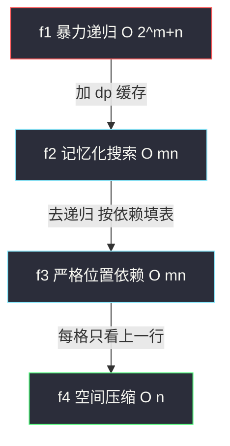
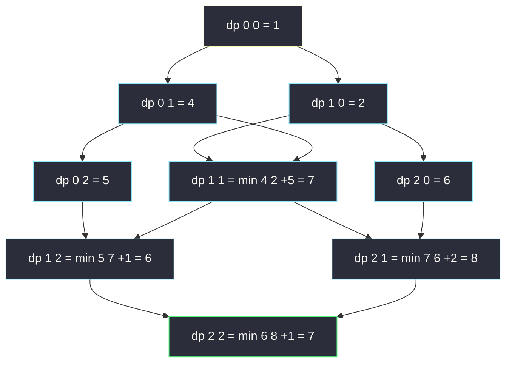

# 最小路径和（网格求最小：递归 → 记忆化 → 填表 → 空间压缩）

## 一、问题描述

给定一个包含**非负整数**的 `m x n` 网格 `grid`，请找出一条从**左上角**到**右下角**的路径，使得路径上的数字总和**最小**。每次只能向下或者向右移动一步。

> 🔗 LeetCode 64：https://leetcode.cn/problems/minimum-path-sum/

**示例 1**

```
输入：grid = [[1,3,1],[1,5,1],[4,2,1]]
输出：7
解释：路径 1 → 3 → 1 → 1 → 1 的总和最小，为 7
```

**示例 2**

```
输入：grid = [[1,2,3],[4,5,6]]
输出：12
解释：路径 1 → 2 → 3 → 6，总和 12
```

**直观理解**

[#62 不同路径](./unique-paths.md) 数的是「有多少条路」，本题问的是「这些路里哪条最便宜」。套路完全同构——**站在 `(i, j)` 回头看**：最后一步要么从上面的 `(i-1, j)` 下来，要么从左边的 `(i, j-1)` 过来。要让自己最便宜，就选两个来源里**更便宜的那个**：

```
minSum(i, j) = grid[i][j] + min( minSum(i-1, j), minSum(i, j-1) )
```

计数题的「相加」变成最值题的「取 min 加格值」，其余四要素（定义/初始化/顺序/压缩）原封不动。

> 📚 课源码定位：**`class067/Code01_MinimumPathSum.java`，本题原题**。课上给了完整的四步演进：`minPathSum1` 暴力递归 → `minPathSum2` 记忆化搜索 → `minPathSum3` 严格位置依赖的动态规划 → `minPathSum4` 空间压缩。本篇逐一对齐。

---

## 二、暴力解法（入门）

### 直观思路

课上 `f1` 的定义：`f(i, j)` 表示**从 `(0,0)` 到 `(i,j)` 的最小路径和**，按最后一步来自上/来自左分类，取更小的加上当前格值：

```java
// 最小路径和：直接递归（对齐 class067/Code01 的 f1）
public static int minPathSum1(int[][] grid) {
    return f1(grid, grid.length - 1, grid[0].length - 1);
}

// 从(0,0)到(i,j)最小路径和，每次只能向右或向下
public static int f1(int[][] grid, int i, int j) {
    if (i == 0 && j == 0) {
        return grid[0][0];
    }
    int up = Integer.MAX_VALUE;
    int left = Integer.MAX_VALUE;
    if (i - 1 >= 0) {
        up = f1(grid, i - 1, j);
    }
    if (j - 1 >= 0) {
        left = f1(grid, i, j - 1);
    }
    return grid[i][j] + Math.min(up, left);
}
```

细节：越界来源记为 `Integer.MAX_VALUE`，配合 `Math.min` 自动淘汰非法方向——与网格障碍题「非法贡献恒等值」同一思想。

### 复杂度

- **时间**：`O(2^(m+n))`（递归树指数展开）
- **空间**：`O(m + n)`，递归栈深度

### 🔴 瓶颈在哪里

`f(i, j)` 这个子问题在递归树里被反复求解（例如 `f(1,1)` 既被 `f(1,2)` 调又被 `f(2,1)` 调）。`m = n = 15` 就会明显超时。**重复子问题 + 可缓存**，进入标准 DP 流程。

---

## 三、优化探索（核心章节）

### 3.1 可变参数法：两个可变参数 → 二维表

课上方法论：递归 `f(i, j)` 有两个可变参数 `i ∈ [0, m-1]`、`j ∈ [0, n-1]`，所以 dp 表是 `m x n` 二维表，含义直接沿用递归含义：

> `dp[i][j]` = 从 `(0,0)` 走到 `(i,j)` 的最小路径和

### 3.2 四步演进（对齐 class067 课版）



1. **记忆化搜索（f2）**：`dp[i][j]` 初值 -1 表示没算过；进递归先查缓存，返回前写缓存。
2. **严格位置依赖（f3）**：分析 `dp[i][j]` 依赖**上方**和**左侧** → 填表顺序「先首行首列，再从上到下、从左到右」。`dp[0][j]` 是第一行前缀和（只能一路向右），`dp[i][0]` 是第一列前缀和（只能一路向下）。
3. **空间压缩（f4）**：`dp[i][j]` 只依赖上一行同列 + 本行左格 → 一行数组即可。课前先让 `dp` 变成「想象中第 0 行」，然后逐行向下刷新。

```
dp[0][0] = grid[0][0]
dp[0][j] = dp[0][j-1] + grid[0][j]        (第一行：只能从左来)
dp[i][0] = dp[i-1][0] + grid[i][0]        (第一列：只能从上来)
dp[i][j] = min(dp[i-1][j], dp[i][j-1]) + grid[i][j]
```

### 3.3 关键推导问题

| 问题 | 答案 |
|------|------|
| 为什么「最优子结构」成立？ | 从 `(0,0)` 到 `(i,j)` 的最优路径，砍掉最后一步仍是到 `(i-1,j)` 或 `(i,j-1)` 的最优路径；否则换成更优的前缀总更小 |
| 会不会绕路更优？ | 不会，只能向右/向下，任何到 `(i,j)` 的路径必经上格或左格，分类不重不漏 |
| 负数会破坏贪心吗？ | 本题 `grid[i][j] ≥ 0`，但转移本身**不依赖非负性**（是枚举两类取 min，不是贪心），有负数一样可解 |
| 为什么不能贪心「每步走小的」？ | 局部便宜可能把路引进昂贵区域；DP 枚举了**所有**来源，保证全局最优 |
| 溢出风险？ | 约束 `1 ≤ m,n ≤ 200`、`0 ≤ grid[i][j] ≤ 200`，最大和约 `200+199) x 200 = 8 x 10^4` 量级，`int` 安全 |

### 3.4 一句话核心

> **计数题的加号换成 min：dp[i][j] = min(上, 左) + grid[i][j]，首行首列是前缀和，一行数组滚到底。**

---

## 四、代码实现详解

### Java（主解：严格位置依赖的动态规划，对齐 class067 f3）

```java
// 最小路径和
// 给定一个包含非负整数的 m x n 网格
// 找出一条从左上角到右下角的路径，使得路径上的数字总和为最小
// 测试链接 : https://leetcode.cn/problems/minimum-path-sum/
// 对齐 class067/Code01_MinimumPathSum 的 minPathSum3
public class Solution {

    // 时间复杂度 O(m * n)，空间复杂度 O(m * n)
    public static int minPathSum(int[][] grid) {
        int n = grid.length;
        int m = grid[0].length;
        // dp[i][j] : 从(0,0)到(i,j)的最小路径和
        // 转移 : dp[i][j] = min(dp[i-1][j], dp[i][j-1]) + grid[i][j]
        // 依赖方向 : 上方和左侧 → 从上到下、从左到右填表
        int[][] dp = new int[n][m];
        dp[0][0] = grid[0][0];
        for (int i = 1; i < n; i++) {
            dp[i][0] = dp[i - 1][0] + grid[i][0]; // 首列：只能从上来
        }
        for (int j = 1; j < m; j++) {
            dp[0][j] = dp[0][j - 1] + grid[0][j]; // 首行：只能从左来
        }
        for (int i = 1; i < n; i++) {
            for (int j = 1; j < m; j++) {
                dp[i][j] = Math.min(dp[i - 1][j], dp[i][j - 1]) + grid[i][j];
            }
        }
        return dp[n - 1][m - 1];
    }
}
```

### Java（进阶：空间压缩，对齐 class067 f4）

```java
public class Solution {

    // 一维数组滚动：dp[j] 复用前 = 上一行同列，dp[j-1] 已更新 = 本行左格
    // 时间 O(m * n)，空间 O(m)
    public static int minPathSum2(int[][] grid) {
        int n = grid.length;
        int m = grid[0].length;
        int[] dp = new int[m];
        dp[0] = grid[0][0];
        for (int j = 1; j < m; j++) {
            dp[j] = dp[j - 1] + grid[0][j]; // 先变成想象中的第 0 行
        }
        for (int i = 1; i < n; i++) {
            dp[0] += grid[i][0];            // 第 0 列只能从上来
            for (int j = 1; j < m; j++) {
                dp[j] = Math.min(dp[j - 1], dp[j]) + grid[i][j];
                //                   本行左     上一行
            }
        }
        return dp[m - 1];
    }
}
```

### Python（同思路）

```python
# 最小路径和：二维填表（对齐 f3），O(m*n) / O(m*n)
class Solution:
    def minPathSum(self, grid: List[List[int]]) -> int:
        n, m = len(grid), len(grid[0])
        # dp[i][j]：从(0,0)到(i,j)的最小路径和 = min(上,左) + grid[i][j]
        dp = [[0] * m for _ in range(n)]
        dp[0][0] = grid[0][0]
        for i in range(1, n):
            dp[i][0] = dp[i - 1][0] + grid[i][0]
        for j in range(1, m):
            dp[0][j] = dp[0][j - 1] + grid[0][j]
        for i in range(1, n):
            for j in range(1, m):
                dp[i][j] = min(dp[i - 1][j], dp[i][j - 1]) + grid[i][j]
        return dp[n - 1][m - 1]
```

```python
# 空间压缩：一行数组滚动（对齐 f4），O(m*n) / O(m)
class Solution:
    def minPathSum(self, grid: List[List[int]]) -> int:
        m = len(grid[0])
        dp = grid[0][:]                     # 想象中的第 0 行
        for j in range(1, m):
            dp[j] += dp[j - 1]
        for row in grid[1:]:
            dp[0] += row[0]
            for j in range(1, m):
                dp[j] = min(dp[j], dp[j - 1]) + row[j]
        return dp[-1]
```

---

## 五、具体例子演示

以示例 1 的 `3 x 3` 网格为例，端到端跟踪 `f3` 填表：

```
grid = 1  3  1
       1  5  1
       4  2  1
```

### 第 1 步：初始化首行首列（前缀和）

| dp | j=0 | j=1 | j=2 |
|----|-----|-----|-----|
| i=0 | 1 | 1+3=**4** | 4+1=**5** |
| i=1 | 1+1=**2** | ? | ? |
| i=2 | 2+4=**6** | ? | ? |

首行 `1→4→5`（只能一路向右），首列 `1→2→6`（只能一路向下）。

### 第 2 步：逐格填充（标出取了哪个来源）

| 格子 | 转移式 | 上 | 左 | 取 | dp 值 |
|------|--------|----|----|----|-------|
| (1,1) | min(dp[0][1], dp[1][0]) + 5 | 4 | 2 | **左 2** | **7** |
| (1,2) | min(dp[0][2], dp[1][1]) + 1 | 5 | 7 | **上 5** | **6** |
| (2,1) | min(dp[1][1], dp[2][0]) + 2 | 7 | 6 | **左 6** | **8** |
| (2,2) | min(dp[1][2], dp[2][1]) + 1 | 6 | 8 | **上 6** | **7** |

### 第 3 步：读答案

`dp[2][2] = 7`。回溯最优路径：`(2,2)` 取上 → `(1,2)` 取上 → `(1,1)` 取左 → `(1,0)` → `(0,0)`，即 `1 → 1 → 3 → 1 → 1`？注意方向倒着看：路径是 `(0,0)1 → (0,1)3 → (0,2)1 → (1,2)1 → (2,2)1`，总和 `1+3+1+1+1 = 7`，与示例一致。



黄框是初值（前缀和），青框逐格取 min 推进，绿框即答案 `7`。

---

## 六、复杂度分析

| 版本 | 时间 | 空间 | 说明 |
|------|------|------|------|
| f1 暴力递归 | `O(2^(m+n))` | `O(m+n)` | 重复子问题指数爆炸 |
| f2 记忆化搜索 | `O(mn)` | `O(mn)` | dp 缓存 + 递归栈 O(m+n) |
| f3 二维填表（主解） | `O(mn)` | `O(mn)` | 依赖方向显式，最好讲 |
| f4 空间压缩 | `O(mn)` | `O(m)` | 一行数组，每行刷一遍 |

---

## 七、方法对比与总结

### 网格最值 DP 三板斧（与计数题对照）

```
计数 : dp[i][j] = dp[i-1][j]  +  dp[i][j-1]              (#62/#63)
最值 : dp[i][j] = min(dp[i-1][j], dp[i][j-1]) + grid[i][j] (本题)
起点 : 首行首列前缀累加（最值题同样只能单向来）
```

### 易错点

1. **首行首列写成 `min(上, 左)`**：首行没有「上」，必须用前缀和公式 `dp[0][j] = dp[0][j-1] + grid[0][j]`。
2. **滚动数组忘了先刷第 0 列**：`dp[0] += grid[i][0]` 要在内层循环之前做，否则第 0 列还是上一行的值。
3. **压缩时滚动方向反了**：必须从左往右扫，保证 `dp[j-1]` 是本行新值。
4. **贪心思维上头**：每步走相邻较小值不是最优（示例里从 `1` 出发先向左 `1` 更小，但最优路径先走 `3`）。

### 模板口诀

> **上左两来源，取小加自身；首行首列前缀和，一行数组刷到尾。**

---

## 八、举一反三

| 题目 | 链接 | 迁移点 |
|------|------|--------|
| 62. 不同路径 | https://leetcode.cn/problems/unique-paths/ | 同网格，计数版（本站已收录题解） |
| 63. 不同路径 II | https://leetcode.cn/problems/unique-paths-ii/ | 计数 + 障碍；本题加障碍即「不可达记 INF 再取 min」 |
| 1289. 下降路径最小和 II | https://leetcode.cn/problems/minimum-falling-path-sum-ii/ | 上一行**任意列**都能来，转移内多一层循环 |
| 120. 三角形最小路径和 | https://leetcode.cn/problems/triangle/ | 网格变三角、可自底向上填表 |
| 931. 下降路径最小和 | https://leetcode.cn/problems/minimum-falling-path-sum/ | 依赖方向变上/左上/右上三方向 |
| 1937. 扣分后的最大得分 | https://leetcode.cn/problems/maximum-number-of-points-with-cost/ | 每列选一格的累加最大值，依赖上一行任意列 + 负分抵扣 |

**迁移一句**：网格最值题永远从「**最后一步来自哪**」出发枚举来源取 min/max——来源方向决定依赖与填表顺序，格子上的代价只是转移式里的加项。
