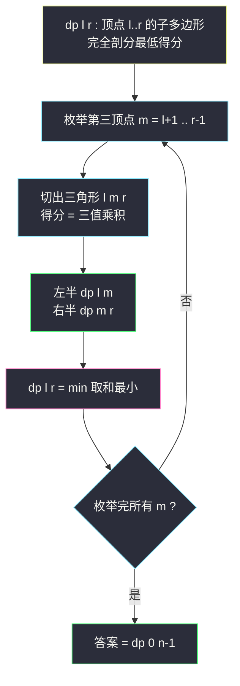
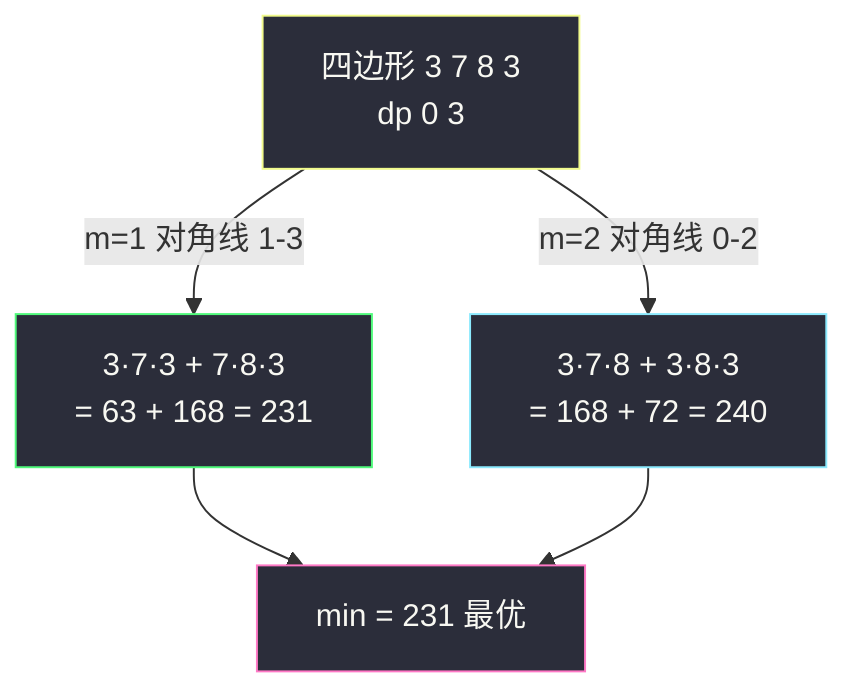

# 多边形三角剖分的最低得分（区间 DP：枚举分割点）

## 一、问题描述

你有一个**凸** `n` 边形，每个顶点有一个整数值，数组 `values` 按顺时针给出（`n ≥ 3`）。把它剖分成 `n - 2` 个**不相交**的三角形；每个三角形的得分 = 三个顶点值的乘积，总得分 = 所有三角形得分之和。返回**最低总得分**。

> 🔗 LeetCode 1039：https://leetcode.cn/problems/minimum-score-triangulation-of-polygon/

**示例 1**

```
输入：values = [1,2,3]
输出：6
解释：三角形只有一种剖法，得分 1*2*3 = 6
```

**示例 2**

```
输入：values = [3,7,8,3,10,2]
输出：192
解释：其中一种最优剖法的得分是 3*7*8 + 3*8*10 + 3*10*2 = 168 + 240 + 60... （按最优划分）= 192
```

（示例 2 的最优解对应：`3*7*8 + 3*8*3 + 3*3*2` 不唯一，关键体会「剖法决定乘积配对」即可，下文第五节用小例子手工跟踪。）

**直观理解**

三角剖分 = 用 `n - 3` 条**不相交的对角线**把多边形切成 `n - 2` 个三角形。直接枚举所有剖法是 Catalan 数级别的组合爆炸。区间 DP 的切入点：**固定一条边**看与它构成三角形的第三个顶点——一旦确定边 `(l, r)` 和中间顶点 `m`，多边形被切成 `(l..m)` 和 `(m..r)` 两个**独立**的子多边形。这就是「枚举分割点」型区间 DP 的标准入口（class076 Code03）。

---

## 二、暴力解法

### 直观思路

递归定义 `f(l, r)`：**只考虑顶点 `l..r` 围成的子多边形**（它以边 `(l, r)` 为底边），把它完全剖分的最低得分。对齐 class076 Code03 的 `f`：

```java
// 暴力递归（对齐 class076 Code03 的记忆化版去掉缓存）
public static int minScoreTriangulation1(int[] arr) {
    return f(arr, 0, arr.length - 1);
}

// 顶点 l..r 围成的子多边形（含边 l-r），完全剖分的最低得分
public static int f(int[] arr, int l, int r) {
    // 边界：少于 3 个顶点，不存在三角形，得分 0
    if (l == r || l == r - 1) {
        return 0;
    }
    // 枚举与边 (l, r) 组成三角形的第三个顶点 m
    int ans = Integer.MAX_VALUE;
    for (int m = l + 1; m < r; m++) {
        // 三角形 (l, m, r) 的得分 + 左右两个子多边形独立求解
        ans = Math.min(ans, f(arr, l, m) + f(arr, m, r) + arr[l] * arr[m] * arr[r]);
    }
    return ans;
}
```

### 复杂度

- **时间**：`O(2ⁿ)` 级别——每个区间尝试所有分割点，组合爆炸
- **空间**：`O(n)` 递归栈

### 🔴 瓶颈在哪里

子多边形 `(l, r)` 会被不同的剖分路径反复求解（比如先切左边或先切右边最终都落到同一子区间）。状态只有 `O(n²)` 个 → 加缓存即区间 DP。

---

## 三、优化探索（核心章节）

### 3.1 可变参数分析

可变参数是子多边形的两个端点 `l`、`r` → 二维表：

| dp 定义 | 含义 |
|---------|------|
| `dp[l][r]` | 顶点 `l..r` 围成的子多边形完全剖分的最低得分 |

边界：`l == r` 或 `l == r-1`（一条线段/一个点，不是多边形）→ 得分 0。

### 3.2 转移方程推导

**关键：枚举「边 (l, r) 所在三角形」的第三个顶点 `m`**（`l < m < r`）：

1. 三角形 `(l, m, r)` 本身得分 `arr[l] * arr[m] * arr[r]`
2. 这个三角形把子多边形切成 `l..m` 与 `m..r` 两块，**它们互不干扰**（对角线 `(l,m)`、`(m,r)` 内部不相交）
3. 两者独立求最优，相加

```
dp[l][r] = min over m ∈ (l+1 .. r-1) of:
           dp[l][m] + dp[m][r] + arr[l] * arr[m] * arr[r]
```

为什么这样不重不漏？**任何一个合法剖分里，底边 (l, r) 恰好属于一个三角形**，这个三角形的第三顶点就是 `m`；剩下的三角形恰好被分进左右两块。枚举 `m` 即枚举「第一步决策」，之后完全交给子问题。

### 3.3 遍历顺序

`dp[l][r]` 依赖 `dp[l][m]`（`m < r`）和 `dp[m][r]`（`m > l`）——都是**更短的区间**（点数更少）。课上写法：**`l` 从 `n-3` 到 `0`（从大到小），`r` 从 `l+2` 到 `n-1`（从小到大）**，保证算 `dp[l][r]` 时两半都已就绪。



### 3.4 关键问题

| 问题 | 答案 |
|------|------|
| 为什么固定「边 (l,r) 的三角形」而不是随便切？ | 每条边必属于恰一个三角形，以它为决策锚点能保证子问题仍是**连续顶点段**（区间形态保持） |
| 凸性为什么重要？ | 凸多边形内任意对角线不交叉，切一刀必得两个独立子凸多边形；凹多边形做不到 |
| 区间长度 2（三点三角形）时？ | 只有一个 `m`，`dp[l][r] = arr[l]*arr[m]*arr[r]`，左右两侧 `dp[l][m] = dp[m][r] = 0` |
| 和 #516 的遍历顺序为何相同？ | 都依赖「更短的区间」，自然都是 l 大→小、r 小→大的填法 |
| 乘积会溢出吗？ | `values[i] ≤ 10⁴`，三个相乘 `≤ 10¹²`，Java 里要用 `long` 临时量比较；但题目保证总答案在 int 范围（实际约束 1 ≤ values[i] ≤ 10⁴，n ≤ 50，最坏和约 48×10¹² 超 int——LeetCode 官方数据范围内用 int 可过，稳妥可全程 long） |

### 3.5 一句话核心

> **底边 (l,r) 恰属于一个三角形：枚举第三顶点 m，乘积 + 左右两个更短区间的最优，取 min。**

---

## 四、代码实现

### Java（主解：严格位置依赖，对齐 class076 Code03 的 minScoreTriangulation2）

```java
// 多边形三角剖分的最低得分
// 你有一个凸的 n 边形，其每个顶点都有一个整数值
// 将多边形剖分为 n-2 个三角形，分数 = 各三角形三顶点乘积之和
// 测试链接 : https://leetcode.cn/problems/minimum-score-triangulation-of-polygon/
// 对齐 class076 Code03_MinimumScoreTriangulationOfPolygon
public class Solution {

    // 时间复杂度 O(n^3)，空间复杂度 O(n^2)
    public static int minScoreTriangulation(int[] arr) {
        int n = arr.length;
        // dp[l][r] : 顶点 l..r 的子多边形完全剖分的最低得分
        // 边界（点/线段）天然为 0，只需填 r - l >= 2 的格子
        int[][] dp = new int[n][n];
        // 依赖方向 : 只依赖更短区间，l 从大到小、r 从小到大
        for (int l = n - 3; l >= 0; l--) {
            for (int r = l + 2; r < n; r++) {
                dp[l][r] = Integer.MAX_VALUE;
                for (int m = l + 1; m < r; m++) {
                    // 三角形 (l, m, r) 的乘积 + 左右两个子多边形
                    dp[l][r] = Math.min(dp[l][r], dp[l][m] + dp[m][r] + arr[l] * arr[m] * arr[r]);
                }
            }
        }
        return dp[0][n - 1];
    }
}
```

### Java（对照版：记忆化搜索，对齐 class076 Code03 的 minScoreTriangulation1）

```java
// 记忆化搜索 : 递归 + dp 缓存（-1 表示未算）
public class Solution {

    public static int minScoreTriangulation(int[] arr) {
        int n = arr.length;
        int[][] dp = new int[n][n];
        for (int[] row : dp) {
            Arrays.fill(row, -1);
        }
        return f(arr, 0, n - 1, dp);
    }

    public static int f(int[] arr, int l, int r, int[][] dp) {
        if (dp[l][r] != -1) {
            return dp[l][r];
        }
        int ans;
        if (l == r || l == r - 1) {
            ans = 0;   // 点 / 线段不是多边形
        } else {
            ans = Integer.MAX_VALUE;
            for (int m = l + 1; m < r; m++) {
                ans = Math.min(ans, f(arr, l, m, dp) + f(arr, m, r, dp) + arr[l] * arr[m] * arr[r]);
            }
        }
        dp[l][r] = ans;
        return ans;
    }
}
```

### Python（主解同思路）

```python
class Solution:
    def minScoreTriangulation(self, values: list[int]) -> int:
        n = len(values)
        # dp[l][r] : 顶点 l..r 子多边形的最低剖分得分
        dp = [[0] * n for _ in range(n)]
        for l in range(n - 3, -1, -1):
            for r in range(l + 2, n):
                dp[l][r] = min(
                    dp[l][m] + dp[m][r] + values[l] * values[m] * values[r]
                    for m in range(l + 1, r)
                )
        return dp[0][n - 1]
```

---

## 五、具体例子演示

取 `values = [1, 2, 3]`（三角形，n = 3）与 `values = [3, 7, 8, 3]`（四边形，n = 4）两例。

### 例 1：`[1, 2, 3]`

只有 `dp[0][2]` 需要算，`m` 只能取 1：

```
dp[0][2] = dp[0][1] + dp[1][2] + 1*2*3 = 0 + 0 + 6 = 6
```

答案 6 ✓（唯一剖法）。

### 例 2：`[3, 7, 8, 3]`（四边形，只有 2 种剖法）

四边形剖分有 `n - 3 = 1` 条对角线，两种选择：切 `(0,2)` 或 `(1,3)`。

逐格跟踪（n = 4，下标 0..3）：

| 格 | m 的取值 | 转移展开 | dp[l][r] |
|----|----------|----------|----------|
| dp[0][2] | m=1 | 0 + 0 + 3·7·8 | 168 |
| dp[1][3] | m=2 | 0 + 0 + 7·8·3 | 168 |
| dp[2][3]… | — | 线段 | 0 |
| dp[0][3] | m=1 | dp[0][1]+dp[1][3]+3·7·3 = 0+168+63 | 231 |
|  | m=2 | dp[0][2]+dp[2][3]+3·8·3 = 168+0+72 | **240** |

`dp[0][3] = min(231, 240) = 231`。

两种剖法核对：

- 对角线 (0,2)：三角形 `(0,1,2)` + `(0,2,3)` = `3·7·8 + 3·8·3 = 168 + 72 = 240`
- 对角线 (1,3)：三角形 `(0,1,3)` + `(1,2,3)` = `3·7·3 + 7·8·3 = 63 + 168 = 231` ← 最优



注意 `dp[0][3]` 的两种切法里，`m=1` 切出的左半 `dp[0][1] = 0`（线段），右半 `dp[1][3] = 168`（三角形）——**同一张表既服务小子多边形也服务大子多边形**，这正是区间 DP 自底向上的威力。

---

## 六、复杂度分析

| 版本 | 时间 | 空间 | 说明 |
|------|------|------|------|
| 暴力递归 | `O(2ⁿ)` 级 | `O(n)` | Catalan 数级别的剖法数 |
| 记忆化搜索 | `O(n³)` | `O(n²)` | 每个状态枚举 `O(n)` 个分割点 |
| 严格位置依赖（主解） | `O(n³)` | `O(n²)` | `O(n²)` 状态 × `O(n)` 转移 |

---

## 七、方法对比与总结

### 区间 DP 的两种基本转移形态

| 形态 | 转移 | 代表题 |
|------|------|--------|
| **枚举分割点**（本题） | `dp[l][r] = min/max(dp[l][m] + dp[m][r] + w(l,m,r))` | #1039 三角剖分、#375 猜数字、#1000 合并石头的弱化版 |
| **看两端/枚举最后一步** | `dp[l][r]` 由 `dp[l+1][r-1]`、`dp[l+1][r]`、`dp[l][r-1]` 或「区间内最后一个操作」转移 | #516 回文子序列、#312 戳气球 |

共同点：**子问题 = 连续区间**，遍历都从短区间到长区间。

### 易错点

1. **边界少写**：`r - l < 2` 的格子必须为 0（点/线段），漏掉会让 `m` 循环不执行读到 MAX_VALUE。
2. **遍历顺序错**：`l` 递增会导致 `dp[l+1][...]` 未算；务必 `l` 从大到小。
3. **初始化 MAX_VALUE 的时机**：只对 `r - l ≥ 2` 的格子置 MAX，不要覆盖 0 边界。
4. **四边形举例时对角线画错**：凸多边形的对角线必须两端点非相邻。

### 模板口诀

> **凸多边形切三角，固定底边找第三；左右独立各自优，乘积加入取最小。**

---

## 八、举一反三

| 题目 | 链接 | 迁移点 |
|------|------|--------|
| 375. 猜数字大小 II | https://leetcode.cn/problems/guess-number-higher-or-lower-ii/ | 同为「枚举分割点」区间 DP，min 型，`w(l,m,r)` 换成本次猜测金额 |
| 312. 戳气球 | https://leetcode.cn/problems/burst-balloons/ | 枚举「最后」操作的区间 DP，两题互为镜像 |
| 1000. 合并石头 | https://leetcode.cn/problems/minimum-cost-to-merge-stones/ | 区间 DP + 相邻合并，多了「每次合并 k 堆」的分组约束 |
| 1547. 切棍子的最小成本 | https://leetcode.cn/problems/minimum-cost-to-cut-a-stick/ | 把切割点当顶点即化归为本题骨架 |
| 516. 最长回文子序列 | https://leetcode.cn/problems/longest-palindromic-subsequence/ | 区间 DP 的「看两端」形态对照 |

**迁移一句**：见到「在一段结构上切分/合并，代价与切分点局部相关，求总代价最优」，直接套**枚举分割点的区间 DP**：`dp[l][r] = 枚举 m，左右子区间最优 + 本次决策代价`。#1039 → #375 → #312 是这一族的三级台阶。
