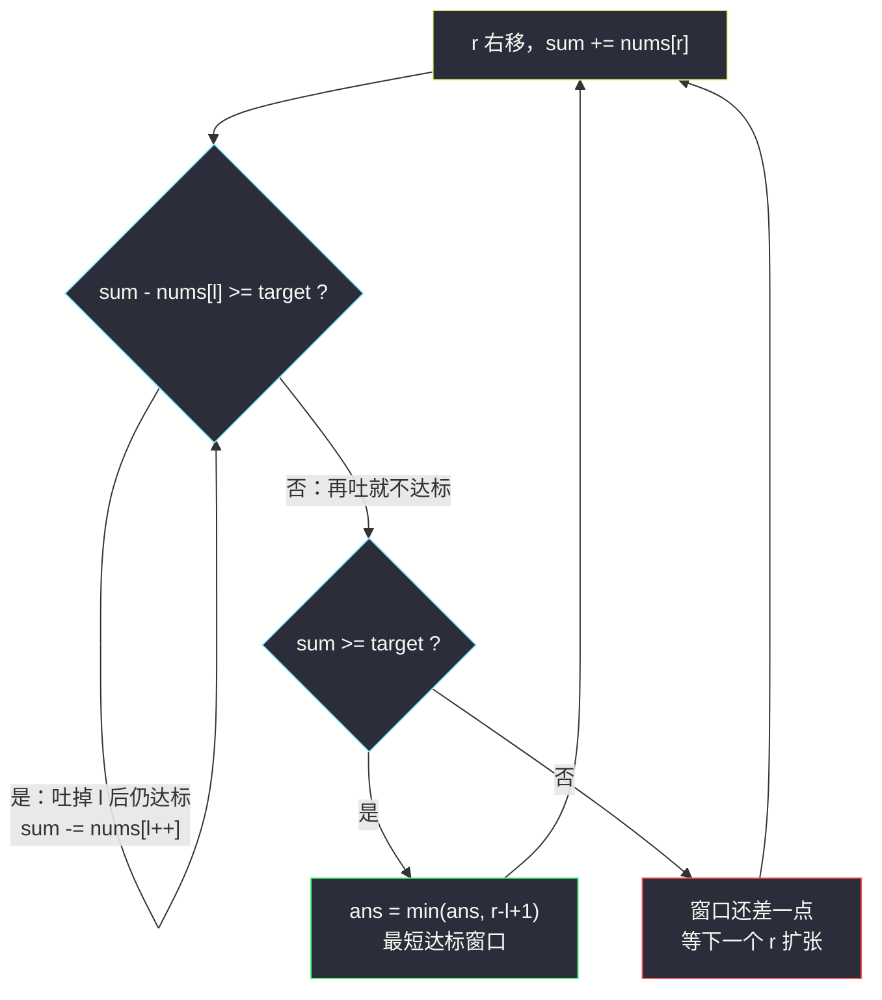
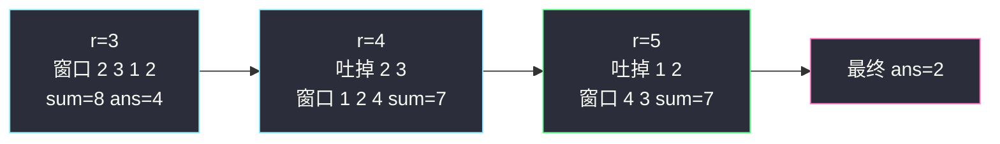

# 长度最小的子数组（变长滑动窗口求最短）

## 一、问题描述

给定一个含有 `n` 个**正整数**的数组和一个正整数 `target`，找到累加和 `>= target` 的**长度最小**的**连续子数组**，返回其长度。若不存在符合条件的子数组，返回 `0`。

> 🔗 LeetCode 209：https://leetcode.cn/problems/minimum-size-subarray-sum/

**示例 1（经典）**

```
输入：target = 7, nums = [2,3,1,2,4,3]
输出：2
解释：子数组 [4,3] 是条件下的长度最小的子数组。
```

**示例 2**

```
输入：target = 4, nums = [1,4,4]
输出：1
解释：子数组 [4] 已经 >= 4。
```

**直观理解**

找一段**尽量短**的连续区间，使区间和达标。与「求最长」的窗口方向相反：这里右端负责**扩张凑和**，一旦达标就**收缩左端**找更短的。

---

## 二、暴力解法（入门）

### 直观思路

枚举所有子数组的左端点 `l`，向右累加 `sum`，一旦 `sum >= target` 就记录长度并 `break`（再长只会更差）。

```java
public int minSubArrayLen(int target, int[] nums) {
    int n = nums.length, ans = Integer.MAX_VALUE;
    for (int l = 0; l < n; l++) {
        int sum = 0;
        for (int r = l; r < n; r++) {
            sum += nums[r];
            if (sum >= target) {
                ans = Math.min(ans, r - l + 1);
                break;
            }
        }
    }
    return ans == Integer.MAX_VALUE ? 0 : ans;
}
```

### 复杂度

- **时间**：`O(n²)`。
- **空间**：`O(1)`。

### 🔴 瓶颈在哪里

全是**正数**是本题最关键的隐藏条件：前缀和**严格单调递增**。于是「以 `r` 结尾的最短达标子数组」的左端点随 `r` 单调右移——暴力却每个 `l` 都从零重加，浪费了这个单调性。`n` 到 `10⁵` 时 `O(n²)` 必超时。

---

## 三、优化探索（核心章节）

### 3.1 观察特征

| 特征 | 说明 |
|------|------|
| 全为正数 | 窗口和 `sum` 随扩张严格变大、随收缩严格变小（**单调性是滑窗成立的根基**） |
| 求**最短**达标子数组 | 达标后要收缩左端，越短越好 |
| 连续子数组 | 双指针 `l / r` |

### 3.2 从暴力到优化的推导

关键观察：既然数都是正的，那么

- 固定右端 `r`，窗口 `[l..r]` 的和随 `l` 增大而**严格减小**；
- 「以 `r` 结尾的最短达标窗口」的左端点 `best(r)` 关于 `r` **单调不减**——`r` 右移后窗口和变大，之前能吐掉的左端现在照样能吐，还可能吐得更多。

所以让 `l`、`r` 都只前进不后退：`r` 每右移一格纳入新数，若「把 `nums[l]` 吐出去后仍然达标」就继续吐，吐到不能吐为止——此时窗口是以 `r` 结尾的**最短达标窗口**，用它的长度更新答案。



### 3.3 为什么课上先「吐到极限」再判？

常见写法是 `while (sum >= target) { 记答案; 吐左 }`。课上（class049 Code01）把判断条件改成 `while (sum - nums[l] >= target)`：**先确认吐掉 `l` 后还达标，才吐**。两种写法统计的答案集合完全一样——每个 `r` 对应的 `l` 都停在「最短达标」位置；课上版把「吐到极限」和「记答案」分离，逻辑上更好读：先归位，再一次性记录。

### 3.4 如果有负数怎么办？

滑窗的单调性立刻失效（吐左可能让 `sum` 变大）。此时要换 **前缀和 + 单调队列 / 前缀和 + 二分（仅正数）**，参考 #862 和为 K 的最短子数组。本题正数条件是白送的，直接滑窗。

### 3.5 一句话核心

> **正数保证窗口和单调：`r` 扩张凑达标，`l` 吐到「再吐就不达标」为止，`r - l + 1` 就是以 r 结尾的最短答案。**

---

## 四、代码实现详解

### Java（课上版，对齐 class049）

```java
// 累加和大于等于 target 的最短子数组长度
// 给定一个含有 n 个正整数的数组和一个正整数 target
// 找到累加和 >= target 的长度最小的子数组并返回其长度
// 如果不存在符合条件的子数组返回 0
// 测试链接 : https://leetcode.cn/problems/minimum-size-subarray-sum/
public class Solution {

    public static int minSubArrayLen(int target, int[] nums) {
        int ans = Integer.MAX_VALUE;
        for (int l = 0, r = 0, sum = 0; r < nums.length; r++) {
            sum += nums[r];
            while (sum - nums[l] >= target) {
                // sum : nums[l....r]
                // 如果 l 位置的数从窗口出去，还能继续达标，那就出去
                sum -= nums[l++];
            }
            if (sum >= target) {
                ans = Math.min(ans, r - l + 1);
            }
        }
        return ans == Integer.MAX_VALUE ? 0 : ans;
    }
}
```

**变量含义**

| 变量 | 含义 |
|------|------|
| `sum` | 当前窗口 `nums[l..r]` 的累加和（注释里的不变式） |
| `l` | 窗口左端，只在 while 里被吐出去 |
| `ans` | 目前见过的最短达标长度，`Integer.MAX_VALUE` 表示还没见过 |

**循环不变式**：进入 `if` 判断时，`nums[l..r]` 达标且 `nums[l+1..r]` 不达标——这正是「以 `r` 结尾的最短达标子数组」。

### Java（常见变体：达标即记录再收缩）

```java
public static int minSubArrayLen2(int target, int[] nums) {
    int ans = Integer.MAX_VALUE;
    for (int l = 0, r = 0, sum = 0; r < nums.length; r++) {
        sum += nums[r];
        while (sum >= target) {              // 达标就先记再吐
            ans = Math.min(ans, r - l + 1);
            sum -= nums[l++];
        }
    }
    return ans == Integer.MAX_VALUE ? 0 : ans;
}
```

### Python

```python
class Solution:
    def minSubArrayLen(self, target: int, nums: list[int]) -> int:
        ans = float("inf")
        l = 0
        sum_ = 0
        for r in range(len(nums)):
            sum_ += nums[r]
            while sum_ - nums[l] >= target:   # 吐掉 l 后仍达标就吐
                sum_ -= nums[l]
                l += 1
            if sum_ >= target:
                ans = min(ans, r - l + 1)
        return 0 if ans == float("inf") else ans
```

---

## 五、具体例子演示

`target = 7`，`nums = [2,3,1,2,4,3]`，逐步跟踪：

| r | 纳入后 sum | 吐左过程 | 最终 l | 窗口 | 达标? | ans |
|---|-----------|----------|--------|------|------|-----|
| 0 | 2 | 不进 while（2−2=0 < 7） | 0 | `[2]` | ❌ | ∞ |
| 1 | 5 | 5−2=3 < 7 | 0 | `[2,3]` | ❌ | ∞ |
| 2 | 6 | 6−2=4 < 7 | 0 | `[2,3,1]` | ❌ | ∞ |
| 3 | 8 | 8−2=6 < 7 | 0 | `[2,3,1,2]` | ✅ 长度 4 | 4 |
| 4 | 12 | 吐 2 → 10；10−3=7 ≥ 7 吐 3 → 7；7−1=6 < 7 停 | 2 | `[1,2,4]` | ✅ 长度 3 | **3** |
| 5 | 10 | 吐 1 → 9；9−2=7 ≥ 7 吐 2 → 7；7−4=3 < 7 停 | 4 | `[4,3]` | ✅ 长度 2 | **2** |

答案 `2`，对应子数组 `[4,3]`。注意 `r=4`、`r=5` 时 `l` 一次跳了两格——正数单调性让左端可以「边吐边判」。



---

## 六、复杂度分析

| 方法 | 时间 | 空间 | 说明 |
|------|------|------|------|
| 暴力枚举 | `O(n²)` | `O(1)` | 每个左端重扫 |
| 前缀和 + 二分 | `O(n log n)` | `O(n)` | 正数才有可二分的单调性 |
| 滑动窗口 | `O(n)` | `O(1)` | `l`、`r` 各自至多走 `n` 步 |

`l + r` 总移动步数 ≤ `2n`，所以 while 循环整体摊还是 `O(n)`，不是 `O(n²)`。

---

## 七、方法对比与总结

| | 暴力 | 前缀和 + 二分 | 滑动窗口 |
|--|------|----------------|----------|
| 时间 | `O(n²)` | `O(n log n)` | `O(n)` |
| 空间 | `O(1)` | `O(n)` | `O(1)` |
| 依赖条件 | 无 | 全为正数 | 全为正数 |
| 出错风险 | 超时 | 边界多 | 忘记单调性前提 |

**易错点**

1. **正数条件是滑窗的前提**，有负数（#862）必须换前缀和 + 单调队列。
2. 返回值：没找到要返回 `0`，用 `Integer.MAX_VALUE` 哨兵记得最后转换。
3. 课上版 while 条件是 `sum - nums[l] >= target`（**吐后**仍达标），不是 `sum >= target`，两者语义不同但最终答案一致。
4. `ans` 更新放在 while 之后、且要包在 `if (sum >= target)` 里，否则会把不达标窗口也算进去。

**模板（变长窗口求最短，对齐课上）**

```java
// for (l=0, r=0, sum=0; r<n; r++) {
//     sum += nums[r];                  // 纳入
//     while (吐掉 l 后仍达标) 吐左;      // 收缩到极限
//     if (达标) ans = min(ans, r-l+1); // 更新
// }
```

---

## 八、举一反三

| 题目 | 关系 |
|------|------|
| [713. 乘积小于 K 的子数组](https://leetcode.cn/problems/subarray-product-less-than-k/) | 同骨架，把「和 ≥ target 求最短」换成「积 < k 求个数」（也是正数单调） |
| [76. 最小覆盖子串](https://leetcode.cn/problems/minimum-window-substring/) | 同为「求最短」的变长窗口，判定条件从数值和变成字符计数 |
| [862. 和至少为 K 的最短子数组](https://leetcode.cn/problems/shortest-subarray-with-sum-at-least-k/) | **含负数**，滑窗失效，前缀和 + 单调队列 |
| [1208. 尽可能使字符串相等](https://leetcode.cn/problems/get-equal-substrings-within-budget/) | 变长窗口求最长的姊妹题（预算内最长） |

**思想迁移**

- 「最短达标」窗口：扩张凑条件、收缩找极限，更新放收缩后。
- 「最长不越界」窗口：扩张后若越界才收缩，更新放收缩后——两者只是判定方向不同。
