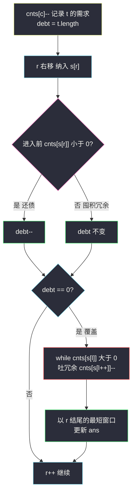

# 最小覆盖子串（变长窗口 + debt 计数法）

## 一、问题描述

给你一个字符串 `s`、一个字符串 `t`。返回 `s` 中涵盖 `t` **所有字符**的最小子串。如果 `s` 中不存在涵盖 `t` 所有字符的子串，返回空字符串 `""`。

**注意**：`t` 中同一个字符可能在 `s` 中没有对应位置时出现多次，即覆盖必须「按次数足额」——`t = "aabc"` 就要求子串里至少有 2 个 `a`、1 个 `b`、1 个 `c`。题目保证答案唯一时返回该子串。

> 🔗 LeetCode 76：https://leetcode.cn/problems/minimum-window-substring/

**示例 1（经典）**

```
输入：s = "ADOBECODEBANC", t = "ABC"
输出："BANC"
解释：最小覆盖子串 "BANC" 包含来自 t 的 A、B、C 各一个
```

**示例 2**

```
输入：s = "a", t = "a"
输出："a"
```

**示例 3**

```
输入：s = "a", t = "aa"
输出：""
解释：t 中两个 a 必须都被覆盖，s 中只有一个 a，无解
```

**直观理解**

在 `s` 上滑一个**变长**窗口：右边界一路扩张「进货」，直到窗口内的字符**足额覆盖** `t`；然后把左边界一路收缩「去冗余」，挤掉不需要的字符，直到再挤就不够为止——这一刻的窗口就是「以当前 r 结尾的最短覆盖子串」。记下最短的，继续右移 r，直到扫完整个 `s`。

---

## 二、暴力解法（入门）

### 直观思路

枚举所有子串起点 `i`，再枚举终点 `j`，每次把子串拷出来统计频次，与 `t` 的频次比较。

```java
public String minWindow(String s, String t) {
    int n = s.length(), m = t.length();
    int[] need = new int[128];
    for (char c : t.toCharArray()) need[c]++;
    int minLen = Integer.MAX_VALUE, start = -1;
    for (int i = 0; i < n; i++) {
        int[] cnt = new int[128];
        for (int j = i; j < n; j++) {
            cnt[s.charAt(j)]++;
            boolean ok = true;
            for (int c = 0; c < 128; c++) {
                if (cnt[c] < need[c]) { ok = false; break; }
            }
            if (ok && j - i + 1 < minLen) {
                minLen = j - i + 1;
                start = i;
            }
        }
    }
    return start == -1 ? "" : s.substring(start, start + minLen);
}
```

### 复杂度

- **时间**：`O(n² · Σ)`，Σ=128，双重枚举 + 每次频次比对（`n ≤ 10⁵` 直接爆炸）。
- **空间**：`O(Σ)`。

### 🔴 瓶颈在哪里

1. 右端扩张时**每次都重扫整张频次表**，而每一步其实只多了一个字符。
2. 已经覆盖后还在原地反复比较，不知道「一旦覆盖，最短子串只跟再收缩一步有关」。

两个痛点分别对应两个优化：**差分更新计数**、**满足后收缩**——合起来就是滑动窗口。

---

## 三、优化探索（核心章节）

### 3.1 观察特征

| 特征 | 结论 |
|------|------|
| 求的是「最短」满足条件的子串 | **变长窗口**：不满足时扩张 r，满足时收缩 l（与「最长」类恰好相反） |
| 覆盖判据是「每类字符个数 ≥ 需求」 | 与顺序无关 → 计数表天然适配 |
| 每步只进出**一个字符** | 计数可以 `±1` 差分维护，判覆盖要 O(1) |

### 3.2 debt 计数法：把「够不够」压成一个整数

关键设计（对齐课源码 class049 `Code03_MinimumWindowSubstring`）：

- `cnts[c]` 记录**债务/盈余**：初始把 `t` 里每个字符 `cnts[c]--`，于是 `cnts[c] < 0` 表示「还欠 |cnts[c]| 个 c」，`cnts[c] > 0` 表示「窗口里多拿了 cnts[c] 个冗余 c」。
- `debt = t.length()`：**总债务**，即还差的字符总数。
- 右端进入字符 `x`：`if (cnts[x]++ < 0) debt--;`——进入前是欠着的（负数），这次进入还上了一笔债；进入前已 ≥ 0 说明它是冗余，debt 不动。
- 左端吐出字符 `y`：`if (cnts[y]-- <= 0) debt++;`——吐出前 ≤ 0 说明吐掉的是「有效字符」，重新欠上；吐出前 > 0 说明是冗余，随便吐。

**为什么对**：`debt == 0` 当且仅当每种字符的欠债都被抵平，即窗口足额覆盖 `t`。于是「覆盖判断」从 O(128) 的数组比对降成 O(1) 的整数判零——这是整题提速的命门。

### 3.3 窗口怎么动：两阶段协议

```
for (l = 0, r = 0; r < n; r++) {
    纳入 s[r]（还债或囤积）；
    if (debt == 0) {                 // 窗口达标
        while (cnts[s[l]] > 0) {     // 左端是冗余，一直吐
            cnts[s[l++]]--;
        }
        // 此刻 l 再吐一个就要欠债：以 r 结尾的最短覆盖窗口
        更新 ans；
    }
}
```

- **不满足 → r 右移**：只有扩张才能把欠的字符等进来。
- **满足 → l 收缩到极限**：`while (cnts[s[l]] > 0)` 吐掉所有「盈余」字符，停在第一个「有效字符」上。此时窗口 `[l..r]` 覆盖且**去掉任何一段都不覆盖**（左端是刚需字符）。
- 注意 l 不需要单独右移「一步」的分支：下一个 r 进来后若还达标，收缩循环会自然从当前位置继续。



### 3.4 关键推导问题

| 问题 | 答案 |
|------|------|
| 为什么每个 r 结尾只在其达标瞬间更新一次答案？ | l 收缩到极限后窗口是以 r 结尾的最短覆盖；r 再前进，旧的 l 极限位置不会被超越（不影响「以新 r 结尾」的最优），所以每个 r 只需记录一次 |
| l、r 各自最多移动多少步？ | 各自单调右移、不回退，合计 `O(n)` 步——窗口虽是变长，总代价仍是线性的 |
| `cnts[x]++ < 0` 为什么先比后加？ | 要判断的是「进入前是否欠债」，必须用旧值；写反会漏掉 0 的语义（0 是恰好还清，不是冗余） |
| `while (cnts[s[l]] > 0)` 为什么用 `>` 而不是 `>=`？ | `= 0` 表示该字符恰好够用，再吐就要欠债，必须停下；只有正数才是可丢的冗余 |
| 字符集多大？ | 课源码开 `int[256]` 覆盖 ASCII；若含 Unicode 改 `HashMap<Character,Integer>`，思路完全不变 |
| 和 438 异位词的区别？ | 异位词是**定长**窗口「频次恰好相等」；本题是**变长**窗口「频次至少满足」，判据从「相等」放松成「debt 归零」 |

### 3.5 一句话核心

> **债务表记账：进字符还债、吐字符欠债，debt 归零即覆盖；覆盖后把左边冗余全部挤掉，留下的就是以 r 结尾的最短答案。**

---

## 四、代码实现详解

> 主解对齐课源码 class049 `Code03_MinimumWindowSubstring`（变长窗口「满足后收缩」骨架，`cnts`/`debt` 记账）。

### Java（课上版：debt 计数法）

```java
// 最小覆盖子串
// 给你字符串 s 和 t，返回 s 中涵盖 t 所有字符的最小子串；不存在返回 ""
// 测试链接 : https://leetcode.cn/problems/minimum-window-substring/
// 对齐 class049 Code03_MinimumWindowSubstring
public class Solution {

    public static String minWindow(String str, String tar) {
        char[] s = str.toCharArray();
        char[] t = tar.toCharArray();
        // 每种字符的欠债情况
        // cnts[i] = 负数，代表字符i有负债（还欠 |cnts[i]| 个）
        // cnts[i] = 正数，代表字符i有盈余（窗口多拿了 cnts[i] 个冗余）
        int[] cnts = new int[256];
        for (char cha : t) {
            cnts[cha]--;
        }
        // 最小覆盖子串的长度
        int len = Integer.MAX_VALUE;
        // 从哪个位置开头，发现的最小覆盖子串
        int start = 0;
        // 总债务
        int debt = t.length;
        for (int l = 0, r = 0; r < s.length; r++) {
            // 窗口右边界向右，给出字符
            if (cnts[s[r]]++ < 0) {
                debt--;
            }
            if (debt == 0) {
                // 窗口左边界向右，拿回冗余字符
                while (cnts[s[l]] > 0) {
                    cnts[s[l++]]--;
                }
                // 以 r 位置结尾的达标窗口，更新答案
                if (r - l + 1 < len) {
                    len = r - l + 1;
                    start = l;
                }
            }
        }
        return len == Integer.MAX_VALUE ? "" : str.substring(start, start + len);
    }
}
```

**变量含义**

| 变量 | 含义 |
|------|------|
| `cnts[c]` | 字符 c 的债务（负）/盈余（正）；初始由 `t` 记入 |
| `debt` | 总债务 = 还差的字符个数；`0` 即窗口覆盖 `t` |
| `l, r` | 窗口左右端，只进不退 |
| `len / start` | 当前最优答案的长度与起点 |

**循环不变式**：每轮 `if (debt == 0)` 判断时，`debt` 恰等于「t 中尚未被窗口 `[l..r]` 覆盖的字符总数」；收缩 while 结束时，`s[l]` 必是刚需字符（`cnts[s[l]] ≤ 0`）。

### Java（可选写法：filtered + satisfy 计数，思路等价）

如果不喜欢负数记账，常见等价写法是 `need`（t 的频次）+ `win`（窗口频次）+ `satisfy`（已满足的**字符种类数**）：当 `win[c]` 增加到 `need[c]` 时 `satisfy++`、减少跌破时 `satisfy--`，`satisfy == need 的非零种类数` 即覆盖。两者只是记账口径不同：`debt` 数**字符个数**，`satisfy` 数**字符种类**，面试讲清一种即可。

### Python（同思路）

```python
class Solution:
    def minWindow(self, s: str, t: str) -> str:
        cnts = [0] * 128
        for c in t:
            cnts[ord(c)] -= 1        # 记债
        debt = len(t)                # 总债务
        length = float('inf')
        start = 0
        l = 0
        for r, ch in enumerate(s):
            i = ord(ch)
            prev = cnts[i]
            cnts[i] += 1
            if prev < 0:             # 进入前是欠着的 → 还债
                debt -= 1
            if debt == 0:            # 覆盖了，挤掉左侧冗余
                while cnts[ord(s[l])] > 0:
                    cnts[ord(s[l])] -= 1
                    l += 1
                if r - l + 1 < length:
                    length = r - l + 1
                    start = l
        return "" if length == float('inf') else s[start:start + length]
```

---

## 五、具体例子演示

`s = "ADOBECODEBANC"`（下标：A0 D1 O2 B3 E4 C5 O6 D7 E8 B9 A10 N11 C12），`t = "ABC"`。
初始：`cnts[A]=cnts[B]=cnts[C]=-1`，`debt=3`，`l=0`。

**阶段一：扩张等覆盖（r = 0..5）**

| r | 字符 | 记账 | debt | 说明 |
|---|------|------|------|------|
| 0 | A | A: -1→0（旧值 < 0，还债） | 2 | |
| 1 | D | D: 0→1（旧值 = 0，囤冗余） | 2 | |
| 2 | O | O: 0→1 | 2 | |
| 3 | B | B: -1→0（还债） | 1 | |
| 4 | E | E: 0→1 | 1 | |
| 5 | C | C: -1→0（还债） | **0** | **首次覆盖！** |

r=5 收缩：检查 `cnts[s[0]='A']=0`，不满足 `> 0`，是刚需，**立即停**。窗口 `[0..5]` = "ADOBEC" 长 6 → `len=6, start=0`。

**阶段二：覆盖后左端是刚需，挤不动（r = 6..9）**

| r | 字符 | 记账 | debt | 收缩结果 |
|---|------|------|------|----------|
| 6 | O | O: 1→2 | 0 | `cnts[A]=0` 停在 l=0，长 7 不更新 |
| 7 | D | D: 1→2 | 0 | 同上，长 8 不更新 |
| 8 | E | E: 1→2 | 0 | 同上，长 9 不更新 |
| 9 | B | B: 0→1（囤冗余） | 0 | 同上，长 10 不更新 |

r=6..9 期间左端始终是刚需 `A`，收缩一步都走不动——「左端是有效字符时窗口无可优化」的直观体现。

**阶段三：新 A 进来，一口气吐 5 个冗余（r = 10）**

r=10, A：`cnts[A]=0→1`（旧值为 0，囤冗余），debt 仍为 0。收缩启动（此刻冗余账面：A=1, B=1, D=2, E=2, O=2）：

| 步 | 检查 s[l] | cnts 值 | 动作 | 备注 |
|----|-----------|---------|------|------|
| 1 | s[0]=A | 1 冗余 | 吐，A→0，l=1 | A 的名额让给下标 10 的新 A |
| 2 | s[1]=D | 2 冗余 | 吐，D→1，l=2 | |
| 3 | s[2]=O | 2 冗余 | 吐，O→1，l=3 | |
| 4 | s[3]=B | 1 冗余 | 吐，B→0，l=4 | B 的名额让给下标 9 的 B |
| 5 | s[4]=E | 2 冗余 | 吐，E→1，l=5 | |
| 6 | s[5]=C | 0 刚需 | **停** | |

窗口 `[5..10]` = "CODEBA" 长 6，不小于 6，不更新。

**阶段四：新 C 顶替旧 C，吐到 B 停（r = 11..12）**

r=11, N：`N: 0→1` 囤冗余。收缩：`cnts[s[5]=C]=0` 刚需，停。窗口 `[5..11]` = "CODEBAN" 长 7，不更新。

r=12, C：`cnts[C]=0→1` 囤冗余（旧 C 还在窗口里，新 C 是多余的）。收缩（l 从 5 出发）：

| 步 | 检查 s[l] | cnts 值 | 动作 |
|----|-----------|---------|------|
| 1 | s[5]=C | 1 冗余 | 吐，C→0，l=6（新 C 顶替旧 C 成为刚需） |
| 2 | s[6]=O | 1 冗余 | 吐，O→0，l=7 |
| 3 | s[7]=D | 1 冗余 | 吐，D→0，l=8 |
| 4 | s[8]=E | 1 冗余 | 吐，E→0，l=9 |
| 5 | s[9]=B | 0 刚需 | **停** |

窗口 `[9..12]` = "**BANC**" 长 4 < 6 → `len=4, start=9`。r 扫描结束，返回 `s.substring(9, 13)` = **"BANC"**。


---

## 六、复杂度分析

| 方法 | 时间 | 空间 |
|------|------|------|
| 暴力枚举 + 整表比对 | `O(n² · Σ)` | `O(Σ)` |
| 滑动窗口 + debt 计数（主解） | `O(n + m)`：r、l 各自单调走完，每步 O(1) | `O(Σ)`，Σ=256（ASCII） |

注意「窗口长度不定」并不带来额外代价：l、r 都只前进不后退，总移动次数是 `2n`，均摊每字符 O(1)。

---

## 七、方法对比与总结

| | 暴力 | 定长思维硬套 | 变长窗口 + debt |
|--|------|-------------|-----------------|
| 找窗口 | 全枚举子串 | 不适用（长度未知） | r 进 l 吐 |
| 判覆盖 | 每次整表比较 | — | 整数 `debt == 0` |
| 复杂度 | `O(n²Σ)` | — | `O(n)` |

**易错点**

1. **先比后加/先比后减**：`if (cnts[s[r]]++ < 0)` 判断的是进入前的旧值，`cnts[s[l]] > 0` 判断的是吐出前的存量，顺序写反逻辑全乱。
2. 收缩条件用 `> 0` 而不是 `>= 0`：`0` 是「恰好够」，吐掉立刻欠债。
3. `t` 比整个 `s` 都长时无解，返回 `""`（debt 永远归不了零，框架自动覆盖该情况）。
4. 记录答案要在**收缩完成后**进行，且比较用 `r-l+1 < len`（严格小于，题目保证答案唯一）。
5. 区分「最小覆盖」（本题，满足后收缩）与「最长无重复」（3 题，不满足时收缩）——**两类变长窗口的收缩时机恰好相反**。

**模板（变长窗口 · 求最短）**

```java
// 记账：need/cnts + debt
// for (l=0, r=0; r<n; r++) {
//     纳入 s[r]，更新 debt；
//     while (满足条件) {           // 本题满足条件持续吐冗余
//         更新最短答案；吐左 l++；
//     }
// }
```

---

## 八、举一反三

| 题目 | 链接 | 迁移点 |
|------|------|--------|
| 209. 长度最小的子数组 | https://leetcode.cn/problems/minimum-size-subarray-sum/ | 「满足和 ≥ target 后收缩」的数值版，练习同一骨架 |
| 76 号的反向：3. 无重复字符的最长子串 | https://leetcode.cn/problems/longest-substring-without-repeating-characters/ | 「求最长」时收缩时机改为「不满足时」 |
| 438. 找到字符串中所有字母异位词 | https://leetcode.cn/problems/find-all-anagrams-in-a-string/ | 定长 + 频次恰好相等的窗口（[站内题解](/solutions/base/find-all-anagrams-in-a-string.md)） |
| 30. 串联所有单词的子串 | https://leetcode.cn/problems/substring-with-concatenation-of-all-words/ | 计数对象从字符换成单词，仍是 debt 思想 |

**思想迁移**：一切「窗口内计数类约束」——字符频次、不同种类数（fruit-into-baskets）、0/1 个数（max-consecutive-ones-iii）——都可以用「记账 + 一个 O(1) 判据整数」的套路，把整个窗口状态压成一个可差分维护的信号灯。
