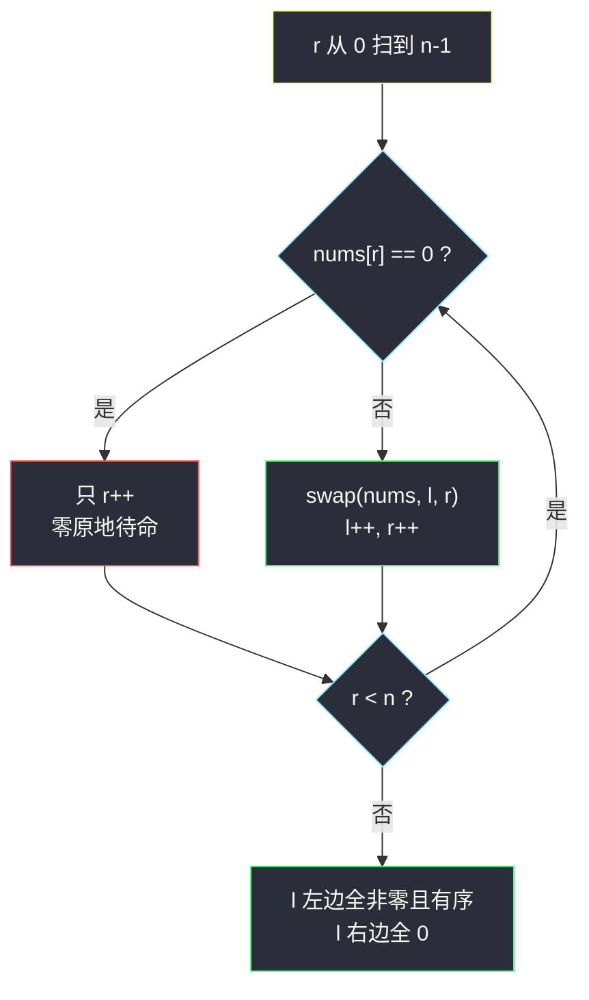

# 移动零（同向双指针，一次遍历分区）

## 一、问题描述

给定一个数组 `nums`，编写一个函数将**所有 `0` 移动到数组的末尾**，同时**保持非零元素的相对顺序**。

要求：

- 必须**原地**对数组进行操作（不能拷贝数组）；
- **尽量减少操作次数**（进阶要求）。

> 🔗 LeetCode 283：https://leetcode.cn/problems/move-zeroes/

**示例 1**

```
输入：nums = [0,1,0,3,12]
输出：[1,3,12,0,0]
```

**示例 2**

```
输入：nums = [0]
输出：[0]
```

**直观理解**

数组被划成两块：前面是「保序的非零元素」，后面是「一片零」。  
难点不是分出来（排序也能分），而是**原地、一趟、且非零相对顺序不变**——这正是同向双指针的经典舞台。

---

## 二、暴力解法（入门）

### 直观思路：开新数组

把非零元素按顺序抄进新数组，剩下的位置全部填 `0`，最后拷回去。

```java
public void moveZeroesBrute(int[] nums) {
    int n = nums.length;
    int[] tmp = new int[n];
    int k = 0;
    for (int x : nums) {
        if (x != 0) tmp[k++] = x;   // 非零依次前放
    }
    for (int i = 0; i < n; i++) {
        nums[i] = tmp[i];           // 尾部天然是 0
    }
}
```

### 复杂度

- **时间**：`O(n)`
- **空间**：`O(n)`

### 🔴 瓶颈在哪里

1. 开了 `O(n)` 辅助数组，直接违反「原地操作」的要求。
2. 多扫了两遍。
3. 数组题里「把满足某条件的元素挤到一边」是个**高频积木**（去重、partition、奇偶分离……），必须掌握原地写法。

---

## 三、优化探索（核心章节）

### 3.1 观察特征

| 特征 | 说明 |
|------|------|
| 结果 = 分区 | 非零区在前、零区在后，与快排 `partition` 的划分结构完全同构 |
| 非零元素要保序 | 不能两头交换（会打乱顺序），只能**同向**移动 |
| 两类元素地位不对称 | 「非零」是要收集的干货，「零」只是被甩到后面的填充物 |

### 3.2 同向双指针（课上 partition 骨架）

左程云课上处理这类「把一批元素划分到数组前段」的题，用的都是同一副骨架（荷兰国旗 / 小于区的推广）：

- `l`：**已收集好的非零区**的下一个落位（`[0, l)` 全是非零且相对顺序正确）；
- `r`：**扫描指针**，从头到尾逐个检查（`[l, r)` 全是被跳过的零，`[r, n)` 未处理）。

每轮只看 `nums[r]`：

| `nums[r]` 的值 | 动作 |
|----------------|------|
| 非零 | `swap(nums, l, r)`，然后 `l++`、`r++` —— 把它收进非零区 |
| 零 | 什么都不动，只 `r++` —— 零留在原地，等待后面被换走 |



### 3.3 关键推导问题

| 问题 | 答案 |
|------|------|
| 为什么非零时要 `swap` 而不是只赋值覆盖？ | swap 版**只在必要时才动**（非零个数次），同时天然满足进阶的「最少操作次数」；直接覆盖写法也对，但收尾还要手动清零 |
| `l == r` 时 swap 是否多余？ | 数组前缀全非零时 `l` 一直贴着 `r`，`swap` 自己和自己是无害的自旋，不写分支反而更简洁（课上写法就是不特判） |
| 为什么保序？ | 非零元素被收进非零区的顺序，就是被 `r` 扫到的顺序，相对次序完全保留 |
| 不变式是什么？ | 每轮结束后：`[0, l)` 全非零且保序；`[l, r)` 全为 0；`[r, n)` 未处理 |

### 3.4 一句话核心

> **`l` 守非零区的门，`r` 全程扫；见到非零就换进门前，`r` 一路走到黑。**

---

## 四、代码实现详解

### Java（对齐课上 partition 写法 · 主解）

```java
// 移动零
// 给定数组 nums，将所有 0 移动到数组末尾，同时保持非零元素的相对顺序
// 原地操作，尽量减少操作次数
// 测试链接 : https://leetcode.cn/problems/move-zeroes/
class Solution {

    public static void moveZeroes(int[] nums) {
        int l = 0; // [0, l) 是收集好的非零区
        for (int r = 0; r < nums.length; r++) {
            if (nums[r] != 0) {
                swap(nums, l++, r); // 收进非零区，l 前进
            }
        }
    }

    private static void swap(int[] nums, int i, int j) {
        int tmp = nums[i];
        nums[i] = nums[j];
        nums[j] = tmp;
    }
}
```

**循环不变式**：任意一轮 `r++` 结束后——

- `[0, l)`：全是非零元素，且相对顺序与原数组一致；
- `[l, r]`：全是 `0`（要么本来就是零被跳过，要么是换出去的零）；
- `(r, n)`：还没看过的原始元素。

`r` 走到头时，非零区自然结束于 `l`，后面整片全零，无需收尾补零。

### Python（同思路）

```python
class Solution:
    def moveZeroes(self, nums: list[int]) -> None:
        l = 0
        for r in range(len(nums)):
            if nums[r] != 0:
                nums[l], nums[r] = nums[r], nums[l]
                l += 1
```

### 可选：覆盖 + 补零写法

不 `swap`，直接 `nums[l++] = nums[r]` 覆盖，最后把 `[l, n)` 清零。  
写起来多一个收尾循环，交换次数更少（非零元素不做自我交换），两版都对，课上 partition 风格以 swap 版最常默写。

---

## 五、例子演示

以 `nums = [0, 1, 0, 3, 12]` 为例，端到端逐步跟踪。

### 初始

```
[0, 1, 0, 3, 12]
 ↑lr
l = 0, r = 0
```

### 第 1 步：r = 0，nums[0] = 0

```
[0, 1, 0, 3, 12]
 ↑    ↑
l=0  r=1
只 r++，零原地待命
```

### 第 2 步：r = 1，nums[1] = 1 ≠ 0

```
swap(nums, 0, 1)：[1, 0, 0, 3, 12]
l = 1, r = 2
非零的 1 被换到下标 0，换出去的 0 落在下标 1
```

### 第 3 步：r = 2，nums[2] = 0

```
[1, 0, 0, 3, 12]
    ↑    ↑
   l=1  r=3
只 r++
```

### 第 4 步：r = 3，nums[3] = 3 ≠ 0

```
swap(nums, 1, 3)：[1, 3, 0, 0, 12]
l = 2, r = 4
3 换进非零区，下标 1 处的 0 被甩到下标 3
```

### 第 5 步：r = 4，nums[4] = 12 ≠ 0

```
swap(nums, 2, 4)：[1, 3, 12, 0, 0]
l = 3, r = 5 → r 越界，结束
```



```mermaid
flowchart LR
    subgraph S0["初始"]
        direction LR
        A0["0"] --> A1["1"] --> A2["0"] --> A3["3"] --> A4["12"]
    end
    subgraph S1["r=4 结束时"]
        direction LR
        B0["1"] --> B1["3"] --> B2["12"] --> B3["0"] --> B4["0"]
    end
    S0 --> S1

    style S0 fill:#1e1f29,stroke:#f1fa8c,color:#f8f8f2
    style S1 fill:#1e1f29,stroke:#50fa7b,color:#f8f8f2
    style A0 fill:#2b2d3a,stroke:#ff5555,color:#f8f8f2
    style A1 fill:#2b2d3a,stroke:#8be9fd,color:#f8f8f2
    style A2 fill:#2b2d3a,stroke:#ff5555,color:#f8f8f2
    style A3 fill:#2b2d3a,stroke:#8be9fd,color:#f8f8f2
    style A4 fill:#2b2d3a,stroke:#8be9fd,color:#f8f8f2
    style B0 fill:#2b2d3a,stroke:#50fa7b,color:#f8f8f2
    style B1 fill:#2b2d3a,stroke:#50fa7b,color:#f8f8f2
    style B2 fill:#2b2d3a,stroke:#50fa7b,color:#f8f8f2
    style B3 fill:#2b2d3a,stroke:#ff5555,color:#f8f8f2
    style B4 fill:#2b2d3a,stroke:#ff5555,color:#f8f8f2
```

**极简边界**：`nums = [0]` 时 `r` 扫一个零就结束，数组不变；全非零 `[1,2,3]` 时每次都是自旋 swap，数组也不变。

---

## 六、复杂度分析

| 方法 | 时间 | 额外空间 | 操作次数 |
|------|------|----------|----------|
| 新数组 | `O(n)` | `O(n)` | 违反原地要求 |
| **同向双指针 swap** | **`O(n)`** | **`O(1)`** | 恰好 = 非零元素个数（前缀自我交换除外） |

`r` 只前进不回退，每个下标只被访问一次。

---

## 七、对比总结

### 易错点

1. **用两头对撞交换** → 非零元素顺序被打乱，不满足「保持相对顺序」。
2. **遇到非零忘了 `l++`** → 非零区重叠覆盖，结果错乱。
3. **swap 版收尾手动清零** → 多余，swap 已经把零换到了右侧。
4. 想用 `remove` + `append`（如 Python 的 `nums.remove(0)`）→ 每个 remove 都是 `O(n)`，总时间 `O(n²)`，面试直接扣分。

### 模板口诀

> **非零往前换，零就让它躺；l 守门 r 扫描，一趟分出两界墙。**

同向双指针 `l/r` 分区骨架可无缝迁移到所有「把某类元素挤到一端且保序」的数组题。

---

## 八、举一反三

| 题目 | 链接 | 迁移点 |
|------|------|--------|
| 27. 移除元素 | https://leetcode.cn/problems/remove-element/ | 同骨架，把「非零」换成「≠val」 |
| 26. 删除有序数组中的重复项 | https://leetcode.cn/problems/remove-duplicates-from-sorted-array/ | `l` 收「不重复区」，`r` 扫描 |
| 905. 按奇偶排序数组 | https://leetcode.cn/problems/sort-array-by-parity/ | 把偶数换到前段（不要求保序时对撞也行） |
| 75. 颜色分类 | https://leetcode.cn/problems/sort-colors/ | 课上荷兰国旗三向 partition，本题的进阶版 |
| 283 的姊妹：1089. 复写零 | https://leetcode.cn/problems/duplicate-zeros/ | 找到最后的「复制边界」后倒着填 |

**迁移一句**：看到「数组 + 原地 + 把某类元素挪到一边 + 保序」，闭眼写同向双指针 `l` 收集、`r` 扫描。
