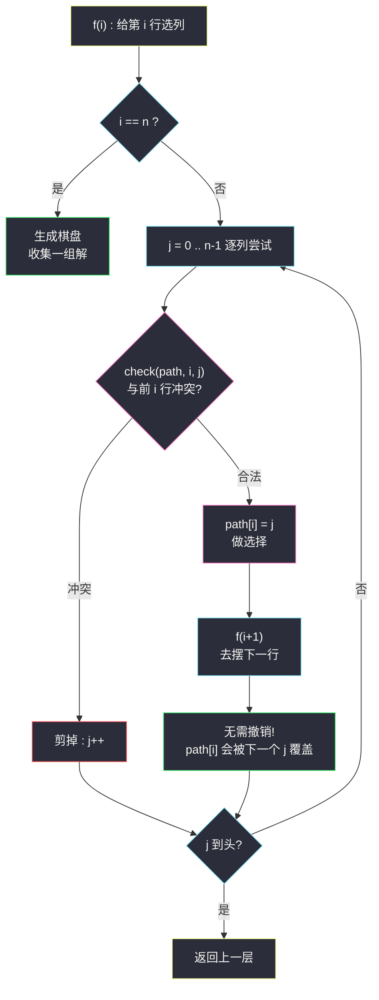
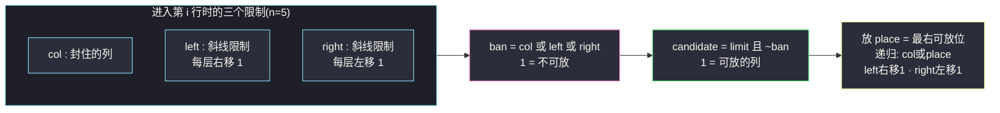

# N 皇后（棋盘回溯 + 冲突剪枝）

## 一、问题描述

按照国际象棋规则，皇后可以攻击与之处在**同一行、同一列或同一斜线**上的棋子。给定整数 `n`，返回 `n` 皇后问题的**所有**解决方案：每一种解法包含一个不同的 `n` 皇后棋盘放置方案，方案中 `'Q'` 代表皇后、`'.'` 代表空位。

> 🔗 LeetCode 51：https://leetcode.cn/problems/n-queens/

**示例 1**

```
输入：n = 4
输出：[[".Q..","...Q","Q...","..Q."],
       ["..Q.","Q...","...Q",".Q.."]]
解释：4 皇后问题存在 2 个不同的解法
```

**示例 2**

```
输入：n = 1
输出：[["Q"]]
```

**直观理解**

`n x n` 棋盘放 `n` 个皇后且互不攻击。关键观察：**每行必须恰好放一个皇后**（n 行 n 个，同行必冲突）——于是「摆棋盘」坍缩成「为第 0 行选一列、第 1 行选一列、……、第 n-1 行选一列」。这正是一棵**逐行决策的排列树**：第 `i` 行枚举列 `j`，只要与前面已放的皇后不同列、不同斜线就往下走；走到第 `n` 行说明 n 个皇后全摆下，生成棋盘收集。与全排列（#46）同构，只是「检查合法」从 `used` 数组变成了**列 + 两条斜线**三重冲突检查。

---

## 二、暴力解法（入门）

### 直观思路

最原始的做法：把 `n·n` 个格子当作候选，用 `path` 记录已放皇后的坐标，每放一个之前用 O(path 长度) 逐个检查与之前所有皇后是否冲突，凑满 `n` 个就生成棋盘。

```java
public List<List<String>> solveNQueens(int n) {
    List<List<String>> ans = new ArrayList<>();
    dfs(0, 0, new ArrayList<>(), n, ans);   // 从第 0 行第 0 列开始逐格尝试
    return ans;
}

private void dfs(int row, int col, List<int[]> queens, int n, List<List<String>> ans) {
    if (queens.size() == n) {               // n 个皇后都放下
        ans.add(build(queens, n));
        return;
    }
    if (row == n) return;                   // 行用完还没凑够
    if (conflict(row, col, queens)) {       // 逐个比对：O(n)
        // 这个格子放不了，试下一个格子
    } else {
        queens.add(new int[]{row, col});
        dfs(row + 1, 0, queens, n, ans);    // 本行已放，跳到下一行
        queens.remove(queens.size() - 1);   // 恢复现场
    }
    if (col + 1 < n) dfs(row, col + 1, queens, n, ans); // 试同行下一列
}
```

### 复杂度

- **时间**：指数级且常数巨大——每个已放皇后都 O(1) 存坐标，冲突检查逐个比对，最坏接近 `O(n! · n²)`
- **空间**：`O(n)` path + 递归栈

### 🔴 瓶颈在哪里

1. 「逐格扫描」浪费了**每行必放一个**的先验结构，同行的无效分支全被展开；
2. 冲突检查每次从头逐个比对已放皇后，O(n) 一次；
3. 坐标对 `(row, col)` 存进 list，不如直接**用 `path[row] = col` 把「行号」当数组下标**——一行一值，天然省掉行维度的所有讨论。

---

## 三、优化探索（核心章节）

### 3.1 观察特征

| 特征 | 结论 |
|------|------|
| 每行恰好一个皇后 | 状态压缩成一维数组：`path[i]` = 第 i 行皇后所在列 |
| 冲突三类：同列、主斜线、副斜线 | 检查当前 与 `path[0..i-1]` 的每个 `(k, path[k])`：`j == path[k]` 同列；`i - k == |j - path[k]|` 同斜线 |
| 斜线的代数刻画 | 格 `(r,c)` 的「右下方向斜线」编号 = `r - c` 恒定；「左下方向斜线」编号 = `r + c` 恒定——可用两个布尔数组 O(1) 判，或干脆循环比对 O(n) 判 |

### 3.2 主解骨架（对齐课源码 class040）

递归 `f(i, path, n, ans)`：第 `0..i-1` 行已摆好（`path[k]` 即第 k 行皇后的列），现在给第 `i` 行选列：



`check(path, i, j)`（与课源码一致）：

```java
for (int k = 0; k < i; k++) {
    if (j == path[k] || Math.abs(i - k) == Math.abs(j - path[k])) {
        return false;   // 同列 或 同斜线
    }
}
return true;
```

### 3.3 关键推导问题

| 问题 | 答案 |
|------|------|
| 为什么 `path[i] = j` 之后递归回来**不用恢复现场**？ | 下一轮 `j+1` 会直接覆盖 `path[i]`；且 `check` 只读 `path[0..i-1]`，第 i 行旧值不参与任何判断——一维数组回溯的「覆盖式撤销」 |
| `i - k == |j - path[k]|` 为什么就是同斜线？ | 两格若在同一条 45° 斜线上，行差与列差的**绝对值**相等；主斜线方向 `i-k == j-path[k]`，副斜线方向 `i-k == path[k]-j`，合并成绝对值等式 |
| `check` 每次 O(i) 会不会成为瓶颈？ | 可以换成三个布尔数组（列 / `i-j+n` / `i+j`）O(1) 判定，见 3.4；课上主推的是「数组版好懂 + 位运算版极快」两档 |
| 为什么答案数量不受「顺序」影响而不重不漏？ | 每层 `j` 从 0 到 n-1 严格按列枚举，任何解的每一行取值只被一种 (i, j) 序列构造一次 |
| n = 2、n = 3 为什么无解？ | 逐行剪枝把决策树剪到光秃：n=3 时第 0 行 3 种列选法全部在 2-3 层内被斜线封死，返回 0 组解 |

### 3.4 进阶：位运算极速版（课源码推荐写法）

课源码 `class040/NQueens.java` 的 `totalNQueens2`（对应 #52 计数版）用三个 `int` 当 n 位棋盘：

- `col`：之前皇后**封住的列**集合（该位为 1 = 不可放）
- `left`：之前皇后**右下方向斜线**推进到当前行的影响（每下一行整体右移一位）
- `right`：之前皇后**左下方向斜线**的影响（每下一行整体左移一位）



位版把「枚举 + 判定」压缩成几条位运算，`n = 15` 也能瞬间跑完（课上实测 16 皇后 10 秒内）。

### 3.5 一句话核心

> **一行一值压成一维 path，逐行决策；列冲突 + 两条 45° 斜线三重剪枝，合法才下伸，覆盖式撤销免恢复。**

---

## 四、代码实现详解

> 说明：课源码 `src/class040/NQueens.java` 的测试链接是姊妹题 #52（只计数），骨架为 `f1(i, path, n) + check`。主解按同一骨架改造成 #51 要求的「收集棋盘」，位运算极速版思路见 3.4（适合 #52）。

### Java（主解：一维 path + check 剪枝）

```java
// N 皇后
// 测试链接 : https://leetcode.cn/problems/n-queens/
class Solution {

    public List<List<String>> solveNQueens(int n) {
        List<List<String>> ans = new ArrayList<>();
        int[] path = new int[n];      // path[i] : 第 i 行皇后放在哪一列
        f(0, path, n, ans);
        return ans;
    }

    // 第 0..i-1 行已摆好，现在给第 i 行选列
    private void f(int i, int[] path, int n, List<List<String>> ans) {
        if (i == n) {
            ans.add(build(path, n));  // n 行全摆下，生成棋盘收集
            return;
        }
        for (int j = 0; j < n; j++) {
            if (check(path, i, j)) {
                path[i] = j;          // 做选择（覆盖式，无需显式撤销）
                f(i + 1, path, n, ans);
            }
        }
    }

    // (i,j) 与 path[0..i-1] 的皇后是否都不冲突
    private boolean check(int[] path, int i, int j) {
        for (int k = 0; k < i; k++) {
            if (j == path[k]                      // 同列
                    || Math.abs(i - k) == Math.abs(j - path[k])) { // 同斜线
                return false;
            }
        }
        return true;
    }

    // 依 path 生成棋盘：每行一个字符串，Q 在 path[i] 列
    private List<String> build(int[] path, int n) {
        List<String> board = new ArrayList<>();
        char[] row = new char[n];
        for (int i = 0; i < n; i++) {
            Arrays.fill(row, '.');
            row[path[i]] = 'Q';
            board.add(new String(row));
        }
        return board;
    }
}
```

### Python

```python
# N 皇后
# 测试链接 : https://leetcode.cn/problems/n-queens/
class Solution:
    def solveNQueens(self, n: int) -> list[list[str]]:
        ans: list[list[str]] = []
        path = [0] * n                     # path[i] : 第 i 行皇后的列

        def check(i: int, j: int) -> bool:
            for k in range(i):
                if j == path[k] or abs(i - k) == abs(j - path[k]):
                    return False
            return True

        def f(i: int) -> None:
            if i == n:
                board = []
                for r in range(n):
                    board.append('.' * path[r] + 'Q' + '.' * (n - path[r] - 1))
                ans.append(board)
                return
            for j in range(n):
                if check(i, j):
                    path[i] = j            # 覆盖式做选择
                    f(i + 1)

        f(0)
        return ans
```

---

## 五、具体例子演示

`n = 4`，完整展开决策树。行号 0..3，列号 0..3。

**第 0 行选列 0**（`path[0]=0`）——第 1 行逐列检查：

| 第 1 行试列 j | check 结果 | 原因 |
|---------------|-----------|------|
| j=0 | ✗ | 同列 |
| j=1 | ✗ | 斜线：`|1-0|=1 == |1-0|=1` |
| j=2 | ✅ | 不同列、`|1-0|=1 ≠ |2-0|=2` → 下伸 |
| j=3 | ✅ | 不同列、`|1-0|=1 ≠ |3-0|=3` → 下伸 |

- 分支 `path=[0,2]`：第 2 行 j=0 ✗同列；j=1 ✗斜线（`|2-1|=1 == |1-2|=1`，与第 1 行皇后冲）；j=2 ✗同列；j=3 ✗斜线（`|2-1|=1 == |3-2|=1`）→ **第 2 行四列全死，整枝剪光**，回退。
- 分支 `path=[0,3]`：第 2 行 j=0 ✗同列；j=1 ✅（与 (0,0)：`|2-0|=2 ≠ |1-0|=1`；与 (1,3)：`|2-1|=1 ≠ |1-3|=2`）→ `path=[0,3,1]`；第 3 行 j=0 ✗同列、j=1 ✗同列、j=2 ✗斜线（`|3-2|=1 == |2-1|=1`，与第 2 行皇后冲）、j=3 ✗同列 → **死**。第 2 行 j=2 ✗斜线（`|2-0|=2 == |2-0|=2`，与第 0 行皇后冲）、j=3 ✗同列 → **第 0 行选列 0 的整棵子树无解**。

**第 0 行选列 1**（`path[0]=1`）：

| 层 | 尝试 | 结果 |
|----|------|------|
| 第 1 行 | j=0 ✗斜线（`|1-0|=1 == |0-1|=1`）；j=1 ✗同列；j=2 ✗斜线（`|1-0|=1 == |2-1|=1`）；j=3 ✅（`|1-0|=1 ≠ |3-1|=2`） | `path=[1,3]` |
| 第 2 行 | j=0 ✅（与 (0,1)：`|2-0|=2 ≠ |0-1|=1`；与 (1,3)：`|2-1|=1 ≠ |0-3|=3`；不同列） | `path=[1,3,0]` |
| 第 3 行 | j=0 ✗同列、j=1 ✗同列、j=2 ✅（与 (2,0)：`|3-2|=1 ≠ |2-0|=2`；与 (1,3)：`|3-1|=2 ≠ |2-3|=1`；与 (0,1)：`|3-0|=3 ≠ |2-1|=1`；不同列） | `path=[1,3,0,2]` ✅ **收集解 ①** |

生成棋盘：

```
.Q..
...Q
Q...
..Q.
```

**第 0 行选列 2**：对称地走出 `path=[2,0,3,1]`，**收集解 ②**：

```
..Q.
Q...
...Q
.Q..
```

**第 0 行选列 3**：与「选列 0」镜像对称，同样无解。

最终 2 组解，与示例一致。可以看到剪枝的威力：整棵树的节点数远小于「4 列全排列」的 4!=24 个叶子，大量分支在第 1、2 层就被斜线检查掐灭。

---

## 六、复杂度分析

| 项目 | 复杂度 | 说明 |
|------|--------|------|
| 时间 | `O(n!)` 级（实测远小于） | 上界：每层候选列数递减的乘积；每个节点 check O(n)、叶子生成棋盘 O(n²)。位运算版把 check 压到 O(1)，n=15 级别也飞快 |
| 空间 | `O(n)` | path 数组 + 递归栈（不计输出；输出每组 O(n²) 字符） |

---

## 七、方法对比与总结

### 易错点

1. **斜线判断写错方向**：`Math.abs(i - k) == Math.abs(j - path[k])` 两边都要取绝对值，只写 `i-k == j-path[k]` 会漏掉另一条斜线。
2. **以为要显式恢复现场**：一维 `path` 是覆盖式写入，`path[i] = j` 天然被下一轮覆盖；若改用 list/used 数组就必须撤销。
3. **生成棋盘时 `row` 数组复用却忘记 fill '.'** → 前一行的 Q 残留。
4. **n ≤ 3 无解**忘了特殊处理也没关系——递归自然返回空列表，但别在 `i == n` 之外的地方提前 return 空。
5. 位运算版的 `left`/`right` 移位方向：`(left | place) >> 1` 与 `(right | place) << 1` 是配套的，移反一个就全错。

### 三档实现对比

| | 逐格暴力（二章） | 一维 path + check（主解） | 位运算版（课源码推荐） |
|--|------------------|---------------------------|------------------------|
| 搜索结构 | 每格都试 | 逐行列枚举 | 逐行、仅枚举可放位 |
| 冲突检查 | 逐皇后比对 | O(i) 循环 | O(1) 位运算 |
| 适用 | 教学 | #51 收集棋盘，好写好讲 | #52 计数 / n 大时 |

### 模板口诀

> **一行一值压数组，逐行列试三查：同列、两斜皆不犯；n 行摆满收棋盘，覆盖撤销免恢复。**

---

## 八、举一反三

| 题目 | 链接 | 迁移点 |
|------|------|--------|
| 52. N 皇后 II | https://leetcode.cn/problems/n-queens-ii/ | 只计数不收集：直接上课源码 `class040` 的位运算极速版 |
| 37. 解数独 | https://leetcode.cn/problems/sudoku-solver/ | 同款「逐格决策 + 合法剪枝 + 恢复现场」，约束换成行/列/宫（[站内题解](/solutions/base/sudoku-solver.md)） |
| 46. 全排列 | https://leetcode.cn/problems/permutations/ | 本题决策树的原型，恢复现场思想同源（[站内题解](/solutions/base/permutations.md)） |
| 526. 优美的排列 | https://leetcode.cn/problems/beautiful-arrangement/ | 逐位放置 + 合法性剪枝的轻量变体 |

**迁移一句**：N 皇后是「**约束满足搜索（CSP）**」的教科书题——状态压缩成一维、逐层决策、三类约束剪枝、覆盖式撤销；这套骨架原封不动搬到数独、图着色、排列类约束题上都能跑。
