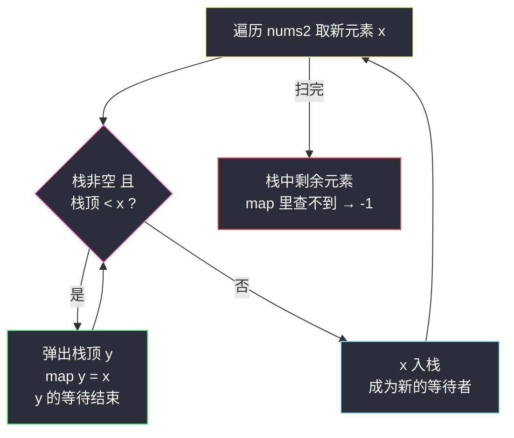
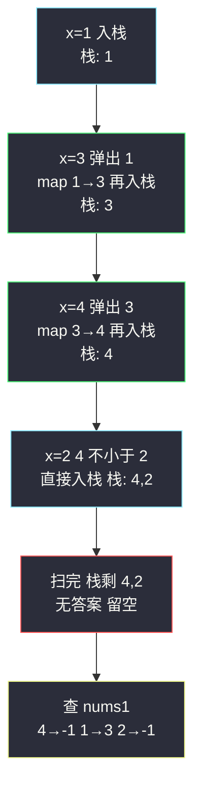

# 下一个更大元素 I（单调栈 + 哈希表）

## 一、问题描述

`nums1` 中数字 `x` 的**下一个更大元素**是指 `x` 在 `nums2` 的**对应位置右边**的第一个比 `x` 大的元素。

给你两个**没有重复元素**的数组 `nums1` 和 `nums2`（`nums1` 是 `nums2` 的子集），请你找出 `nums1` 中每个元素的下一个更大元素。`nums1` 中数字 `x` 的下一个更大元素不存在时输出 `-1`。

> 🔗 LeetCode 496：https://leetcode.cn/problems/next-greater-element-i/
>
> 约束：`1 <= nums1.length <= nums2.length <= 1000`；所有值互不相同；`O(nums1.length + nums2.length)` 的进阶解法是本题考点。

**示例 1**

```
输入：nums1 = [4,1,2]，nums2 = [1,3,4,2]
输出：[-1,3,-1]
解释：
  4 在 nums2 中右边没有更大的数 → -1
  1 在 nums2 中右边第一个更大是 3 → 3
  2 在 nums2 中右边没有更大的数 → -1
```

**示例 2**

```
输入：nums1 = [2,4]，nums2 = [1,2,3,4]
输出：[3,-1]
解释：2 的下一个更大是 3；4 右边没数 → -1
```

**直观理解**

只扫 `nums2` 一遍就能回答所有人：从左往右走，手里攥着一个「还没等到更大元素的成员名单」。新来一个更大的数时，名单里所有比它小的成员**同时等到答案**——这个新数就是它们的下一个更大元素；弹完剩下的名单依然从栈底到栈顶递减。等谁、谁先等到，用**栈**维护正合适：越晚入栈的越小，也越先等到答案。`nums1` 只是一批「查询」，用哈希表把「元素 → 答案」存下来查即可。课源码未收录本题原码，骨架对齐 class052 单调栈系列（`Code02_DailyTemperatures` 同模板：`while 栈非空且 nums[栈顶] < 当前) 弹栈记答案`）。

---

## 二、暴力解法（定位后向右线性扫）

### 直观思路

对 `nums1` 每个元素 `x`：先在 `nums2` 里找到 `x` 的位置，然后从那个位置向右一个一个找，遇到第一个比 `x` 大的就收工；扫到头都没有就是 `-1`：

```java
class Solution {
    public int[] nextGreaterElement(int[] nums1, int[] nums2) {
        int[] ans = new int[nums1.length];
        for (int i = 0; i < nums1.length; i++) {
            int x = nums1[i];
            ans[i] = -1;
            // 先定位 x 在 nums2 中的下标（值互不相同，位置唯一）
            int j = 0;
            while (nums2[j] != x) {
                j++;
            }
            // 向右找第一个更大的
            for (int k = j + 1; k < nums2.length; k++) {
                if (nums2[k] > x) {
                    ans[i] = nums2[k];
                    break;
                }
            }
        }
        return ans;
    }
}
```

### 复杂度

- **时间**：`O(m·n)`，`m = nums1.length`、`n = nums2.length`——每次查询定位 + 向右扫都可能走完整段
- **空间**：`O(1)`（不计输出）

### 🔴 瓶颈在哪里

1. **同一片区域被反复扫**：`nums1` 里多个元素都在 `nums2` 的前半段，它们的「向右搜索」高度重叠；
2. 每个元素独立作战，没有利用「**新来的更大元素一次性解决一批等待者**」的结构；
3. 查询与构建耦合：答案其实完全由 `nums2` 决定（`nums1` 只是查询名单），应该**预处理 `nums2` 一次**，所有查询秒答。

---

## 三、优化探索（核心章节）

### 3.1 观察特征

| 特征 | 说明 |
|------|------|
| 值互不相同 | `nums2` 里「元素 → 下一个更大元素」的映射是确定的，值得预处理成哈希表 |
| 一个新元素能批量结案 | 新来 `x` 时，栈中所有小于 `x` 的成员的答案**同时**确定为 `x` |
| 等待者天然单调 | 结案弹出后，栈中剩下的都比 `x` 大——栈**从底到顶严格递减**，这就是「单调栈」 |
| 没等到答案的注定等不到 | 扫描结束时还在栈里的，右边没有任何更大元素 → 答案 `-1`（哈希表查不到即 -1） |

### 3.2 暴力 → 优化：单调栈一遍扫 + 哈希表暂存

```
nextGreaterElement:
    map = 哈希表：元素 → 它的下一个更大元素
    stack = 空栈（存值即可，本题值互不重复）
    for x in nums2:
        while 栈非空 且 栈顶 < x:
            map[栈顶弹出] = x          ← 栈顶等到答案，结案离场
        stack.push(x)                 ← x 成为新的等待者
    for i, x in nums1:
        ans[i] = map.getOrDefault(x, -1)
```

栈顶方向的**不变式**：任意时刻，栈内元素自底向上严格递减——比新来者小的全被弹走，留下的都比它大、还得继续等更大的。每个元素入栈一次、出栈至多一次，总代价线性。



### 3.3 关键推导问题

| 问题 | 答案 |
|------|------|
| 为什么「弹出」恰好是等到了答案？ | 栈顶 `y` 还在栈里，说明 `y` 之后（到 `x` 之前）没有任何数大于 `y`（否则早被弹走）；现在 `x > y` 且 `x` 紧跟在这段「都不大于 y」的序列之后——`x` 就是 `y` 右边第一个更大的 |
| 为什么栈是严格递减的？ | 入栈前所有 `< x` 的都被弹光，剩下的栈顶 `>= x`；本题元素互不相同，实际是 `>`，所以严格递减 |
| 弹出条件为什么是 `<` 而不是 `<=`？ | 元素互不相同，两种写法结果一致；但**有重复元素**的题（如 #739 温度「更高」）必须区分：相等不算「更大」，要用 `<` 弹、相等保留同层处理，具体看题意 |
| 为什么只需扫 nums2，不扫 nums1？ | 答案与 nums1 无关，nums1 是纯查询；先花 `O(n)` 预处理，再 `O(1)` 单点查——典型的「离线预处理 + 在线查询」 |
| 栈里存值还是存下标？ | 本题值互不相同，存值即可直接做 map 的键；若要返回距离（#739）或有重复值，必须存下标 |
| 遍历方向能反过来吗？ | 能：从右往左扫、维护「右侧第一个更大」也成立（弹出到第一个比自己大的为止，栈顶即答案）。正扫 / 逆扫是同一模型的两个视角，背熟一个即可 |

### 3.4 一句话核心

> **新来更大的，把栈里所有等小的批量结案；栈，永远从底到顶递减。**

---

## 四、代码实现详解

### Java（主解：单调栈 + HashMap，值版）

```java
// nums1 每个元素在 nums2 中右边的第一个更大元素
// 测试链接 : https://leetcode.cn/problems/next-greater-element-i/
// 骨架对齐 class052 单调栈系列（Code02_DailyTemperatures 同模板）
class Solution {
    public int[] nextGreaterElement(int[] nums1, int[] nums2) {
        Map<Integer, Integer> nextGreater = new HashMap<>();
        Deque<Integer> stack = new ArrayDeque<>();       // 从底到顶严格递减
        for (int x : nums2) {
            while (!stack.isEmpty() && stack.peek() < x) {
                nextGreater.put(stack.pop(), x);         // 栈顶等到答案
            }
            stack.push(x);
        }
        int[] ans = new int[nums1.length];
        for (int i = 0; i < nums1.length; i++) {
            ans[i] = nextGreater.getOrDefault(nums1[i], -1);
        }
        return ans;
    }
}
```

对照课上 `Code02_DailyTemperatures` 的数组模拟栈写法（`int[] stack` + 指针 `r`），站点版用 `Deque` 更直白；两边 `while` 弹栈骨架完全一致。

### Python（同思路）

```python
class Solution:
    def nextGreaterElement(self, nums1: list[int], nums2: list[int]) -> list[int]:
        next_greater: dict[int, int] = {}
        stack: list[int] = []                 # 从底到顶严格递减
        for x in nums2:
            while stack and stack[-1] < x:
                next_greater[stack.pop()] = x
            stack.append(x)
        return [next_greater.get(x, -1) for x in nums1]
```

Python 末行直接用字典 `get` 默认值推导，全题 10 行内收工。

---

## 五、具体例子演示

### 例 1：`nums1 = [4,1,2]`，`nums2 = [1,3,4,2]`，答案 `[-1,3,-1]`

只扫 `nums2`，跟踪栈与 map 的每一步（栈记法：左侧为底）：

| 步 | 当前 x | 栈顶比较 | 动作 | 栈（底→顶） | map 新增 |
|----|--------|----------|------|-------------|----------|
| 1 | 1 | 栈空 | 入栈 | [1] | — |
| 2 | 3 | 1 < 3 | 弹 1，1 的答案是 3；再入栈 | [3] | `1 → 3` |
| 3 | 4 | 3 < 4 | 弹 3，3 的答案是 4；再入栈 | [4] | `3 → 4` |
| 4 | 2 | 4 > 2 不弹 | 入栈 | [4, 2] | — |
| 5 | 扫完 | — | 栈剩 4、2：右边没有更大者 | [] | 不入 map |

最后对 `nums1` 查表：`4` 查不到 → **-1**；`1` → **3**；`2` 查不到 → **-1**。输出 `[-1,3,-1]` ✅



**关键看点**：第 3 步 `x=4` 一来，连续弹掉 3（顺带更早的 1 已在第 2 步弹掉）——每个元素一生只被弹一次，这就是线性复杂度的来源。

### 例 2：`nums1 = [2,4]`，`nums2 = [1,2,3,4]`，答案 `[3,-1]`

| 步 | x | 弹栈 | 栈 | map |
|----|---|------|-----|-----|
| 1 | 1 | — | [1] | — |
| 2 | 2 | 弹 1 | [2] | `1 → 2` |
| 3 | 3 | 弹 2 | [3] | `2 → 3` |
| 4 | 4 | 弹 3 | [4] | `3 → 4` |
| 5 | 扫完 | — | [4] | 4 无答案 |

查表：`2` → **3**；`4` → **-1**。输出 `[3,-1]` ✅

### 例 3：递减序列 `nums2 = [5,4,3]`

三步全不弹（每个新元素都比栈顶小），栈一路长成 `[5,4,3]`，map 空——所有人答案都是 **-1**，扫描结束时一次弹栈收尾（或不弹直接弃栈）。单调栈最坏栈深 = `O(n)`，全部元素都在等一个永远不来的更大者。

---

## 六、复杂度分析

| 项目 | 暴力逐个扫 | 单调栈 + 哈希（主解） |
|------|------------|------------------------|
| 时间 | `O(m·n)` | **`O(m + n)`**：扫 nums2 每元素入栈一次、出栈至多一次，总弹栈次数 ≤ n；m 次查询每次 `O(1)` |
| 空间 | `O(1)` | `O(n)`：栈 + 哈希表 |

弹栈总数为什么 ≤ n：一个元素出栈后**永不返回**（结案了），所以全程弹栈操作加起来不超过入栈次数，与「每个人排队只需排一次」同理——**单调栈是摊还 O(1) 的批量结案机**。

---

## 七、方法对比与总结

### 写法对比

| | 暴力逐个扫 | 单调栈 + 哈希（主解） | 从右往左单调栈 |
|--|------------|------------------------|----------------|
| 时间 | `O(m·n)` | `O(m + n)` | `O(m + n)` |
| 思路 | 查询即计算 | 预处理 + 查表 | 边扫边查（栈顶即答案） |
| 泛化性 | 弱 | ✅ 换距离/循环数组都好改 | 同 |
| 面试定位 | 讲思路起点 | ✅ 必须默写 | 二选一练熟 |

### 易错点

1. **弹栈条件写反**（`> x` 才弹）：栈变递增，答案全空——单调栈题最常见手滑。
2. **忘了「查不到 = -1」**：直接 `map.get(x)` 返回 null，Java 里 NPE、Python 里 KeyError。
3. **对 nums1 建栈**：栈应扫**完整序列 nums2**；nums1 只是查询名单，扫它得不到「右边」信息。
4. **有重复值时仍存值**：本题值唯一存值没事；换到 #739/#503 就要改存下标，习惯上直接练下标版更通用。
5. **while 写成 if**：一个新元素可能连弹多个（例 2 的 4 连弹 3、2、1 等情形），只弹一个会漏结案。

### 模板口诀

> **新人大，全栈小者弹；弹一个记一票，栈底到顶永远降。**

---

## 八、举一反三

| 题目 | 链接 | 迁移点 |
|------|------|--------|
| 739. 每日温度 | https://leetcode.cn/problems/daily-temperatures/ | 完全同骨架（class052 Code02 原题），答案从「值」换成「距离 i - j」，栈存下标 |
| 503. 下一个更大元素 II | https://leetcode.cn/problems/next-greater-element-ii/ | 循环数组：把序列逻辑上拼两遍（`i % n`）再扫一遍 |
| 1019. 链表中的下一个更大节点 | https://leetcode.cn/problems/next-greater-node-in-linked-list/ | 同模型搬到链表，先转数组再单调栈 |
| 84. 柱状图中最大的矩形 | https://leetcode.cn/problems/largest-rectangle-in-histogram/ | 单调栈深水区：弹柱时结算矩形面积，class052 Code04 原题 |
| 901. 股票价格跨度 | https://leetcode.cn/problems/online-stock-span/ | 「左边连续更小个数」的单调栈在线版 |

**迁移一句**：见到「**右边第一个比我大/小**」，闭眼单调栈——入栈时结案一批、弹栈即写答案；答案要值还是要下标距离，决定栈里存什么。
