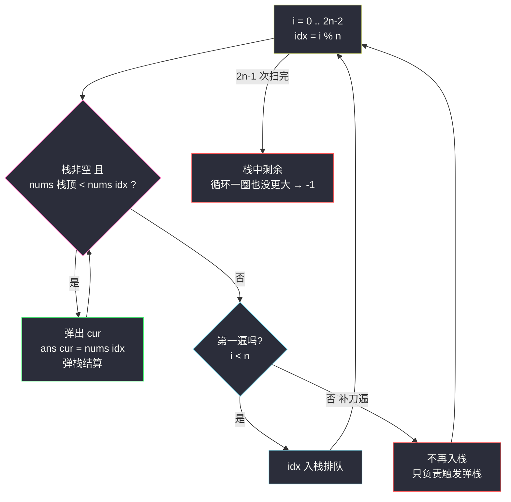
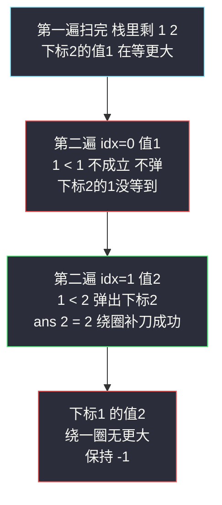

# 下一个更大元素 II（循环数组 · 单调栈扫两遍）

## 一、问题描述

给定一个循环数组 `nums`（`nums[nums.length - 1]` 的下一个元素是 `nums[0]`），返回 `nums` 中每个元素的**下一个更大元素**。`nums[i]` 的下一个更大元素是「数组中循环扫描时，`i` 右边第一个比 `nums[i]` 大的元素」；如果不存在，返回 `-1`。

> 🔗 LeetCode 503：https://leetcode.cn/problems/next-greater-element-ii/
>
> 约束：`1 <= nums.length <= 10^4`，`-10^9 <= nums[i] <= 10^9`。**可以有重复元素**，这是与 #496 的重要区别。

**示例 1**

```
输入：nums = [1,2,1]
输出：[2,-1,2]
解释：
  1（下标 0）→ 右边第一个更大是 2
  2 → 循环一整圈也没有更大的 → -1
  1（下标 2）→ 绕回开头，第一个更大是 2
```

**示例 2**

```
输入：nums = [1,2,3,4,3]
输出：[2,3,4,-1,4]
解释：
  1 → 右边第一个更大是 2
  4 是全局最大，绕一圈也没有更大的 → -1
  末尾的 3 → 绕回开头后遇到 4 → 4
```

**直观理解**

还是「右边第一个更大」的单调栈，麻烦只在一个「**循环**」：末尾元素的答案可能在开头。破局很朴素——**把数组在逻辑上拼成两遍再扫**：`[1,2,1]` 看成 `[1,2,1,1,2]`（去掉最后一个，共 `2n-1` 个元素），下标用 `i % n` 取余映射回原数组。第一遍正常入栈排队；第二遍**不再入栈**，纯粹回来「补刀」——给第一遍没等到答案的元素再一次被弹出的机会。课源码未收录本题，骨架对齐 class052 单调栈系列（`Code02_DailyTemperatures` 的弹栈结算 + `Code06` 洛谷版「右侧更大最近位置」的题面，仅多一层循环取余）。

---

## 二、暴力解法（每个位置绕一圈）

### 直观思路

对每个 `i`，从 `i+1` 起在循环数组里走 `n-1` 步，找到第一个比 `nums[i]` 大的就记下来：

```java
class Solution {
    public int[] nextGreaterElements(int[] nums) {
        int n = nums.length;
        int[] ans = new int[n];
        for (int i = 0; i < n; i++) {
            ans[i] = -1;
            for (int step = 1; step < n; step++) {   // 最多绕 n-1 步
                int j = (i + step) % n;               // 循环下标
                if (nums[j] > nums[i]) {
                    ans[i] = nums[j];
                    break;
                }
            }
        }
        return ans;
    }
}
```

### 复杂度

- **时间**：`O(n²)`——整体递减时每个位置都绕满一圈
- **空间**：`O(1)`（不计输出）

### 🔴 瓶颈在哪里

1. 每个 `%` 取出来的序列高度重叠：`i` 检查过的 `i+1, i+2, ...`，`i+1` 又原样检查一遍；
2. 还是没利用「一个更大的数一次能结案一摞」的单调栈结构；
3. `n = 10^4` 时 `10^8` 次比较，勉强能过但毫无美感，面试必然追问线性做法。

---

## 三、优化探索（核心章节）

### 3.1 观察特征

| 特征 | 说明 |
|------|------|
| 循环数组 | 末尾的答案可能在开头——「右边」要绕一圈理解 |
| 元素可重复 | 与 #496 不同，比较必须严格 `>`（相等不算更大） |
| 答案要值不要距离 | 栈存下标或存值都行，存下标更通用（也能顺手算距离） |
| 拼两遍不会改变「下一个更大」 | 位置 `i` 的答案只可能出现在 `i+1..n-1, 0..i-1`（一圈，排除自己），恰好是「拼两遍」扫描时 `i` 之后第一次重现的那些位置 |

### 3.2 暴力 → 优化：扫 2n-1 次，第二遍只补刀

栈维护**大压小**：底到顶值递减（存下标）。逻辑上把 `nums` 拼成 `nums + nums`（掐头去尾：总长 `2n - 1` 即可，最后拼的那个元素 `nums[n-1]` 作为「触发者」的机会在第一遍 `i = n-1` 时已经用过了）：

```
nextGreaterElements:
    ans 全部初始化 -1
    stack = 空栈
    for i in 0 .. 2n-2:                ← 一共 2n-1 次
        idx = i % n                    ← 映射回原数组下标
        while 栈非空 且 nums[栈顶] < nums[idx]:
            cur = 弹出
            ans[cur] = nums[idx]       ← 弹栈结算：违规者拿到答案
        if i < n:
            stack.push(idx)            ← 只有第一遍入栈排队
    栈中剩余 → ans 保持 -1（绕一圈也没有更大）
```



### 3.3 关键推导问题

| 问题 | 答案 |
|------|------|
| 为什么循环两遍就够，不用三遍？ | 位置 `i` 的候选答案只在一圈内（`i+1 .. i+n-1`，不含 `i` 自己——自己不比自身大）。扫到 `2n-1` 时，每个位置都已被「右边一圈」完整地考察过，第三遍纯浪费 |
| 为什么上界是 `2n-1` 而不是 `2n`？ | 第 `2n` 个位置映射回 `i = n-1`（最后一个元素）。它作为触发者的机会在第一遍 `i = n-1` 时就出现过了（当时它最后入栈，其后无人），重放它不会新弹出任何元素——掐掉它省一步 |
| 第二遍为什么不用入栈？ | 每个下标第一遍都完整入过队（没被弹的还在栈里）。第二遍的使命是「重放一遍数组、触发弹栈」，把重复入栈的冗余直接砍掉，栈里永远不会有重复下标 |
| 第二遍也入栈会错吗？ | 不会错，只是浪费：重复下标再弹一次时 `ans` 被写上同样的值，无害但栈更深、代码更难讲——主流题解常这么写，能用但要明白它冗余在哪 |
| 相等元素怎么处理？ | 弹栈条件是严格 `<`：相等不算「更大」，等值下标一起叠在栈里，等真正更大的来时逐个弹出结算（同 #739 温度题的等温处理） |
| 答案为什么不用单独清算？ | `ans` 初始全 `-1`，扫完还在栈里的（绕一圈也没更大）恰好保持 `-1`，天然正确 |

### 3.4 一句话核心

> **数组逻辑拼两遍：第一遍排队等答案，第二遍绕回来补刀；大压小不变，弹栈即答案。**

---

## 四、代码实现详解

### Java（主解：扫两遍单调栈，骨架对齐 class052）

```java
// 循环数组中每个元素的下一个更大元素
// 测试链接 : https://leetcode.cn/problems/next-greater-element-ii/
// 骨架对齐 class052 单调栈系列（Code02 弹栈结算 + Code06 右侧更大最近位置），循环数组加 i % n
class Solution {
    public int[] nextGreaterElements(int[] nums) {
        int n = nums.length;
        int[] ans = new int[n];
        Arrays.fill(ans, -1);
        Deque<Integer> stack = new ArrayDeque<>();   // 大压小：底到顶递减，存下标
        for (int i = 0; i < 2 * n - 1; i++) {        // 逻辑上扫两遍（去掉最后一个）
            int idx = i % n;
            while (!stack.isEmpty() && nums[stack.peek()] < nums[idx]) {
                int cur = stack.pop();
                ans[cur] = nums[idx];                // 弹栈结算
            }
            if (i < n) {
                stack.push(idx);                     // 只有第一遍入栈
            }
        }
        return ans;   // 栈中剩余：循环一圈也没更大，ans 保持 -1
    }
}
```

### Python（同思路）

```python
class Solution:
    def nextGreaterElements(self, nums: list[int]) -> list[int]:
        n = len(nums)
        ans = [-1] * n
        stack: list[int] = []                     # 大压小，存下标
        for i in range(2 * n - 1):
            idx = i % n
            while stack and nums[stack[-1]] < nums[idx]:
                ans[stack.pop()] = nums[idx]      # 弹栈结算
            if i < n:
                stack.append(idx)                 # 第一遍才入栈
        return ans
```

---

## 五、具体例子演示

### 例 1：`nums = [1,2,1]`，答案 `[2,-1,2]`（第二遍补刀全过程）

`n = 3`，扫描 `i = 0..4`，`idx = i % 3`。栈记法：左侧为底，括号内为值：

| 步 | i | idx（值） | 栈顶比较 | 动作 | 栈（底→顶） | 结算 |
|----|---|-----------|----------|------|-------------|------|
| 1 | 0 | 0 (1) | 栈空 | 第一遍，入栈 | [0] | — |
| 2 | 1 | 1 (2) | 1 < 2 | 弹 0，ans[0]=2；入栈 | [1] | `ans[0]=2` |
| 3 | 2 | 2 (1) | 2 > 1 不弹 | 第一遍，入栈 | [1,2] | — |
| 4 | 3 | 0 (1) | 1 < 1 假 | **第二遍**，不弹也不入栈 | [1,2] | — |
| 5 | 4 | 1 (2) | 1 < 2 | 弹 2，ans[2]=2；2 < 2 假停；不入栈 | [1] | `ans[2]=2` |
| 6 | 扫完 | — | — | 栈剩 1（值 2）：绕一圈也没更大 | [] | ans[1]=-1 |

输出 `[2,-1,2]` ✅



**关键看点**：下标 2（值 1）在第一遍没等到答案（它右边只有…没有了），是**第二遍重放的下标 1（值 2）**把它弹掉结案的——这就是「循环」在单调栈里的全部含义。

### 例 2：`nums = [5,4,3,2,1]`，答案 `[-1,5,5,5,5]`（第二遍开场连弹）

第一遍：严格递减，全程零弹栈，栈长成 `[0(5),1(4),2(3),3(2),4(1)]`（完美大压小，五个全在等更大）。第二遍：

| i | idx（值） | 弹栈过程 | 结算 |
|---|-----------|----------|------|
| 5 | 0 (5) | 4(1)<5 弹、3(2)<5 弹、2(3)<5 弹、1(4)<5 弹；0(5)<5 假停 | `ans[4]=5`、`ans[3]=5`、`ans[2]=5`、`ans[1]=5` |
| 6 | 1 (4) | 栈里只剩 0(5)，5 > 4 不弹 | — |
| 7~8 | 2 (3)、3 (2) | 同上不弹 | — |

扫完栈剩 `0(5)`——全局最大绕一圈也週不到更大，保持 `-1`；其余四根全在第二遍第一个元素就位时被**一次连弹结案**。递减序列的「循环」威力全在补刀里。

### 例 3：`nums = [1,2,3,4,3]`，答案 `[2,3,4,-1,4]`

第一遍：2、3、4 逐个把前一个弹出结案（`ans[0]=2`、`ans[1]=3`、`ans[2]=4`），末尾的 3 压不动 4 直接入栈，栈剩 `[3(4),4(3)]`。第二遍：idx=0 (1)、idx=1 (2)、idx=2 (3) 都压不动栈顶 4(3)（3<3 假）；idx=3 (4) 来了：弹 4(3)，`ans[4]=4`；栈顶 3(4)<4 假停。扫完栈剩 3(4)（全局最大）→ `ans[3]=-1`。最终 `[2,3,4,-1,4]` ✅

---

## 六、复杂度分析

| 项目 | 暴力绕圈 | 单调栈扫两遍（主解） |
|------|----------|------------------------|
| 时间 | `O(n²)` | **`O(n)`**：扫描 2n-1 步，每个下标入栈一次、出栈至多一次，总操作 ≤ 3n |
| 空间 | `O(1)` | `O(n)`：栈最坏存满（整体递减） |

**摊还分析**：`while` 的总弹栈次数被「入栈总次数 ≤ n」封顶，第二遍不产生新的入栈，所以扫描虽走 2n-1 步，弹栈总数仍 ≤ n——循环补刀是零成本复读，不是加倍工作。

---

## 七、方法对比与总结

### 写法对比

| | 暴力绕圈 | 扫两遍 + 只第一遍入栈（主解） | 扫两遍 + 全程入栈（主流变体） |
|--|----------|-------------------------------|-------------------------------|
| 时间 | `O(n²)` | `O(n)` | `O(n)` |
| 栈内容 | — | 每个下标至多一份 | 可能出现重复下标 |
| 讲解友好度 | 高（但慢） | ✅ 语义最清晰 | 需解释「重复入栈无害」 |
| 面试定位 | 起点思路 | ✅ 默写推荐 | 认得出、说得出即可 |

### 易错点

1. **上界写成 `2n` 或 `2n+1`**：`2n-1` 就够了（第 2n 个位置是重复触发，见 3.3）；多扫不改变正确性但暴露对机制不理解。
2. **第二遍忘记 `i % n`**：直接拿 `i` 当下标越界，或答案错乱。
3. **`i < n` 判断写反**：第二遍也入栈虽然结果正确，但若把判断写成 `i <= n` 之类会多入一个，无伤大雅但混乱；干脆理解「第一遍排队、第二遍补刀」就不会记错。
4. **弹栈条件写成 `<=`**：相等元素不算「更大」，会把等值位置错误结案（本题有重复值，必踩）。
5. **忘了 `Arrays.fill(ans, -1)`**：Java 默认 0，与「下一个更大元素」的 -1 约定冲突，直接全错。
6. **循环数组想成「物理拼接」**：真把数组复制一遍也能过，但 `O(n)` 额外空间纯浪费，`i % n` 一行就搞定。

### 模板口诀

> **循环数组扫两遍，取余映射回原面；头遍排队尾遍补，弹栈结案值现成。**

---

## 八、举一反三

| 题目 | 链接 | 迁移点 |
|------|------|--------|
| 496. 下一个更大元素 I | https://leetcode.cn/problems/next-greater-element-i/ | 非循环版入门（站内已有题解 next-greater-element-i.md），本题去掉循环即退化成它 |
| 739. 每日温度 | https://leetcode.cn/problems/daily-temperatures/ | 同骨架「答案换成距离」版，栈存下标、`ans[cur] = i - cur`（站内本批已有题解） |
| 556. 下一个更大元素 III | https://leetcode.cn/problems/next-greater-element-iii/ | 「下一个更大」从数组搬到**数字数位**：找降序位 + 逆置，单调栈思想变体 |
| 1019. 链表中的下一个更大节点 | https://leetcode.cn/problems/next-greater-node-in-linked-list/ | 链表版：先转数组再走本题流程 |
| 84. 柱状图中最大的矩形 | https://leetcode.cn/problems/largest-rectangle-in-histogram/ | 单调栈深水区：弹栈时不是记答案而是**结算面积**（站内本批已有题解） |

**迁移一句**：「循环」类问题的万能处理是**逻辑拼接 + 取余映射**——不必真复制数组，也几乎不加复杂度；单调栈本体不变，大压小照旧，弹栈照旧结案。
