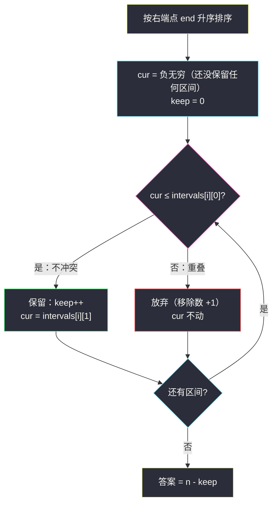
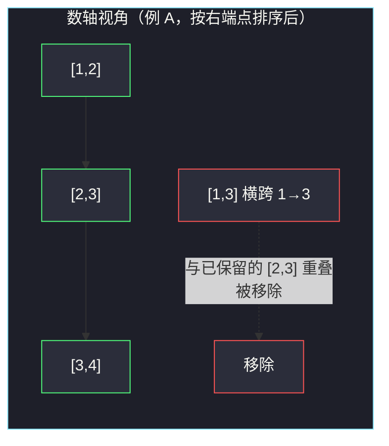

# 无重叠区间（右端点排序 + 保留最多不相交区间）

## 一、问题描述

给定一个区间的集合 `intervals`，其中 `intervals[i] = [start_i, end_i]`。返回**需要移除区间的最小数量**，使剩余区间**互不重叠**（相邻区间首尾相接不算重叠，即 `a.end <= b.start` 是允许的）。

> 🔗 LeetCode 435：https://leetcode.cn/problems/non-overlapping-intervals/

**示例 1**

```
输入：intervals = [ [1,2],[2,3],[3,4],[1,3] ]
输出：1
解释：移除 [1,3] 后，剩下的 [1,2] [2,3] [3,4] 首尾相接、互不重叠。
```

**示例 2**

```
输入：intervals = [ [1,2],[1,2],[1,2] ]
输出：2
解释：两个完全相同的区间里，至少要移除两个，剩一个才不重叠。
```

**直观理解**

「移除最少」=「**保留最多**」的一体两面：设最多能挑出 `k` 个互不重叠的区间，答案就是 `n - k`。  
于是问题转化为经典的「活动安排 / 最多不相交区间」：每个区间看作一场会议，一场接一场地参加，最多能参加几场——课上正是用这道原题（会议独占时间段）讲的，见 `class090/Code03_MeetingMonopoly1.java`，其中 `eraseOverlapIntervals` 就是本题提交函数。

---

## 二、暴力解法（入门）

### 直观思路

枚举区间全排列，每种排列里从头贪心往后"接得上的就接"，取能接上的最大数量（课源码 `maxMeeting1` 的对数器正是这么写的）。

```java
// 伪代码：全排列暴力，O(n!)
int maxKeep = 0;
void f(int[][] a, int i) {
    if (i == a.length) {
        // 按这个排列顺序，能依次衔接的最大区间数
        int cnt = 0, curEnd = -50001;
        for (int[] p : a) {
            if (curEnd <= p[0]) { cnt++; curEnd = p[1]; }
        }
        maxKeep = Math.max(maxKeep, cnt);
    } else {
        for (int j = i; j < a.length; j++) {
            swap(a, i, j); f(a, i + 1); swap(a, i, j);
        }
    }
}
```

### 复杂度

- **时间**：`O(n!)`——全排列，只在数据极小时可用（对数器用途）
- **空间**：`O(n)` 递归栈

### 🔴 瓶颈在哪里

「挑哪些区间」的选择顺序根本不重要，重要的是**集合本身**。  
排序后按固定次序做一次线性扫描即可——谁先结束，谁给后面留的机会就越多，这就是贪心登场的地方。

---

## 三、优化探索（核心章节）

### 3.1 观察特征

| 特征 | 说明 |
|------|------|
| 「移除最少」=「保留最多」 | 转化成最多不相交区间选择问题 |
| 区间只有两个自由度 | 按**结束时间**排序后有全局顺序，扫描一次 |
| 首尾相接合法 | 衔接条件是 `cur <= start`（**含等号**） |
| 与 #452 同构 | 射气球按右端点排序"能覆盖尽量覆盖"；本题按右端点排序"能参加尽量参加" |

### 3.2 贪心策略：按结束时间排序，能选就选

按右端点从小到大排序后，从左往右扫，维护 `cur`（上一个已保留区间的结束时间）：

- 若 `cur <= intervals[i][0]`：当前区间与已保留的**不冲突**，保留它，`cur = intervals[i][1]`；
- 否则：当前区间与已保留区间重叠，**放弃它**（计入移除数）。

**为什么按右端点排序、能选就选是最优的？** 交换论证：设最优解保留的第一个区间是 B，而排序后第一个入选的候选 A 满足 `A.end ≤ B.end`。把 B 换成 A，A 结束更早（或相同），对后续所有区间只可能更宽松——最优解不劣。逐个位置重复此论证，贪心解的保留数量 = 最优解。

一句话：**早结束的先拿，给后面留最大空间**。



### 3.3 关键推导问题

| 问题 | 答案 |
|------|------|
| 为什么按右端点而不是左端点排序？ | 决定"影响后续空间"的是结束时间：越早结束，占用的未来越少。按左端点排序无法保证这一点（一个超长区间可能左端最小） |
| 衔接条件为什么是 `<=` 不是 `<`？ | 题意 `[1,2]` 与 `[2,3]` 不重叠（首尾相接合法） |
| 放弃重叠区间时，为什么不试着"换掉已保留的"？ | 已保留的区间右端 ≤ 当前区间的右端（排序保证），换掉它只会让 cur 更晚，不可能更优 |
| `cur` 初始值怎么定？ | 取一个必然小于所有 start 的值；课源码因题面数据范围用 `-50001`，通用写法用 `Integer.MIN_VALUE` 更稳 |
| 答案为什么是 `n - keep`？ | 移除 = 全部 - 保留；保留数最大时移除数最小 |

### 3.4 一句话核心

> **按结束时间排序，扫一遍：衔接得上（cur ≤ start）就保留并更新 cur，衔接不上就移除——保留最多的那套，就是移除最少的答案。**

---

## 四、代码实现详解

### Java（主解：对齐课源码 class090）

> 出处：`/Users/zy/ai_learn/algorithm-journey/src/class090/Code03_MeetingMonopoly1.java` 中的 `eraseOverlapIntervals`（课上"会议必须独占时间段"原题）。课上 `cur` 初始为 `-50001`（题面数据范围 ±5×10⁴），此处换成 `Integer.MIN_VALUE` 等价且不依赖数据范围。

```java
// 无重叠区间：移除最少区间使剩余互不重叠
// 测试链接 : https://leetcode.cn/problems/non-overlapping-intervals/
import java.util.Arrays;

public class Solution {

    public static int eraseOverlapIntervals(int[][] meeting) {
        // 按结束时间升序：谁先结束，谁给后面留的空间越大
        Arrays.sort(meeting, (a, b) -> a[1] - b[1]);
        int n = meeting.length;
        int keep = 0; // 最多能保留的不相交区间数
        for (int i = 0, cur = Integer.MIN_VALUE; i < n; i++) {
            if (cur <= meeting[i][0]) { // 首尾相接合法，含等号
                keep++;
                cur = meeting[i][1];    // 更新"已占用到什么时候"
            }
        }
        // 总数 - 保留数 = 移除数
        return n - keep;
    }
}
```

### Python

```python
# 无重叠区间（右端点排序 + 贪心保留）
# 测试链接 : https://leetcode.cn/problems/non-overlapping-intervals/
class Solution:
    def eraseOverlapIntervals(self, intervals: list[list[int]]) -> int:
        intervals.sort(key=lambda p: p[1])  # 按结束时间升序
        keep, cur = 0, float("-inf")
        for start, end in intervals:
            if cur <= start:   # 不冲突（首尾相接合法）
                keep += 1
                cur = end      # 已占用到 end
        return len(intervals) - keep
```

---

## 五、例子演示

### 例 A：`intervals = [[1,2],[2,3],[3,4],[1,3]]`（答案 1）

**第 1 步：按右端点排序** → `[1,2] (end 2)`, `[2,3] (end 3)`, `[1,3] (end 3)`, `[3,4] (end 4)`  
（`[2,3]` 与 `[1,3]` 右端同为 3，先后不影响结果）

**第 2 步：线性扫描**，初始 `cur = -∞`，`keep = 0`：

| i | 区间 | 判断 cur ≤ start ? | 动作 | cur | keep | 移除 |
|---|------|--------------------|------|-----|------|------|
| 0 | [1,2] | -∞ ≤ 1 ✓ | 保留 | **2** | 1 | 0 |
| 1 | [2,3] | 2 ≤ 2 ✓（首尾相接） | 保留 | **3** | 2 | 0 |
| 2 | [1,3] | 3 ≤ 1 ? ✗ | **移除** | 3 | 2 | **1** |
| 3 | [3,4] | 3 ≤ 3 ✓ | 保留 | 4 | 3 | 1 |

**第 3 步：答案** = `n - keep` = `4 - 3` = **1**。被移除的正是 `[1,3]`。

### 例 B：`intervals = [[1,2],[1,2],[1,2]]`（答案 2）

排序后不变，初始 `cur = -∞`：

| i | 区间 | 判断 | 动作 | cur | keep | 移除 |
|---|------|------|------|-----|------|------|
| 0 | [1,2] | -∞ ≤ 1 ✓ | 保留 | **2** | 1 | 0 |
| 1 | [1,2] | 2 ≤ 1 ✗ | 移除 | 2 | 1 | **1** |
| 2 | [1,2] | 2 ≤ 1 ✗ | 移除 | 2 | 1 | **2** |

答案 = `3 - 1` = **2**：三胞胎区间只能留一个。



---

## 六、复杂度分析

| 项目 | 复杂度 | 说明 |
|------|--------|------|
| 时间 | `O(n log n)` | 排序主导；扫描部分是 `O(n)` |
| 空间 | `O(log n)`~`O(n)` | 仅排序栈/临时空间（取决于语言实现），不计输出 |

瓶颈在排序；线性扫描部分已是理论最优。

---

## 七、对比总结

### 易错点

1. **按左端点排序**：`[[1,100],[2,3],[4,5]]` 会先选中超长的 `[1,100]`，把后面两个挤掉——保留 1 个；而按右端点能保留 2 个。左端点排序没有"早结束"保证。
2. **衔接条件写成 `cur < start`**：会把合法的首尾相接（`[1,2]` 接 `[2,3]`）误判为重叠，例 A 会误报 2。
3. **忘记答案要 `n - keep`**：题目问的是移除数，不是保留数。
4. **比较器用 `a[1] - b[1]` 溢出**：本题数据范围小没事；数据大时（如 ±10⁹）用 `Integer.compare(a[1], b[1])` 更稳。
5. **重叠时去"更新" cur**：被移除的区间不应影响 cur——cur 只记录已保留区间的占用终点。

### 区间贪心家族

| 题 | 排序键 | 贪心动作 | 关系 |
|----|--------|----------|------|
| 452 射气球 | 右端点 | 箭位贴右端，能射尽射 | 站内已写 [minimum-number-of-arrows-to-burst-balloons](/solutions/base/minimum-number-of-arrows-to-burst-balloons.md)，与本题同一模板 |
| 435 无重叠区间（本题） | 右端点 | 能衔接就保留 | 移除最少 = 保留最多 |
| 56 合并区间 | 左端点 | 重叠就合并 | 站内已写 [merge-intervals](/solutions/base/merge-intervals.md) |

### 模板口诀

> **右端排序首当先，接得上就留一天；移除总数减保留，首尾相接算合法。**

---

## 八、举一反三

| 题目 | 链接 | 迁移点 |
|------|------|--------|
| 452. 用最少数量的箭引爆气球 | https://leetcode.cn/problems/minimum-number-of-arrows-to-burst-balloons/ | 同款右端点排序；"分组覆盖"视角，站内题解 [minimum-number-of-arrows-to-burst-balloons](/solutions/base/minimum-number-of-arrows-to-burst-balloons.md) |
| 56. 合并区间 | https://leetcode.cn/problems/merge-intervals/ | 同样排序后线性扫，但"重叠就合并"而非"舍弃" |
| 763. 划分字母区间 | https://leetcode.cn/problems/partition-labels/ | 先把字母出现位置转成区间，再"最多不相交覆盖"式贪心 |
| 1235. 规划兼职工作 | https://leetcode.cn/problems/maximum-profit-in-job-scheduling/ | 带权版的最多不相交区间：右端点排序 + DP/二分转移 |

**迁移一句**：区间题先排序——**问"最多选几个不冲突"按右端点**（本题、#452、#1235），**问"合并覆盖"按左端点**（#56）；排序后一次线性扫描出答案。
