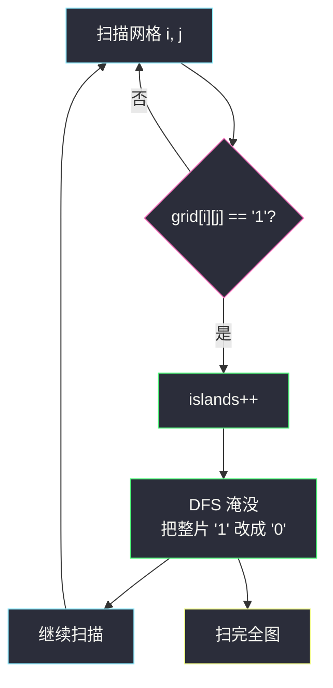
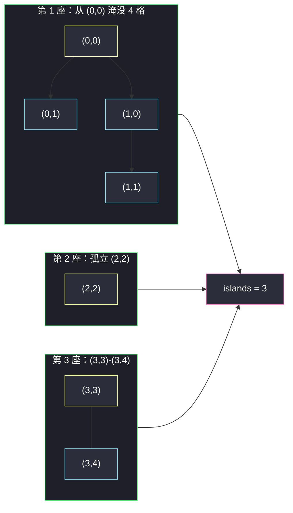

# 岛屿数量（连通块计数：DFS 淹没模板）

## 一、问题描述

给你一个由 `'1'`（陆地）和 `'0'`（水）组成的二维网格，请你计算网格中**岛屿的数量**。

岛屿总是被水包围，并且每座岛屿只能由**水平方向和/或竖直方向上相邻**的陆地连接形成（斜对角不算相邻）。可以假设网格的四条边均被水包围。

> 🔗 LeetCode 200：https://leetcode.cn/problems/number-of-islands/
>
> 约束：`1 <= n, m <= 300`（经典约束），网格只含 `'1'` / `'0'`。

**示例 1**

```
输入：grid = [
  ["1","1","0","0","0"],
  ["1","1","0","0","0"],
  ["0","0","1","0","0"],
  ["0","0","0","1","1"]
]
输出：3
解释：左上 2×2 一座、中间 (2,2) 一座、右下 (3,3)-(3,4) 一座
```

**示例 2**

```
输入：grid = [
  ["1"],
  ["1"]
]
输出：1
解释：竖着的两个 1 相邻（上下方向），连成一座岛
```

**直观理解**

把网格看成一堆陆地格子，「连成一片的 1」就是一座岛。本题本质是**无向图的连通块计数**：格子是点，相邻（上下左右）的陆地之间有边，问有多少个连通块。套路固定：**从任意没统计过的陆地出发做一次遍历（DFS/BFS），把整片陆地全部标记，计数 +1；再扫到下一片没标记的陆地，重复**。这个套路就是「洪水填充（flood fill）」，与课源码 class058 `Code01_NumberOfIslands` 的最优解一致。

---

## 二、暴力解法（无记忆的重复遍历）

### 直观思路

最朴素的做法：**不标记任何格子**。每当扫描中遇到一个 `'1'`，都做一次 DFS 把与它连片的陆地找出来——但找完之后**不留下任何记号**，于是同一片陆地里的每个格子被扫到时，都会再触发一次整片搜索。

```java
class Solution {
    public int numIslands(char[][] grid) {
        int n = grid.length, m = grid[0].length;
        int islands = 0;
        for (int i = 0; i < n; i++) {
            for (int j = 0; j < m; j++) {
                if (grid[i][j] == '1') {
                    islands++;          // 每个陆地格都当一次“新岛”
                    dfs(grid, i, j);    // 遍历连通片但不做标记
                }
            }
        }
        return islands;
    }

    // 有缺陷的 DFS：什么都没记住
    private void dfs(char[][] grid, int i, int j) {
        if (i < 0 || i >= grid.length || j < 0 || j >= grid[0].length
                || grid[i][j] != '1') {
            return;
        }
        dfs(grid, i - 1, j);
        dfs(grid, i + 1, j);
        dfs(grid, i, j - 1);
        dfs(grid, i, j + 1);
    }
}
```

### 复杂度

- **时间**：一片大小为 s 的陆地会被完整搜索 s 次，最坏 `O((n·m)²)`（全陆地网格）
- **空间**：递归栈 `O(n·m)`

### 🔴 瓶颈在哪里

答案明显重复劳动：**同一片陆地被反复确认了一遍又一遍**。而且上面这份代码连答案都是错的——它把每个陆地格都当成新岛计数。突破点只有一个字：**标**。一旦把「属于某座已统计岛屿」的格子标记掉（改成 `'0'` 或 visited 数组），每片陆地只需搜一次。

---

## 三、优化探索（核心章节）

### 3.1 观察特征

| 特征 | 说明 |
|------|------|
| 连通块计数 | 「数岛」=「数连通分量」，遍历整片 + 计数是标准套路 |
| 陆地只需归属一次 | 格子一旦被某次遍历标记，之后永远不必再看它 |
| 相邻只有 4 个方向 | 递归/入队的邻居固定为上下左右，斜向不管 |
| 可以原地修改 | 把访问过的 `'1'` 改成 `'0'`（“淹没”），省掉 visited 数组 |

### 3.2 优化：DFS 淹没（洪水填充，主解）

扫描每个格子：

1. 遇到 `'1'` → 说明这是一座**还没统计过**的岛，`islands++`；
2. 从这里 DFS，把整片陆地的 `'1'` 全部改成 `'0'`——**“水淹七军”**；
3. 后续扫描再碰到这片区域时全是 `'0'`，天然跳过。

这正是 class058 `Code01_NumberOfIslands` 的洪水填充做法（课上把格子赋值为 0 实现淹没）。



DFS 内部只做两件事：**越界/非陆地就返回；否则淹没自己，再淹没四个邻居**。

### 3.3 换个容器就是 BFS 版

把递归换成队列 `ArrayDeque`：起点入队并**立刻标记**，出队时把仍是 `'1'` 的邻居标记并入队。效果与 DFS 完全相同，只是扩张顺序从「一头扎到底」变成「一圈一圈扩散」——大网格下 BFS 没有递归栈溢出的风险。

### 3.4 换个模型就是并查集版

把每个 `'1'` 格子初始化为独立集合，`sets` 初值 = 陆地格总数；从左到右、从上到下扫描，只检查**左边**和**上边**的邻居（右边和下边之后轮到它们时自会合并），相邻的 `'1'` 就 `union`，**合并成功一次 `sets--`**。最后剩下的集合数就是岛屿数——即 class056 `Code05_NumberOfIslands` 的并查集做法，细节在 [#547 省份数量](./number-of-provinces.md) 里展开。

### 3.5 关键推导问题

| 问题 | 答案 |
|------|------|
| 为什么每个格子只进一次 DFS？ | 进 DFS 的前提是还是 `'1'`，而 DFS 第一步就把它改成 `'0'`，永不再进 |
| 为什么淹没不影响后面的计数？ | 淹掉的格子属于**已统计**的岛，它们本来就是“看过的”，跳过是应该的 |
| 原地改 `'0'` 安全吗？ | 本题允许；若面试官要求不破坏输入，用 `boolean[][] visited` 等价替换 |
| 只检查左/上邻居为什么够（并查集版）？ | 扫描有序，右/下邻居会在自己那一轮主动来合并，每对相邻关系恰好被处理一次 |

### 3.6 一句话核心

> **遇到没见过的 `'1'` 就计一座岛，并立刻把整片连通陆地淹没——每片陆地只被完整处理一次，计数自然正确。**

---

## 四、代码实现详解

### Java（主解：DFS 淹没，对齐 class058 思路的简洁版）

> 课源码出处：`class058/Code01_NumberOfIslands.java`（洪水填充最优解，课上用全局 static 与 `board[i][j] = 0`；此处按站点结构题规范写成 class Solution 风格，淹没用字符 `'0'`）。

```java
// 岛屿数量
// 测试链接 : https://leetcode.cn/problems/number-of-islands/
class Solution {
    public int numIslands(char[][] grid) {
        int n = grid.length, m = grid[0].length;
        int islands = 0;
        for (int i = 0; i < n; i++) {
            for (int j = 0; j < m; j++) {
                if (grid[i][j] == '1') {
                    islands++;          // 发现一座新岛
                    dfs(grid, i, j);    // 淹没整片
                }
            }
        }
        return islands;
    }

    private void dfs(char[][] grid, int i, int j) {
        if (i < 0 || i >= grid.length || j < 0 || j >= grid[0].length
                || grid[i][j] != '1') {
            return;                     // 出界或不是陆地
        }
        grid[i][j] = '0';               // 淹没自己
        dfs(grid, i - 1, j);            // 上
        dfs(grid, i + 1, j);            // 下
        dfs(grid, i, j - 1);            // 左
        dfs(grid, i, j + 1);            // 右
    }
}
```

### Java（附 1：BFS 版，ArrayDeque 防递归爆栈）

```java
class Solution {
    public int numIslands(char[][] grid) {
        int n = grid.length, m = grid[0].length;
        int islands = 0;
        int[][] dirs = {{-1, 0}, {1, 0}, {0, -1}, {0, 1}};
        for (int i = 0; i < n; i++) {
            for (int j = 0; j < m; j++) {
                if (grid[i][j] != '1') continue;
                islands++;
                grid[i][j] = '0';                     // 入队前就标记
                ArrayDeque<int[]> queue = new ArrayDeque<>();
                queue.add(new int[]{i, j});
                while (!queue.isEmpty()) {
                    int[] cur = queue.poll();
                    for (int[] d : dirs) {
                        int x = cur[0] + d[0], y = cur[1] + d[1];
                        if (x >= 0 && x < n && y >= 0 && y < m
                                && grid[x][y] == '1') {
                            grid[x][y] = '0';         // 入队前标记，防重复入队
                            queue.add(new int[]{x, y});
                        }
                    }
                }
            }
        }
        return islands;
    }
}
```

### Java（附 2：并查集版，对齐 class056 Code05）

```java
class Solution {
    int[] father;
    int sets;                              // 集合数 = 当前岛屿数

    public int numIslands(char[][] grid) {
        int n = grid.length, m = grid[0].length;
        father = new int[n * m];
        sets = 0;
        for (int i = 0; i < n; i++)
            for (int j = 0; j < m; j++)
                if (grid[i][j] == '1') {
                    father[i * m + j] = i * m + j;   // 每个陆地自成一岛
                    sets++;
                }
        for (int i = 0; i < n; i++)
            for (int j = 0; j < m; j++)
                if (grid[i][j] == '1') {
                    if (j > 0 && grid[i][j - 1] == '1') union(i * m + j, i * m + j - 1);
                    if (i > 0 && grid[i - 1][j] == '1') union(i * m + j, (i - 1) * m + j);
                }
        return sets;
    }

    private int find(int i) {
        if (i != father[i]) father[i] = find(father[i]); // 路径压缩
        return father[i];
    }

    private void union(int a, int b) {
        int fa = find(a), fb = find(b);
        if (fa != fb) { father[fa] = fb; sets--; }       // 真合并才减
    }
}
```

### Python

```python
# 岛屿数量（DFS 淹没）
# 测试链接 : https://leetcode.cn/problems/number-of-islands/
class Solution:
    def numIslands(self, grid: list[list[str]]) -> int:
        n, m = len(grid), len(grid[0])
        islands = 0
        for i in range(n):
            for j in range(m):
                if grid[i][j] == '1':
                    islands += 1
                    self._dfs(grid, i, j)
        return islands

    def _dfs(self, grid: list[list[str]], i: int, j: int) -> None:
        if i < 0 or i >= len(grid) or j < 0 or j >= len(grid[0]) \
                or grid[i][j] != '1':
            return
        grid[i][j] = '0'          # 淹没
        self._dfs(grid, i - 1, j)
        self._dfs(grid, i + 1, j)
        self._dfs(grid, i, j - 1)
        self._dfs(grid, i, j + 1)
```

```python
# 附：BFS 版（collections.deque）
from collections import deque

class Solution:
    def numIslands(self, grid: list[list[str]]) -> int:
        n, m = len(grid), len(grid[0])
        islands = 0
        for si in range(n):
            for sj in range(m):
                if grid[si][sj] != '1':
                    continue
                islands += 1
                grid[si][sj] = '0'
                q = deque([(si, sj)])
                while q:
                    x, y = q.popleft()
                    for nx, ny in ((x-1, y), (x+1, y), (x, y-1), (x, y+1)):
                        if 0 <= nx < n and 0 <= ny < m and grid[nx][ny] == '1':
                            grid[nx][ny] = '0'
                            q.append((nx, ny))
        return islands
```

---

## 五、具体例子演示

### 例 A：示例 1 完整跟踪（4×5 网格，DFS 版）

```
初始：
1 1 0 0 0
1 1 0 0 0
0 0 1 0 0
0 0 0 1 1
```

扫描顺序按行优先，逐格跟踪：

| 扫到 | grid 值 | 动作 | 淹没后网格 | islands |
|------|---------|------|-----------|---------|
| (0,0) | '1' | 计数 +1，DFS 从 (0,0) 扩散 | 见下方 | 1 |
| (0,1)~(1,1) | '0' | 已被淹没，跳过 | 不变 | 1 |
| (0,2)~(2,1) | '0' | 跳过 | 不变 | 1 |
| (2,2) | '1' | 计数 +1，DFS 孤立格 | 该格变 '0' | 2 |
| (3,3) | '1' | 计数 +1，DFS 扩到 (3,4) | 两格变 '0' | 3 |
| 其余 | '0' | 跳过 | 不变 | 3 |

**第一次 DFS（从 (0,0)）的递归栈逐步展开**（淹没用 D 表示）：

| 步 | 递归栈（从底到顶） | 当前格 | 淹没 | 说明 |
|----|--------------------|--------|------|------|
| 1 | (0,0) | (0,0) | D | 改 '0'，先走上 |
| 2 | (0,0)→(-1,0) | (-1,0) | — | 出界返回 |
| 3 | (0,0)→(1,0) | (1,0) | D | 改 '0'，先走上（回到 (0,0) 已是 '0' 返回）再下再左出界，最后右 |
| 4 | (0,0)→(1,0)→(1,1) | (1,1) | D | 改 '0'，四周：上 (0,1) |
| 5 | …→(1,1)→(0,1) | (0,1) | D | 改 '0'，四周全是 '0'/出界，层层回退 |
| 6 | 栈空 | — | — | 片区 {(0,0),(0,1),(1,0),(1,1)} 全部淹没 |

淹没三片之后网格变成全 '0'，最终 `islands = 3`。



### 例 B：BFS 版第一座岛的队列演化（同上 (0,0) 起步）

| 步 | 出队 | 邻居处理 | 队列（处理完） |
|----|------|----------|----------------|
| 0 | — | (0,0) 标记并入队 | [(0,0)] |
| 1 | (0,0) | (1,0) 标记入队 | [(1,0)] |
| 2 | (1,0) | (1,1) 标记入队 | [(1,1)] |
| 3 | (1,1) | (0,1) 标记入队 | [(0,1)] |
| 4 | (0,1) | 无新邻居 | [] 空，片区结束 |

注意对比：BFS 是一圈一圈向外扩（队列里最多同时压着“当前边界”），DFS 是一头扎到底（栈深等于蛇形路径长度）。

### 例 C：并查集版 `sets` 的演化（同网格）

初始 `sets = 6`（6 个陆地格）。按行扫描，只看左/上邻居：

| 扫到 | 左邻 '1'? | 上邻 '1'? | union 结果 | sets |
|------|-----------|-----------|------------|------|
| (0,0) | 无 | 无 | — | 6 |
| (0,1) | 是 (0,0) | 无 | 合并成功 | 5 |
| (1,0) | 无 | 是 (0,0) | 已同集，不减 | 5 |
| (1,1) | 是 (1,0) | 是 (0,1) | 已同集，不减 | 5 |
| (2,2) | 无 | 无 | — | 5 |
| (3,3) | 无 | 无 | — | 5 |
| (3,4) | 是 (3,3) | 无 | 合并成功 | 4 |

最后 `sets = 6 - 3 = 3`：6 个陆地格，合并成功共 3 次（(0,0)-(0,1)、(0,0)-(1,0)、(3,3)-(3,4)），而 (1,1) 的两次 union 均为「已同集」，正确不减。**结论 `sets = 3`，与 DFS 一致。**

---

## 六、复杂度分析

| 方法 | 时间 | 空间 | 说明 |
|------|------|------|------|
| DFS 淹没 | `O(n·m)` | `O(n·m)` | 每格进出 DFS 至多一次；空间是递归栈深度 |
| BFS | `O(n·m)` | `O(min(n,m))` 量级的队列 | 队列里至多是当前边界（最坏仍记 `O(n·m)`） |
| 并查集 | `O(n·m·α)` 近似 `O(n·m)` | `O(n·m)` | father 数组按格子数开；α 为反阿克曼函数，可视为常数 |

三种方法每个格子/每对相邻关系都只处理常数次，都是线性最优量级。

---

## 七、方法对比与总结

### 易错点

1. **DFS 忘改 `'0'`** → 同一格反复递归，直接死循环/爆栈（就是第二节的“暴力”）。
2. **先递归再标记** → 同一格在四个方向被重复展开；必须**进来先淹没自己**再走邻居。
3. **BFS 出队时才标记** → 同一格可能被多个邻居重复入队，队列膨胀；要**入队前标记**。
4. **`'1'` 是字符不是数字** → Java 里写 `grid[i][j] == 1` 恒 false，要用 `'1'`。
5. **越界判断顺序** → 先判 `i/j` 越界，再取 `grid[i][j]`，否则数组越界异常。
6. **并查集版 union 前不 find 已同集** → `sets` 多减，答案偏小。

### 三法对比

| | DFS 淹没 | BFS | 并查集 |
|--|----------|-----|--------|
| 时间 | `O(n·m)` | `O(n·m)` | 近似 `O(n·m)` |
| 额外空间 | 递归栈 `O(n·m)` | 队列 | father 数组 |
| 擅长场景 | 代码最短，面试默认写法 | 怕递归爆栈、要按距离分层 | **动态加陆地/合并**（如 #305 离线、#695 面积、动态连通问题） |

### 模板口诀

> **见一淹一：见到 '1' 计数加一，DFS/BFS 把整片夷为 '0'；并查集则初始全独立，合并一次少一岛。**

---

## 八、举一反三

| 题目 | 链接 | 迁移点 |
|------|------|--------|
| 547. 省份数量 | https://leetcode.cn/problems/number-of-provinces/ | 同一道题的**邻接矩阵版**，并查集模板题，与本文互为镜像 |
| 695. 岛屿的最大面积 | https://leetcode.cn/problems/max-area-of-island/ | 淹没时顺手数格子数，求最大片 |
| 130. 被围绕的区域 | https://leetcode.cn/problems/surrounded-regions/ | 课源码 class058 Code02 原题：从边界反向淹没 |
| 463. 岛屿的周长 | https://leetcode.cn/problems/island-perimeter/ | 淹没思想的计数变体：数“水边” |
| 994. 腐烂的橘子 | https://leetcode.cn/problems/rotting-oranges/ | BFS 按层扩散的经典：多源点同时入队 |

**迁移一句**：网格里凡是「连成一片」的计数、面积、标记问题，第一反应就是**洪水填充**；如果陆地会**动态增加/动态查询连通性**，再升级成**并查集**（详见 [#547 省份数量](./number-of-provinces.md)）。
