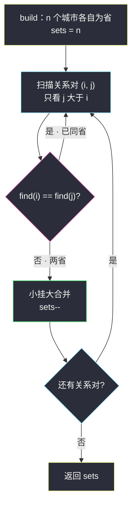
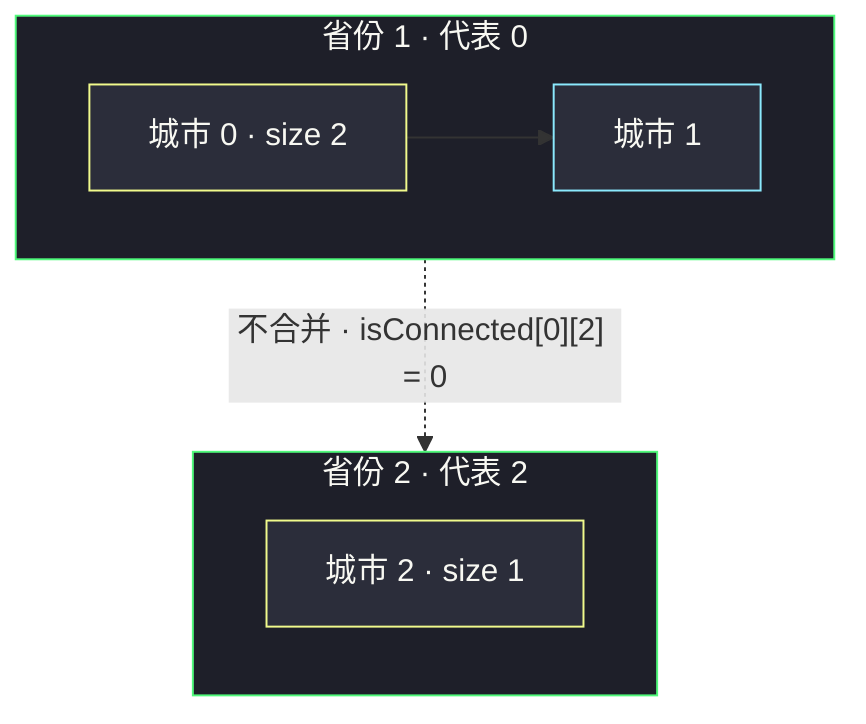

# 省份数量（并查集模板题：合并一次少一个集合）

## 一、问题描述

有 `n` 个城市，其中一些彼此相连。`isConnected[i][j] = 1` 表示第 `i` 个城市和第 `j` 个城市**直接**相连，`isConnected[i][j] = 0` 表示不直接相连。

省份是一组**直接或间接**相连的城市，组内不含其他没有相连的城市。返回矩阵中**省份的数量**。

> 🔗 LeetCode 547：https://leetcode.cn/problems/number-of-provinces/
>
> 约束：`1 <= n <= 200`，`isConnected[i][i] == 1`，矩阵对称。

**示例 1**

```
输入：isConnected = [
  [1,1,0],
  [1,1,0],
  [0,0,1]
]
输出：2
解释：城市 0 与 1 直接相连成一省；城市 2 自成一省
```

**示例 2**

```
输入：isConnected = [
  [1,0,0],
  [0,1,0],
  [0,0,1]
]
输出：3
解释：没有任何城市直接相连，每城自成一省
```

**直观理解**

这题就是 [#200 岛屿数量](./number-of-islands.md) 的**邻接矩阵版**：城市 = 格子，「直接相连」= 相邻陆地，省份 = 连通块。图换了张皮，连通块计数的心没变。这题被选为**并查集模板题**的原因也很直白：数据给的就是一堆「谁和谁是一伙」的关系对，而并查集天生就是干这个的——`union` 一次，集合数减一，扫完关系，剩下的集合数就是答案。

---

## 二、暴力解法（传递闭包）

### 直观思路

「间接相连」不好直接看，那就用 Floyd 传递闭包把它**摊平成直接相连**：若 b 能到 a、c 能到 b，则 a 与 c 也算连通。三重循环后，`reach[a][c] = 1` 表示 a、c 在同一省，再数连通块。

```java
class Solution {
    public int findCircleNum(int[][] isConnected) {
        int n = isConnected.length;
        boolean[][] reach = new boolean[n][n];
        for (int i = 0; i < n; i++)
            for (int j = 0; j < n; j++)
                reach[i][j] = isConnected[i][j] == 1;

        // Floyd 传递闭包：中转点 k
        for (int k = 0; k < n; k++)
            for (int a = 0; a < n; a++)
                for (int c = 0; c < n; c++)
                    if (reach[a][k] && reach[k][c])
                        reach[a][c] = true;

        // 数连通块：还没归属的城市，把它能到的全部标记
        boolean[] vis = new boolean[n];
        int provinces = 0;
        for (int i = 0; i < n; i++) {
            if (vis[i]) continue;
            provinces++;
            for (int j = 0; j < n; j++)
                if (reach[i][j]) vis[j] = true;
        }
        return provinces;
    }
}
```

### 复杂度

- **时间**：`O(n³)`——Floyd 三重循环主导
- **空间**：`O(n²)`

### 🔴 瓶颈在哪里

我们只关心「**哪些城市同伙**」，Floyd 却把**每一对**城市的关系都推了个遍，绝大多数信息用不上。而「不断合并同伙」正是并查集的主场：每次合并只需沿着代表节点走几步，近 `O(1)` 完成一次 `union`。

---

## 三、优化探索（核心章节）

### 3.1 观察特征

| 特征 | 说明 |
|------|------|
| 输入是一堆关系对 | 「i、j 直接相连」=「把 i 和 j 合并」——`union` 的天然饲料 |
| 只问集合个数 | 维护计数器 `sets`，合并成功就减一，全程不用真正枚举集合成员 |
| 无需拆分 | 并查集不支持拆，但本题只合不分，恰好匹配 |
| 矩阵对称 | 只扫上三角 `j > i` 即可，每对关系处理一次 |

### 3.2 并查集三件套（对齐 class056 模板）

课源码 class056 `Code01_UnionFindNowCoder` 是并查集标准模板：`father[]` 记代表、`size[]` 支撑小挂大、`stack[]` 沿途收集做路径压缩；class056 `Code05_NumberOfIslands` 则示范了用 `sets` 计数回答「还剩几个集合」。本题把两者拼起来：

1. **`build`**：每个城市 `father[i] = i`，自成一省，`sets = n`；
2. **`find(i)`**：沿 `father` 一路上溯到代表节点；**沿途节点直接挂到代表**（路径压缩），下次再查就近乎一步到位；
3. **`union(a, b)`**：两边的 `find` 结果不同才真合并——**小集合挂到大集合**（小挂大，控制树高），同时 `sets--`。



### 3.3 对照：DFS 洪水填充同样能过

与 #200 完全同构：从没访问过的城市出发，DFS 邻接矩阵一整行，把直接相连的未访问城市全部标记，计数 +1。时间同为 `O(n²)`（每个城市扫一行）。**选谁？** 静态图两者皆可；一旦题目变形为「动态加边 + 随时问还剩几个省」，DFS 每次都要全图重跑，而并查集一次 `union`、一次 `find` 就把增量处理掉——这就是并查集的不可替代性。

### 3.4 关键推导问题

| 问题 | 答案 |
|------|------|
| 为什么 `sets--` 只放在「真合并」里？ | `find` 相同说明本就同省，没有两省合一，减了就多数流失 |
| 路径压缩 + 小挂大为什么快？ | 两者叠加后，单次 `find` 均摊近似 `O(α(n))`（反阿克曼函数，`n ≤ 2⁶⁴` 时不超 5，视作常数） |
| `find` 为什么要收集沿途节点再统一挂？ | 上溯时不能边走边改（会提前把中间节点挂错），先记到 `stack` 里，找到代表后统一重挂 |
| 对角线 `isConnected[i][i] = 1` 要处理吗？ | 不必，`union(i, i)` 时 `find` 相同自然跳过；只扫 `j > i` 更是直接绕开 |
| 不用 `size` 小挂大会怎样？ | 功能上不影响正确性，只影响树高——最坏退化成链，`find` 变 `O(n)` |

### 3.5 一句话核心

> **n 个城市各成一省；每合并一对直接相连且不同省的城市，省份数减一——扫完所有关系，剩下的就是省份数。**

---

## 四、代码实现详解

### Java（主解：并查集，father/size/stack 对齐 class056 模板）

> 说明：课源码仓库未收录本题原题文件，主解按 class056 `Code01_UnionFindNowCoder` 的并查集模板骨架（`father` + `size` 小挂大 + `stack` 路径压缩）与 class056 `Code05_NumberOfIslands` 的 `sets` 计数写法对齐，改为 class Solution 风格提交 LeetCode。

```java
// 省份数量
// 测试链接 : https://leetcode.cn/problems/number-of-provinces/
class Solution {
    private int[] father;   // father[i]：i 的代表节点
    private int[] size;     // size[i]：i 为代表的集合大小
    private int[] stack;    // find 沿途收集，做路径压缩
    private int sets;       // 集合数 = 省份数

    public int findCircleNum(int[][] isConnected) {
        int n = isConnected.length;
        build(n);
        for (int i = 0; i < n; i++) {
            for (int j = i + 1; j < n; j++) {      // 只扫上三角
                if (isConnected[i][j] == 1) {
                    union(i, j);
                }
            }
        }
        return sets;
    }

    private void build(int n) {
        father = new int[n];
        size = new int[n];
        stack = new int[n];
        sets = n;
        for (int i = 0; i < n; i++) {
            father[i] = i;
            size[i] = 1;
        }
    }

    private int find(int i) {
        int top = 0;
        while (i != father[i]) {
            stack[top++] = i;      // 沿途收集
            i = father[i];
        }
        while (top > 0) {
            father[stack[--top]] = i;  // 统一挂到代表，路径压缩
        }
        return i;
    }

    private void union(int a, int b) {
        int fa = find(a), fb = find(b);
        if (fa == fb) return;      // 已同省
        if (size[fa] >= size[fb]) { // 小挂大
            father[fb] = fa;
            size[fa] += size[fb];
        } else {
            father[fa] = fb;
            size[fb] += size[fa];
        }
        sets--;                    // 两省合一
    }
}
```

### Java（附：DFS 对照版，同 #200 洪水填充）

```java
class Solution {
    public int findCircleNum(int[][] isConnected) {
        int n = isConnected.length;
        boolean[] visited = new boolean[n];
        int provinces = 0;
        for (int i = 0; i < n; i++) {
            if (!visited[i]) {
                provinces++;       // 新省份
                dfs(isConnected, visited, i);
            }
        }
        return provinces;
    }

    private void dfs(int[][] g, boolean[] vis, int i) {
        vis[i] = true;
        for (int j = 0; j < g.length; j++) {
            if (g[i][j] == 1 && !vis[j]) {
                dfs(g, vis, j);
            }
        }
    }
}
```

### Python

```python
# 省份数量（并查集）
# 测试链接 : https://leetcode.cn/problems/number-of-provinces/
class Solution:
    def findCircleNum(self, isConnected: list[list[int]]) -> int:
        n = len(isConnected)
        father = list(range(n))
        size = [1] * n
        sets = n

        def find(i: int) -> int:
            root = i
            while father[root] != root:      # 先找到代表
                root = father[root]
            while father[i] != root:          # 沿途压平
                father[i], i = root, father[i]
            return root

        def union(a: int, b: int) -> None:
            nonlocal sets
            fa, fb = find(a), find(b)
            if fa == fb:
                return
            if size[fa] >= size[fb]:          # 小挂大
                father[fb] = fa
                size[fa] += size[fb]
            else:
                father[fa] = fb
                size[fb] += size[fa]
            sets -= 1

        for i in range(n):
            for j in range(i + 1, n):         # 只扫上三角
                if isConnected[i][j] == 1:
                    union(i, j)
        return sets
```

```python
# 附：DFS 对照版
class Solution:
    def findCircleNum(self, isConnected: list[list[int]]) -> int:
        n = len(isConnected)
        visited = [False] * n

        def dfs(i: int) -> None:
            visited[i] = True
            for j in range(n):
                if isConnected[i][j] == 1 and not visited[j]:
                    dfs(j)

        provinces = 0
        for i in range(n):
            if not visited[i]:
                provinces += 1
                dfs(i)
        return provinces
```

---

## 五、具体例子演示

### 例 A：示例 1 的并查集全程跟踪

`isConnected = [[1,1,0],[1,1,0],[0,0,1]]`，n = 3。初始：

```
father = [0, 1, 2]   size = [1, 1, 1]   sets = 3
```

只扫上三角 `j > i`，逐个关系对处理：

| 关系对 | 值 | find(i) / find(j) | 动作 | father | size | sets |
|--------|-----|-------------------|------|--------|------|------|
| (0,1) | 1 | 0 / 1（不同） | 小挂大：size 同为 1，1 挂 0 | [0, 0, 2] | [2, -, 1] | 2 |
| (0,2) | 0 | — | 跳过 | [0, 0, 2] | [2, -, 1] | 2 |
| (1,2) | 0 | — | 跳过 | [0, 0, 2] | [2, -, 1] | 2 |

结束，**`sets = 2`**。合并后的集合形态（father 指向）：



### 例 B：路径压缩的现场演示（稍大的例子）

设 n = 5，先依次执行 `union(0,1)`、`union(1,2)`、`union(3,4)`（每次 size 相同小挂大，`father[1]=0`、`father[2]=1`、`father[4]=3`）：

```
father = [0, 0, 1, 3, 3]   sets = 2
```

此刻 `find(2)` 的执行过程：

| 步 | 动作 | stack | 说明 |
|----|------|-------|------|
| 1 | i=2 ≠ father[2]=1，收集 2，i=1 | [2] | 上溯 |
| 2 | i=1 ≠ father[1]=0，收集 1，i=0 | [2,1] | 继续上溯 |
| 3 | i=0 == father[0]，代表找到，停止 | [2,1] | root = 0 |
| 4 | 弹出 1：father[1]=0 | [2] | 压缩 |
| 5 | 弹出 2：father[2]=0 | [] | 压缩，树被压平 |

```
压缩前：  0 ← 1 ← 2        压缩后：  0 ← 1
                                            ↖ 2（直接挂 0）
```

下次再 `find(2)`，一步就到代表——这就是「路径压缩」四个字的含金量。

### 例 C：示例 2（无任何相连）

上三角全是 0，一个 `union` 都不发生，`sets` 从 3 到 3，直接返回 **3**。对角线的 1（自己连自己）被 `j > i` 天然排除，即使真做了 `union(i,i)`，`find(i) == find(i)` 也不会触发 `sets--`，安全。

---

## 六、复杂度分析

| 方法 | 时间 | 空间 | 说明 |
|------|------|------|------|
| 并查集 | `O(n² + n·α(n))` ≈ `O(n²)` | `O(n)` | 扫矩阵 `O(n²)` 次 `union` 检查；每次 `find` 均摊近 `O(1)` |
| DFS | `O(n²)` | `O(n)` | 每个城市访问时扫一整行；visited + 递归栈 |
| 暴力传递闭包 | `O(n³)` | `O(n²)` | Floyd 三重循环 |

并查集的 `O(n²)` 主要花在**读入关系**上，这部分任何方法都省不掉；处理每条关系的代价被压到近常数，这就是它对传递闭包的碾压。

---

## 七、方法对比与总结

### 易错点

1. **`sets--` 写进 `union` 但没判同集合** → 重复合并多减，省份数偏小。
2. **`find` 边上溯边改 father** → 中间节点可能被挂到非代表上，压缩失效甚至指错。
3. **不做小挂大** → 数据刻意构造下退化成长链，`find` 退化 `O(n)`，整体退化 `O(n³)`。
4. **只合并对角线/下三角重复扫** → 结果仍正确但白做一倍；约定只扫 `j > i`。
5. **DFS 版忘了标记入口城市** → 同一省被重复计数。
6. **把矩阵当邻接表用** → `isConnected[i][j]` 是邻接矩阵，第 i 行就是城市 i 的全部直接关系，别再去建图容器。

### 并查集 vs DFS

| | 并查集 | DFS 洪水填充 |
|--|--------|--------------|
| 时间 | 近 `O(n²)` | `O(n²)` |
| 空间 | `O(n)` 数组 | `O(n)` visited + 递归栈 |
| 增量加边 | 一次 `union` 即可 | 需全图重跑 |
| 拆分/删边 | 不支持 | 重跑可支持 |
| 模板沉淀 | 三件套 `build/find/union`，背下来通吃一大片题 | 网格题写起来更快 |

### 模板口诀

> **father 建并查：上溯找代表，沿途全压平；合并挑大树，小树挂上去，两省变一省，sets 少一个。**

---

## 八、举一反三

| 题目 | 链接 | 迁移点 |
|------|------|--------|
| 200. 岛屿数量 | https://leetcode.cn/problems/number-of-islands/ | 网格版同构题，DFS 淹没主解 + 并查集镜像，与本文互引 |
| 684. 冗余连接 | https://leetcode.cn/problems/redundant-connection/ | 加边前 `find` 已同集 → 这条边就是环上多余边 |
| 990. 等式方程的可满足性 | https://leetcode.cn/problems/satisfiability-of-equality-equations/ | 先并 `==` 再查 `!=`，经典并查集判冲突 |
| 1971. 寻找图中是否存在路径 | https://leetcode.cn/problems/find-if-path-exists-in-graph/ | 一路 union 后 `find` 判同集 |
| 1319. 连通网络的操作次数 | https://leetcode.cn/problems/number-of-operations-to-make-network-connected/ | 冗余线缆数 = union 被拒次数，答案 = 集合数 - 1 |

**迁移一句**：凡是题面出现「同组」「连通」「是否是一伙」且**只合不分**，直接掏并查集三件套；`sets` 计数和「union 被拒」这两把小刀，能秒掉一整族变形题。
