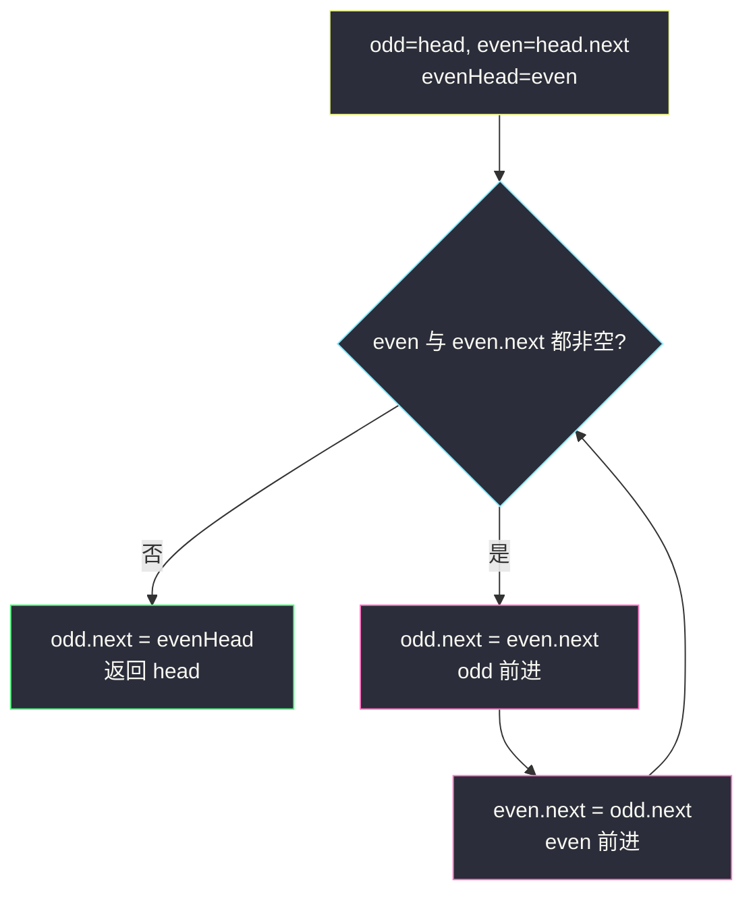
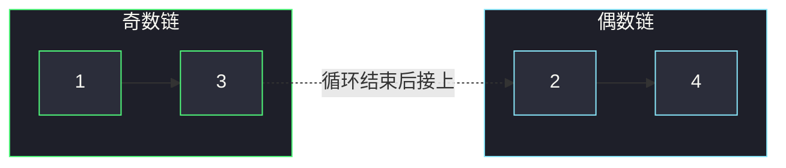

# 奇偶链表（拆两条链再拼接）

## 一、问题描述

给定单链表的头结点 `head`，将所有**索引为奇数**的结点排在前面，**索引为偶数**的结点排在后面，并保持相对顺序。返回重新排列后的链表头。

- 下标从 **1** 开始：第 1 个结点算奇数位，第 2 个算偶数位。
- 要求：**O(1) 额外空间**，**O(n) 时间**。

> 🔗 LeetCode 328：https://leetcode.cn/problems/odd-even-linked-list/

**示例 1（简单）**

```
输入：head = [1,2,3,4,5]
输出：[1,3,5,2,4]
解释：奇数位 1→3→5，偶数位 2→4，拼在一起。
```

**示例 2（偶数个结点）**

```
输入：head = [2,1,3,5,6,4,7]
输出：[2,3,6,7,1,5,4]
解释：奇数位 2→3→6→7，偶数位 1→5→4。
```

**直观理解**

不是按**结点值**的奇偶，而是按**位置**的奇偶。  
像把一条队伍拆成两列——奇数位一列、偶数位一列——再把偶数列接到奇数列尾巴上。

```
原：  1 → 2 → 3 → 4 → 5
奇：  1 → 3 → 5
偶：  2 → 4
结果：1 → 3 → 5 → 2 → 4
```

---

## 二、暴力解法（入门）

### 直观思路

开两个数组（或新链表）分别收集奇数位、偶数位结点，再串起来。

```java
class Solution {
    public ListNode oddEvenList(ListNode head) {
        if (head == null) return null;
        java.util.List<ListNode> odd = new java.util.ArrayList<>();
        java.util.List<ListNode> even = new java.util.ArrayList<>();
        ListNode cur = head;
        int i = 1;
        while (cur != null) {
            if (i % 2 == 1) odd.add(cur);
            else even.add(cur);
            cur = cur.next;
            i++;
        }
        for (int k = 0; k < odd.size() - 1; k++) {
            odd.get(k).next = odd.get(k + 1);
        }
        for (int k = 0; k < even.size() - 1; k++) {
            even.get(k).next = even.get(k + 1);
        }
        odd.get(odd.size() - 1).next = even.isEmpty() ? null : even.get(0);
        if (!even.isEmpty()) {
            even.get(even.size() - 1).next = null;
        }
        return odd.get(0);
    }
}
```

### 复杂度

- **时间**：`O(n)`。
- **空间**：`O(n)`（存了所有结点引用）。

### 🔴 瓶颈在哪里

题面明确要求 **O(1) 额外空间**——不能靠数组「暂存再串」。  
必须在原链表上用几个指针，边走边改 `next`。

---

## 三、优化探索（核心章节）

### 3.1 观察特征

| 特征 | 说明 |
|------|------|
| 按位置奇偶 | 不是值奇偶；奇数位 = 原第 1、3、5… 个 |
| 保持相对顺序 | 各自内部顺序不变 → 稳定拆分 |
| O(1) 空间 | 只能用常数个指针原地改链 |
| 最后拼接 | 奇数链尾 → 偶数链头；偶数链尾 → `null` |

### 3.2 暴力 → 优化：双指针拆链

维护：

- `odd`：当前奇数链的尾
- `even`：当前偶数链的尾
- `evenHead`：偶数链的头（最后接到奇数尾上）

每一步：

1. `odd.next = even.next`，`odd` 前进
2. `even.next = odd.next`，`even` 前进

循环条件：`even != null && even.next != null`（后面还有结点可拆）。

结束后：`odd.next = evenHead`。



**指针关系示意（拆完一步后）**



### 3.3 关键问题（链表双指针）

- **为何先动 `odd` 再动 `even`？** 顺序固定：先把奇数的下一家接到奇数尾，再把偶数的下一家接到偶数尾；反过来容易丢引用。
- **循环何时停？** `even` 走在「偶数侧」；当 `even` 为空或 `even.next` 为空时，说明没有下一个奇数位可挂了。
- **头结点变不变？** 第 1 个一定是奇数位，`head` 始终是答案头，不用 dummy（除非想统一空链处理）。
- **偶数链尾要不要断？** 循环里改 `even.next` 时已经接到正确后继；最后一节的 `next` 会自然变成 `null`（或原本就是）。

### 3.4 核心思想（一句话）

**用 `odd` / `even` 两个尾指针交替把结点拆进两条链，最后 `odd.next = evenHead`。**

---

## 四、代码实现详解

### Java（逐行）

```java
class Solution {
    public ListNode oddEvenList(ListNode head) {
        if (head == null || head.next == null) {
            return head; // 0 或 1 个结点，无需重排
        }
        ListNode odd = head;           // 奇数链当前尾
        ListNode even = head.next;     // 偶数链当前尾
        ListNode evenHead = even;      // 记住偶数链头，最后拼接

        while (even != null && even.next != null) {
            odd.next = even.next;      // 下一个奇数位接到奇数尾
            odd = odd.next;            // 奇数尾前进
            even.next = odd.next;      // 下一个偶数位接到偶数尾
            even = even.next;          // 偶数尾前进
        }
        odd.next = evenHead;           // 奇数链尾接偶数链头
        return head;
    }
}
```

| 变量 | 含义 |
|------|------|
| `odd` | 奇数链尾，始终指向「当前已排好的最后一个奇数位」 |
| `even` | 偶数链尾 |
| `evenHead` | 偶数链起点（原第 2 个结点） |

**循环不变式**：`odd` 之后尚未接入的奇数位，可通过 `even.next` 找到；两条链内部相对顺序与原链表一致。

### Python（同结构）

```python
class Solution:
    def oddEvenList(self, head: ListNode | None) -> ListNode | None:
        if not head or not head.next:
            return head
        odd, even = head, head.next
        even_head = even
        while even and even.next:
            odd.next = even.next
            odd = odd.next
            even.next = odd.next
            even = even.next
        odd.next = even_head
        return head
```

---

## 五、具体例子演示

### 例 1：`1 → 2 → 3 → 4 → 5`

初值：`odd=1`，`even=2`，`evenHead=2`

| 步 | 操作后链表关系 | odd | even |
|----|----------------|-----|------|
| 1 | `1→3`，`2→4`；链：`1→3→4→5`，`2→4→5`（暂共享后缀） | 3 | 4 |
| 2 | `3→5`，`4→null`；链：`1→3→5`，`2→4` | 5 | null |
| 终 | `5.next = 2` → `1→3→5→2→4` | | |

循环因 `even == null` 结束。


### 例 2：`1 → 2 → 3 → 4`（偶数个）

| 步 | 要点 | odd | even |
|----|------|-----|------|
| 1 | `1→3`，`2→4` | 3 | 4 |
| 停 | `even.next == null`，不再进循环 | 3 | 4 |
| 终 | `3.next = 2` → `1→3→2→4` | | |

注意：停下来时 `even` 还在 `4`，不是 `null`——靠 `even.next == null` 退出。

### 例 3：`1 → 2`

直接不进循环，`odd.next = evenHead` → `1→2`，结果不变。

---

## 六、复杂度分析

| 方法 | 时间 | 空间 | 说明 |
|------|------|------|------|
| 数组收集再串 | `O(n)` | `O(n)` | 不满足题面空间要求 |
| **双指针原地拆拼** | **`O(n)`** | **`O(1)`** | 每个结点最多被改常数次 `next` |

---

## 七、方法对比与总结

| | 数组法 | 双指针拆拼 |
|--|--------|------------|
| 空间 | O(n) | **O(1)** |
| 面试 | 可作直觉版 | **期望答案** |
| 难度 | 低 | 指针别丢、顺序别反 |

**易错点**

1. 搞混「值奇偶」和「下标奇偶」——本题是**位置**。
2. 先改 `odd.next` 再动 `odd`，再改 `even.next`；顺序反了容易断链。
3. 循环条件写成只判断 `odd` / 只判断 `even` 会漏边界（偶数长度、奇数长度都要测）。
4. 忘记 `odd.next = evenHead`，两条链就没拼上。
5. 空链表、单结点要提前返回。

**模板（拆两条相对有序子链再拼）**

```java
// A = 满足条件的链尾，B = 另一条链尾，BHead = 另一条链头
// while (还能继续拆) {
//   A.next = 下一家该进 A 的结点; A = A.next;
//   B.next = 下一家该进 B 的结点; B = B.next;
// }
// A.next = BHead;
```

---

## 八、举一反三

| 题目 | 关系 |
|------|------|
| [86. 分隔链表](https://leetcode.cn/problems/partition-list/) | 按**值**拆成 `<x` / `≥x` 两条再拼 |
| [725. 分隔链表](https://leetcode.cn/problems/split-linked-list-in-parts/) | 按长度切成多段 |
| [24. 两两交换链表中的节点](https://leetcode.cn/problems/swap-nodes-in-pairs/) | 也是原地改 `next`，分组处理 |
| [206. 反转链表](https://leetcode.cn/problems/reverse-linked-list/) | 指针改向基本功 |

**思想迁移**

```
要把链表按某规则分成两类且保序
  ↓
维护两条链的尾指针 + 记住第二条的头
  ↓
一趟扫描边拆边接
  ↓
最后 链1尾 → 链2头
```

**记忆口诀**：奇尾偶尾交替接，偶头挂到奇尾巴。
