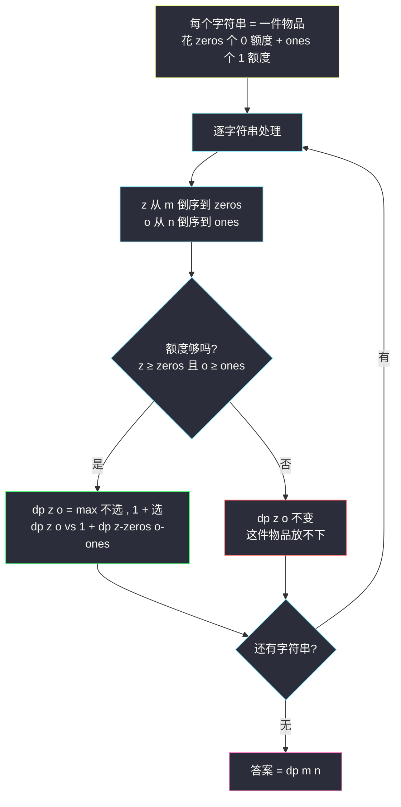
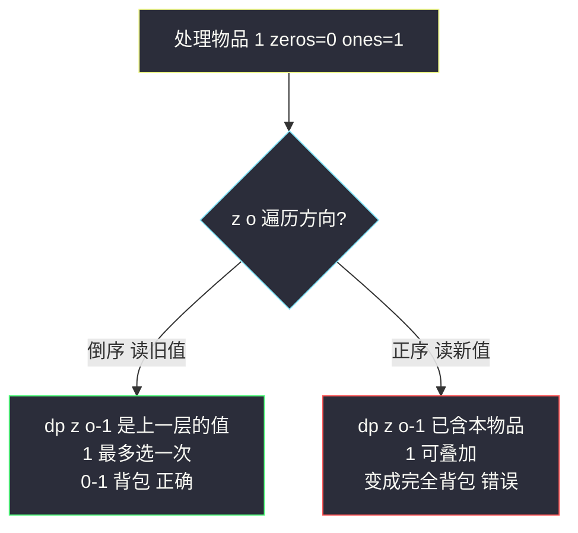

# 一和零（二维费用背包：两个容量维度同时做限制）

## 一、问题描述

给你一个二进制字符串数组 `strs` 和两个整数 `m`、`n`。请找出并返回 `strs` 的**最大子集**的长度，该子集中 **最多** 有 `m` 个 `0` 和 `n` 个 `1`。

> 🔗 LeetCode 474：https://leetcode.cn/problems/ones-and-zeroes/

**示例 1**

```
输入：strs = ["10","0001","111001","1","0"], m = 5, n = 3
输出：4
解释：选 "10","0001","1","0"，共 3 个 0、3 个 1，是最大子集（4 个字符串）
```

**示例 2**

```
输入：strs = ["10","0","1"], m = 1, n = 1
输出：2
解释：最大的可行子集是 {"0", "1"}，0 和 1 各 1 个
```

**直观理解**

经典 0-1 背包里每个物品花**一种**费用（体积）；本题每个字符串花**两种**费用——`zeros` 个 0 额度 + `ones` 个 1 额度，两个容量维度（`m` 个 0、`n` 个 1）必须同时满足。这就是**多维费用背包**：几个可变参数就是几维表（课上方法论），除了「物品、两个容量」三维（或滚动掉物品维成二维），骨架与 #416 分割等和子集（站内已写）完全一致——**每个字符串只能选一次**，所以容量必须**倒序**更新。

---

## 二、暴力解法

### 直观思路

从「第 i 个字符串开始，剩 z 个 0 额度、o 个 1 额度」出发做尝试（对齐 class069 Code01 的 f1）：

```java
// 暴力递归：strs[i....] 自由选择，0 额度 ≤ z、1 额度 ≤ o，最多选几个字符串
public static int f1(String[] strs, int i, int z, int o) {
    if (i == strs.length) {
        return 0; // 没有字符串了
    }
    // 不选 strs[i]
    int p1 = f1(strs, i + 1, z, o);
    // 选 strs[i]：先数它有几个 0 几个 1
    int p2 = 0;
    int zeros = 0, ones = 0;
    for (char c : strs[i].toCharArray()) {
        if (c == '0') zeros++;
        else ones++;
    }
    if (zeros <= z && ones <= o) {
        p2 = 1 + f1(strs, i + 1, z - zeros, o - ones);
    }
    return Math.max(p1, p2);
}
```

### 复杂度

- **时间**：`O(2^len)` 级别（len = 字符串个数），指数爆炸
- **空间**：`O(len)` 递归栈

### 🔴 瓶颈在哪里

`(i, z, o)` 三个参数的组合大量重复展开。状态总数 `len × (m+1) × (n+1)` → 三维缓存 / 三维表，再滚动成二维。

---

## 三、优化探索

### 3.1 可变参数分析（对齐 class069 Code01）

三个可变参数 `(i, z, o)` → 三维表：

| dp 定义 | 含义 |
|---------|------|
| `dp[i][z][o]` | `strs[i....]` 里选，0 额度 ≤ z、1 额度 ≤ o，最多选的字符串个数 |

### 3.2 转移方程推导

每个字符串**选或不选**（0-1 背包，与 #416 同款）：

```
dp[i][z][o] = max( dp[i+1][z][o],                          // 不选 strs[i]
                   1 + dp[i+1][z-zeros_i][o-ones_i] )      // 选（额度够时）
```

其中 `zeros_i`、`ones_i` 是第 i 个字符串的 0/1 个数。

### 3.3 降维：滚动掉物品维（课上空间压缩）

`dp[i][...]` 只依赖 `dp[i+1][...]`（下一层），把 `i` 滚动掉：

| 压缩后定义 | 含义 |
|-----------|------|
| `dp[z][o]` | 处理完当前字符串后，0 额度 ≤ z、1 额度 ≤ o 能选的最大个数 |

**关键：两个容量维度都必须倒序**（z 从 m 往小、o 从 n 往小）。原因与 #416 一模一样：`dp[z-zeros][o-ones]` 必须是**上一层**（没算当前字符串）的值；若正序，小额度格子已混入本字符串的贡献，等于同一个字符串选了两次——这不是完全背包，是 0-1！

### 3.4 初始化

全 0：什么都没选、额度再大也是 0 个。

### 3.5 关键问题

| 问题 | 答案 |
|------|------|
| 为什么是 0-1 背包不是完全背包？ | 每个字符串只能进子集一次，`dp[z-zeros][o-ones]` 必须取旧值 → 倒序 |
| 两个维度都要倒吗？ | 要。任意一个维度正序，都可能让转移读到「已含本字符串」的格子 |
| 与 #416 的区别？ | #416 一个容量维度（sum/2），本题两个（m 和 n）——多了层循环，骨架不变 |
| 0/1 计数要重复算吗？ | 预处理一次即可，每个字符串 O(长度) |
| 依赖方向？ | 倒序遍历等效「从旧到新」读上一层的 `(z-zeros, o-ones)` |

### 3.6 一句话核心

> **每个字符串一件物品，花 zeros+ones 两种费用；二维容量双双倒序，max 不选/选+1。**



---

## 四、代码实现

### Java（主解：二维容量滚动，对齐 class069 Code01 的 findMaxForm4）

```java
// 一和零（多维费用背包）
// strs 的最大子集，子集中 0 的个数 ≤ m、1 的个数 ≤ n
// 测试链接 : https://leetcode.cn/problems/ones-and-zeroes/
// 对齐 class069 Code01_OnesAndZeroes 的空间压缩版
public class Solution {

    // 时间复杂度 O(len*m*n + L)，L = 所有字符串总长
    // 空间复杂度 O(m*n)
    public int findMaxForm(String[] strs, int m, int n) {
        // dp[z][o] : 处理完若干字符串后，0 额度 ≤ z、1 额度 ≤ o 能选的最大个数
        int[][] dp = new int[m + 1][n + 1];
        for (String s : strs) {
            // 先数这个字符串的 0 / 1 个数
            int zeros = 0, ones = 0;
            for (char c : s.toCharArray()) {
                if (c == '0') {
                    zeros++;
                } else {
                    ones++;
                }
            }
            // 0-1 背包 : 两个容量维度都倒序，读到的是上一层的旧值
            // 依赖方向 : 本格 ← 更小额度 (z-zeros, o-ones)
            for (int z = m; z >= zeros; z--) {
                for (int o = n; o >= ones; o--) {
                    dp[z][o] = Math.max(dp[z][o],
                            1 + dp[z - zeros][o - ones]);
                }
            }
        }
        return dp[m][n];
    }
}
```

### Java（对照版：显式三维表，对齐 class069 Code01 的 findMaxForm3）

```java
// dp[i][z][o] : strs[i....] 里选，额度 (z, o) 下的最大个数
// 帮助理解滚动版"倒序 = 读上一层"的含义
public class Solution {

    public int findMaxForm(String[] strs, int m, int n) {
        int len = strs.length;
        int[][][] dp = new int[len + 1][m + 1][n + 1];
        for (int i = len - 1; i >= 0; i--) {
            int zeros = 0, ones = 0;
            for (char c : strs[i].toCharArray()) {
                if (c == '0') zeros++;
                else ones++;
            }
            for (int z = 0; z <= m; z++) {
                for (int o = 0; o <= n; o++) {
                    // 不选 strs[i]
                    int p1 = dp[i + 1][z][o];
                    // 选 strs[i]（额度够时）
                    int p2 = 0;
                    if (zeros <= z && ones <= o) {
                        p2 = 1 + dp[i + 1][z - zeros][o - ones];
                    }
                    dp[i][z][o] = Math.max(p1, p2);
                }
            }
        }
        return dp[0][m][n];
    }
}
```

### Python

```python
# 二维容量滚动（主解同思路）
class Solution:
    def findMaxForm(self, strs: list[str], m: int, n: int) -> int:
        # dp[z][o] : 0 额度 ≤ z、1 额度 ≤ o 能选的最大个数
        dp = [[0] * (n + 1) for _ in range(m + 1)]
        for s in strs:
            zeros = s.count('0')
            ones = len(s) - zeros
            # 双容量倒序（0-1 背包）
            for z in range(m, zeros - 1, -1):
                for o in range(n, ones - 1, -1):
                    dp[z][o] = max(dp[z][o], 1 + dp[z - zeros][o - ones])
        return dp[m][n]
```

---

## 五、具体例子演示

以 `strs = ["10","0001","111001","1","0"]`、`m = 5, n = 3` 为例，dp 是 6×4 的表（行 = 0 额度 z，列 = 1 额度 o）。先列各字符串的费用：

| 字符串 | zeros | ones |
|--------|-------|------|
| "10" | 1 | 1 |
| "0001" | 3 | 1 |
| "111001" | 2 | 4 |
| "1" | 0 | 1 |
| "0" | 1 | 0 |

约定：每层结束给出**整张表**（行 z=5 到 z=0，列 o=0..3），★ 标注该层的关键转移。

### 第 0 层：初始全 0

```
z=5: 0 0 0 0
z=4: 0 0 0 0
z=3: 0 0 0 0
z=2: 0 0 0 0
z=1: 0 0 0 0
z=0: 0 0 0 0
```

### 第 1 层：物品 "10"（zeros=1, ones=1）

z 从 5 倒到 1、o 从 3 倒到 1，`dp[z][o] = max(dp[z][o], 1 + dp[z-1][o-1])`：

- ★ `dp[1][1] = max(0, 1 + dp[0][0]) = 1`（选 "10"）
- 其余 `z ≥ 1 且 o ≥ 1` 的格子同样变 1（读到的旧值全是 0）

```
z=5: 0 1 1 1
z=4: 0 1 1 1
z=3: 0 1 1 1
z=2: 0 1 1 1
z=1: 0 1 1 1
z=0: 0 0 0 0
```

### 第 2 层：物品 "0001"（zeros=3, ones=1）

z 从 5 倒到 3、o 从 3 倒到 1，`dp[z][o] = max(dp[z][o], 1 + dp[z-3][o-1])`：

- ★ `dp[4][2] = max(1, 1 + dp[1][1]) = 1 + 1 = 2`（dp[1][1] 是第 1 层的旧值 1 ⟹ "10" + "0001"）
- `dp[5][3] = max(1, 1 + dp[2][2]) = 2`（同样叠上第 1 层）
- `dp[3][1] = max(1, 1 + dp[0][0]) = 1`（旧值为 0，只有 "0001" 自己）

**倒序的意义**：`dp[4][2]` 读 `dp[1][1]` 时它是「还没处理本物品」的第 1 层值——"0001" 只被选一次。

```
z=5: 0 1 2 2
z=4: 0 1 2 2
z=3: 0 1 1 1
z=2: 0 1 1 1
z=1: 0 1 1 1
z=0: 0 0 0 0
```

### 第 3 层：物品 "111001"（zeros=2, ones=4）

`ones = 4 > n = 3`，o 的循环区间为空，**整层跳过，表不变**（一个含 4 个 1 的字符串放不进 3 的 1 额度）。

### 第 4 层：物品 "1"（zeros=0, ones=1）

z 从 5 倒到 0、o 从 3 倒到 1，`dp[z][o] = max(dp[z][o], 1 + dp[z][o-1])`：

- ★ `dp[4][3] = max(2, 1 + dp[4][2]旧=2) = 3`（"10"+"0001"+"1"：4 个 0、3 个 1）
- ★ `dp[0][1] = max(0, 1 + dp[0][0]) = 1`（0 额度也能选 "1"，z 循环下界到 0）
- `dp[1][3] = max(1, 1 + dp[1][2]旧=1) = 2`：注意 o 倒序，`dp[1][2]` 是本层**更新前**的旧值——若正序，`dp[1][2]` 已变 2，`dp[1][3]` 会算出 3，等于把 "1" 用了两次

```
z=5: 0 1 2 3
z=4: 0 1 2 3
z=3: 0 1 2 2
z=2: 0 1 2 2
z=1: 0 1 2 2
z=0: 0 1 1 1
```

### 第 5 层：物品 "0"（zeros=1, ones=0）

z 从 5 倒到 1、o 从 3 倒到 0，`dp[z][o] = max(dp[z][o], 1 + dp[z-1][o])`：

- ★ `dp[5][3] = max(3, 1 + dp[4][3]旧=3) = 4`（"10"+"0001"+"1"+"0"：5 个 0、3 个 1，额度恰好用满）
- `dp[4][2] = max(2, 1 + dp[3][2]旧=2) = 3`（"10"+"1"+"0"）
- z 倒序保证 `dp[4][3]` 是第 4 层旧值，"0" 不被叠加

```
z=5: 1 2 3 4   ← dp[5][3] = 4，最终答案
z=4: 1 2 3 3
z=3: 1 2 3 3
z=2: 1 2 3 3
z=1: 1 2 2 2
z=0: 0 1 1 1
```

最终 `dp[5][3] = 4` → 返回 **4** ✓，对应子集 `{"10","0001","1","0"}`（5 个 0、3 个 1，全部额度内）。

### 倒序与正序的对照实验（以物品 "1" 为例）



第 4 层的 `dp[1][3]` 是最好的试金石：倒序得 2（"1" 只选一次），正序会得 3（"1" 被选两次，额度被凭空多算）。

---

## 六、复杂度分析

| 版本 | 时间 | 空间 | 说明 |
|------|------|------|------|
| 暴力递归 | `O(2^len)` | `O(len)` | 指数展开 |
| 三维 dp（对照版） | `O(len*m*n)` | `O(len*m*n)` | 显式分层，好讲 |
| 二维滚动（主解） | `O(len*m*n + L)` | `O(m*n)` | L = 字符串总长（数 0/1 的一次性开销） |

`len ≤ 600, m,n ≤ 100`，主解最多约 600×100×100 = 6×10^6 次转移，稳过。

---

## 七、方法对比与总结

### 背包家族：费用维度扩展（家族互引）

| 题 | 物品费用 | 容量维度 | 循环方向 |
|----|---------|---------|---------|
| #416 分割等和子集（站内已写） | 1 个数字 | 1 维（sum/2） | 倒序 |
| **#474 本题** | 0 个数 + 1 个数 | **2 维（m 和 n）** | **两维都倒序** |
| #322 零钱兑换（站内已写） | 面额（无限个） | 1 维 | 正序（完全） |
| #879 盈利计划 | 人数 + 利润 | 2 维（带 ≥ 语义） | 双倒序 |

**一句话升级路线**：#416 会了 → 给物品加一种费用、给表加一层容量循环 → #474；再让物品无限 → 完全背包（#322）。

### 易错点

1. **倒序漏掉一个维度**：两个容量都要倒序，漏一个都可能把 0-1 背包跑成「半完全」。
2. **0/1 个数在循环内反复统计**：先数好再进循环（课上 `zerosAndOnes` 单独统计）。
3. **循环下界写 0**：`z` 的下界应是 `zeros`（额度不足的格子本物品放不下，无需更新）。
4. **以为要选满额度**：是「最多 m 个 0、n 个 1」，不是恰好用完。

### 模板口诀

> **一件物品两种费，二维容量双倒序；不选选它取最大，逐层滚出最大集。**

---

## 八、举一反三

| 题目 | 链接 | 迁移点 |
|------|------|--------|
| 416. 分割等和子集 | https://leetcode.cn/problems/partition-equal-subset-sum/ | 一维容量 0-1 背包入门（站内已写题解） |
| 879. 盈利计划 | https://leetcode.cn/problems/profitable-schemes/ | 二维费用背包 Hard 版：人数 + 最少利润 |
| 2585. 获得分数的方法数 | https://leetcode.cn/problems/number-of-ways-to-earn-points/ | 二维费用 + 计数 |
| 322. 零钱兑换 | https://leetcode.cn/problems/coin-change/ | 对照完全背包的正序（站内已写题解） |
| 1049. 最后一块石头的重量 II | https://leetcode.cn/problems/last-stone-weight-ii/ | 一维容量 0-1 背包（变形目标） |

**迁移一句**：0-1 背包的「容量倒序」是全家通用的命门；费用从一维加到二维，只是多一层倒序循环——识别「多种资源同时受限」，就往多维费用背包上想。
