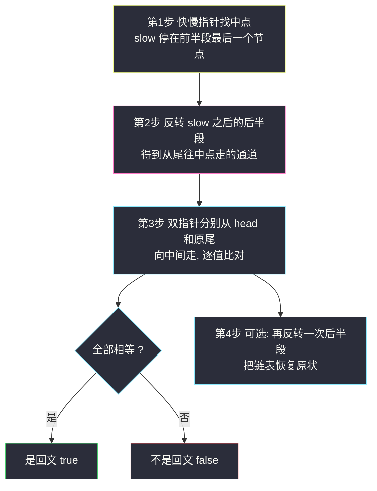
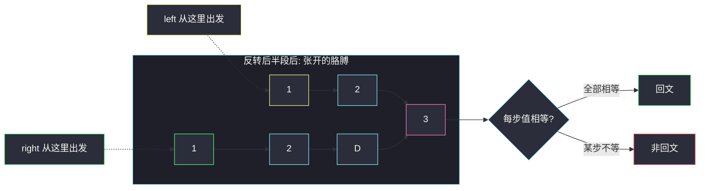

# 回文链表（找中点 + 反转后半 + 双侧比对）

## 一、问题描述

给你单链表的头节点 `head`，请你判断该链表是否为**回文链表**。如果是，返回 `true`；否则返回 `false`。

节点的定义为：

```java
public class ListNode {
    int val;
    ListNode next;
}
```

> 🔗 LeetCode 234：https://leetcode.cn/problems/palindrome-linked-list/

**示例 1**

```
输入：head = [1,2,2,1]
输出：true
```

**示例 2**

```
输入：head = [1,2]
输出：false
```

**进阶**：你能否用 `O(n)` 时间复杂度和 `O(1)` 空间复杂度解决此题？

**直观理解**

回文 = 正着读、倒着读都一样。数组判回文是双指针从两端向中间夹；但链表**只能从头单向走**，没有「尾端指针」，也没有下标可以回头。

破局思路只有一条：**自己造一个「从右往左读」的机会**——把链表的后半段原地反转，就等于得到了一条从尾部倒着读的通道。

---

## 二、暴力解法（入门）

### 直观思路：抄进数组再判回文

链表不好倒着走？那就把值全部抄进 `ArrayList`，变成熟悉的数组回文问题，左右双指针夹逼比对。

```java
class Solution {
    public boolean isPalindrome(ListNode head) {
        List<Integer> vals = new ArrayList<>();
        for (ListNode cur = head; cur != null; cur = cur.next) {
            vals.add(cur.val);
        }
        int l = 0, r = vals.size() - 1;
        while (l < r) {
            if (!vals.get(l).equals(vals.get(r))) {
                return false;
            }
            l++;
            r--;
        }
        return true;
    }
}
```

### 复杂度

- **时间**：`O(n)`
- **空间**：`O(n)`，数组存了全部值

### 🔴 瓶颈在哪里

1. 进阶要求 `O(1)` 空间，数组直接出局。
2. 25/92 等「不许改值」的链表题里养成的「抄值」习惯在这里同样被嫌弃——面试官想看的是**指针操作**。
3. 一次复制丢掉了链表本身的结构信息，本题练的正是「重构结构再复原」的硬功夫。

---

## 三、优化探索（核心章节）

### 3.1 观察特征

| 特征 | 说明 |
|------|------|
| 回文关于中点对称 | 前半段正序 == 后半段逆序 |
| 链表能找到中点 | 快慢指针：fast 走 2 步、slow 走 1 步，fast 到头时 slow 在中点 |
| 后半段可以反转 | 206 反转链表的原地四步，`O(1)` 空间 |
| 「从右往左读」可制造 | 反转后半段后，从中点右侧出发沿 `next` 走就是倒序 |

### 3.2 三步合体



反转之后的结构像一只「张开的胳膊」：

```
head → 1 → 2 → 3 ← 2 ← 1 ← pre
                (中点)        (原尾)
```

左指针从 `head` 往右走，右指针从 `pre`（原尾）往右走——由于后半段已反转，「往右」实际就是原链表的「往左」。两指针在中间汇合前，每一步都应该值相等。

### 3.3 关键推导问题

| 问题 | 答案 |
|------|------|
| 找中点用哪种推进条件？ | `while (fast.next != null && fast.next.next != null)`，结束后 `slow` 停在**前半段的最后一个节点**（偶数长度时正好平分；奇数长度时中点归前半） |
| 奇数长度时中间那个节点怎么处理？ | 中点归前半段；比对时两个指针一个先走到 `null`，中点自身无需配对，天然不影响结果 |
| 为什么比对条件是 `left != null && right != null`？ | 两侧长度最多差 1，短的一侧先到 `null` 就停；已比对的部分全部相等即可下结论 |
| 反转从哪里开始？ | 从 `slow.next` 开始反转，并且先执行 `slow.next = null` 把前半段封口，防止遗留环 |
| 链表要不要恢复？ | 题目不强制，但「本着不坑的原则」再反转一次后半段即可复原，面试时主动提出是加分项 |
| 空链表 / 单节点？ | 单节点自己和自己对称，直接 `true`（代码里可以提前返回，也可以让流程自然覆盖） |

### 3.4 循环不变式

反转完成后，任意时刻：从 `head` 出发沿 `next` 走过 `k` 个节点得到的序列，与从 `pre` 出发沿 `next` 走过 `k` 个节点得到的序列，分别等于原链表**前段正序前 k 个**和**后段逆序前 k 个**。比对维持「已检查的 k 对全部相等」。

### 3.5 一句话核心

> **快慢找中点，后半掉个头，两边往中间夹，全等就是回文。**

---

## 四、代码实现详解

### Java（找中点 + 反转后半 · 主解）

```java
class Solution {
    public boolean isPalindrome(ListNode head) {
        if (head == null || head.next == null) {
            return true;
        }
        // 第 1 步：快慢指针找中点，slow 停在前半段最后一个节点
        ListNode slow = head, fast = head;
        while (fast.next != null && fast.next.next != null) {
            slow = slow.next;
            fast = fast.next.next;
        }
        // 第 2 步：反转 slow 之后的后半段（206 的四步掉头）
        ListNode pre = slow;
        ListNode cur = pre.next;
        pre.next = null; // 前半段封口
        while (cur != null) {
            ListNode next = cur.next;
            cur.next = pre;
            pre = cur;
            cur = next;
        }
        // 第 3 步：head 往右、pre（原尾）往"右"（实际是原链表往左），逐值比对
        boolean ans = true;
        ListNode left = head, right = pre;
        while (left != null && right != null) {
            if (left.val != right.val) {
                ans = false;
                break;
            }
            left = left.next;
            right = right.next;
        }
        // 第 4 步：把后半段再反转回来，恢复链表原状（可选但厚道）
        cur = pre.next;
        pre.next = null;
        while (cur != null) {
            ListNode next = cur.next;
            cur.next = pre;
            pre = cur;
            cur = next;
        }
        return ans;
    }
}
```

> 📚 课源码对应：左程云 class034 `Code04_PalindromeLinkedList.java`，即上述「找中点 → 后半逆序 → 双向比对 → 复原」四段式，一字不差地贯彻了「判完回文不留烂摊子」的习惯。

### Python（同思路）

```python
class Solution:
    def isPalindrome(self, head: ListNode | None) -> bool:
        if head is None or head.next is None:
            return True
        # 第 1 步：快慢指针找中点
        slow = fast = head
        while fast.next is not None and fast.next.next is not None:
            slow = slow.next
            fast = fast.next.next
        # 第 2 步：反转后半段
        pre, cur = slow, slow.next
        slow.next = None
        while cur is not None:
            nxt = cur.next
            cur.next = pre
            pre, cur = cur, nxt
        # 第 3 步：双侧比对
        ans = True
        left, right = head, pre
        while left is not None and right is not None:
            if left.val != right.val:
                ans = False
                break
            left, right = left.next, right.next
        # 第 4 步：恢复后半段
        cur = pre.next
        pre.next = None
        while cur is not None:
            nxt = cur.next
            cur.next = pre
            pre, cur = cur, nxt
        return ans
```

---

## 五、例子演示

以 `head = 1 → 2 → 3 → 2 → 1`（奇数长度）为例，端到端跟踪。

### 第 1 步：找中点

```
初始: slow = 1, fast = 1

轮1: fast.next=2, fast.next.next=3 都非空
     slow = 2, fast = 3
轮2: fast.next=2', fast.next.next=1' 都非空
     slow = 3, fast = 1'  （fast 已绕到第 5 个节点）
轮3: fast.next = null → 退出

slow = 3   ← 中点（归前半）

1 → 2 → 3 → 2 → 1
        ↑slow
```

### 第 2 步：反转 slow 之后

```
pre = 3, cur = 2', 3.next = null 封口

轮1: nxt = 1'; 2'.next = 3;   pre = 2'; cur = 1'
轮2: nxt = null; 1'.next = 2'; pre = 1'; cur = null

1 → 2 → 3 ← 2 ← 1
        ↑         ↑pre（原尾）
     (head 侧)  (倒走通道)
```

### 第 3 步：双侧比对

```
left = head = 1(头), right = pre = 1(尾)

轮1: 1 == 1 ✓   left = 2,  right = 2
轮2: 2 == 2 ✓   left = 3,  right = 3
轮3: 3 == 3 ✓   left = null, right = null
     → 循环条件失败, 全部相等, ans = true
```

### 第 4 步：恢复

```
对后半段（pre=1' 起）再反转一次 → 1 → 2 → 3 → 2 → 1 原样复原
返回 true
```

### 对照：非回文 `1 → 2 → 2`

```
找中点: slow = 1, fast = 1
轮1: fast.next=2, fast.next.next=2 都非空 → slow = 2, fast = 2'
轮2: fast.next = null → 退出, slow = 2

反转 slow 之后: pre = 2', 2.next = null → 1 → 2 ← 2'

比对: left = 1, right = 2'
轮1: 1 != 2 → ans = false, break
恢复后返回 false
```



---

## 六、复杂度分析

| 方法 | 时间 | 额外空间 | 说明 |
|------|------|----------|------|
| 数组双指针 | `O(n)` | `O(n)` | 好想但不达标 |
| 递归（栈上模拟倒序） | `O(n)` | `O(n)` | 系统栈也算空间 |
| **找中点 + 反转后半** | **`O(n)`** | **`O(1)`** | 主解，四段各扫一遍常数遍 |

---

## 七、对比总结

### 易错点

1. **中点归谁搞错**：本写法 `slow` 停在**前半段最后一个节点**（不是正中间偏后的那个），反转从 `slow.next` 开始；换推进条件（`fast != null && fast.next != null`）则 slow 位置不同，两套别混。
2. **忘写 `slow.next = null` 封口**：后半段反转后前半段尾还挂着旧指针，比对和恢复阶段结构混乱。
3. **比对时比的是 `val`，遍历结束条件用节点 `!= null`**：不要用 `left != right`（奇偶长度下可能永不相等、也可能错过）。
4. **恢复阶段忘了再做一次 `pre.next = null`**：复原的段尾要封住，否则带环。
5. 单节点 / 空链表：提前 `return true`，也顺便保护了后面的快慢推进。

### 方法对比

| | 数组双指针 | 快慢 + 反转后半 |
|--|------|------|
| 空间 | `O(n)` | `O(1)` |
| 改不改链表 | 不改 | 改（可复原） |
| 难度 | 一行思路 | 四段组装，考基本功 |
| 面试地位 | 必须先说出来，再升级 | 标准答案 |

### 模板口诀

> **快慢定中点，后半掉头接；左右往中间，全等回文也；顺手翻回去，链表不亏欠。**

---

## 八、举一反三

| 题目 | 链接 | 迁移点 |
|------|------|--------|
| 206. 反转链表 | https://leetcode.cn/problems/reverse-linked-list/ | 本题第 2、4 步用的就是这个积木 |
| 876. 链表的中间结点 | https://leetcode.cn/problems/middle-of-the-linked-list/ | 第 1 步的独立完整版 |
| 143. 重排链表 | https://leetcode.cn/problems/reorder-list/ | 同款三件套：找中点 + 反转后半 + 双侧交错合并 |
| 92. 反转链表 II | https://leetcode.cn/problems/reverse-linked-list-ii/ | 「只反转一段」的通用化 |
| 125. 验证回文串 | https://leetcode.cn/problems/valid-palindrome/ | 数组/字符串版的同款双端夹逼，感受题型迁移 |

**迁移一句**：链表题里凡是「从尾往头」的需求，先想**反转后半段**——找中点、反转、比对、复原，一套连招通吃 234、143、25。
