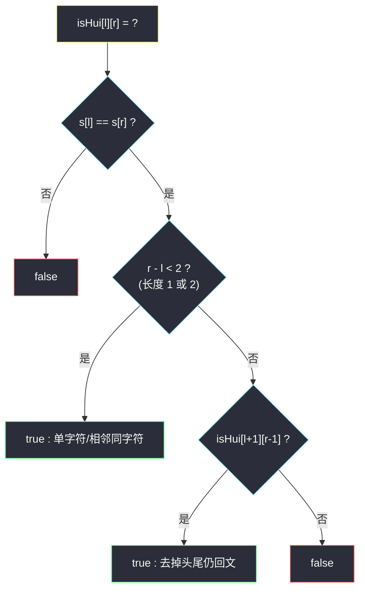
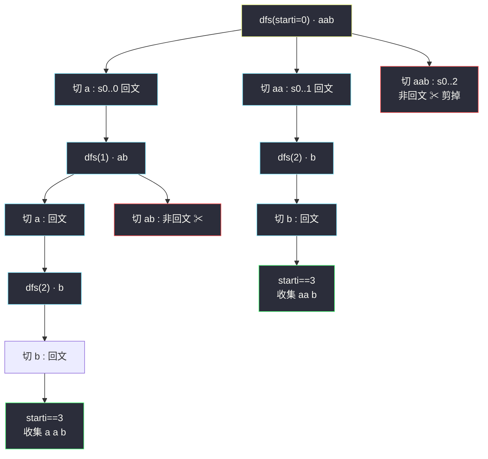

# 分割回文串（切分点回溯 + 回文判断）

## 一、问题描述

给定一个字符串 `s`，请将 `s` 分割成一些子串，使每个子串都是**回文串**。返回 `s` 所有可能的分割方案。

> 🔗 LeetCode 131：https://leetcode.cn/problems/palindrome-partitioning/

**示例 1**

```
输入：s = "aab"
输出：[["a","a","b"],["aa","b"]]
```

**示例 2**

```
输入：s = "a"
输出：[["a"]]
```

**直观理解**

「分割」= 在字符串的 n-1 个空隙里决定**在哪里下刀**。每一刀切下后，切出来的那段必须保证自己是回文才能继续。于是这就是一棵**切分点决策树**：

- 第 1 刀（含起点 0 的第一段）可以切出 `s[0..0]`、`s[0..1]`、…、`s[0..n-1]`，只有回文的那些分支才活下来；
- 每个活下来的分支里，再对剩余后缀递归地下刀，直到切到字符串末尾，收集一组方案。

结构与组合问题（#77）完全同款：**用参数 `starti` 标记「当前还没切的部分从哪开始」，枚举这一段的右端点，回溯推进**。

---

## 二、暴力解法（入门）

### 直观思路

递归函数 `dfs(s, starti, path, ans)`：`s[starti..]` 还没切。枚举第一段的右端点 `endi`，用双指针判断 `s[starti..endi]` 是否回文；是则把这段加入 `path`，递归切 `s[endi+1..]`；`starti` 到达 `n` 说明切完，收集 `path` 拷贝。递归回来把这段从 `path` 移除（恢复现场）。

```java
public List<List<String>> partition(String s) {
    List<List<String>> ans = new ArrayList<>();
    dfs(s, 0, new ArrayList<>(), ans);
    return ans;
}

private void dfs(String s, int starti, List<String> path, List<List<String>> ans) {
    if (starti == s.length()) {
        ans.add(new ArrayList<>(path));   // 收集时必须拷贝
        return;
    }
    for (int endi = starti; endi < s.length(); endi++) {
        if (!isPalindrome(s, starti, endi)) continue;  // 不是回文，此刀作废
        path.add(s.substring(starti, endi + 1));       // 做选择：切下这一段
        dfs(s, endi + 1, path, ans);                   // 去切剩余后缀
        path.remove(path.size() - 1);                  // 恢复现场
    }
}

// 双指针判断 s[l..r] 是否回文：O(r-l+1)
private boolean isPalindrome(String s, int l, int r) {
    while (l < r) {
        if (s.charAt(l++) != s.charAt(r--)) return false;
    }
    return true;
}
```

### 复杂度

- **时间**：`O(n · 2^n · n)`——切分点每个空隙「切 / 不切」两种可能，共 `2^(n-1)` 种分割；每段判断回文 O(n)，收集每组方案再 O(n)
- **空间**：`O(n)` 递归栈 + path（不计输出）

### 🔴 瓶颈在哪里

答案数量本身就是指数级（没法消除），但**同一段子串的回文判定被反复重算**：`s[l..r]` 是不是回文，在无数个不同分支里被一次又一次地双指针扫——而「某段是不是回文」是**只跟 (l, r) 有关的静态事实**，天生该被预处理成表。

---

## 三、优化探索（核心章节）

### 3.1 观察特征

| 特征 | 结论 |
|------|------|
| 回文判定只依赖 `(l, r)` 两个下标 | 与「怎么切到这里」无关 → 可预处理成二维表，查询 O(1) |
| 回文有天然的递推结构 | `isHui[l][r] = (s[l] == s[r]) && (r - l < 2 || isHui[l+1][r-1])`——两头相等且中间是回文 |
| 分割本身是指数级答案 | 枚举框架不可能降维，优化只针对「判定」环节 |

### 3.2 回文预处理表（区间 DP）

建表 `isHui[l][r]`：`s[l..r]` 是否回文。递推依赖「更短的中间段」，所以**长度从小到大**填（或 `l` 从大到小、`r` 从小到大）：



`n ≤ 16`（本题数据范围），建表 `O(n²)` 一次，之后**所有分支的所有判定全部 O(1) 查表**。

### 3.3 决策树全景



### 3.4 关键推导问题

| 问题 | 答案 |
|------|------|
| 为什么 `starti == n` 是收集条件？ | 说明前面每一刀都合法，整条字符串被无遗漏地切成若干回文段 |
| `endi` 为什么从 `starti` 开始而不是 `starti+1`？ | 第一段可以是单字符（长度 1），左闭右闭 `s[starti..endi]`，单字符段是合法切割 |
| 恢复现场为什么是 remove 最后一个？ | path 是栈式使用：进入分支加一段、退出分支撤一段，后进先出天然配对 |
| 会不会漏方案？ | 每个分支把「第一段长度」的所有可能（1..n-starti）挨个枚举，且只在回文时下伸——按第一段的长度做完全划分，不重不漏 |
| 建表的方向错会怎样？ | 若 `l` 从小到大填，`isHui[l+1][...]` 还没算好就被引用，表里全是错的——必须保证算 `(l,r)` 前 `(l+1,r-1)` 已就绪 |

### 3.5 一句话核心

> **枚举切割框架不动（指数级答案躲不掉），把回文判定从「每次 O(n) 重扫」升格为「建一次 `O(n²)` 表、终身 O(1) 查」。**

---

## 四、代码实现详解

> 说明：课源码仓库未收录 #131 原题。主解按课上 `class038/Code02_Combinations.java` 的「参数 `starti` 推进 + path 收集」组合骨架同构书写，回文预处理采用课上讲解回文串时的区间 DP 递推。

### Java（主解：回文预处理 + 切分回溯）

```java
// 分割回文串
// 测试链接 : https://leetcode.cn/problems/palindrome-partitioning/
class Solution {

    public List<List<String>> partition(String s) {
        int n = s.length();
        // isHui[l][r] : s[l..r] 是否回文，l 从大到小保证递推就绪
        boolean[][] isHui = new boolean[n][n];
        for (int l = n - 1; l >= 0; l--) {
            for (int r = l; r < n; r++) {
                isHui[l][r] = s.charAt(l) == s.charAt(r)
                        && (r - l < 2 || isHui[l + 1][r - 1]);
            }
        }
        List<List<String>> ans = new ArrayList<>();
        dfs(s.toCharArray(), 0, new ArrayList<>(), ans, isHui);
        return ans;
    }

    // starti : 当前还没切的部分从哪开始
    private void dfs(char[] s, int starti, List<String> path,
                     List<List<String>> ans, boolean[][] isHui) {
        if (starti == s.length) {
            ans.add(new ArrayList<>(path)); // 收集时必须拷贝
            return;
        }
        // 枚举第一段 s[starti..endi]，只有回文的分支才下伸
        for (int endi = starti; endi < s.length; endi++) {
            if (!isHui[starti][endi]) {
                continue;                    // 剪枝：非回文段直接作废
            }
            path.add(new String(s, starti, endi - starti + 1)); // 做选择
            dfs(s, endi + 1, path, ans, isHui);                 // 切剩余后缀
            path.remove(path.size() - 1);                       // 恢复现场
        }
    }
}
```

### Python

```python
# 分割回文串
# 测试链接 : https://leetcode.cn/problems/palindrome-partitioning/
class Solution:
    def partition(self, s: str) -> list[list[str]]:
        n = len(s)
        is_hui = [[False] * n for _ in range(n)]
        for l in range(n - 1, -1, -1):
            for r in range(l, n):
                is_hui[l][r] = (s[l] == s[r]
                                and (r - l < 2 or is_hui[l + 1][r - 1]))
        ans: list[list[str]] = []
        path: list[str] = []

        def dfs(starti: int) -> None:
            if starti == n:
                ans.append(path[:])          # 收集时必须拷贝
                return
            for endi in range(starti, n):
                if not is_hui[starti][endi]:
                    continue                 # 剪枝
                path.append(s[starti:endi + 1])   # 做选择
                dfs(endi + 1)                     # 切剩余后缀
                path.pop()                        # 恢复现场

        dfs(0)
        return ans
```

---

## 五、具体例子演示

以 `s = "aab"`（下标 0:a, 1:a, 2:b）为例。

**第一步：建回文表**（`l` 从 2 倒着填，只列 true 的格子）：

| (l,r) | 判定 | 依据 |
|-------|------|------|
| (2,2) | ✅ b | 单字符 |
| (1,1) | ✅ a | 单字符 |
| (1,2) | ❌ ab | a≠b |
| (0,0) | ✅ a | 单字符 |
| (0,1) | ✅ aa | s[0]==s[1] 且长度 2 |
| (0,2) | ❌ aab | s[0]==s[2] 但 isHui[1][1]... 等等，s[0]=a, s[2]=b 不相等，直接 false |

**第二步：回溯全程跟踪**

| 步 | 调用 | path | 动作 |
|----|------|------|------|
| 1 | dfs(0) | [] | endi=0：查表 (0,0)✅，path 加入 `"a"`，进入 dfs(1) |
| 2 | dfs(1) | [a] | endi=1：查表 (1,1)✅，path 加入 `"a"`，进入 dfs(2) |
| 3 | dfs(2) | [a,a] | endi=2：查表 (2,2)✅，path 加入 `"b"`，进入 dfs(3) |
| 4 | dfs(3) | [a,a,b] | `starti==3` → **收集 ① ["a","a","b"]**，逐层 return |
| 5 | 回到 dfs(2) | [a,a] | 恢复现场：`path.pop()` 弹出 `"b"`；endi 已到头，返回 |
| 6 | 回到 dfs(1) | [a] | `path.pop()` 弹出 `"a"`；endi=2：查表 (1,2)❌ → continue；到头返回 |
| 7 | 回到 dfs(0) | [] | `path.pop()` 弹出 `"a"`；endi=1：查表 (0,1)✅，path 加入 `"aa"`，进入 dfs(2) |
| 8 | dfs(2) | [aa] | endi=2：(2,2)✅，加入 `"b"` → dfs(3) |
| 9 | dfs(3) | [aa,b] | `starti==3` → **收集 ② ["aa","b"]**，返回 |
| 10 | 回到 dfs(0) | [] | 弹出，endi=2：查表 (0,2)❌ 剪枝；循环结束，返回 |

最终 `ans = [["a","a","b"], ["aa","b"]]`，与示例一致。注意步骤 4、9 收集后 path 里残留的段是如何被步骤 5-7 逐层弹干净的——**每条分支结束时 path 必须还原成进入时的样子**。

---

## 六、复杂度分析

| 项目 | 预处理 + 回溯（主解） | 暴力双指针版 |
|------|----------------------|--------------|
| 时间 | `O(n²)` 建表 + `O(n · 2^n)` 搜索（每个节点判定 O(1)，叶子收集 O(n)） | `O(n · 2^n · n)`，判定重复重扫 |
| 空间 | `O(n²)` 回文表 + `O(n)` 递归栈与 path | `O(n)`（判定不占额外空间，但慢） |

---

## 七、方法对比与总结

### 易错点

1. **收集时 `ans.add(path)` 忘拷贝** → 所有方案最终共享同一个可变 list，答案全错。
2. **建表循环方向写反**（`l` 从小到大）→ 引用了还没算出的 `isHui[l+1][r-1]`。
3. **`endi` 范围写成 `endi < s.length() - 1`** → 最后一段永远切不出来，漏掉大量方案。
4. **把「切到 n」的判断写成 `path 非空` 之类** → 判据必须是 `starti == n`，它与 path 状态一一对应才有不变式。
5. substring 参数是左闭右开，`new String(s, starti, endi - starti + 1)` 第三个参数是**长度**，别传成右端点。

### 两层结构总结

| 层 | 技术 | 职责 |
|----|------|------|
| 搜索层 | `starti` 切分回溯 | 枚举所有「每段都回文」的切法（组合家族骨架） |
| 判定层 | 区间 DP 预处理表 | 把 O(n) 的回文判定压缩成 O(1) 查表 |

### 模板口诀

> **starti 标记剩余头，endi 挨个试切下；回文查表剪枝快，收集拷贝莫忘怀。**

---

## 八、举一反三

| 题目 | 链接 | 迁移点 |
|------|------|--------|
| 132. 分割回文串 II | https://leetcode.cn/problems/palindrome-partitioning-ii/ | 同一张回文表，改成求最少切几刀——回溯升格为 DP |
| 77. 组合 | https://leetcode.cn/problems/combinations/ | 本题搜索层的原型：`starti` 推进、收集拷贝、恢复现场 |
| 39. 组合总和 | https://leetcode.cn/problems/combination-sum/ | 组合家族：枚举「选哪个数」而非「切哪里」，骨架相同 |
| 216. 组合总和 III | https://leetcode.cn/problems/combination-sum-iii/ | 组合家族：固定 k 个数的变体 |
| 93. 复原 IP 地址 | https://leetcode.cn/problems/restore-ip-addresses/ | 换个合法性判据（IP 段规则）的同款切分回溯 |

**迁移一句**：组合家族（#77/#39/#40/#216）统一骨架——**参数 `starti` 表示「从哪开始还没决策」，循环枚举本步选择，递归后恢复现场**；分割回文串只是把「选择一个数」换成「切下一段」，并给选择加了回文合法性剪枝。
