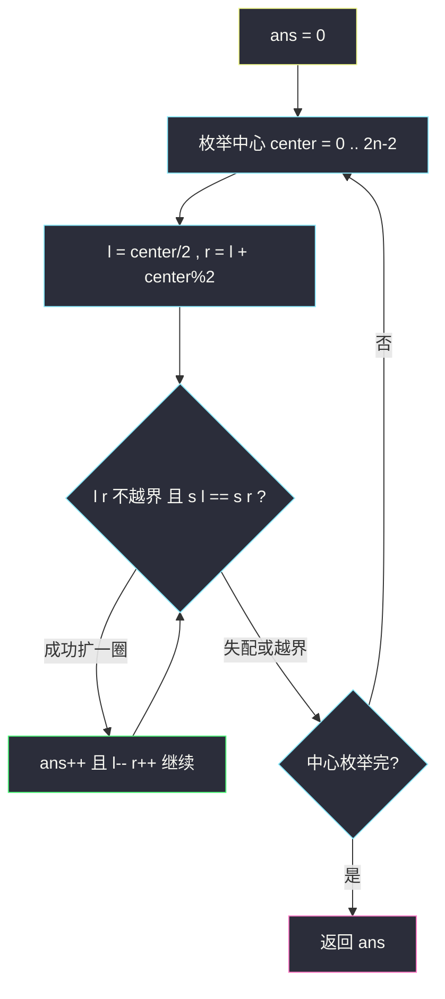
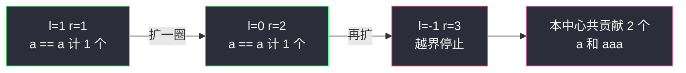

# 回文子串（中心扩散计数）

## 一、问题描述

给你一个字符串 `s`，返回 `s` 中**回文子串的数目**。子串要求连续；不同起点或终点的子串即使内容相同也算不同。

> 🔗 LeetCode 647：https://leetcode.cn/problems/palindromic-substrings/

**示例 1**

```
输入：s = "abc"
输出：3
解释：三个回文子串 "a", "b", "c"
```

**示例 2**

```
输入：s = "aaa"
输出：6
解释：6 个回文子串 "a", "a", "a", "aa", "aa", "aaa"
```

**直观理解**

与 #5「最长回文子串」是同一件事的两个问法：#5 问最长的有多长，本题问**一共有多少个**。关键观察：**每个回文子串都唯一对应一个「中心 + 半径」**。枚举全部 `2n-1` 个中心，从中心向外每扩成功一圈，就得到一个新的回文子串，计数 +1。所有中心扩出的回文数加起来正好不重不漏覆盖全部回文子串。

---

## 二、暴力解法

### 直观思路

枚举所有子串（起点 `i`、终点 `j`），双指针验证回文：

```java
// 暴力：枚举子串 + 验证
public static int countSubstringsBrute(String s) {
    char[] c = s.toCharArray();
    int n = c.length, ans = 0;
    for (int i = 0; i < n; i++) {
        for (int j = i; j < n; j++) {
            boolean ok = true;
            for (int l = i, r = j; l < r; l++, r--) {
                if (c[l] != c[r]) {
                    ok = false;
                    break;
                }
            }
            if (ok) {
                ans++;
            }
        }
    }
    return ans;
}
```

### 复杂度

- **时间**：`O(n³)`
- **空间**：`O(1)`

### 🔴 瓶颈在哪里

同一个内部区间的回文性被反复验证。回文判定可复用 → 区间 DP 存 boolean 表；或者干脆换枚举对象：不枚举子串、枚举**中心**——中心扩散一步就是 `O(1)` 的增量判断。

---

## 三、优化探索（核心章节）

### 3.1 中心扩散计数的不重不漏

回文串关于中心对称，中心只有两种：

| 中心 | 位置数 | 扩出的回文长度 |
|------|--------|----------------|
| 字符 `s[i]` | `n` | 奇数：1, 3, 5 ... |
| 间隙（`s[i]` 与 `s[i+1]` 之间） | `n-1` | 偶数：2, 4, 6 ... |

以某中心扩出的回文序列是 `1 → 3 → 5` 或 `2 → 4 → 6`（长度每次 +2），**每个长度恰对应一个子串**。不同中心扩出的子串中心必不同，天然不重复；任何回文子串必有中心，天然不漏。

所以答案 = 对每个中心，数扩散过程中**扩成功**的步数（每成功扩一圈贡献 1 个回文子串）。



### 3.2 区间 DP 对照

沿用 #5 的回文表：

| dp 定义 | 含义 |
|---------|------|
| `dp[l][r]` | `s[l..r]` 是否回文 |

```
dp[l][l] = true
dp[l][l+1] = (s[l] == s[l+1])
dp[l][r] = (s[l] == s[r]) && dp[l+1][r-1]    // r - l >= 2
答案 = 表中 true 的个数（每算一格是 true 就 ans++）
```

### 3.3 关键问题

| 问题 | 答案 |
|------|------|
| 为什么「内容相同的子串」不合并？ | 题目按位置区分：`"aaa"` 里的三个 `"a"` 是三个子串。中心扩散天然按位置计数，无需去重 |
| 扩散失败时会不会多算/漏算？ | 失配即停：该中心更长的回文必然不存在（外层两端不等），不漏；成功每圈恰一个新子串，不多 |
| 单字符也算回文吗？ | 算，长度 1 起步，初始化时每个字符中心至少贡献 1 |
| 能 `O(n)` 吗？ | Manacher（class104 Code02 就是这么做的：回文半径 `p[i]/2` 求和），进阶了解即可 |
| 和 #5 的代码差异？ | 骨架一模一样：#5 记录最长长度，本题把每次成功扩散计入 ans |

### 3.4 一句话核心

> **每个回文子串 = 一个中心 + 一个半径；枚举 2n-1 个中心，扩散成功一圈计数加一。**

---

## 四、代码实现

### Java（主解：中心扩散计数）

```java
// 回文子串数量
// 返回字符串s的回文子串数量
// 测试链接 : https://leetcode.cn/problems/palindromic-substrings/
// 说明 : 课上 class104 Code02 用 Manacher 达到 O(n)，
//        面试常规做法是中心扩散计数，本文以此为主解
public class Solution {

    // 时间复杂度 O(n^2)，空间复杂度 O(1)
    public static int countSubstrings(String s) {
        char[] c = s.toCharArray();
        int n = c.length, ans = 0;
        for (int center = 0; center < 2 * n - 1; center++) {
            // 偶 center：字符中心（奇长度）；奇 center：间隙中心（偶长度）
            int l = center / 2;
            int r = l + center % 2;
            while (l >= 0 && r < n && c[l] == c[r]) {
                ans++;   // 每成功扩一圈，得到一个新的回文子串
                l--;
                r++;
            }
        }
        return ans;
    }
}
```

### Java（对照版：区间 DP boolean 表计数）

```java
// dp[l][r] : s[l..r] 是否回文；填表时 true 即计数
// 时间复杂度 O(n^2)，空间复杂度 O(n^2)
public class Solution {

    public static int countSubstringsDp(String s) {
        char[] c = s.toCharArray();
        int n = c.length, ans = 0;
        boolean[][] dp = new boolean[n][n];
        for (int r = 0; r < n; r++) {
            for (int l = r; l >= 0; l--) {
                // 长度1或2直接判；长度>=3看内部（dp[l+1][r-1] 已算，因区间更短）
                if (c[l] == c[r] && (r - l < 2 || dp[l + 1][r - 1])) {
                    dp[l][r] = true;
                    ans++;
                }
            }
        }
        return ans;
    }
}
```

### Python（主解同思路）

```python
class Solution:
    def countSubstrings(self, s: str) -> int:
        n, ans = len(s), 0
        for center in range(2 * n - 1):
            l = center // 2
            r = l + center % 2
            while l >= 0 and r < n and s[l] == s[r]:
                ans += 1
                l -= 1
                r += 1
        return ans
```

---

## 五、具体例子演示

以 `s = "aaa"`（n = 3）为例，共 5 个中心（3 字符 + 2 间隙）。

| # | center | 起点 (l,r) | 扩散过程 | 贡献 |
|---|--------|-----------|----------|------|
| 0 | 0（字符 a0） | (0,0) | s[0]==s[0] ✓ → (−1,1) 越界停 | `a`(0,0) → 1 个 |
| 1 | 1（间隙 0,1） | (0,1) | s[0]==s[1] ✓ → (−1,2) 越界停 | `aa`(0,1) → 1 个 |
| 2 | 2（字符 a1） | (1,1) | ✓(1,1) → s[0]==s[2] ✓(0,2) → (−1,3) 越界停 | `a`(1,1), `aaa`(0,2) → 2 个 |
| 3 | 3（间隙 1,2） | (1,2) | s[1]==s[2] ✓ → (0,3) 越界停 | `aa`(1,2) → 1 个 |
| 4 | 4（字符 a2） | (2,2) | ✓(2,2) → (1,3) 越界停 | `a`(2,2) → 1 个 |

合计 `1 + 1 + 2 + 1 + 1 = 6`，与示例一致。

**关键一步展开（center=2，字符中心 s[1]）**：

```
初始 l = 1, r = 1
第 1 轮：s[1] == s[1] 成立 → ans++（得到 "a"），l=0, r=2
第 2 轮：s[0]='a' == s[2]='a' 成立 → ans++（得到 "aaa"），l=-1, r=3
第 3 轮：l < 0 越界，退出
该中心贡献 2
```



再看失配的例子 `s = "abc"`：每个字符中心只扩成功自身（1 个），两个间隙中心 `s[0]='a' != s[1]='b'`、`s[1]='b' != s[2]='c'` 立刻失败（0 个），总计 `3`。

---

## 六、复杂度分析

| 版本 | 时间 | 空间 | 说明 |
|------|------|------|------|
| 暴力枚举 | `O(n³)` | `O(1)` | 枚举 + 验证 |
| 中心扩散（主解） | `O(n²)` | `O(1)` | `2n-1` 中心 × 最多扩 `O(n)` |
| 区间 DP | `O(n²)` | `O(n²)` | boolean 表逐格计数 |
| Manacher（class104 Code02） | `O(n)` | `O(n)` | 回文半径求和，进阶 |

---

## 七、方法对比与总结

### 回文三题一道看穿

| | #5 最长 | #647 计数（本题） | #516 子序列 |
|---|---------|------------------|--------------|
| 连续性 | 连续 | 连续 | 可跳 |
| 中心扩散适用 | ✓（记最长） | ✓（累加次数） | ✗（改区间 DP） |
| dp 存什么 | 回文起点/长度 | boolean 计数 | int 长度 |
| 复杂度 | `O(n²)` | `O(n²)` | `O(n²)` |

中心扩散的代码骨架三题里两题通用——**「枚举中心 + while 扩散」是回文连续类问题的万能钥匙**。

### 易错点

1. **漏掉间隙中心**：`"aaa"` 少算两个 `"aa"`，答案从 6 变 4。
2. **循环里忘了 `ans++` 就继续扩**：扩散成功与计数必须同步。
3. **去重误区**：题目按位置计数，不要用 Set 去重（会把 `"aaa"` 的三个 `"a"` 错合并）。
4. **区间 DP 遍历顺序**：`dp[l][r]` 依赖 `dp[l+1][r-1]`，内层 `l` 从 `r` 往小走 / 或按长度递增，别让左下角读到未填值。

### 模板口诀

> **回文计数中心扫，奇偶两类别漏掉；每扩成功加一个，失配越界就换道。**

---

## 八、举一反三

| 题目 | 链接 | 迁移点 |
|------|------|--------|
| 5. 最长回文子串 | https://leetcode.cn/problems/longest-palindromic-substring/ | 同骨架求最长：扩散时记 `(begin, len)` |
| 516. 最长回文子序列 | https://leetcode.cn/problems/longest-palindromic-subsequence/ | 不连续版：中心扩散失效，上区间 DP |
| 1960. 两个回文子字符串长度的最大乘积 | https://leetcode.cn/problems/maximum-product-of-the-length-of-two-palindromic-substrings/ | Manacher 半径数组的前后缀应用 |
| 1745. 分割回文串 IV | https://leetcode.cn/problems/palindrome-partitioning-iv/ | 回文表 + 枚举两个分割点 |
| 1177. 构建回文串检测 | https://leetcode.cn/problems/can-make-palindrome-from-substring/ | 回文的字符计数性质（替换次数） |

**迁移一句**：回文类问题先问自己「连续吗？」——连续就中心扩散（求最长/计数一把抓），要复用大量判定或允许不连续就上区间 DP。课上 class104 的 Manacher 把这类题打到 `O(n)`，是「同问题更优解」的代表。
