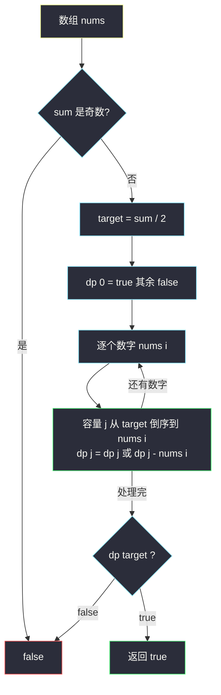
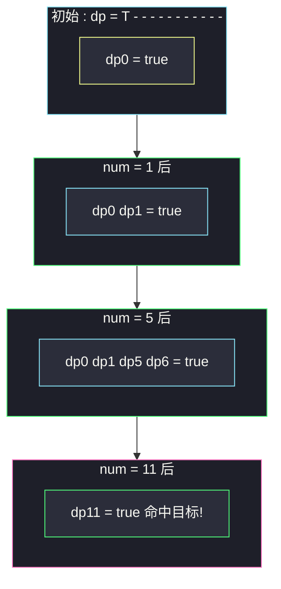

# 分割等和子集（0-1 背包：子集能否恰好凑到一半）

## 一、问题描述

给你一个**只含正整数**的数组 `nums`，判断能否把它分割成两个子集，使两个子集的元素和**相等**。

> 🔗 LeetCode 416：https://leetcode.cn/problems/partition-equal-subset-sum/

**示例 1**

```
输入：nums = [1,5,11,5]
输出：true
解释：[1,5,5] 与 [11]，两边和都是 11
```

**示例 2**

```
输入：nums = [1,2,3,5]
输出：false
解释：总和 11 是奇数，无法平分
```

**直观理解**

两半相等 ⟺ 存在一个子集的和恰好等于**总和的一半** `sum / 2`（另一半自动也是 sum/2）。于是问题变成：**每个数最多选一次，能否恰好装满容量 sum/2 的背包**——标准 0-1 背包的「可行性」版本。

---

## 二、暴力解法

### 直观思路

每个数**选或不选**，枚举全部 `2ⁿ` 个子集，看有没有和为 `sum/2` 的：

```java
// 暴力：从 index 开始决定每个数选/不选
public static boolean canPartition1(int[] nums) {
    int sum = 0;
    for (int num : nums) {
        sum += num;
    }
    if ((sum & 1) == 1) {
        return false; // 奇数总和必 false
    }
    return subset(nums, 0, sum / 2);
}

// nums[index...] 能否选出累加和恰好为 rest 的子集
public static boolean subset(int[] nums, int index, int rest) {
    if (rest == 0) {
        return true;
    }
    if (index == nums.length) {
        return false;
    }
    // 不选 index / 选 index（rest 足够时）
    return subset(nums, index + 1, rest)
            || (rest >= nums[index] && subset(nums, index + 1, rest - nums[index]));
}
```

### 复杂度

- **时间**：`O(2ⁿ)`——`n` 稍大就爆
- **空间**：`O(n)` 递归栈

### 🔴 瓶颈在哪里

递归树里 `(index, rest)` 状态大量重复。**两个可变参数** → 二维表 `(index, rest)`，状态总数 `n * (sum/2)`，DP 直接接管。

---

## 三、优化探索

### 3.1 预判剪枝

- 总和为奇数 → 直接 `false`
- 最大元素 > sum/2 → `false`
- `n == 1` → `false`

### 3.2 可变参数分析与 dp 定义

两个可变参数：物品进度 `i`、剩余容量 `j` → 二维表（对齐 class073 0-1 背包模板的 `dp[i][j]`）。

| dp 定义 | 含义 |
|---------|------|
| `dp[i][j]` | **前 i 个数**（每个最多选一次）能否选出和**恰好为 j** 的子集 |

### 3.3 转移方程推导

对第 `i` 个数（体积 = 价值 = `nums[i]`）分类：

- **不选它**：`dp[i][j] = dp[i-1][j]`
- **选它**（`j >= nums[i]` 时）：`dp[i][j] = dp[i-1][j - nums[i]]`

```
dp[0][0] = true，dp[0][j>0] = false
dp[i][j] = dp[i-1][j] || (j >= nums[i] && dp[i-1][j - nums[i]])
答案 = dp[n][sum/2]
```

### 3.4 空间压缩 + 遍历顺序（本题灵魂）

每行只依赖**上一行**，压成一维 `dp[j]`。此时内层容量必须**倒序**：

- 倒序 `j` 从大到小：`dp[j - nums[i]]` 读到的还是**上一行（未更新）**的值 → 每个数最多选一次 ✓
- 正序 `j` 从小到大：`dp[j - nums[i]]` 已被本行更新，相当于**允许重复选** → 变成完全背包（#322/#518）

这正是 class073 0-1 背包模板 `for (j = t; j >= cost[i]; j--)` 与 class074 完全背包模板 `for (j = cost[i]; j <= t; j++)` 的唯一区别。

### 3.5 一句话核心

> **奇偶预判后转 0-1 背包可行性：dp[j] = dp[j] or dp[j-nums[i]]，容量倒序扫，看 dp[sum/2]。**



---

## 四、代码实现

### Java（主解：0-1 背包可行性 + 空间压缩）

```java
// 分割等和子集
// 判断能否将数组分割成两个元素和相等的子集
// 测试链接 : https://leetcode.cn/problems/partition-equal-subset-sum/
// 说明 : 课上 class073 Code01 是 0-1 背包模板（dp[i][j] = max(不选, 选)），
//        class073 Code04 LastStoneWeightII 用同骨架求"子集和最接近 sum/2"，
//        本题按同一体系对齐 : 子集和能否恰好等于 sum/2
public class Solution {

    // 时间复杂度 O(n * target)，空间复杂度 O(target)
    public static boolean canPartition(int[] nums) {
        int sum = 0;
        for (int num : nums) {
            sum += num;
        }
        if ((sum & 1) == 1) {
            return false;
        }
        int target = sum / 2;
        // dp[j] : 当前已处理的数字中，能否选出和恰好为 j 的子集
        boolean[] dp = new boolean[target + 1];
        dp[0] = true; // 空集和为 0
        for (int num : nums) {
            // 0-1 背包 : 容量倒序，保证每个数字只被选一次
            for (int j = target; j >= num; j--) {
                // 转移 : 不选 num（dp[j] 原样） 或 选 num（看 dp[j-num]）
                dp[j] = dp[j] || dp[j - num];
            }
        }
        return dp[target];
    }
}
```

### Java（对照版：二维 dp 表，帮助理解压缩前形态）

```java
// dp[i][j] : 前 i 个数能否恰好凑出 j（对齐 class073 Code01 compute1 的结构）
public class Solution {

    public static boolean canPartition(int[] nums) {
        int n = nums.length;
        int sum = 0;
        for (int num : nums) {
            sum += num;
        }
        if ((sum & 1) == 1) {
            return false;
        }
        int target = sum / 2;
        boolean[][] dp = new boolean[n + 1][target + 1];
        dp[0][0] = true;
        for (int i = 1; i <= n; i++) {
            for (int j = 0; j <= target; j++) {
                // 不选第 i 个数
                dp[i][j] = dp[i - 1][j];
                // 选第 i 个数（容量足够时）
                if (j >= nums[i - 1]) {
                    dp[i][j] = dp[i][j] || dp[i - 1][j - nums[i - 1]];
                }
            }
        }
        return dp[n][target];
    }
}
```

### Python

```python
# 0-1 背包可行性 + 滚动数组（容量倒序）
class Solution:
    def canPartition(self, nums: list[int]) -> bool:
        total = sum(nums)
        if total % 2 == 1:
            return False
        target = total // 2
        # dp[j] : 能否恰好凑出 j
        dp = [False] * (target + 1)
        dp[0] = True
        for num in nums:
            # 倒序：每个数字最多选一次
            for j in range(target, num - 1, -1):
                dp[j] = dp[j] or dp[j - num]
        return dp[target]
```

---

## 五、具体例子演示

以 `nums = [1,5,11,5]` 为例：`sum = 22`（偶数 ✓），`target = 11`。

### 一维 dp 逐物品、逐容量跟踪

初始：只有 `dp[0] = true`。

| 物品 num | 容量 j（倒序 11→num） | 检查 dp[j-num] | 更新后 dp 表（true 的位置） |
|----------|----------------------|----------------|---------------------------|
| — | — | — | {0} |
| 1 | j=11 | dp[10] false | {0} |
| 1 | j=10 | dp[9] false | {0} |
| 1 | ... | 全 false | {0} |
| 1 | **j=1** | **dp[0] true** → dp[1]=true | {0,1} |
| 5 | j=11 | dp[6] false | {0,1} |
| 5 | j=10 | dp[5] false | {0,1} |
| 5 | j=9~7 | 全 false | {0,1} |
| 5 | **j=6** | **dp[1] true** → dp[6]=true | {0,1,6} |
| 5 | j=5 | **dp[0] true** → dp[5]=true | {0,1,5,6} |
| 11 | **j=11** | **dp[0] true** → dp[11]=true | {0,1,5,6,11} |
| 11 | j=10 | dp[10] false | 同上 |
| 11 | j=6 | dp[6] false（本行未被动过） | 同上 |
| 5 | j=11 | **dp[11] 已 true** 维持 | {0,1,5,6,11} |
| 5 | j=10 | dp[5] true → dp[10]=true | {0,1,5,6,10,11} |

处理完 4 个数字后 `dp[11] = true` → 返回 **true**。对应子集：`11` 单独一半（也可 `1+5+5 = 11`）。

### 为什么倒序保住了 0-1 语义

处理 `num = 5` 时若**正序**：`dp[5]` 先被更新为 true，随后扫到 `j = 10` 时读 `dp[5]`（已含本物品）→ `dp[10] = true`，等于把 5 用了**两次**。倒序下 `j = 10` 先于 `j = 5` 执行，读到的 `dp[5]` 还是上一物品后的旧值，重复选择被堵死。



---

## 六、复杂度分析

| 版本 | 时间 | 空间 | 说明 |
|------|------|------|------|
| 暴力枚举子集 | `O(2ⁿ)` | `O(n)` | n = 200 直接超时 |
| 二维 dp 表 | `O(n * target)` | `O(n * target)` | 状态一目了然，适合讲解 |
| 滚动数组（主解） | `O(n * target)` | `O(target)` | 每行只依赖上一行 |

`target = sum/2 ≤ 100 * 200 / 2 = 10000`，主解最多约 `200 * 10000 = 2 * 10⁶` 次布尔运算。

---

## 七、方法对比与总结

### 背包家族坐标系（本题 = 0-1 背包 · 恰好装满 · 可行性）

| | 本题 #416 | #494 目标和 | #322 零钱兑换 | #518 零钱兑换 II |
|---|-----------|-------------|---------------|------------------|
| 物品种类 | 0-1 背包 | 0-1 背包 | 完全背包 | 完全背包 |
| 问什么 | 能否恰好装满 | 恰好装满的**方案数** | 恰好装满的**最少件数** | 恰好装满的**组合数** |
| 容量遍历 | **倒序** | **倒序** | **正序** | **正序** |
| 转移 | `dp[j] or= dp[j-num]` | `dp[j] += dp[j-num]` | `dp[j] = min(dp[j], dp[j-coin]+1)` | `dp[j] += dp[j-coin]` |

### 易错点

1. **忘判奇偶**：奇数总和直接 false，白算一趟。
2. **容量循环写成正序**：0-1 背包正序 = 完全背包，`[2]` 这种单元素数组会错判成 `2+2+...` 也可行。
3. **dp[0] 没置 true**：空集和为 0，是一切转移的根。
4. **内层下界写成 j >= 1**：应从 `target` 倒序到 `num`，`j < num` 时根本选不了。

### 模板口诀

> **总和奇偶先预判，一半容量倒着灌；dp[j] 或上 dp[j-num]，dp[target] 定答案。**

---

## 八、举一反三

| 题目 | 链接 | 迁移点 |
|------|------|--------|
| 494. 目标和 | https://leetcode.cn/problems/target-sum/ | 同是 0-1 背包，问「恰好装满」的**方案数** |
| 1049. 最后一块石头的重量 II | https://leetcode.cn/problems/last-stone-weight-ii/ | 子集和**尽量接近** sum/2（class073 Code04 原题） |
| 698. 划分为 k 个相等的子集 | https://leetcode.cn/problems/partition-to-k-equal-sum-subsets/ | k=2 退化为本题；k>2 需状态压缩或回溯 |
| 474. 一和零 | https://leetcode.cn/problems/ones-and-zeroes/ | 0-1 背包升级成二维费用（class069 Code01） |
| 322. 零钱兑换 | https://leetcode.cn/problems/coin-change/ | 改成完全背包 + 求最少件数，对比遍历顺序 |

**迁移一句**：见「选/不选、每个一次、凑一个目标值」，先问自己三件事——0-1 还是完全？恰好还是至多？要方案数、可行性还是最值？答案定完，背包模板直接套。
